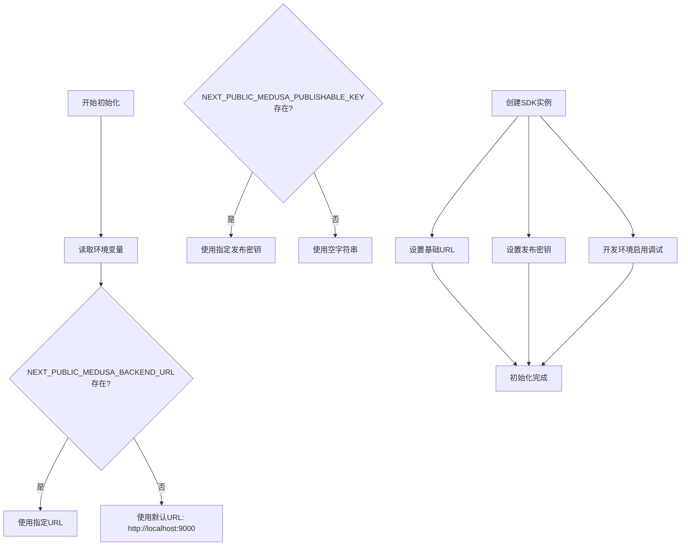
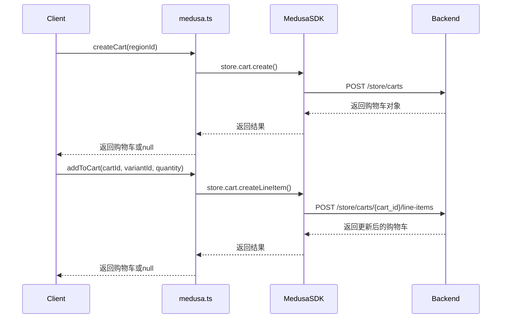
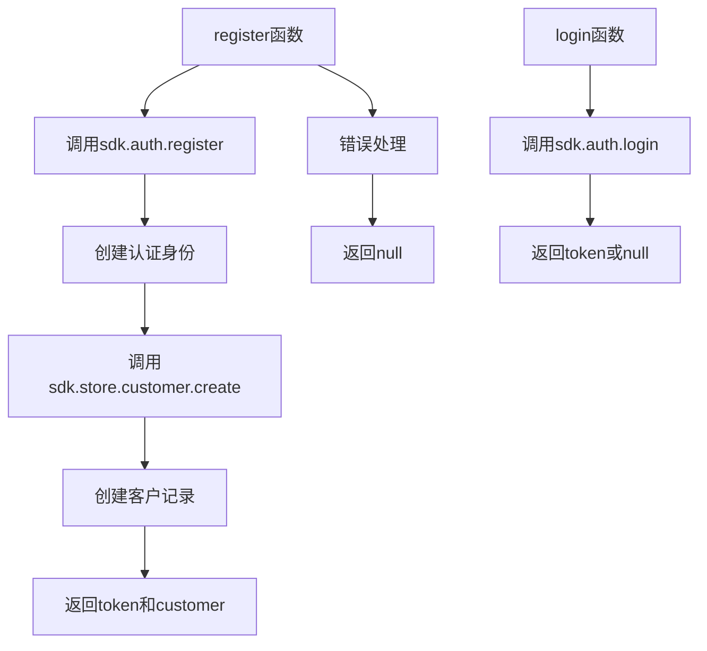
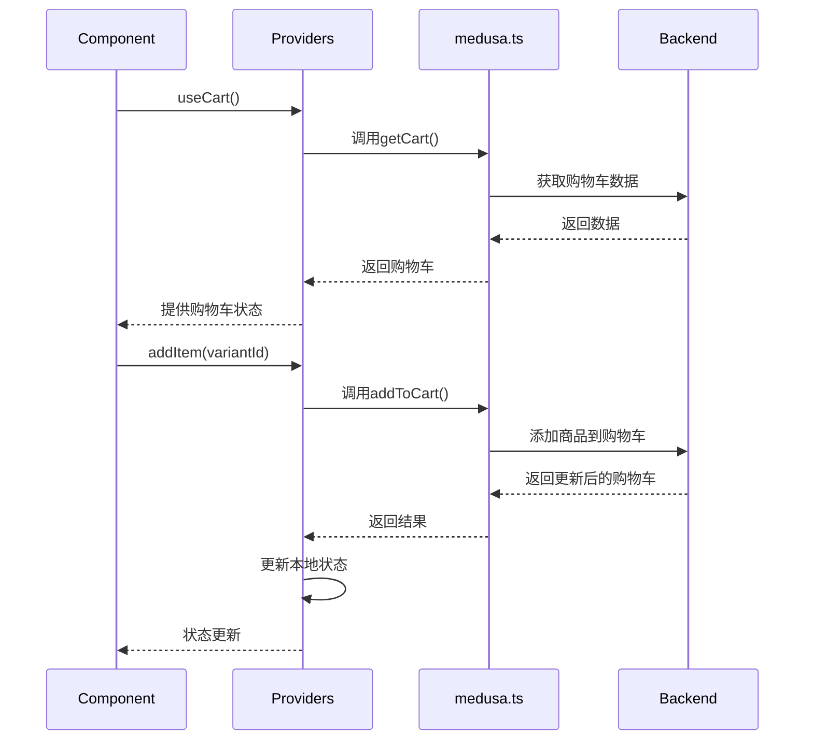
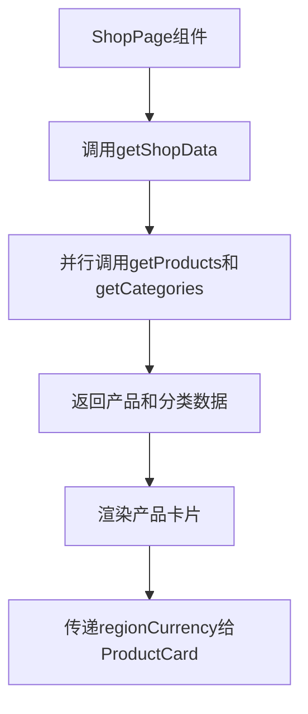
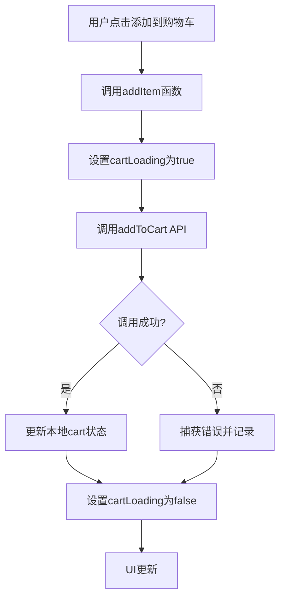
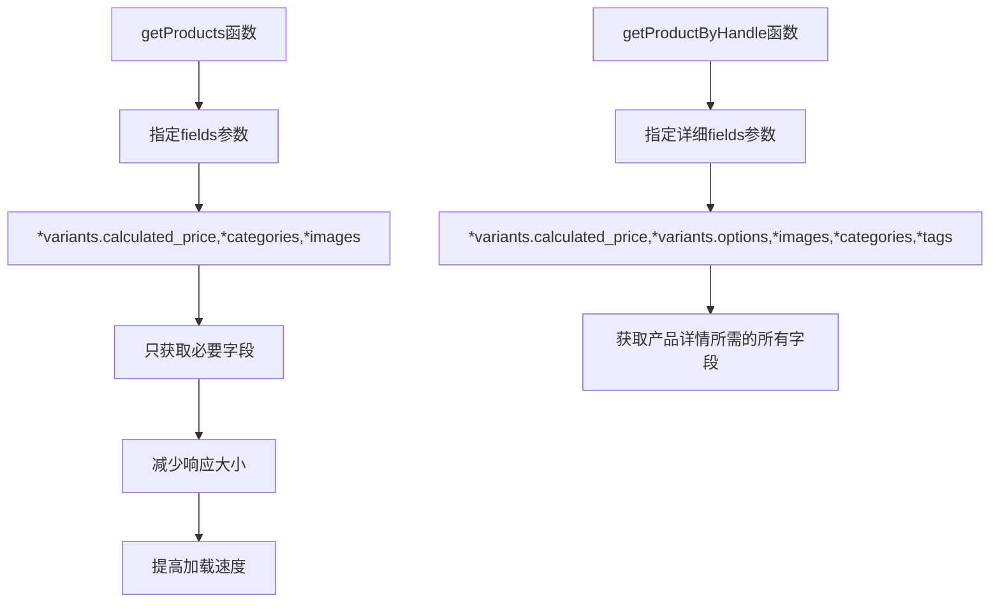
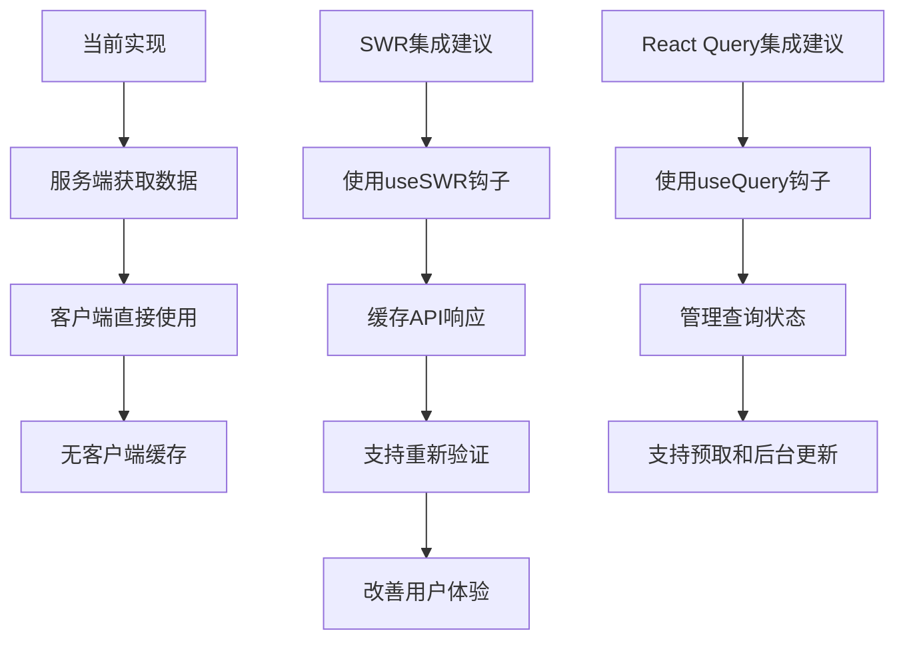
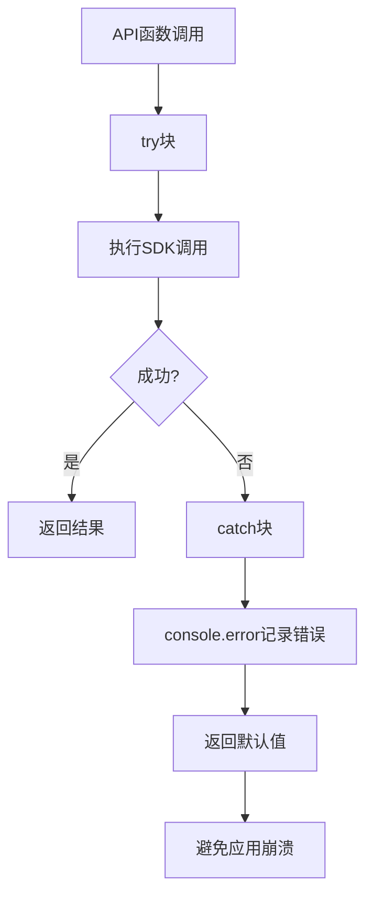
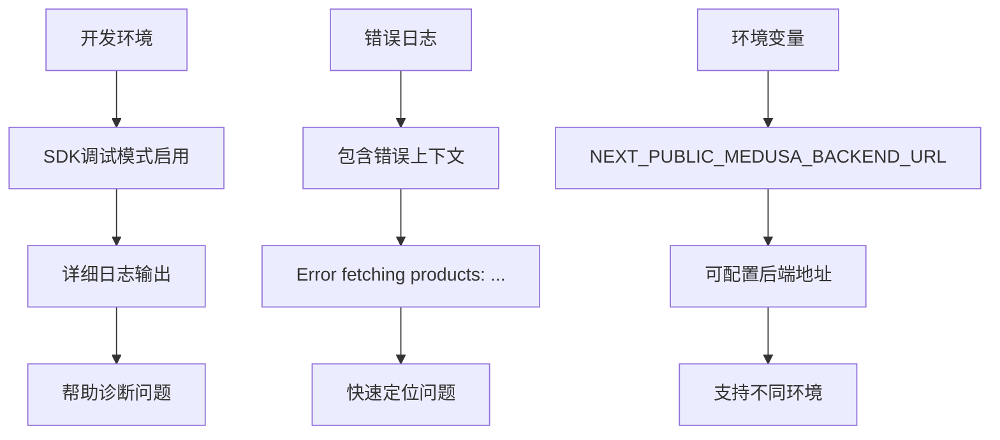

# API集成层

<cite>
**本文档中引用的文件**   
- [medusa.ts](file://storefront/src/lib/medusa.ts)
- [providers.tsx](file://storefront/src/lib/providers.tsx)
- [types.ts](file://storefront/src/lib/types.ts)
- [.env.local](file://storefront/.env.local)
- [.env.example](file://storefront/.env.example)
- [medusa-config.ts](file://backend/medusa-config.ts)
- [page.tsx](file://storefront/src/app/shop/page.tsx)
- [ProductCard.tsx](file://storefront/src/components/ProductCard.tsx)
- [cart/page.tsx](file://storefront/src/app/cart/page.tsx)
</cite>

## 目录
1. [简介](#简介)
2. [SDK初始化与环境配置](#sdk初始化与环境配置)
3. [核心API函数解析](#核心api函数解析)
4. [API与React状态集成](#api与react状态集成)
5. [使用示例与最佳实践](#使用示例与最佳实践)
6. [性能优化与缓存策略](#性能优化与缓存策略)
7. [错误处理与调试](#错误处理与调试)
8. [结论](#结论)

## 简介

Lumiera前端项目通过`medusa.ts`文件对Medusa JS SDK进行封装，构建了一个健壮的API集成层。该集成层负责与后端Medusa服务通信，提供产品、购物车、用户认证等核心功能。通过`providers.tsx`中的React上下文，实现了服务端数据获取与客户端状态管理的无缝集成。本文档详细说明了SDK初始化、API封装、状态集成等关键实现细节。

## SDK初始化与环境配置

API集成层的核心是Medusa SDK实例的初始化，该过程通过环境变量注入配置，并包含错误处理机制。



**Diagram sources**
- [medusa.ts](file://storefront/src/lib/medusa.ts#L4-L12)
- [.env.local](file://storefront/.env.local#L2-L4)
- [.env.example](file://storefront/.env.example#L2-L3)

**Section sources**
- [medusa.ts](file://storefront/src/lib/medusa.ts#L1-L20)
- [.env.local](file://storefront/.env.local#L1-L4)
- [.env.example](file://storefront/.env.example#L1-L4)

## 核心API函数解析

`medusa.ts`文件导出了多个异步函数，封装了对Medusa API的调用，每个函数都包含请求参数、字段选择、错误捕获和返回值处理。

### 产品相关API

产品API函数负责获取产品列表、单个产品、分类和集合等数据。

```mermaid
classDiagram
class getProductByHandle {
+handle : string
+regionId? : string
+fields : string
+return : Promise<Product|null>
}
class getProducts {
+regionId? : string
+limit : number
+fields : string
+return : Promise<{products : Product[], count : number}>
}
class getCategories {
+include_descendants_tree : boolean
+return : Promise<Category[]>
}
class getCollections {
+return : Promise<Collection[]>
}
getProductByHandle --> getProducts : "使用相同的基础API"
getCategories --> MedusaSDK : "调用store.category.list"
getCollections --> MedusaSDK : "调用store.collection.list"
```

**Diagram sources**
- [medusa.ts](file://storefront/src/lib/medusa.ts#L32-L85)
- [types.ts](file://storefront/src/lib/types.ts#L4-L11)

**Section sources**
- [medusa.ts](file://storefront/src/lib/medusa.ts#L31-L110)
- [types.ts](file://storefront/src/lib/types.ts#L1-L11)

### 购物车相关API

购物车API函数管理购物车的创建、获取和修改操作，包含详细的字段选择配置。



**Diagram sources**
- [medusa.ts](file://storefront/src/lib/medusa.ts#L129-L193)
- [cart/page.tsx](file://storefront/src/app/cart/page.tsx#L408-L431)

**Section sources**
- [medusa.ts](file://storefront/src/lib/medusa.ts#L125-L193)
- [cart/page.tsx](file://storefront/src/app/cart/page.tsx#L407-L432)

### 用户认证API

用户认证API函数处理用户登录、注册和信息获取。



**Diagram sources**
- [medusa.ts](file://storefront/src/lib/medusa.ts#L196-L238)

**Section sources**
- [medusa.ts](file://storefront/src/lib/medusa.ts#L195-L239)

## API与React状态集成

通过`providers.tsx`文件中的React上下文，实现了API调用与客户端状态的集成，形成了服务端获取数据、客户端更新状态的模式。



**Diagram sources**
- [providers.tsx](file://storefront/src/lib/providers.tsx#L33-L164)
- [medusa.ts](file://storefront/src/lib/medusa.ts#L129-L167)

**Section sources**
- [providers.tsx](file://storefront/src/lib/providers.tsx#L1-L181)
- [types.ts](file://storefront/src/lib/types.ts#L43-L57)

## 使用示例与最佳实践

### 服务端组件中的API使用

在Next.js服务端组件中，可以直接调用API函数获取数据。



**Diagram sources**
- [page.tsx](file://storefront/src/app/shop/page.tsx#L12-L25)
- [ProductCard.tsx](file://storefront/src/components/ProductCard.tsx#L30-L120)

**Section sources**
- [page.tsx](file://storefront/src/app/shop/page.tsx#L1-L112)
- [ProductCard.tsx](file://storefront/src/components/ProductCard.tsx#L1-L120)

### 客户端状态更新

客户端通过上下文提供的函数更新状态，这些函数内部调用API并更新本地状态。



**Diagram sources**
- [providers.tsx](file://storefront/src/lib/providers.tsx#L97-L111)
- [cart/page.tsx](file://storefront/src/app/cart/page.tsx#L414-L422)

**Section sources**
- [providers.tsx](file://storefront/src/lib/providers.tsx#L97-L111)
- [cart/page.tsx](file://storefront/src/app/cart/page.tsx#L407-L432)

## 性能优化与缓存策略

API集成层通过多种方式优化性能，包括字段选择、并行请求和潜在的缓存集成。

### 字段选择优化

通过精确的字段选择，减少不必要的数据传输。



**Diagram sources**
- [medusa.ts](file://storefront/src/lib/medusa.ts#L37-L51)

**Section sources**
- [medusa.ts](file://storefront/src/lib/medusa.ts#L32-L58)

### 潜在的缓存集成点

虽然当前实现未直接集成SWR或React Query，但提供了良好的集成基础。



**Section sources**
- [medusa.ts](file://storefront/src/lib/medusa.ts#L1-L267)

## 错误处理与调试

API集成层包含全面的错误处理机制，确保应用的健壮性。

### 错误捕获模式

所有API函数都使用try-catch块捕获错误，并返回安全的默认值。



**Diagram sources**
- [medusa.ts](file://storefront/src/lib/medusa.ts#L33-L43)
- [medusa.ts](file://storefront/src/lib/medusa.ts#L130-L139)

**Section sources**
- [medusa.ts](file://storefront/src/lib/medusa.ts#L1-L267)

### 调试技巧

通过环境变量和日志记录支持调试。



**Section sources**
- [medusa.ts](file://storefront/src/lib/medusa.ts#L10-L12)
- [.env.local](file://storefront/.env.local#L2-L4)

## 结论

Lumiera的API集成层通过`medusa.ts`文件对Medusa JS SDK进行了有效的封装，实现了环境变量注入、错误处理、字段选择等关键功能。通过`providers.tsx`中的React上下文，成功地将服务端数据获取与客户端状态管理集成在一起。该设计模式清晰、健壮，为应用提供了可靠的数据访问层。未来可以考虑集成SWR或React Query等客户端状态管理库，进一步优化性能和用户体验。