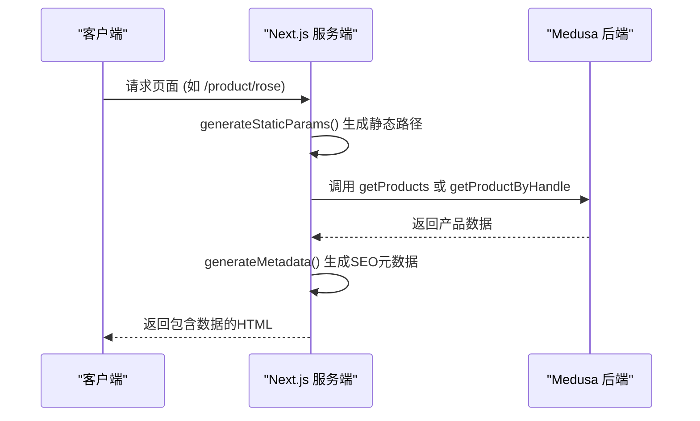
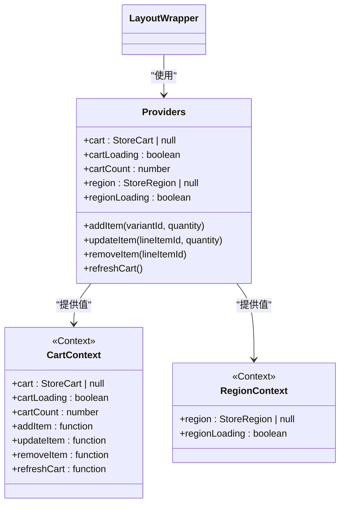
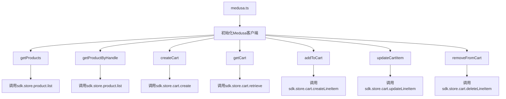

# 前端架构

<cite>
**本文档引用文件**   
- [page.tsx](file://storefront/src/app/page.tsx)
- [layout.tsx](file://storefront/src/app/layout.tsx)
- [product/[handle]/page.tsx](file://storefront/src/app/product\[handle]/page.tsx)
- [cart/page.tsx](file://storefront/src/app/cart/page.tsx)
- [shop/page.tsx](file://storefront/src/app/shop/page.tsx)
- [ProductCard.tsx](file://storefront/src/components/ProductCard.tsx)
- [Navbar.tsx](file://storefront/src/components/Navbar.tsx)
- [Footer.tsx](file://storefront/src/components/Footer.tsx)
- [medusa.ts](file://storefront/src/lib/medusa.ts)
- [providers.tsx](file://storefront/src/lib/providers.tsx)
- [types.ts](file://storefront/src/lib/types.ts)
- [constants.ts](file://storefront/src/lib/constants.ts)
- [LayoutWrapper.tsx](file://storefront/src/components/LayoutWrapper.tsx)
</cite>

## 目录
1. [项目结构](#项目结构)
2. [页面路由与数据获取](#页面路由与数据获取)
3. [核心UI组件分析](#核心ui组件分析)
4. [状态管理与上下文](#状态管理与上下文)
5. [API集成与SDK封装](#api集成与sdk封装)
6. [数据流与性能优化](#数据流与性能优化)

## 项目结构

Lumiera前端项目采用Next.js 16的App Router架构，整体结构清晰，分为`app`、`components`和`lib`三大核心目录。`app`目录作为应用入口，包含所有页面路由和布局文件；`components`目录存放可复用的UI组件；`lib`目录则集中管理应用逻辑、状态和常量。

```mermaid
graph TB
A[storefront] --> B[src]
B --> C[app]
B --> D[components]
B --> E[lib]
C --> F[page.tsx]
C --> G[layout.tsx]
C --> H[product/[handle]]
C --> I[cart]
C --> J[shop]
D --> K[ProductCard.tsx]
D --> L[Navbar.tsx]
D --> M[Footer.tsx]
E --> N[medusa.ts]
E --> O[providers.tsx]
E --> P[types.ts]
E --> Q[constants.ts]
```

**图示来源**
- [app目录结构](file://storefront/src/app)
- [components目录结构](file://storefront/src/components)
- [lib目录结构](file://storefront/src/lib)

**本节来源**
- [app目录结构](file://storefront/src/app)
- [components目录结构](file://storefront/src/components)
- [lib目录结构](file://storefront/src/lib)

## 页面路由与数据获取

Lumiera的页面路由基于Next.js App Router的文件系统约定，每个页面对应`app`目录下的一个文件或文件夹。首页、产品页、购物车和商店页均通过`page.tsx`文件实现。数据获取主要在服务端组件中完成，利用`generateStaticParams`函数预生成静态路径，并通过异步函数从Medusa后端获取数据。



**图示来源**
- [page.tsx](file://storefront/src/app/page.tsx)
- [product/[handle]/page.tsx](file://storefront/src/app/product\[handle]/page.tsx)
- [shop/page.tsx](file://storefront/src/app/shop/page.tsx)
- [cart/page.tsx](file://storefront/src/app/cart/page.tsx)

**本节来源**
- [page.tsx](file://storefront/src/app/page.tsx#L1-L240)
- [product/[handle]/page.tsx](file://storefront/src/app/product\[handle]/page.tsx#L1-L214)
- [shop/page.tsx](file://storefront/src/app/shop/page.tsx#L1-L112)
- [cart/page.tsx](file://storefront/src/app/cart/page.tsx#L1-L469)

## 核心UI组件分析

### ProductCard组件

`ProductCard`组件是产品展示的核心UI单元，用于在首页、商店页等位置展示产品缩略图。该组件接收`StoreProduct`对象作为属性，展示产品图片、标题、分类和价格。组件实现了图片悬停切换效果，并根据产品标签（如“Best Seller”）显示相应的徽章。

**本节来源**
- [ProductCard.tsx](file://storefront/src/components/ProductCard.tsx#L1-L120)

### Navbar组件

`Navbar`组件实现了响应式导航栏，包含品牌Logo、导航链接和购物车图标。在桌面端，导航链接水平排列；在移动端，导航链接隐藏在汉堡菜单中。组件通过`usePathname`钩子获取当前路径，高亮显示当前页面的导航项。

**本节来源**
- [Navbar.tsx](file://storefront/src/components/Navbar.tsx#L1-L161)

### Footer组件

`Footer`组件提供了网站的底部信息，包括品牌介绍、链接集合和版权信息。在移动端，链接集合以手风琴形式折叠，点击标题可展开。组件使用`MobileAccordionItem`子组件实现可折叠的交互逻辑。

**本节来源**
- [Footer.tsx](file://storefront/src/components/Footer.tsx#L1-L155)

## 状态管理与上下文

Lumiera使用React Context进行全局状态管理，通过`providers.tsx`文件中的`Providers`组件提供购物车和区域（Region）状态。`CartContext`管理购物车数据、加载状态和操作函数（如添加、更新、删除商品），`RegionContext`管理区域信息和加载状态。



**图示来源**
- [providers.tsx](file://storefront/src/lib/providers.tsx#L1-L181)
- [types.ts](file://storefront/src/lib/types.ts#L1-L58)

**本节来源**
- [providers.tsx](file://storefront/src/lib/providers.tsx#L1-L181)
- [types.ts](file://storefront/src/lib/types.ts#L1-L58)
- [LayoutWrapper.tsx](file://storefront/src/components/LayoutWrapper.tsx#L1-L31)

## API集成与SDK封装

`medusa.ts`文件封装了对Medusa SDK的调用，提供了统一的API接口。该文件初始化Medusa客户端，并导出一系列异步函数，用于获取产品、分类、购物车等数据。所有函数都包含错误处理逻辑，确保在API调用失败时返回默认值而非抛出异常。



**图示来源**
- [medusa.ts](file://storefront/src/lib/medusa.ts#L1-L267)

**本节来源**
- [medusa.ts](file://storefront/src/lib/medusa.ts#L1-L267)
- [cart/page.tsx](file://storefront/src/app/cart/page.tsx#L1-L469)
- [product/[handle]/page.tsx](file://storefront/src/app/product\[handle]/page.tsx#L1-L214)

## 数据流与性能优化

Lumiera的数据流遵循从服务端到客户端的单向流动。页面组件在服务端获取数据并渲染，客户端组件通过Context消费状态。性能优化方面，项目采用了多种策略：使用`revalidate`选项实现静态页面的增量静态再生（ISR）；在`ProductCard`和`CartItem`组件中实现图片懒加载；在`cart/page.tsx`中使用本地缓存避免重复的API调用。

**本节来源**
- [page.tsx](file://storefront/src/app/page.tsx#L9)
- [product/[handle]/page.tsx](file://storefront/src/app/product\[handle]/page.tsx#L8)
- [shop/page.tsx](file://storefront/src/app/shop/page.tsx#L6)
- [cart/page.tsx](file://storefront/src/app/cart/page.tsx#L15-L119)
- [ProductCard.tsx](file://storefront/src/components/ProductCard.tsx#L68-L81)