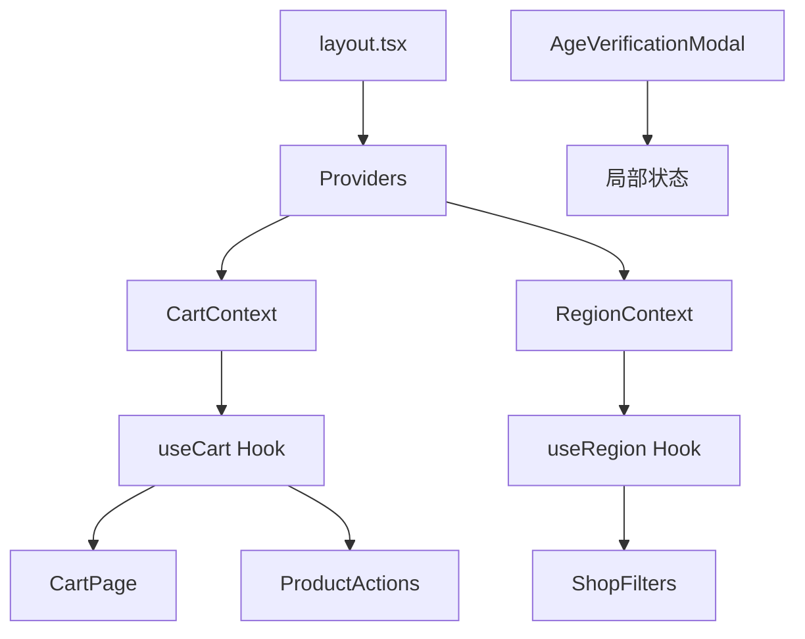
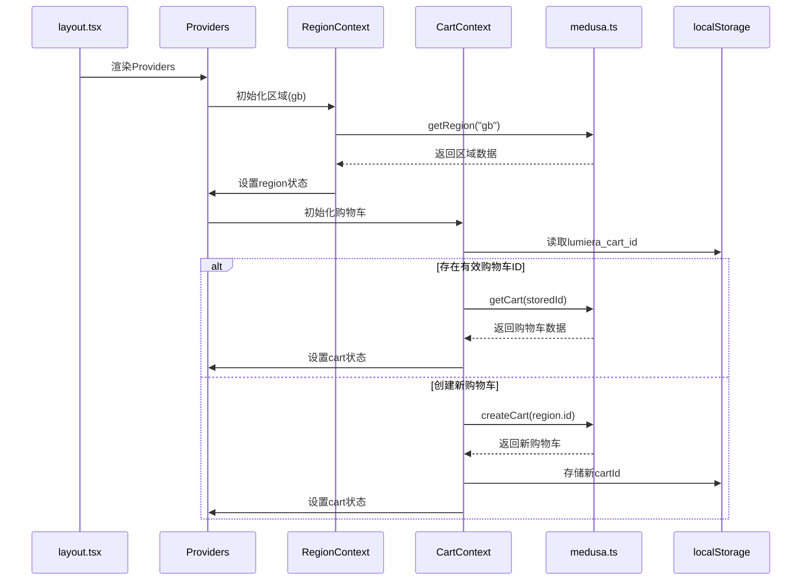
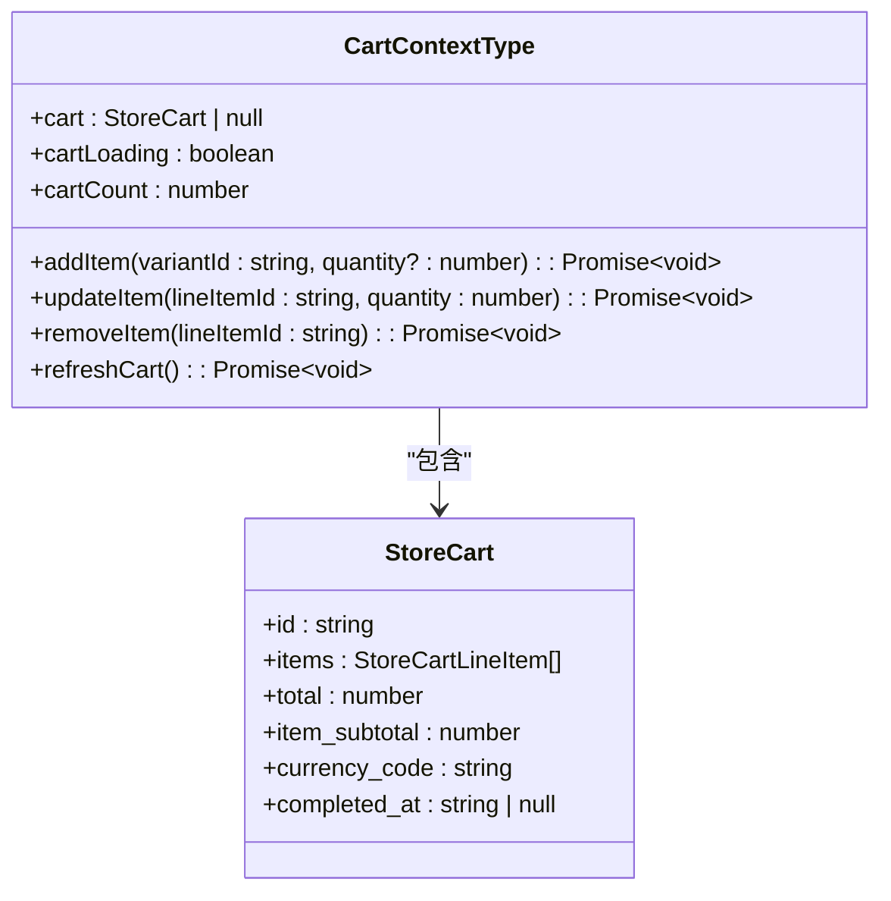
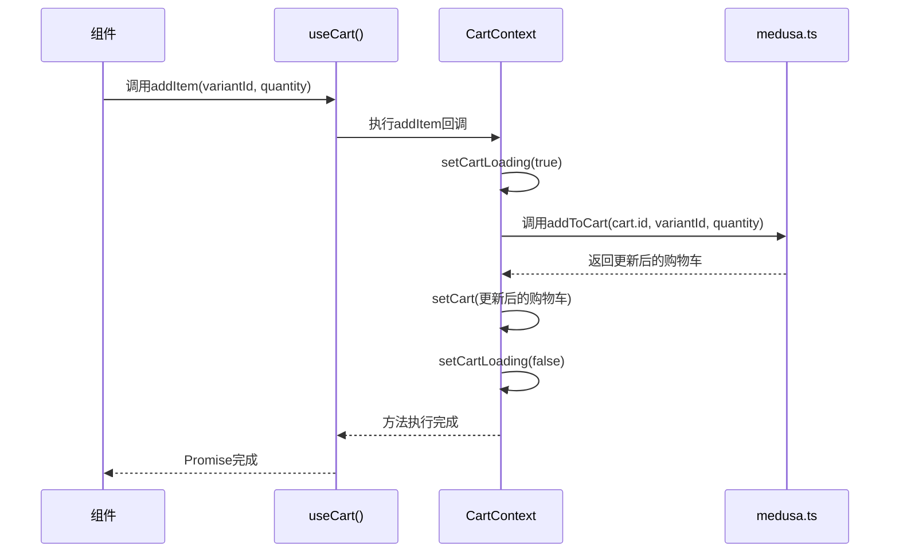
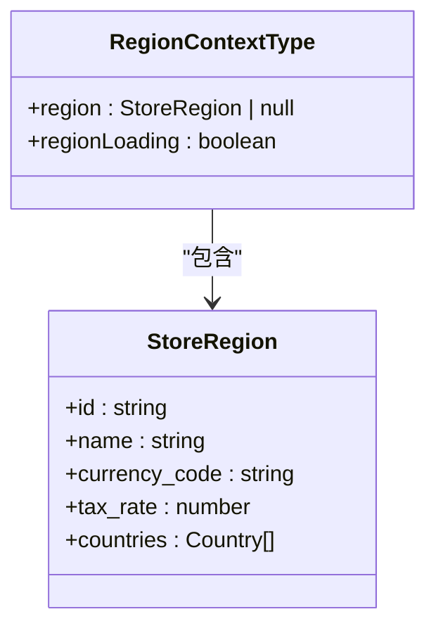
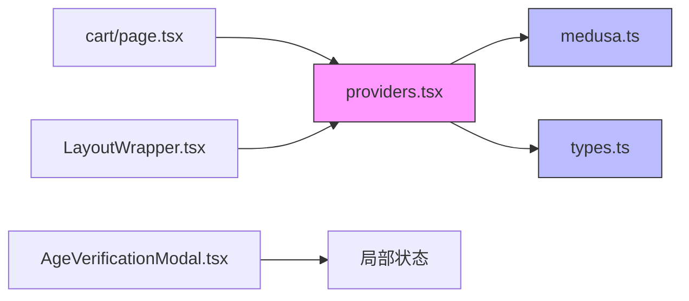

# 状态管理

<cite>
**本文档中引用的文件**  
- [providers.tsx](file://storefront/src/lib/providers.tsx)
- [types.ts](file://storefront/src/lib/types.ts)
- [medusa.ts](file://storefront/src/lib/medusa.ts)
- [layout.tsx](file://storefront/src/app/layout.tsx)
- [cart/page.tsx](file://storefront/src/app/cart/page.tsx)
- [LayoutWrapper.tsx](file://storefront/src/components/LayoutWrapper.tsx)
- [AgeVerificationModal.tsx](file://storefront/src/components/AgeVerificationModal.tsx)
</cite>

## 目录
1. [简介](#简介)
2. [项目结构](#项目结构)
3. [核心组件](#核心组件)
4. [架构概述](#架构概述)
5. [详细组件分析](#详细组件分析)
6. [依赖分析](#依赖分析)
7. [性能考虑](#性能考虑)
8. [故障排除指南](#故障排除指南)
9. [结论](#结论)

## 简介
本文档全面描述了Lumiera前端应用的状态管理方案，重点分析基于React Context的全局状态实现机制。文档详细阐述了购物车（CartContext）和区域（RegionContext）两个核心上下文的创建、初始化与状态同步流程，包括通过localStorage持久化购物车ID的策略。同时解释了useCart和useRegion自定义Hook的封装逻辑及其在组件树中的消费方式，说明购物车状态变更（添加、更新、删除商品）如何通过回调函数触发异步更新。结合AgeVerificationModal等组件展示局部状态与全局状态的协同工作模式，并提供状态管理的最佳实践建议。

## 项目结构
Lumiera前端应用采用Next.js框架构建，状态管理核心逻辑集中于`storefront/src/lib`目录下。`providers.tsx`文件作为全局状态提供者，通过React Context为整个应用提供购物车和区域信息。`types.ts`定义了状态类型接口，`medusa.ts`封装了与后端Medusa服务的API交互。应用布局通过`layout.tsx`引入Providers，确保所有页面组件均可访问全局状态。



**图示来源**  
- [layout.tsx](file://storefront/src/app/layout.tsx#L33)
- [providers.tsx](file://storefront/src/lib/providers.tsx#L33)
- [types.ts](file://storefront/src/lib/types.ts#L43)
- [AgeVerificationModal.tsx](file://storefront/src/components/AgeVerificationModal.tsx#L6)

## 核心组件
状态管理的核心组件包括CartContext和RegionContext两个React Context对象，以及对应的useCart和useRegion自定义Hook。CartContext管理购物车数据、加载状态和操作方法，RegionContext管理地区信息和加载状态。Providers组件负责初始化这两个上下文，并通过组件树向下传递。自定义Hook提供类型安全的访问接口，确保在正确上下文中使用状态。

**组件来源**  
- [providers.tsx](file://storefront/src/lib/providers.tsx#L22-L25)
- [types.ts](file://storefront/src/lib/types.ts#L43-L57)

## 架构概述
Lumiera的状态管理采用分层架构设计，顶层为Context提供者，中间层为状态Hook，底层为API服务。Providers组件作为根提供者，在应用启动时初始化区域和购物车状态。区域信息从后端获取后用于创建购物车，购物车ID通过localStorage持久化存储，实现跨会话保持。所有状态变更通过封装的异步方法触发，自动处理加载状态和错误边界。



**图示来源**  
- [providers.tsx](file://storefront/src/lib/providers.tsx#L39-L87)
- [medusa.ts](file://storefront/src/lib/medusa.ts#L15-L28)
- [layout.tsx](file://storefront/src/app/layout.tsx#L33)

## 详细组件分析
### CartContext分析
CartContext是Lumiera应用的核心状态管理组件，负责维护购物车的完整生命周期。它不仅存储购物车数据，还提供一系列操作方法和辅助状态。

#### CartContext状态结构


**图示来源**  
- [providers.tsx](file://storefront/src/lib/providers.tsx#L151-L157)
- [types.ts](file://storefront/src/lib/types.ts#L43-L51)

#### 购物车初始化流程
购物车初始化依赖于区域信息的获取，采用useEffect实现异步初始化。流程首先检查localStorage中是否存在购物车ID，若存在则尝试获取对应购物车，验证其有效性（未完成订单），有效则直接使用；否则创建新购物车并更新localStorage。

```mermaid
flowchart TD
Start([开始]) --> CheckRegion{"区域是否可用?"}
CheckRegion --> |否| Wait[等待区域加载]
CheckRegion --> |是| CheckStorage["读取localStorage.getItem('lumiera_cart_id')"]
CheckStorage --> HasId{"存在购物车ID?"}
HasId --> |否| CreateNew[调用createCart(region.id)]
HasId --> |是| FetchCart[调用getCart(storedId)]
FetchCart --> IsValid{"购物车有效?<br/>completed_at === null"}
IsValid --> |否| CreateNew
IsValid --> |是| UseExisting[使用现有购物车]
CreateNew --> StoreId["localStorage.setItem('lumiera_cart_id', newCart.id)"]
StoreId --> SetCart[设置cart状态]
UseExisting --> SetCart
SetCart --> End([结束])
```

**图示来源**  
- [providers.tsx](file://storefront/src/lib/providers.tsx#L55-L87)
- [medusa.ts](file://storefront/src/lib/medusa.ts#L129-L136)

#### 购物车操作方法
购物车操作方法（addItem, updateItem, removeItem）均采用useCallback优化，避免不必要的重新渲染。每个方法在执行时都会设置cartLoading状态为true，在finally块中重置为false，确保UI能正确反映加载状态。



**图示来源**  
- [providers.tsx](file://storefront/src/lib/providers.tsx#L97-L143)
- [medusa.ts](file://storefront/src/lib/medusa.ts#L154-L163)

### RegionContext分析
RegionContext负责管理应用的区域信息，目前固定初始化为英国（gb）地区。与购物车不同，区域信息不进行持久化存储，每次应用加载时重新获取。



**图示来源**  
- [providers.tsx](file://storefront/src/lib/providers.tsx#L148-L149)
- [types.ts](file://storefront/src/lib/types.ts#L54-L57)

### 自定义Hook分析
useCart和useRegion是封装Context访问的自定义Hook，提供类型安全的接口并包含运行时检查，确保Hook在正确的Provider上下文中使用。

```mermaid
flowchart TD
A[useCart Hook] --> B{Context是否undefined?}
B --> |是| C[抛出错误: "useCart must be used within a CartProvider"]
B --> |否| D[返回Context值]
D --> E[组件使用返回值]
```

**图示来源**  
- [providers.tsx](file://storefront/src/lib/providers.tsx#L166-L179)

## 依赖分析
状态管理系统的依赖关系清晰分层，上层组件依赖下层服务，避免循环依赖。Providers依赖medusa.ts提供的API方法，但不直接依赖具体实现，通过导入函数的方式解耦。



**图示来源**  
- [providers.tsx](file://storefront/src/lib/providers.tsx#L11-L19)
- [cart/page.tsx](file://storefront/src/app/cart/page.tsx#L6)
- [LayoutWrapper.tsx](file://storefront/src/components/LayoutWrapper.tsx#L5)

## 性能考虑
状态管理方案在性能方面做了多项优化：使用useCallback记忆化操作函数，避免子组件不必要的重新渲染；通过合理的useEffect依赖数组控制副作用执行时机；购物车数量通过计算属性cartCount提供，避免重复计算。错误处理采用try-catch-finally模式，确保加载状态能正确重置。

**最佳实践建议**：
- 在消费Context的组件中，尽量使用useCart/useRegion Hook而非直接使用Context
- 对于频繁触发的操作，考虑添加防抖或节流
- 监听localStorage变化以响应其他标签页的状态变更
- 实现购物车数据的本地缓存，减少API调用频率

## 故障排除指南
常见问题包括Context未定义错误、购物车状态不同步、localStorage数据损坏等。解决方案包括确保Providers正确包裹应用组件、实现错误边界处理、添加localStorage数据验证机制。

**组件来源**  
- [providers.tsx](file://storefront/src/lib/providers.tsx#L168-L170)
- [providers.tsx](file://storefront/src/lib/providers.tsx#L176-L178)

## 结论
Lumiera的状态管理方案采用React Context结合自定义Hook的模式，实现了清晰、可维护的全局状态管理。通过合理的初始化流程、持久化策略和错误处理机制，确保了购物车状态的可靠性和用户体验的流畅性。方案充分考虑了性能优化和类型安全，为应用的扩展和维护提供了良好基础。