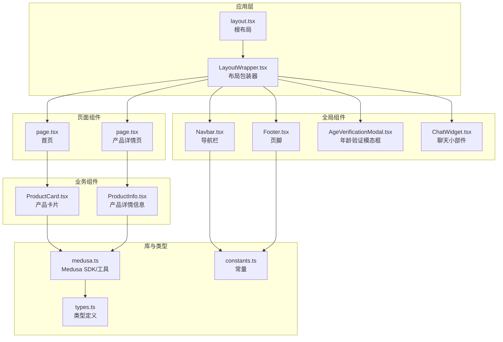
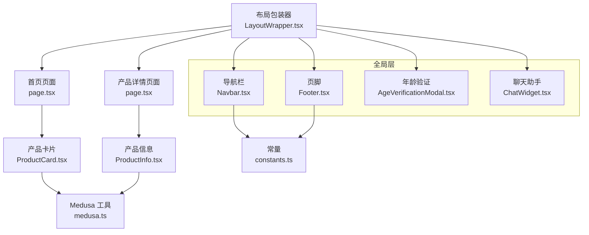
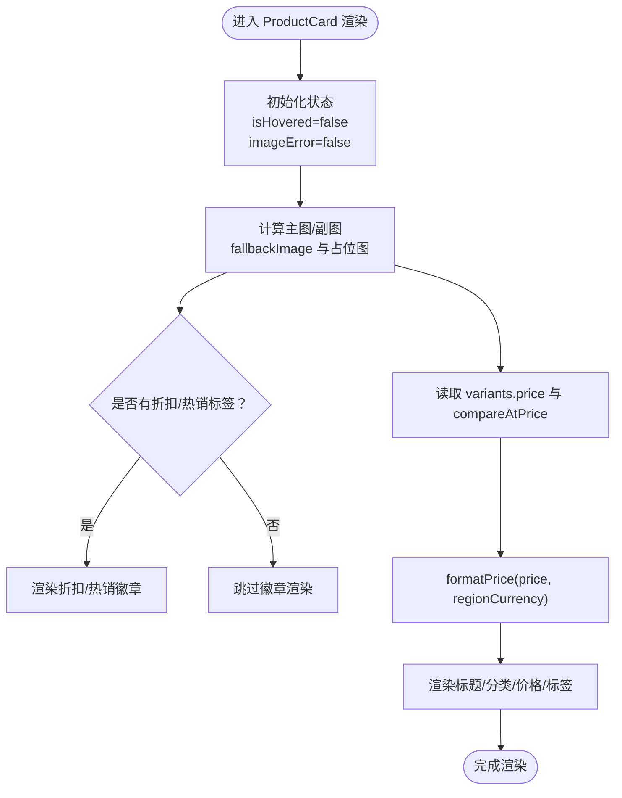
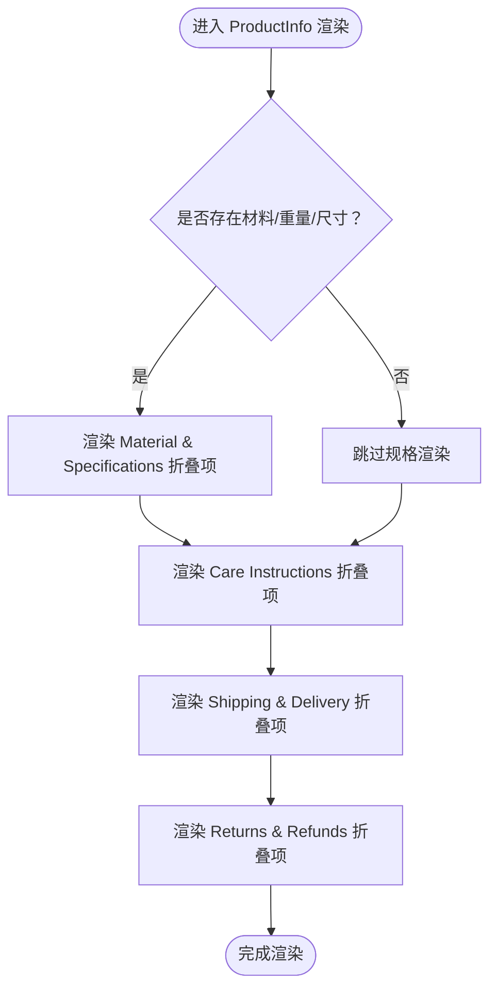
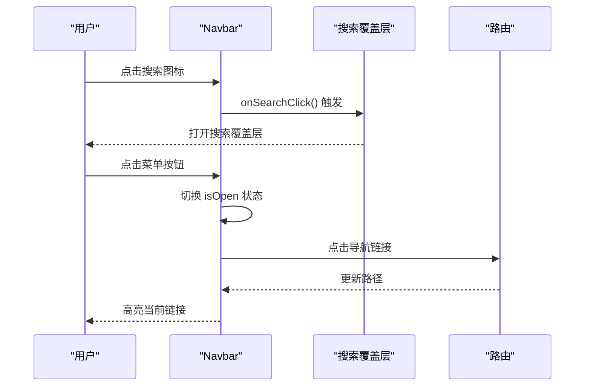
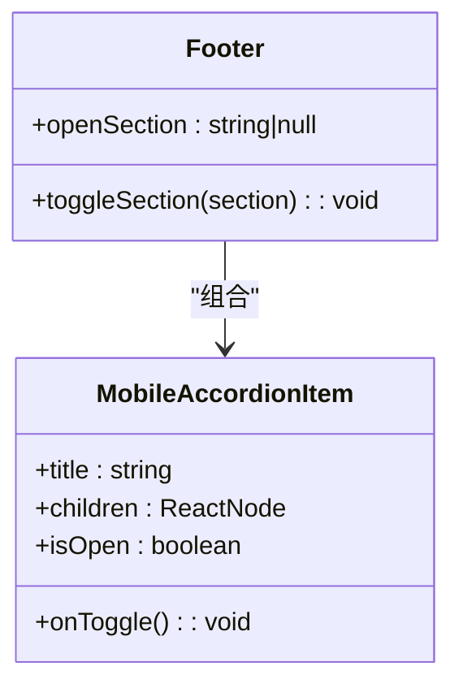
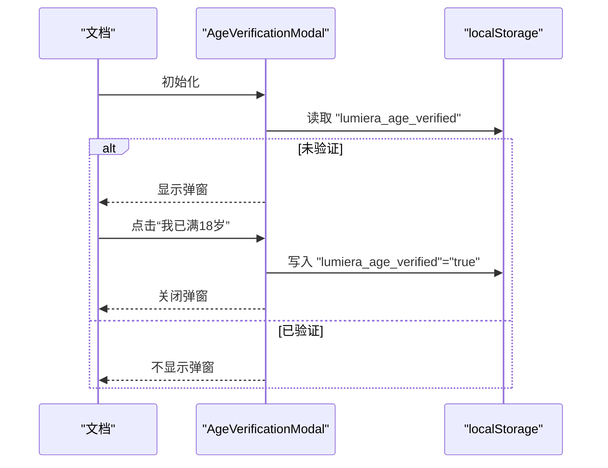
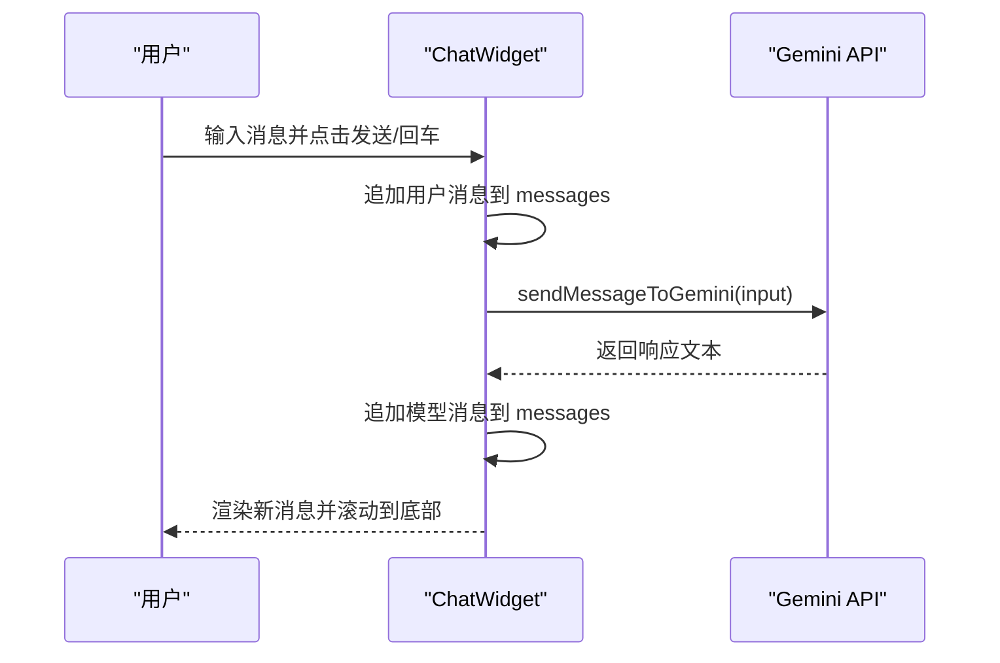
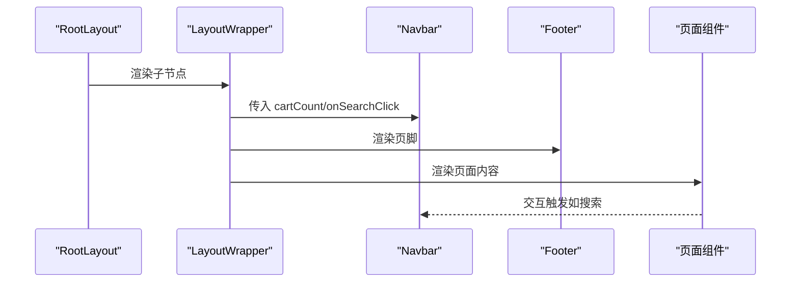
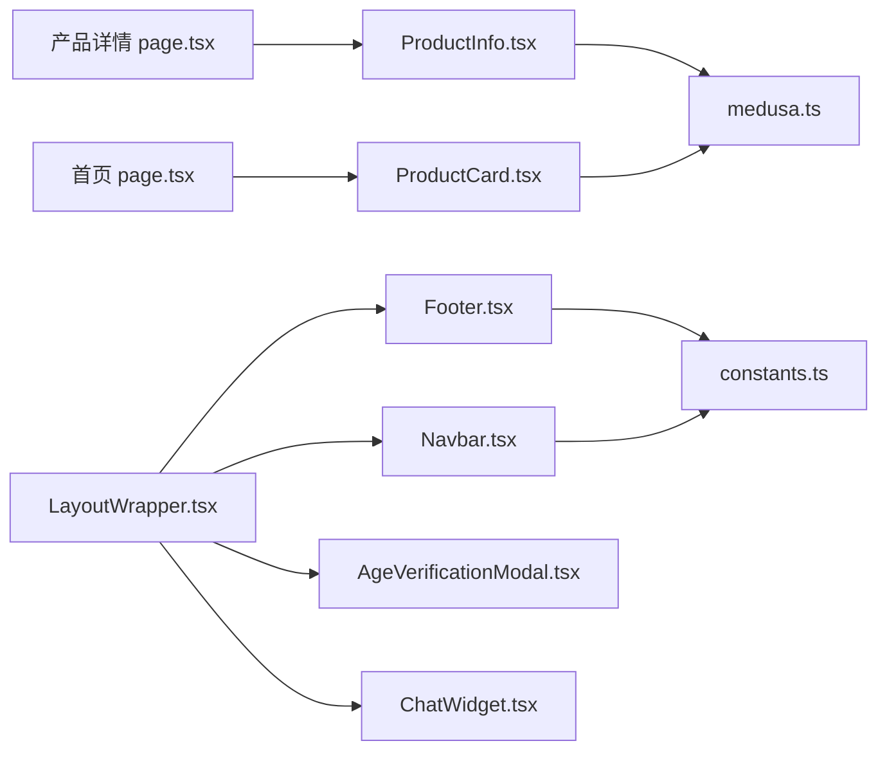

# 组件架构

<cite>
**本文引用的文件**
- [storefront/src/components/ProductCard.tsx](file://storefront/src/components/ProductCard.tsx)
- [storefront/src/app/product/[handle]/ProductInfo.tsx](file://storefront/src/app/product/[handle]/ProductInfo.tsx)
- [storefront/src/components/Navbar.tsx](file://storefront/src/components/Navbar.tsx)
- [storefront/src/components/Footer.tsx](file://storefront/src/components/Footer.tsx)
- [storefront/src/components/AgeVerificationModal.tsx](file://storefront/src/components/AgeVerificationModal.tsx)
- [storefront/src/components/ChatWidget.tsx](file://storefront/src/components/ChatWidget.tsx)
- [storefront/src/components/LayoutWrapper.tsx](file://storefront/src/components/LayoutWrapper.tsx)
- [storefront/src/app/page.tsx](file://storefront/src/app/page.tsx)
- [storefront/src/app/product/[handle]/page.tsx](file://storefront/src/app/product/[handle]/page.tsx)
- [storefront/src/lib/medusa.ts](file://storefront/src/lib/medusa.ts)
- [storefront/src/lib/types.ts](file://storefront/src/lib/types.ts)
- [storefront/src/lib/constants.ts](file://storefront/src/lib/constants.ts)
- [storefront/src/app/layout.tsx](file://storefront/src/app/layout.tsx)
</cite>

## 目录
1. [引言](#引言)
2. [项目结构](#项目结构)
3. [核心组件](#核心组件)
4. [架构总览](#架构总览)
5. [详细组件分析](#详细组件分析)
6. [依赖关系分析](#依赖关系分析)
7. [性能考量](#性能考量)
8. [故障排查指南](#故障排查指南)
9. [结论](#结论)
10. [附录](#附录)

## 引言
本文件系统性梳理 Lumiera 前端的 UI 组件架构，聚焦可复用 React 组件的实现模式与职责划分。重点覆盖：
- ProductCard 如何封装产品展示逻辑（图片懒加载、价格格式化、多货币支持）
- ProductInfo 在产品详情页中的复合信息渲染机制
- Navbar 与 Footer 的全局导航与布局作用及其响应式设计
- AgeVerificationModal 与 ChatWidget 等交互式模态框的状态管理与触发逻辑
- Props 定义、子组件组合模式、CSS 模块化应用
- 组件调用最佳实践、可访问性（a11y）考虑与性能优化建议（如 React.memo 使用场景）

## 项目结构
Lumiera 前端采用 Next.js 应用结构，组件集中在 storefront/src/components，页面级组件位于 storefront/src/app 下，业务数据通过 storefront/src/lib 提供。

图表来源
- [storefront/src/app/layout.tsx](file://storefront/src/app/layout.tsx#L1-L42)
- [storefront/src/components/LayoutWrapper.tsx](file://storefront/src/components/LayoutWrapper.tsx#L1-L31)
- [storefront/src/components/Navbar.tsx](file://storefront/src/components/Navbar.tsx#L1-L161)
- [storefront/src/components/Footer.tsx](file://storefront/src/components/Footer.tsx#L1-L155)
- [storefront/src/components/AgeVerificationModal.tsx](file://storefront/src/components/AgeVerificationModal.tsx#L1-L60)
- [storefront/src/components/ChatWidget.tsx](file://storefront/src/components/ChatWidget.tsx#L1-L153)
- [storefront/src/app/page.tsx](file://storefront/src/app/page.tsx#L1-L240)
- [storefront/src/app/product/[handle]/page.tsx](file://storefront/src/app/product/[handle]/page.tsx#L1-L214)
- [storefront/src/components/ProductCard.tsx](file://storefront/src/components/ProductCard.tsx#L1-L120)
- [storefront/src/app/product/[handle]/ProductInfo.tsx](file://storefront/src/app/product/[handle]/ProductInfo.tsx#L1-L136)
- [storefront/src/lib/medusa.ts](file://storefront/src/lib/medusa.ts#L1-L267)
- [storefront/src/lib/types.ts](file://storefront/src/lib/types.ts#L1-L58)
- [storefront/src/lib/constants.ts](file://storefront/src/lib/constants.ts#L1-L145)

章节来源
- [storefront/src/app/layout.tsx](file://storefront/src/app/layout.tsx#L1-L42)
- [storefront/src/components/LayoutWrapper.tsx](file://storefront/src/components/LayoutWrapper.tsx#L1-L31)

## 核心组件
- ProductCard：负责单个产品的展示，包含主图/副图切换、折扣标签、分类显示、价格格式化与多货币支持。
- ProductInfo：产品详情页的复合信息面板，使用手风琴折叠展示材质规格、保养说明、配送与退换政策。
- Navbar：全局导航，含移动端汉堡菜单、滚动阴影效果、购物车徽章、搜索入口。
- Footer：品牌信息、分栏链接、移动端手风琴、版权与支付图标。
- AgeVerificationModal：年龄验证弹窗，基于本地存储控制显示与退出行为。
- ChatWidget：内嵌聊天助手，支持消息发送、自动滚动、加载指示与键盘回车提交。

章节来源
- [storefront/src/components/ProductCard.tsx](file://storefront/src/components/ProductCard.tsx#L1-L120)
- [storefront/src/app/product/[handle]/ProductInfo.tsx](file://storefront/src/app/product/[handle]/ProductInfo.tsx#L1-L136)
- [storefront/src/components/Navbar.tsx](file://storefront/src/components/Navbar.tsx#L1-L161)
- [storefront/src/components/Footer.tsx](file://storefront/src/components/Footer.tsx#L1-L155)
- [storefront/src/components/AgeVerificationModal.tsx](file://storefront/src/components/AgeVerificationModal.tsx#L1-L60)
- [storefront/src/components/ChatWidget.tsx](file://storefront/src/components/ChatWidget.tsx#L1-L153)

## 架构总览
组件层次清晰，采用“页面组件 + 业务组件 + 全局组件”的分层组织。页面组件负责数据拉取与布局，业务组件封装展示与交互，全局组件提供横切关注点（导航、页脚、模态框、聊天）。数据通过 medusa.ts 封装的 SDK 获取，并以 props 注入到组件中。

图表来源
- [storefront/src/app/page.tsx](file://storefront/src/app/page.tsx#L1-L240)
- [storefront/src/app/product/[handle]/page.tsx](file://storefront/src/app/product/[handle]/page.tsx#L1-L214)
- [storefront/src/components/ProductCard.tsx](file://storefront/src/components/ProductCard.tsx#L1-L120)
- [storefront/src/app/product/[handle]/ProductInfo.tsx](file://storefront/src/app/product/[handle]/ProductInfo.tsx#L1-L136)
- [storefront/src/components/Navbar.tsx](file://storefront/src/components/Navbar.tsx#L1-L161)
- [storefront/src/components/Footer.tsx](file://storefront/src/components/Footer.tsx#L1-L155)
- [storefront/src/components/AgeVerificationModal.tsx](file://storefront/src/components/AgeVerificationModal.tsx#L1-L60)
- [storefront/src/components/ChatWidget.tsx](file://storefront/src/components/ChatWidget.tsx#L1-L153)
- [storefront/src/components/LayoutWrapper.tsx](file://storefront/src/components/LayoutWrapper.tsx#L1-L31)
- [storefront/src/lib/medusa.ts](file://storefront/src/lib/medusa.ts#L1-L267)
- [storefront/src/lib/constants.ts](file://storefront/src/lib/constants.ts#L1-L145)

## 详细组件分析

### ProductCard 组件分析
- 职责与封装
  - 图片懒加载与错误回退：使用 Next/Image 的 fill 与 sizes，配合 onError 处理图片加载失败，优先使用产品主图，否则回退到占位图或本地 fallback。
  - 主副图切换：悬停时通过透明度过渡实现主副图切换，增强视觉反馈。
  - 折扣与热销标签：根据 variants 的 original_amount 与 calculated_amount 判断是否打折；根据 tags 判断是否为“Best Seller”。
  - 价格格式化与多货币：通过 formatPrice 接收 currencyCode，统一货币格式输出。
  - 分类与标题：从 categories 取首个分类名，若无则默认“Wellness”。

- Props 定义
  - product: StoreProduct
  - regionCurrency?: string（默认“GBP”）

- 子组件组合模式
  - 通过 Link 包裹整个卡片，形成点击跳转至产品详情页的统一入口。
  - 使用 Image 组件进行响应式尺寸设置，提升加载性能。

- CSS 模块化
  - 使用 Tailwind 类名组织样式，通过分组选择器与 hover 状态实现交互效果。

- 性能优化建议
  - 对频繁渲染的卡片可考虑 React.memo，避免父级重渲染导致的重复计算与重绘。
  - 图片懒加载已由 Next/Image 实现，无需额外处理。

图表来源
- [storefront/src/components/ProductCard.tsx](file://storefront/src/components/ProductCard.tsx#L1-L120)
- [storefront/src/lib/medusa.ts](file://storefront/src/lib/medusa.ts#L256-L266)

章节来源
- [storefront/src/components/ProductCard.tsx](file://storefront/src/components/ProductCard.tsx#L1-L120)
- [storefront/src/lib/medusa.ts](file://storefront/src/lib/medusa.ts#L256-L266)

### ProductInfo 组件分析
- 职责与封装
  - 手风琴折叠：内部 AccordionItem 子组件维护 isOpen 状态，支持默认展开与动画过渡。
  - 材质与规格：按需渲染 material、weight、dimensions，过滤空值后拼接显示。
  - 保养说明、配送与退换政策：作为独立折叠项，内容来自静态文本与产品信息。

- Props 定义
  - product: StoreProduct（用于提取 material/weight/dimensions 等字段）

- 子组件组合模式
  - 通过多个 AccordionItem 组合，形成可扩展的信息面板，便于后续新增折叠项。

- 可访问性（a11y）建议
  - 为按钮添加 aria-expanded 与 aria-controls，提升屏幕阅读器可用性。
  - 保持键盘可操作性（Tab 导航、Space/Enter 触发）。

图表来源
- [storefront/src/app/product/[handle]/ProductInfo.tsx](file://storefront/src/app/product/[handle]/ProductInfo.tsx#L1-L136)

章节来源
- [storefront/src/app/product/[handle]/ProductInfo.tsx](file://storefront/src/app/product/[handle]/ProductInfo.tsx#L1-L136)

### Navbar 组件分析
- 职责与封装
  - 固定导航与滚动阴影：监听 scroll 事件，根据滚动高度切换样式。
  - 移动端汉堡菜单：通过 isOpen 控制 overlay 显示与动画。
  - 链接高亮：使用 usePathname 判断当前路径，动态高亮活动链接。
  - 购物车徽章：接收外部传入的 cartCount 并在图标上显示数量。

- Props 定义
  - cartCount: number
  - onSearchClick: () => void（用于打开搜索覆盖层）

- 响应式设计
  - 使用断点 lg 控制桌面端与移动端布局，移动端使用 overlay 展示菜单。

图表来源
- [storefront/src/components/Navbar.tsx](file://storefront/src/components/Navbar.tsx#L1-L161)
- [storefront/src/components/LayoutWrapper.tsx](file://storefront/src/components/LayoutWrapper.tsx#L1-L31)

章节来源
- [storefront/src/components/Navbar.tsx](file://storefront/src/components/Navbar.tsx#L1-L161)
- [storefront/src/lib/constants.ts](file://storefront/src/lib/constants.ts#L117-L145)

### Footer 组件分析
- 职责与封装
  - 品牌信息与链接分栏：使用网格布局展示品牌、商店、支持、法律等链接。
  - 移动端手风琴：MobileAccordionItem 子组件维护 isOpen 状态，点击切换展开/收起。
  - 版权与支付图标：底部展示公司信息与支付方式图标。

- 响应式设计
  - 使用 lg 断点切换桌面端与移动端布局，移动端使用手风琴减少空间占用。

图表来源
- [storefront/src/components/Footer.tsx](file://storefront/src/components/Footer.tsx#L1-L155)

章节来源
- [storefront/src/components/Footer.tsx](file://storefront/src/components/Footer.tsx#L1-L155)
- [storefront/src/lib/constants.ts](file://storefront/src/lib/constants.ts#L123-L145)

### AgeVerificationModal 组件分析
- 职责与封装
  - 年龄验证弹窗：首次访问时检查本地存储，未验证则显示弹窗。
  - 行为控制：确认按钮写入本地存储并关闭弹窗；退出按钮跳转至外部网站。

- 状态管理
  - isVisible：受客户端副作用影响，仅在浏览器端生效。

图表来源
- [storefront/src/components/AgeVerificationModal.tsx](file://storefront/src/components/AgeVerificationModal.tsx#L1-L60)

章节来源
- [storefront/src/components/AgeVerificationModal.tsx](file://storefront/src/components/AgeVerificationModal.tsx#L1-L60)

### ChatWidget 组件分析
- 职责与封装
  - 聊天窗口：支持消息列表、输入框、发送按钮与键盘回车提交。
  - 自动滚动：消息更新后滚动到底部，确保最新消息可见。
  - 加载指示：发送请求期间显示加载动画，防止重复提交。

- 状态管理
  - isOpen：控制聊天窗口显隐
  - input：用户输入内容
  - messages：消息数组（初始包含模型欢迎语）
  - isLoading：请求中状态

- 与后端集成
  - 通过 sendMessageToGemini 发送消息并接收回复，使用 Message 类型定义。

图表来源
- [storefront/src/components/ChatWidget.tsx](file://storefront/src/components/ChatWidget.tsx#L1-L153)
- [storefront/src/lib/types.ts](file://storefront/src/lib/types.ts#L30-L36)

章节来源
- [storefront/src/components/ChatWidget.tsx](file://storefront/src/components/ChatWidget.tsx#L1-L153)
- [storefront/src/lib/types.ts](file://storefront/src/lib/types.ts#L30-L36)

### 页面与布局集成
- LayoutWrapper
  - 聚合全局组件：AgeVerificationModal、Navbar、SearchOverlay、ChatWidget、Footer。
  - 状态共享：通过 useCart/useRegion 获取购物车计数与区域信息，传递给 Navbar 与 SearchOverlay。
  - 子组件组合：以顺序方式渲染，保证全局组件在页面上下文中正确挂载。

- 首页与产品详情页
  - 首页：异步获取区域与产品，渲染 ProductCard 列表；每个卡片注入 regionCurrency。
  - 产品详情页：异步获取产品详情，渲染 ProductGallery、ProductActions、ProductInfo，并使用 formatPrice 进行价格格式化。

图表来源
- [storefront/src/app/layout.tsx](file://storefront/src/app/layout.tsx#L1-L42)
- [storefront/src/components/LayoutWrapper.tsx](file://storefront/src/components/LayoutWrapper.tsx#L1-L31)
- [storefront/src/app/page.tsx](file://storefront/src/app/page.tsx#L1-L240)
- [storefront/src/app/product/[handle]/page.tsx](file://storefront/src/app/product/[handle]/page.tsx#L1-L214)

章节来源
- [storefront/src/components/LayoutWrapper.tsx](file://storefront/src/components/LayoutWrapper.tsx#L1-L31)
- [storefront/src/app/page.tsx](file://storefront/src/app/page.tsx#L1-L240)
- [storefront/src/app/product/[handle]/page.tsx](file://storefront/src/app/product/[handle]/page.tsx#L1-L214)

## 依赖关系分析
- 组件间耦合
  - ProductCard 依赖 medusa.ts 的 formatPrice 与 StoreProduct 类型。
  - ProductInfo 依赖 StoreProduct 类型，不直接依赖后端 SDK。
  - Navbar/Footers 依赖 constants.ts 中的导航与链接配置。
  - LayoutWrapper 聚合全局组件并通过 providers 注入状态。

- 外部依赖
  - Next.js 生态：Image、Link、usePathname、useRouter 等。
  - 图标库：lucide-react。
  - 样式：Tailwind CSS 类名组织。

图表来源
- [storefront/src/components/ProductCard.tsx](file://storefront/src/components/ProductCard.tsx#L1-L120)
- [storefront/src/app/product/[handle]/ProductInfo.tsx](file://storefront/src/app/product/[handle]/ProductInfo.tsx#L1-L136)
- [storefront/src/components/Navbar.tsx](file://storefront/src/components/Navbar.tsx#L1-L161)
- [storefront/src/components/Footer.tsx](file://storefront/src/components/Footer.tsx#L1-L155)
- [storefront/src/components/LayoutWrapper.tsx](file://storefront/src/components/LayoutWrapper.tsx#L1-L31)
- [storefront/src/lib/medusa.ts](file://storefront/src/lib/medusa.ts#L1-L267)
- [storefront/src/lib/constants.ts](file://storefront/src/lib/constants.ts#L1-L145)
- [storefront/src/app/page.tsx](file://storefront/src/app/page.tsx#L1-L240)
- [storefront/src/app/product/[handle]/page.tsx](file://storefront/src/app/product/[handle]/page.tsx#L1-L214)

章节来源
- [storefront/src/lib/medusa.ts](file://storefront/src/lib/medusa.ts#L1-L267)
- [storefront/src/lib/types.ts](file://storefront/src/lib/types.ts#L1-L58)
- [storefront/src/lib/constants.ts](file://storefront/src/lib/constants.ts#L1-L145)

## 性能考量
- 图片懒加载与尺寸适配
  - ProductCard 使用 Next/Image 的 fill 与 sizes，减少不必要的带宽消耗。
- 状态最小化
  - Navbar 使用滚动监听，注意在卸载时移除事件监听，避免内存泄漏。
- 组件重渲染控制
  - 对高频渲染的卡片（如首页产品列表）可引入 React.memo，避免不必要的重渲染。
- 异步数据缓存
  - 页面组件使用 revalidate 控制静态生成缓存，平衡新鲜度与性能。
- 动画与过渡
  - 合理使用过渡时长与 ease 函数，避免过度动画造成卡顿。

[本节为通用指导，不直接分析具体文件]

## 故障排查指南
- 图片加载失败
  - 现象：图片空白或闪烁
  - 排查：检查 onError 回退逻辑与占位图路径；确认 Medusa 返回的 images 字段存在
  - 参考
    - [storefront/src/components/ProductCard.tsx](file://storefront/src/components/ProductCard.tsx#L61-L81)

- 价格显示异常
  - 现象：价格为空或格式不正确
  - 排查：确认 regionCurrency 传入与 formatPrice 的 currencyCode；检查 variants.price 是否存在
  - 参考
    - [storefront/src/components/ProductCard.tsx](file://storefront/src/components/ProductCard.tsx#L106-L114)
    - [storefront/src/lib/medusa.ts](file://storefront/src/lib/medusa.ts#L256-L266)

- 年龄验证弹窗不出现
  - 现象：弹窗未显示
  - 排查：确认本地存储键值是否存在；检查客户端副作用执行环境
  - 参考
    - [storefront/src/components/AgeVerificationModal.tsx](file://storefront/src/components/AgeVerificationModal.tsx#L8-L14)

- 聊天功能不可用
  - 现象：无法发送消息或无响应
  - 排查：检查 sendMessageToGemini 的实现与网络请求；确认 messages 数组更新与滚动逻辑
  - 参考
    - [storefront/src/components/ChatWidget.tsx](file://storefront/src/components/ChatWidget.tsx#L29-L50)
    - [storefront/src/lib/types.ts](file://storefront/src/lib/types.ts#L30-L36)

章节来源
- [storefront/src/components/ProductCard.tsx](file://storefront/src/components/ProductCard.tsx#L61-L114)
- [storefront/src/lib/medusa.ts](file://storefront/src/lib/medusa.ts#L256-L266)
- [storefront/src/components/AgeVerificationModal.tsx](file://storefront/src/components/AgeVerificationModal.tsx#L8-L14)
- [storefront/src/components/ChatWidget.tsx](file://storefront/src/components/ChatWidget.tsx#L29-L50)
- [storefront/src/lib/types.ts](file://storefront/src/lib/types.ts#L30-L36)

## 结论
Lumiera 的 UI 组件架构以清晰的职责划分与良好的组合模式为核心，通过 Medusa SDK 与类型系统实现数据驱动的展示层。全局组件承担横切关注点，页面组件专注数据与布局，业务组件封装展示细节。建议在高频渲染场景引入 React.memo，在交互组件中完善可访问性属性，并持续优化图片与异步数据的性能表现。

[本节为总结，不直接分析具体文件]

## 附录
- 组件 Props 一览
  - ProductCard
    - product: StoreProduct
    - regionCurrency?: string
  - ProductInfo
    - product: StoreProduct
  - Navbar
    - cartCount: number
    - onSearchClick: () => void
  - Footer
    - 无外部 Props（内部使用常量）
  - AgeVerificationModal
    - 无外部 Props（内部使用 localStorage）
  - ChatWidget
    - 无外部 Props（内部管理状态与消息）

- 最佳实践清单
  - 使用 React.memo 包装高频渲染组件
  - 为交互元素补充 aria-* 属性与键盘支持
  - 合理拆分子组件，保持单一职责
  - 使用 Tailwind 类名组织样式，避免内联样式
  - 通过 constants.ts 统一管理导航与链接配置

[本节为通用指导，不直接分析具体文件]