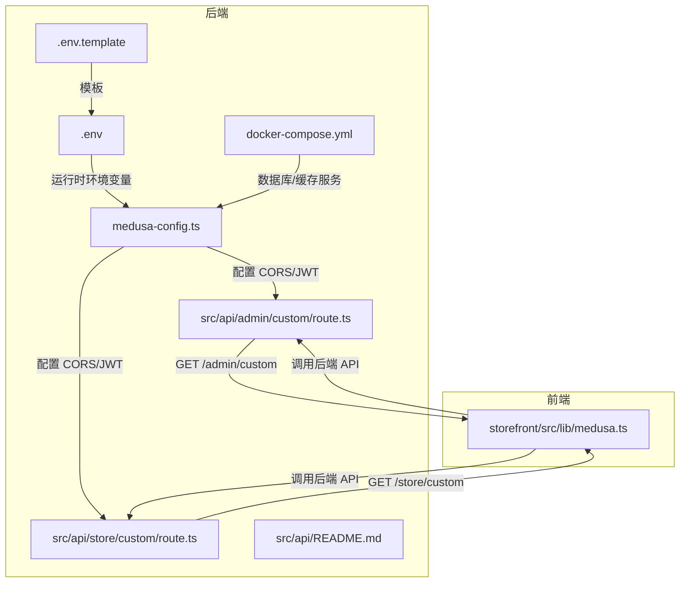
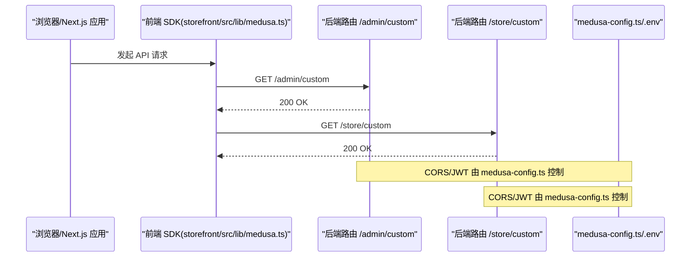
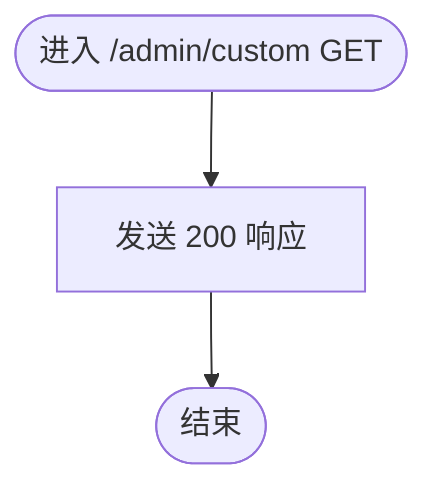
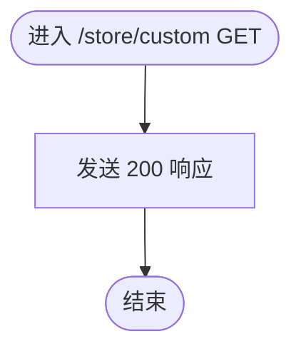
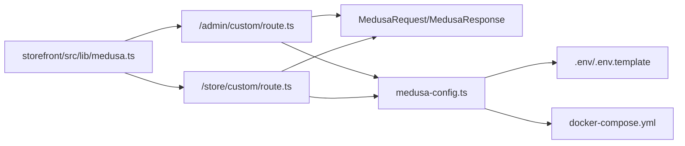

# API端点参考

<cite>
**本文引用的文件**
- [backend/src/api/admin/custom/route.ts](file://backend/src/api/admin/custom/route.ts)
- [backend/src/api/store/custom/route.ts](file://backend/src/api/store/custom/route.ts)
- [backend/src/api/README.md](file://backend/src/api/README.md)
- [backend/medusa-config.ts](file://backend/medusa-config.ts)
- [backend/.env](file://backend/.env)
- [backend/.env.template](file://backend/.env.template)
- [backend/docker-compose.yml](file://backend/docker-compose.yml)
- [storefront/src/lib/medusa.ts](file://storefront/src/lib/medusa.ts)
</cite>

## 目录
1. [简介](#简介)
2. [项目结构](#项目结构)
3. [核心组件](#核心组件)
4. [架构总览](#架构总览)
5. [详细组件分析](#详细组件分析)
6. [依赖关系分析](#依赖关系分析)
7. [性能考量](#性能考量)
8. [故障排查指南](#故障排查指南)
9. [结论](#结论)
10. [附录](#附录)

## 简介
本文件为 Lumiera 后端 API 的完整端点参考，聚焦于管理端（admin）与店铺端（store）的自定义路由。当前仓库中已实现两个最小化示例端点：
- 管理端：/admin/custom（仅支持 GET）
- 店铺端：/store/custom（仅支持 GET）

本文将系统说明：
- MedusaRequest 与 MedusaResponse 类型在端点中的使用方式
- HTTP 状态码返回机制（例如 200 响应）
- 如何扩展这些路由以支持 POST、PUT、DELETE 等方法
- 身份验证集成思路（API 密钥或 JWT）
- 请求参数与请求体数据的提取方式
- JSON 响应格式与错误处理模式（try-catch 封装）
- API 版本控制策略建议
- 日志记录建议
- 与前端 Next.js 应用的调用集成方式

## 项目结构
后端采用 Medusa 文件路由约定，在 src/api 下按 store 或 admin 子目录组织自定义路由。每个路由文件命名为 route.ts，导出对应 HTTP 方法的异步处理器函数。

图表来源
- [backend/src/api/admin/custom/route.ts](file://backend/src/api/admin/custom/route.ts#L1-L9)
- [backend/src/api/store/custom/route.ts](file://backend/src/api/store/custom/route.ts#L1-L9)
- [backend/src/api/README.md](file://backend/src/api/README.md#L1-L33)
- [backend/medusa-config.ts](file://backend/medusa-config.ts#L1-L21)
- [backend/.env](file://backend/.env#L1-L8)
- [backend/.env.template](file://backend/.env.template#L1-L9)
- [backend/docker-compose.yml](file://backend/docker-compose.yml#L1-L31)
- [storefront/src/lib/medusa.ts](file://storefront/src/lib/medusa.ts#L213-L266)

章节来源
- [backend/src/api/admin/custom/route.ts](file://backend/src/api/admin/custom/route.ts#L1-L9)
- [backend/src/api/store/custom/route.ts](file://backend/src/api/store/custom/route.ts#L1-L9)
- [backend/src/api/README.md](file://backend/src/api/README.md#L1-L33)
- [backend/medusa-config.ts](file://backend/medusa-config.ts#L1-L21)
- [backend/.env](file://backend/.env#L1-L8)
- [backend/.env.template](file://backend/.env.template#L1-L9)
- [backend/docker-compose.yml](file://backend/docker-compose.yml#L1-L31)
- [storefront/src/lib/medusa.ts](file://storefront/src/lib/medusa.ts#L213-L266)

## 核心组件
- 管理端自定义路由：/admin/custom
- 店铺端自定义路由：/store/custom
- MedusaRequest/MedusaResponse：端点处理器的请求与响应类型
- 配置与环境：CORS、JWT、Cookie Secret、数据库连接
- 前端 SDK：Next.js 应用通过 JS SDK 调用后端 API

章节来源
- [backend/src/api/admin/custom/route.ts](file://backend/src/api/admin/custom/route.ts#L1-L9)
- [backend/src/api/store/custom/route.ts](file://backend/src/api/store/custom/route.ts#L1-L9)
- [backend/src/api/README.md](file://backend/src/api/README.md#L1-L33)
- [backend/medusa-config.ts](file://backend/medusa-config.ts#L1-L21)
- [backend/.env](file://backend/.env#L1-L8)

## 架构总览
下图展示了从浏览器到后端 API 的典型调用链路，以及 Medusa 的配置如何影响跨域与认证行为。

图表来源
- [backend/src/api/admin/custom/route.ts](file://backend/src/api/admin/custom/route.ts#L1-L9)
- [backend/src/api/store/custom/route.ts](file://backend/src/api/store/custom/route.ts#L1-L9)
- [backend/medusa-config.ts](file://backend/medusa-config.ts#L1-L21)
- [backend/.env](file://backend/.env#L1-L8)
- [storefront/src/lib/medusa.ts](file://storefront/src/lib/medusa.ts#L213-L266)

## 详细组件分析

### 管理端自定义路由：/admin/custom
- 当前实现：仅支持 GET，返回 200 状态码
- 处理器签名：接收 MedusaRequest 与 MedusaResponse
- 扩展方向：添加 POST/PUT/DELETE 等方法；读取查询参数与请求体；返回 JSON 响应；集成身份验证

图表来源
- [backend/src/api/admin/custom/route.ts](file://backend/src/api/admin/custom/route.ts#L1-L9)

章节来源
- [backend/src/api/admin/custom/route.ts](file://backend/src/api/admin/custom/route.ts#L1-L9)

### 店铺端自定义路由：/store/custom
- 当前实现：仅支持 GET，返回 200 状态码
- 处理器签名：接收 MedusaRequest 与 MedusaResponse
- 扩展方向：同上

图表来源
- [backend/src/api/store/custom/route.ts](file://backend/src/api/store/custom/route.ts#L1-L9)

章节来源
- [backend/src/api/store/custom/route.ts](file://backend/src/api/store/custom/route.ts#L1-L9)

### MedusaRequest 与 MedusaResponse 类型
- MedusaRequest：包含请求上下文，如 params、query、headers、body 等
- MedusaResponse：提供 sendStatus、json、redirect 等响应方法
- 在路由中通过 req.scope 访问容器资源（模块服务等）

章节来源
- [backend/src/api/README.md](file://backend/src/api/README.md#L1-L33)
- [backend/src/api/README.md](file://backend/src/api/README.md#L79-L100)

### HTTP 状态码与响应格式
- 当前端点返回 200 OK
- 可通过 res.sendStatus(status) 返回状态码
- 可通过 res.json(data) 返回 JSON 响应

章节来源
- [backend/src/api/admin/custom/route.ts](file://backend/src/api/admin/custom/route.ts#L1-L9)
- [backend/src/api/store/custom/route.ts](file://backend/src/api/store/custom/route.ts#L1-L9)
- [backend/src/api/README.md](file://backend/src/api/README.md#L1-L33)

### 扩展支持更多 HTTP 方法
- 在同一 route.ts 中导出 POST/PUT/PATCH/DELETE 等函数即可启用对应方法
- 文档明确支持 GET/POST/PUT/PATCH/DELETE/OPTIONS/HEAD

章节来源
- [backend/src/api/README.md](file://backend/src/api/README.md#L21-L33)

### 身份验证集成（API 密钥或 JWT）
- medusa-config.ts 提供 jwtSecret 与 cookieSecret 配置项
- .env/.env.template 提供 JWT_SECRET 与 COOKIE_SECRET 示例
- 建议在中间件层对特定路由进行鉴权校验（如校验 Authorization 头中的 API Key 或 JWT）

章节来源
- [backend/medusa-config.ts](file://backend/medusa-config.ts#L1-L21)
- [backend/.env](file://backend/.env#L1-L8)
- [backend/.env.template](file://backend/.env.template#L1-L9)

### 请求参数与请求体提取
- 查询参数：通过 req.query 获取
- 路径参数：通过 req.params 获取
- 请求体：通过 req.body 获取
- 路由参数示例与容器访问示例可参考文档

章节来源
- [backend/src/api/README.md](file://backend/src/api/README.md#L53-L76)
- [backend/src/api/README.md](file://backend/src/api/README.md#L79-L100)

### 错误处理模式（try-catch 封装）
- 建议在路由中使用 try-catch 包裹业务逻辑，捕获异常并返回统一的错误响应（如 4xx/5xx）
- 前端 SDK 中也展示了类似的 try-catch 模式用于调用后端接口

章节来源
- [storefront/src/lib/medusa.ts](file://storefront/src/lib/medusa.ts#L213-L266)

### API 版本控制策略
- 建议在路由路径中加入版本号，如 /store/v1/custom、/admin/v1/custom
- 或通过请求头（如 Accept-Version）进行版本协商
- 保持向后兼容或在变更时提供迁移指引

[本节为通用实践建议，不直接分析具体文件]

### 日志记录建议
- 在路由入口处记录请求信息（方法、路径、参数）
- 在错误处理分支记录异常堆栈
- 可结合 OpenTelemetry 进行可观测性（仓库提供注释化的配置文件）

章节来源
- [backend/instrumentation.ts](file://backend/instrumentation.ts#L1-L24)

### 与前端 Next.js 应用的调用集成
- 前端通过 JS SDK 调用后端 API
- SDK 中包含注册、获取客户信息、搜索商品等示例
- 建议在前端统一处理错误与加载状态

章节来源
- [storefront/src/lib/medusa.ts](file://storefront/src/lib/medusa.ts#L213-L266)

## 依赖关系分析
- 端点依赖 MedusaRequest/MedusaResponse 类型
- 端点依赖 medusa-config.ts 的 CORS 与认证配置
- 端点依赖 .env/.env.template 提供的运行时环境变量
- 端点依赖 Docker Compose 提供的数据库与缓存服务
- 前端通过 JS SDK 调用后端 API

图表来源
- [backend/src/api/admin/custom/route.ts](file://backend/src/api/admin/custom/route.ts#L1-L9)
- [backend/src/api/store/custom/route.ts](file://backend/src/api/store/custom/route.ts#L1-L9)
- [backend/src/api/README.md](file://backend/src/api/README.md#L1-L33)
- [backend/medusa-config.ts](file://backend/medusa-config.ts#L1-L21)
- [backend/.env](file://backend/.env#L1-L8)
- [backend/.env.template](file://backend/.env.template#L1-L9)
- [backend/docker-compose.yml](file://backend/docker-compose.yml#L1-L31)
- [storefront/src/lib/medusa.ts](file://storefront/src/lib/medusa.ts#L213-L266)

章节来源
- [backend/src/api/admin/custom/route.ts](file://backend/src/api/admin/custom/route.ts#L1-L9)
- [backend/src/api/store/custom/route.ts](file://backend/src/api/store/custom/route.ts#L1-L9)
- [backend/src/api/README.md](file://backend/src/api/README.md#L1-L33)
- [backend/medusa-config.ts](file://backend/medusa-config.ts#L1-L21)
- [backend/.env](file://backend/.env#L1-L8)
- [backend/.env.template](file://backend/.env.template#L1-L9)
- [backend/docker-compose.yml](file://backend/docker-compose.yml#L1-L31)
- [storefront/src/lib/medusa.ts](file://storefront/src/lib/medusa.ts#L213-L266)

## 性能考量
- 使用中间件进行限流与速率控制
- 对复杂查询使用分页与索引优化
- 缓存热点数据（如静态配置），避免重复计算
- 在容器中合理复用服务实例，减少初始化开销

[本节为通用性能建议，不直接分析具体文件]

## 故障排查指南
- 端点返回非 200：检查路由是否正确导出对应方法；确认中间件未拦截
- CORS 报错：核对 medusa-config.ts 中的 STORE_CORS/ADMIN_CORS 与前端地址一致
- JWT/认证失败：核对 JWT_SECRET/Cookie Secret 是否与前端 SDK 配置一致
- 数据库/缓存不可用：检查 docker-compose 服务状态与连接字符串

章节来源
- [backend/medusa-config.ts](file://backend/medusa-config.ts#L1-L21)
- [backend/.env](file://backend/.env#L1-L8)
- [backend/.env.template](file://backend/.env.template#L1-L9)
- [backend/docker-compose.yml](file://backend/docker-compose.yml#L1-L31)

## 结论
- 当前仓库提供了管理端与店铺端的最小化自定义路由示例，均支持 GET 并返回 200
- 可基于现有示例快速扩展为多方法端点，并集成身份验证、参数解析、错误处理与日志记录
- 建议在路由中引入版本控制与中间件，提升安全性与可维护性
- 前端可通过 JS SDK 与后端 API 交互，建议统一错误处理与状态管理

[本节为总结性内容，不直接分析具体文件]

## 附录

### 端点一览（当前与扩展建议）
- 管理端
  - GET /admin/custom（当前）
  - 建议扩展：POST/PUT/DELETE /admin/custom
- 店铺端
  - GET /store/custom（当前）
  - 建议扩展：POST/PUT/DELETE /store/custom

章节来源
- [backend/src/api/admin/custom/route.ts](file://backend/src/api/admin/custom/route.ts#L1-L9)
- [backend/src/api/store/custom/route.ts](file://backend/src/api/store/custom/route.ts#L1-L9)
- [backend/src/api/README.md](file://backend/src/api/README.md#L21-L33)