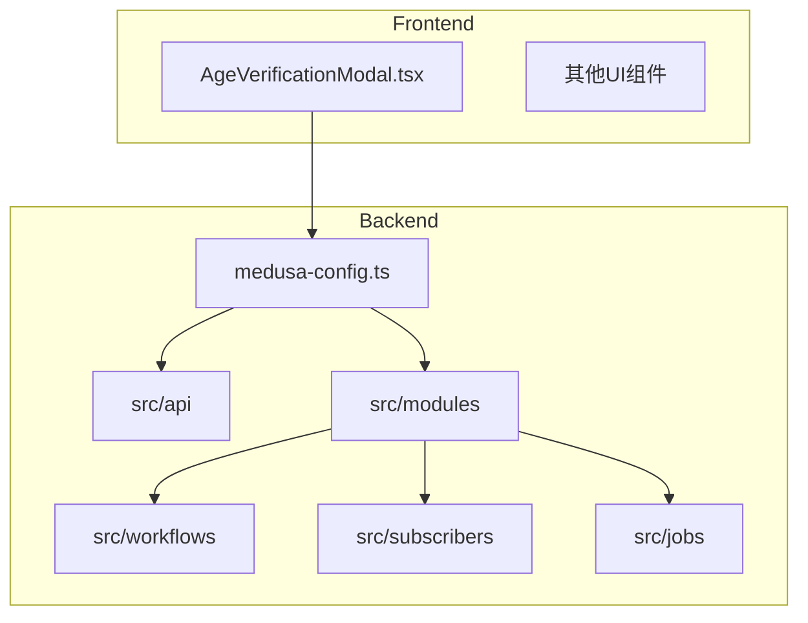
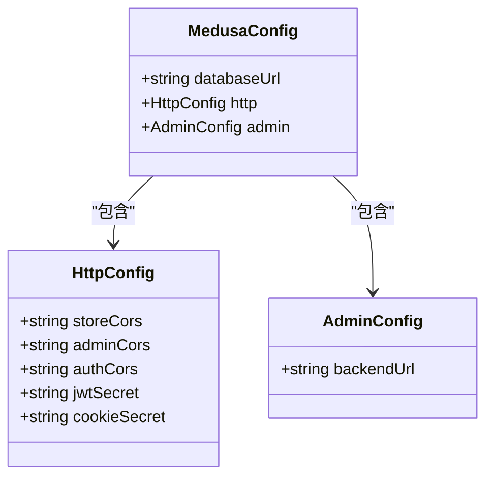
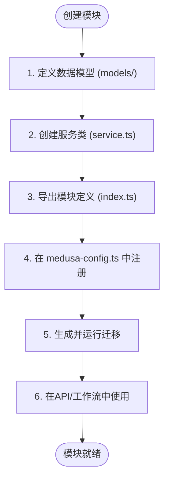
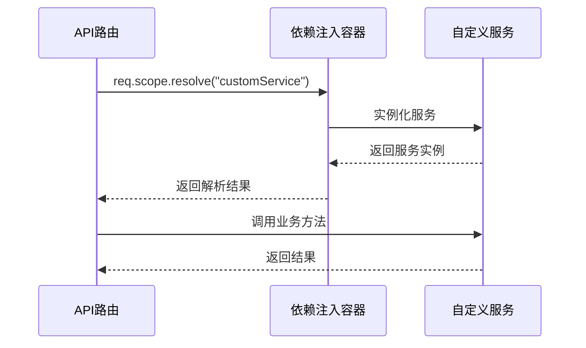
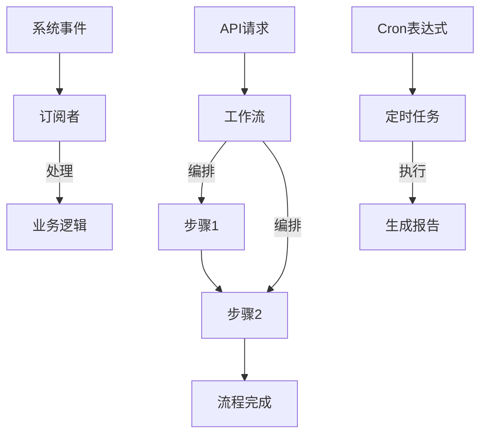

# 业务逻辑层

<cite>
**本文档中引用的文件**  
- [medusa-config.ts](file://backend/medusa-config.ts)
- [package.json](file://backend/package.json)
- [.env](file://backend/.env)
- [.env.template](file://backend/.env.template)
- [docker-compose.yml](file://backend/docker-compose.yml)
- [src/api/admin/custom/route.ts](file://backend/src/api/admin/custom/route.ts)
- [src/api/store/custom/route.ts](file://backend/src/api/store/custom/route.ts)
- [src/modules/README.md](file://backend/src/modules/README.md)
- [src/workflows/README.md](file://backend/src/workflows/README.md)
- [src/subscribers/README.md](file://backend/src/subscribers/README.md)
- [src/jobs/README.md](file://backend/src/jobs/README.md)
- [src/api/README.md](file://backend/src/api/README.md)
- [src/admin/README.md](file://backend/src/admin/README.md)
- [storefront/src/components/AgeVerificationModal.tsx](file://storefront/src/components/AgeVerificationModal.tsx)
</cite>

## 目录
1. [简介](#简介)
2. [项目结构](#项目结构)
3. [配置与服务集成](#配置与服务集成)
4. [模块化架构与自定义模块](#模块化架构与自定义模块)
5. [依赖注入与服务覆盖](#依赖注入与服务覆盖)
6. [中间件与API路由机制](#中间件与api路由机制)
7. [工作流与事件驱动逻辑](#工作流与事件驱动逻辑)
8. [多区域支持与隐私配送逻辑](#多区域支持与隐私配送逻辑)
9. [年龄验证钩子实现](#年龄验证钩子实现)
10. [扩展指南：自定义服务集成](#扩展指南自定义服务集成)
11. [结论](#结论)

## 简介
Lumiera后端基于Medusa框架构建，采用模块化、可扩展的架构设计，专注于成人健康产品的电子商务业务逻辑。本系统通过`medusa-config.ts`配置文件实现核心服务（数据库、缓存、文件存储等）的集成与定制，并支持通过模块、工作流、订阅者等机制实现高度可维护和可测试的业务逻辑层。

系统通过环境变量和Docker容器化部署确保配置灵活性，同时利用Medusa的依赖注入容器实现服务的解耦与覆盖。业务逻辑层的设计强调可扩展性，允许开发者通过自定义模块、API路由、中间件、工作流和订阅者来增强系统功能。

**Section sources**
- [medusa-config.ts](file://backend/medusa-config.ts#L1-L21)
- [package.json](file://backend/package.json#L1-L50)

## 项目结构
Lumiera项目分为`backend`和`storefront`两个主要部分。后端采用Medusa框架的标准结构，核心业务逻辑位于`backend/src`目录下，包括API路由、自定义模块、工作流、订阅者和定时任务等组件。

- `backend/src/api`：存放自定义API路由，支持基于文件的路由机制。
- `backend/src/modules`：存放自定义模块，实现可复用的业务功能。
- `backend/src/workflows`：定义复杂业务流程的工作流。
- `backend/src/subscribers`：处理系统事件的订阅者。
- `backend/src/jobs`：定义定时执行的后台任务。
- `backend/medusa-config.ts`：核心配置文件，定义数据库、缓存、模块等配置。
- `backend/.env`：环境变量配置文件。

前端部分（storefront）采用Next.js构建，包含年龄验证模态框等用户交互组件。



**Diagram sources**
- [medusa-config.ts](file://backend/medusa-config.ts#L1-L21)
- [src/modules/README.md](file://backend/src/modules/README.md#L1-L118)

**Section sources**
- [backend](file://backend)
- [storefront](file://storefront)

## 配置与服务集成
Lumiera后端通过`medusa-config.ts`文件定义核心服务配置，包括数据库连接、HTTP CORS策略、JWT密钥等。该文件使用`defineConfig`函数创建配置对象，通过`projectConfig`字段设置项目级参数。

数据库使用PostgreSQL，连接URL通过环境变量`DATABASE_URL`注入，确保生产环境的安全性。缓存服务使用Redis，通过`REDIS_URL`环境变量配置。文件存储服务未在配置文件中显式定义，但可通过Medusa插件机制集成S3或本地存储。

HTTP服务配置了`storeCors`、`adminCors`和`authCors`，分别控制商店前端、管理后台和认证服务的跨域请求策略。JWT和Cookie的密钥也通过环境变量注入，增强安全性。



**Diagram sources**
- [medusa-config.ts](file://backend/medusa-config.ts#L5-L20)

**Section sources**
- [medusa-config.ts](file://backend/medusa-config.ts#L1-L21)
- [.env](file://backend/.env#L1-L8)
- [.env.template](file://backend/.env.template#L1-L8)
- [docker-compose.yml](file://backend/docker-compose.yml#L1-L31)

## 模块化架构与自定义模块
Lumiera采用Medusa的模块化架构，允许将业务功能封装为独立的模块。每个模块包含数据模型、服务类和模块定义文件，通过`medusa-config.ts`中的`modules`字段注册到系统中。

自定义模块遵循标准结构：
1. **数据模型**：定义数据库表结构，使用`model.define`方法创建。
2. **服务类**：继承`MedusaService`，封装业务逻辑方法。
3. **模块定义**：通过`Module`函数导出模块，指定主服务。
4. **注册到配置**：在`medusa-config.ts`中添加模块路径。

模块通过依赖注入容器（`req.scope`）被其他组件（如API路由、工作流）访问，确保松耦合和可测试性。



**Diagram sources**
- [src/modules/README.md](file://backend/src/modules/README.md#L1-L118)

**Section sources**
- [src/modules/README.md](file://backend/src/modules/README.md#L1-L118)
- [medusa-config.ts](file://backend/medusa-config.ts#L5-L21)

## 依赖注入与服务覆盖
Medusa框架提供强大的依赖注入容器（`req.scope`），允许在运行时解析和使用已注册的服务。通过`req.scope.resolve("service_name")`方法，可以在API路由、工作流、订阅者等组件中获取服务实例。

服务覆盖（Service Overriding）是Medusa的重要特性，允许开发者替换默认服务实现。例如，可以创建自定义的`ProductService`来扩展或修改产品管理逻辑，然后在配置中注册该服务以覆盖默认实现。

这种机制确保了系统的可扩展性和可维护性，开发者可以在不修改核心代码的情况下定制业务逻辑。



**Diagram sources**
- [src/api/README.md](file://backend/src/api/README.md#L78-L99)
- [src/modules/README.md](file://backend/src/modules/README.md#L96-L117)

**Section sources**
- [src/api/README.md](file://backend/src/api/README.md#L78-L136)
- [src/modules/README.md](file://backend/src/modules/README.md#L96-L117)

## 中间件与API路由机制
Lumiera后端使用基于文件的API路由机制，路由文件位于`src/api`目录下，文件名为`route.ts`。支持所有标准HTTP方法（GET、POST、PUT等），通过导出对应名称的异步函数来处理请求。

中间件通过`src/api/middlewares.ts`文件集中配置，使用`defineMiddlewares`函数定义匹配路径和中间件函数数组。中间件可用于日志记录、身份验证、输入验证等横切关注点。

API路由可通过`req.scope`访问依赖注入容器，调用模块服务处理业务逻辑，并通过`res.json()`返回响应。

**Section sources**
- [src/api/README.md](file://backend/src/api/README.md#L1-L136)
- [src/api/admin/custom/route.ts](file://backend/src/api/admin/custom/route.ts#L1-L9)
- [src/api/store/custom/route.ts](file://backend/src/api/store/custom/route.ts#L1-L9)

## 工作流与事件驱动逻辑
Lumiera使用工作流（Workflows）管理复杂的业务流程，如订单处理、库存更新等。工作流由一系列步骤（Steps）组成，每个步骤封装特定的业务操作，支持异步执行和错误处理。

工作流可通过API路由、定时任务或事件订阅者触发。事件驱动逻辑通过订阅者（Subscribers）实现，订阅者监听系统事件（如`product.created`），并在事件发生时执行相应逻辑，如发送通知、更新索引等。

定时任务（Scheduled Jobs）用于执行周期性操作，如每日报告生成、缓存清理等，使用cron表达式定义执行计划。



**Diagram sources**
- [src/workflows/README.md](file://backend/src/workflows/README.md#L1-L82)
- [src/subscribers/README.md](file://backend/src/subscribers/README.md#L1-L61)
- [src/jobs/README.md](file://backend/src/jobs/README.md#L1-L39)

**Section sources**
- [src/workflows/README.md](file://backend/src/workflows/README.md#L1-L82)
- [src/subscribers/README.md](file://backend/src/subscribers/README.md#L1-L61)
- [src/jobs/README.md](file://backend/src/jobs/README.md#L1-L39)

## 多区域支持与隐私配送逻辑
虽然当前代码库中未直接体现多区域支持的实现细节，但Medusa框架原生支持多区域、多货币和多语言配置。通过`medusa-config.ts`中的区域设置，可以定义不同地区的定价、税收和配送规则。

隐私配送逻辑可能通过自定义模块或工作流实现，确保敏感产品在配送过程中保持隐私。例如，可以在订单处理工作流中添加步骤，标记订单为"隐私配送"，并选择支持隐私包装的物流服务商。

**Section sources**
- [medusa-config.ts](file://backend/medusa-config.ts#L5-L21)

## 年龄验证钩子实现
年龄验证功能主要在前端实现，通过`AgeVerificationModal.tsx`组件在用户进入网站时弹出验证模态框。用户必须确认年满18岁才能继续浏览。

后端可通过自定义中间件或API路由钩子增强年龄验证，例如：
- 在用户会话中存储验证状态
- 对特定API端点（如产品查看）添加年龄验证中间件
- 记录验证日志用于合规审计

```mermaid
flowchart TD
User[用户访问网站] --> Modal[显示年龄验证模态框]
Modal --> Verify{用户点击"我已18岁+"}
Verify --> |是| Store[存储验证状态到localStorage]
Store --> Allow[允许访问网站]
Verify --> |否| Exit[重定向到外部网站]
```

**Diagram sources**
- [storefront/src/components/AgeVerificationModal.tsx](file://storefront/src/components/AgeVerificationModal.tsx#L1-L59)

**Section sources**
- [storefront/src/components/AgeVerificationModal.tsx](file://storefront/src/components/AgeVerificationModal.tsx#L1-L59)

## 扩展指南：自定义服务集成
要向Lumiera系统添加自定义服务（如邮件通知、AI推荐引擎），请遵循以下步骤：

1. **创建自定义模块**：在`src/modules`下创建新模块，定义数据模型和服务类。
2. **实现服务逻辑**：在服务类中实现业务方法，如发送邮件、调用AI API等。
3. **注册模块**：在`medusa-config.ts`的`modules`数组中添加模块路径。
4. **注入依赖**：在需要使用服务的组件（API路由、工作流、订阅者）中，通过`req.scope.resolve("module_name")`获取服务实例。
5. **测试与部署**：编写测试用例，确保服务按预期工作，然后部署到生产环境。

此模式确保新功能与核心系统解耦，易于维护和测试。

**Section sources**
- [src/modules/README.md](file://backend/src/modules/README.md#L1-L118)
- [src/api/README.md](file://backend/src/api/README.md#L78-L99)
- [src/workflows/README.md](file://backend/src/workflows/README.md#L55-L82)

## 结论
Lumiera后端的业务逻辑层设计体现了现代电商系统的最佳实践：模块化、可扩展、事件驱动。通过`medusa-config.ts`配置文件，系统灵活集成了数据库、缓存等核心服务。模块化架构允许安全地扩展功能，而依赖注入容器确保了组件间的松耦合。

工作流和订阅者机制支持复杂的业务流程和事件驱动逻辑，中间件提供了横切关注点的统一处理方式。年龄验证等合规功能通过前后端协作实现，确保业务符合法规要求。

未来扩展可聚焦于多区域支持、AI个性化推荐和更精细的隐私控制，进一步提升用户体验和业务合规性。