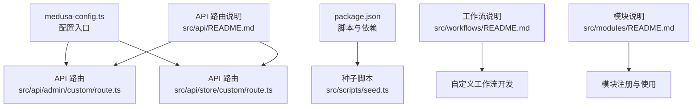
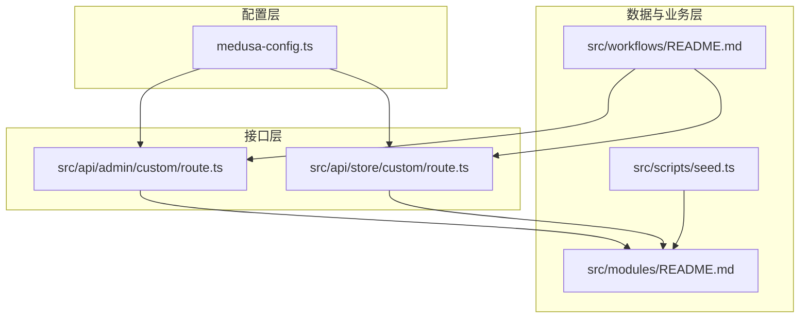
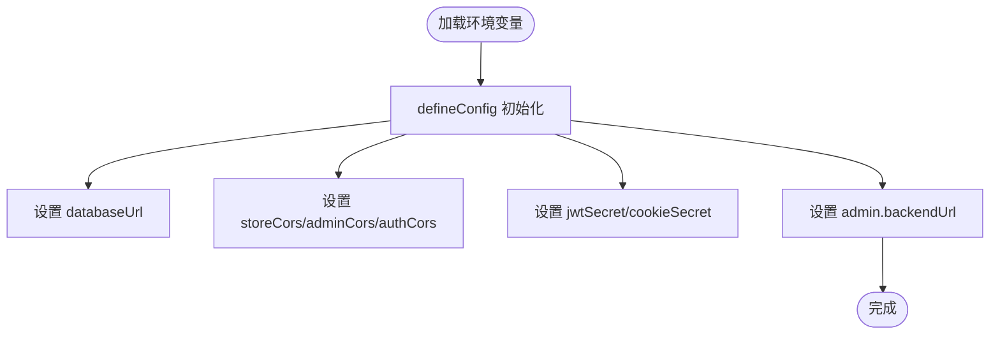
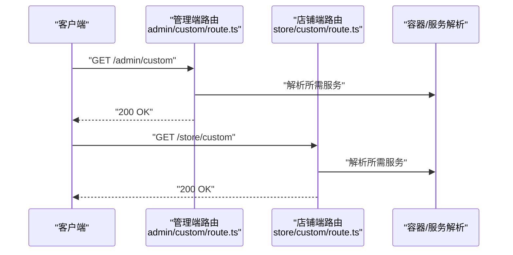
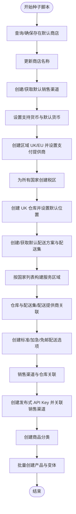
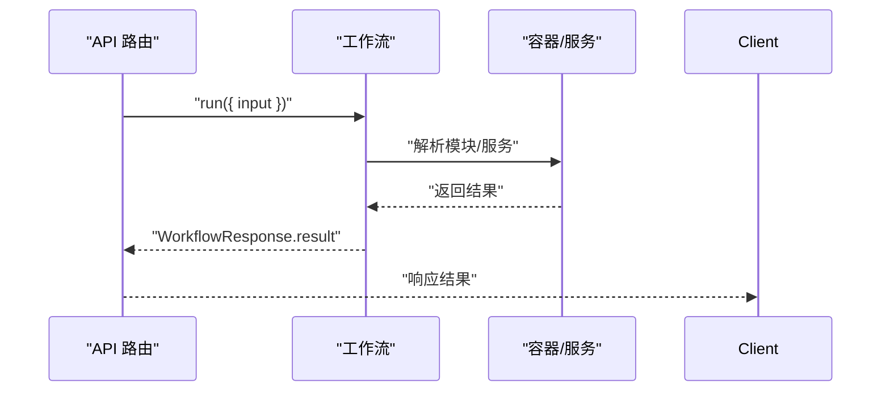
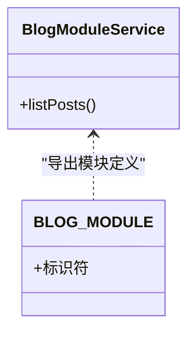
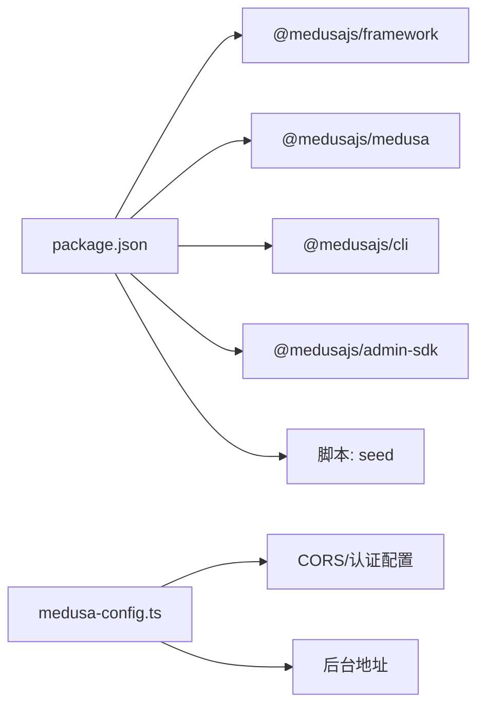

# 后端架构

<cite>
**本文引用的文件**
- [medusa-config.ts](file://backend/medusa-config.ts)
- [package.json](file://backend/package.json)
- [seed.ts](file://backend/src/scripts/seed.ts)
- [admin-custom-route.ts](file://backend/src/api/admin/custom/route.ts)
- [store-custom-route.ts](file://backend/src/api/store/custom/route.ts)
- [api-readme.md](file://backend/src/api/README.md)
- [workflows-readme.md](file://backend/src/workflows/README.md)
- [modules-readme.md](file://backend/src/modules/README.md)
- [backend-readme.md](file://backend/README.md)
</cite>

## 目录
1. [简介](#简介)
2. [项目结构](#项目结构)
3. [核心组件](#核心组件)
4. [架构总览](#架构总览)
5. [详细组件分析](#详细组件分析)
6. [依赖关系分析](#依赖关系分析)
7. [性能考量](#性能考量)
8. [故障排查指南](#故障排查指南)
9. [结论](#结论)
10. [附录](#附录)

## 简介
本文件面向Lumiera后端（基于MedusaJS v2）的深度技术文档，聚焦于模块化与工作流设计，系统性解析以下主题：
- src/api 下自定义管理端与店铺端 API 路由的实现机制（请求处理、身份验证与响应格式）
- seed.ts 脚本如何初始化产品、区域、配送选项等种子数据，揭示核心数据模型结构
- medusa-config.ts 中的插件配置（数据库、缓存、存储）与自定义设置
- MedusaJS 的工作流（workflows）机制如何支持复杂业务流程（如订单创建、库存更新）
- 开发者扩展点：新增 API 端点、修改默认行为的方法与最佳实践

## 项目结构
后端采用 MedusaJS 的标准目录组织方式，关键路径如下：
- 配置与运行：medusa-config.ts、package.json
- 自定义 API：src/api/admin/custom/route.ts、src/api/store/custom/route.ts
- 种子数据：src/scripts/seed.ts
- 工作流：src/workflows/README.md
- 模块与插件：src/modules/README.md
- 文档与说明：src/api/README.md、backend/README.md

图表来源
- [medusa-config.ts](file://backend/medusa-config.ts#L1-L21)
- [package.json](file://backend/package.json#L15-L23)
- [seed.ts](file://backend/src/scripts/seed.ts#L1-L43)
- [workflows-readme.md](file://backend/src/workflows/README.md#L1-L82)
- [modules-readme.md](file://backend/src/modules/README.md#L1-L118)
- [api-readme.md](file://backend/src/api/README.md#L1-L136)

章节来源
- [medusa-config.ts](file://backend/medusa-config.ts#L1-L21)
- [package.json](file://backend/package.json#L15-L23)
- [backend-readme.md](file://backend/README.md#L35-L63)

## 核心组件
- 配置中心：medusa-config.ts 通过 defineConfig 定义数据库连接、HTTP CORS 与认证相关参数，并可配置后台 URL。
- API 路由：src/api/admin/custom/route.ts 与 src/api/store/custom/route.ts 提供最小化示例，展示如何接收请求并返回状态码。
- 种子脚本：seed.ts 使用 @medusajs/medusa/core-flows 与 @medusajs/framework/workflows-sdk 组合，批量初始化商店、销售渠道、区域、税区、库存地点、配送方案与产品等。
- 工作流：src/workflows/README.md 展示了工作流的创建与执行方式，强调从 API 路由、定时任务或订阅者中调用。
- 模块：src/modules/README.md 说明模块的建模、服务与注册流程，便于扩展业务能力。

章节来源
- [medusa-config.ts](file://backend/medusa-config.ts#L1-L21)
- [admin-custom-route.ts](file://backend/src/api/admin/custom/route.ts#L1-L9)
- [store-custom-route.ts](file://backend/src/api/store/custom/route.ts#L1-L9)
- [seed.ts](file://backend/src/scripts/seed.ts#L1-L43)
- [workflows-readme.md](file://backend/src/workflows/README.md#L1-L82)
- [modules-readme.md](file://backend/src/modules/README.md#L1-L118)
- [api-readme.md](file://backend/src/api/README.md#L1-L136)

## 架构总览
MedusaJS 在 Lumiera 后端中的角色是“模块化电商内核”，负责：
- 数据模型与服务：通过模块化服务抽象商品、库存、区域、配送、支付等能力
- API 路由：提供管理端与店铺端的 REST 接口
- 工作流：将多步骤业务逻辑封装为可复用、可编排的工作流
- 配置：集中管理数据库、CORS、JWT/Cookie 密钥与后台地址

图表来源
- [medusa-config.ts](file://backend/medusa-config.ts#L1-L21)
- [admin-custom-route.ts](file://backend/src/api/admin/custom/route.ts#L1-L9)
- [store-custom-route.ts](file://backend/src/api/store/custom/route.ts#L1-L9)
- [seed.ts](file://backend/src/scripts/seed.ts#L1-L43)
- [workflows-readme.md](file://backend/src/workflows/README.md#L1-L82)
- [modules-readme.md](file://backend/src/modules/README.md#L1-L118)

## 详细组件分析

### 配置与环境变量（medusa-config.ts）
- 数据库连接：通过 DATABASE_URL 注入
- CORS 与认证：storeCors、adminCors、authCors 控制跨域；jwtSecret、cookieSecret 控制令牌与 Cookie 安全
- 后台地址：admin.backendUrl 可配置后台访问地址

图表来源
- [medusa-config.ts](file://backend/medusa-config.ts#L1-L21)

章节来源
- [medusa-config.ts](file://backend/medusa-config.ts#L1-L21)

### API 路由：管理端与店铺端
- 文件命名规范：在 src/api/{admin|store}/custom 下创建 route.ts 即可暴露 REST 端点
- 支持方法：GET、POST、PUT、PATCH、DELETE、OPTIONS、HEAD
- 参数与中间件：可通过路径参数 [param] 定义；可按路由匹配应用中间件
- 请求上下文：req.scope 提供容器访问，用于解析模块服务

图表来源
- [admin-custom-route.ts](file://backend/src/api/admin/custom/route.ts#L1-L9)
- [store-custom-route.ts](file://backend/src/api/store/custom/route.ts#L1-L9)
- [api-readme.md](file://backend/src/api/README.md#L1-L136)

章节来源
- [admin-custom-route.ts](file://backend/src/api/admin/custom/route.ts#L1-L9)
- [store-custom-route.ts](file://backend/src/api/store/custom/route.ts#L1-L9)
- [api-readme.md](file://backend/src/api/README.md#L1-L136)

### 种子数据：初始化商店、区域、配送与产品
seed.ts 使用 core-flows 与 workflows-sdk 执行一系列工作流，覆盖：
- 商店信息：名称、默认销售渠道、默认库存地点、支持货币
- 区域与税区：按国家/地区划分区域并建立税区
- 库存地点与配送：创建仓库、绑定配送集与服务区域、生成配送选项
- 销售渠道与 API Key：创建发布式 API Key 并关联到默认销售渠道
- 商品分类与产品：批量创建分类与产品，含变体、价格与图片

图表来源
- [seed.ts](file://backend/src/scripts/seed.ts#L1-L43)
- [seed.ts](file://backend/src/scripts/seed.ts#L124-L145)
- [seed.ts](file://backend/src/scripts/seed.ts#L147-L154)
- [seed.ts](file://backend/src/scripts/seed.ts#L156-L182)
- [seed.ts](file://backend/src/scripts/seed.ts#L193-L236)
- [seed.ts](file://backend/src/scripts/seed.ts#L237-L309)
- [seed.ts](file://backend/src/scripts/seed.ts#L312-L318)
- [seed.ts](file://backend/src/scripts/seed.ts#L320-L357)
- [seed.ts](file://backend/src/scripts/seed.ts#L359-L397)
- [seed.ts](file://backend/src/scripts/seed.ts#L398-L852)

章节来源
- [seed.ts](file://backend/src/scripts/seed.ts#L1-L43)
- [seed.ts](file://backend/src/scripts/seed.ts#L124-L145)
- [seed.ts](file://backend/src/scripts/seed.ts#L147-L154)
- [seed.ts](file://backend/src/scripts/seed.ts#L156-L182)
- [seed.ts](file://backend/src/scripts/seed.ts#L193-L236)
- [seed.ts](file://backend/src/scripts/seed.ts#L237-L309)
- [seed.ts](file://backend/src/scripts/seed.ts#L312-L318)
- [seed.ts](file://backend/src/scripts/seed.ts#L320-L357)
- [seed.ts](file://backend/src/scripts/seed.ts#L359-L397)
- [seed.ts](file://backend/src/scripts/seed.ts#L398-L852)

### 工作流机制：封装复杂业务流程
- 工作流定义：通过 createWorkflow 创建，内部可组合多个步骤（steps），返回 WorkflowResponse
- 执行入口：可在 API 路由、定时任务或订阅者中以 container 或 req.scope.run 方式执行
- 示例：README 展示了从 API 路由中调用工作流的模式

图表来源
- [workflows-readme.md](file://backend/src/workflows/README.md#L1-L82)

章节来源
- [workflows-readme.md](file://backend/src/workflows/README.md#L1-L82)

### 模块与插件：扩展点与集成
- 模块结构：包含数据模型（models）、服务（service）与模块定义（index.ts）
- 注册方式：在 medusa-config.ts 的 modules 数组中声明模块路径
- 使用方式：在 API 路由或工作流中通过 req.scope.resolve 获取模块服务实例

图表来源
- [modules-readme.md](file://backend/src/modules/README.md#L1-L118)

章节来源
- [modules-readme.md](file://backend/src/modules/README.md#L1-L118)

## 依赖关系分析
- 运行时依赖：@medusajs/framework、@medusajs/medusa、@medusajs/cli、@medusajs/admin-sdk
- 脚本命令：build、dev、start、seed、test:* 等
- 配置依赖：medusa-config.ts 作为配置入口，影响 CORS、认证与后台地址

图表来源
- [package.json](file://backend/package.json#L15-L23)
- [medusa-config.ts](file://backend/medusa-config.ts#L1-L21)

章节来源
- [package.json](file://backend/package.json#L15-L23)
- [medusa-config.ts](file://backend/medusa-config.ts#L1-L21)

## 性能考量
- 工作流批处理：通过 core-flows 一次性创建区域、配送、产品等，减少多次往返
- 缓存与存储：medusa-config.ts 中未显式配置缓存与存储，建议结合实际部署场景评估是否引入 Redis/对象存储
- 跨域与认证：合理设置 CORS 与 JWT/COOKIE 密钥，避免不必要的重试与错误响应

## 故障排查指南
- CORS 问题：检查 medusa-config.ts 中 storeCors/adminCors/authCors 是否与前端一致
- 认证失败：确认 jwtSecret/cookieSecret 设置，以及前端携带的 Cookie/JWT 是否正确
- API 路由无效：确认路由文件名与路径是否符合 src/api/*/*/route.ts 规范
- 种子脚本失败：查看日志输出与容器解析的服务是否存在；注意 create*Workflow 的输入字段与依赖模块是否已注册

章节来源
- [medusa-config.ts](file://backend/medusa-config.ts#L1-L21)
- [api-readme.md](file://backend/src/api/README.md#L1-L136)

## 结论
Lumiera 后端以 MedusaJS 为核心，通过模块化与工作流机制实现了清晰的职责分离与可扩展性。配置层统一管理数据库与安全策略，API 层提供简洁的路由扩展点，种子脚本则以工作流形式完成复杂的数据初始化。开发者可基于模块与工作流快速扩展新功能，同时保持系统的稳定与一致性。

## 附录
- 新增 API 端点：在 src/api/{admin|store}/{your-path}/route.ts 中导出所需 HTTP 方法函数，并在需要时使用 req.scope 解析模块服务
- 修改默认行为：通过自定义工作流封装业务逻辑，或在模块中扩展服务方法，再在路由中调用
- 部署建议：根据业务规模选择合适的数据库与缓存方案，合理配置 CORS 与认证密钥