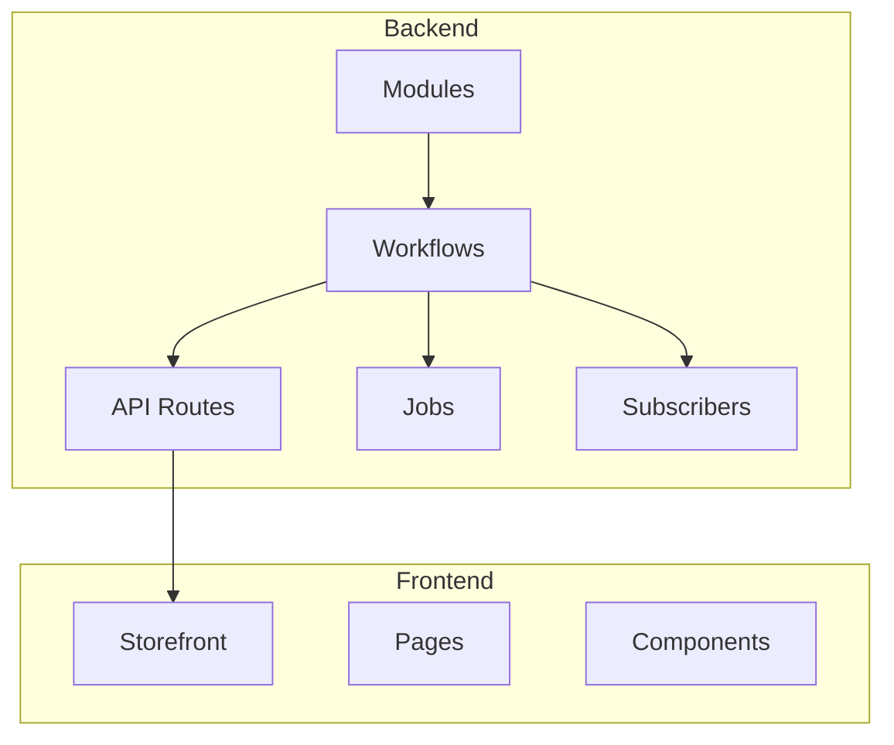
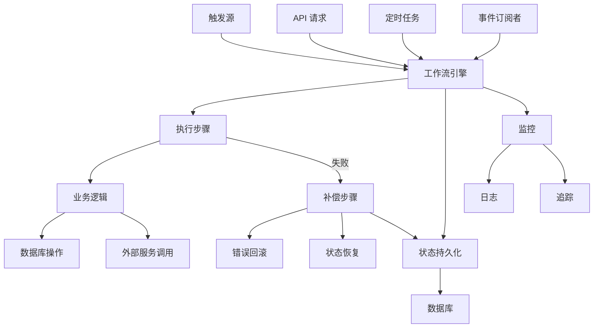
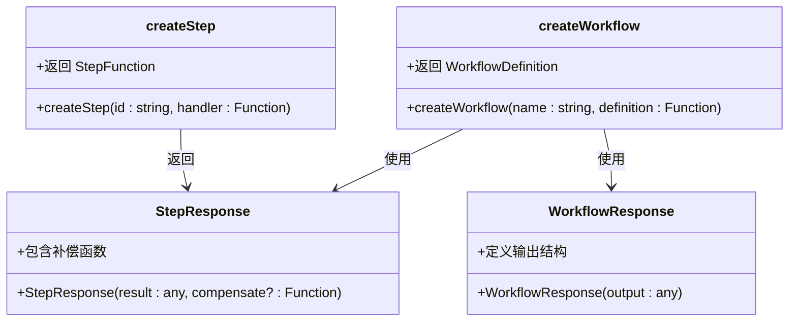
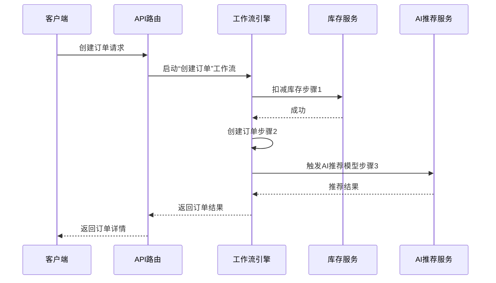
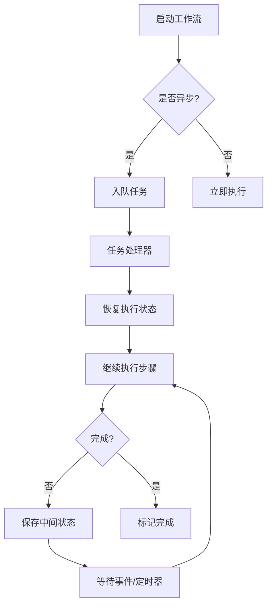
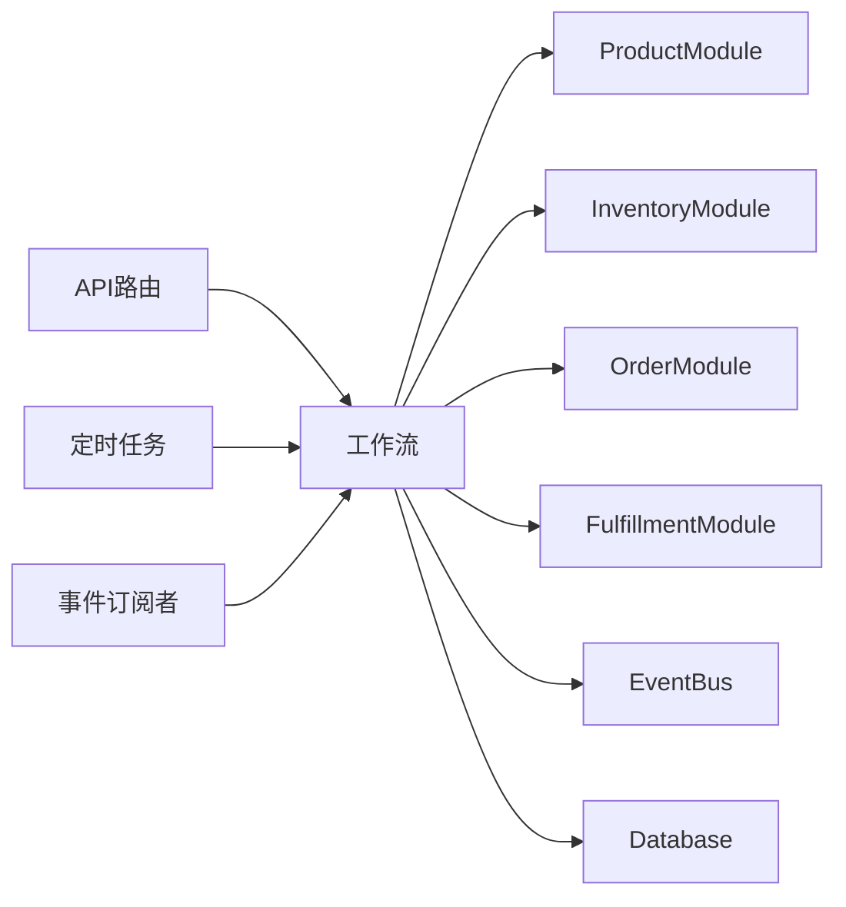

# 工作流设计

<cite>
**本文档中引用的文件**  
- [README.md](file://backend/README.md)
- [workflows/README.md](file://backend/src/workflows/README.md)
- [medusa-config.ts](file://backend/medusa-config.ts)
- [seed.ts](file://backend/src/scripts/seed.ts)
</cite>

## 目录
1. [简介](#简介)
2. [项目结构](#项目结构)
3. [核心组件](#核心组件)
4. [架构概述](#架构概述)
5. [详细组件分析](#详细组件分析)
6. [依赖分析](#依赖分析)
7. [性能考量](#性能考量)
8. [故障排除指南](#故障排除指南)
9. [结论](#结论)

## 简介

Lumiera 是一个高端亲密健康电子商务平台，其后端基于 Medusa 框架构建。本项目采用模块化架构，利用 `@medusajs/workflows-sdk` 实现声明式工作流系统，用于处理订单创建、库存管理、支付确认等关键业务流程。工作流架构允许开发者以可组合、可重试和可回滚的方式定义复杂的业务逻辑，确保事务一致性并支持异步执行与状态持久化。

## 项目结构

Lumiera 项目分为前后端两个主要部分：`backend` 和 `storefront`。后端实现了基于 Medusa 的电商核心功能，而前端则提供用户界面。工作流相关逻辑集中在 `backend/src/workflows` 目录中，通过 TypeScript 文件定义和编排。

**图示来源**  
- [backend/README.md](file://backend/README.md)
- [backend/src/workflows/README.md](file://backend/src/workflows/README.md)

**本节来源**  
- [backend/README.md](file://backend/README.md)
- [project_structure](file://project_structure)

## 核心组件

Lumiera 的工作流架构基于 `@medusajs/framework/workflows-sdk`，其核心组件包括步骤（Step）、工作流（Workflow）、补偿机制（Compensation）和状态管理。这些组件共同支持声明式编程模型，使复杂业务流程如订单创建、库存扣减和支付确认能够被可靠地执行和回滚。

工作流在系统中被广泛用于数据初始化（如 `seed.ts` 中的 `updateStoreCurrencies`），并通过 API 路由、定时任务或事件订阅者触发。每个工作流由多个步骤组成，步骤之间可以传递数据，并支持异步执行和错误处理。

**本节来源**  
- [backend/src/workflows/README.md](file://backend/src/workflows/README.md)
- [backend/src/scripts/seed.ts](file://backend/src/scripts/seed.ts)

## 架构概述

Lumiera 的工作流架构采用声明式、可组合的设计，基于 Medusa 的 `workflows-sdk` 实现。该架构支持事务性操作、补偿机制和异步执行，确保关键业务流程的可靠性与一致性。

**图示来源**  
- [backend/src/workflows/README.md](file://backend/src/workflows/README.md)
- [backend/src/scripts/seed.ts](file://backend/src/scripts/seed.ts)

## 详细组件分析

### 工作流定义与编排

在 Lumiera 中，工作流通过 `createWorkflow` 和 `createStep` 函数定义。每个步骤封装一个原子操作，工作流则将这些步骤按顺序或条件编排。输入和输出通过类型定义确保类型安全。

**图示来源**  
- [backend/src/workflows/README.md](file://backend/src/workflows/README.md)

#### 实际用例：创建订单时同步更新库存并触发AI推荐模型

虽然当前代码库中未直接实现此用例，但基于现有架构可设计如下工作流：

该流程可通过定义三个步骤实现：1) 调用库存服务扣减库存；2) 创建订单记录；3) 调用 AI 服务生成推荐。若任一步骤失败，补偿机制可回滚已执行的操作。

**本节来源**  
- [backend/src/workflows/README.md](file://backend/src/workflows/README.md)
- [backend/src/scripts/seed.ts](file://backend/src/scripts/seed.ts)

### 异步执行模型与状态持久化

Lumiera 的工作流支持异步执行，通过 Medusa 的任务队列和数据库持久化执行状态。每个工作流实例的状态被序列化存储，支持长时间运行和恢复。

工作流状态在每一步执行后持久化，确保系统重启后可恢复。此机制在 `seed.ts` 中的初始化流程中得到体现，多个工作流被顺序执行以构建完整数据环境。

**图示来源**  
- [backend/src/scripts/seed.ts](file://backend/src/scripts/seed.ts)

**本节来源**  
- [backend/src/scripts/seed.ts](file://backend/src/scripts/seed.ts)

## 依赖分析

Lumiera 的工作流系统依赖于 Medusa 框架的核心模块，包括服务模块（如产品、库存、订单）、事件总线和数据库持久层。这些依赖通过依赖注入容器管理，确保松耦合和可测试性。

在 `seed.ts` 文件中，多个核心工作流（如 `createRegionsWorkflow`、`createProductsWorkflow`）被调用，表明工作流与各业务模块紧密集成。

**图示来源**  
- [backend/src/scripts/seed.ts](file://backend/src/scripts/seed.ts)

**本节来源**  
- [backend/src/scripts/seed.ts](file://backend/src/scripts/seed.ts)
- [backend/package.json](file://backend/package.json)

## 性能考量

工作流的性能受步骤数量、异步调用延迟和数据库事务影响。建议对长时间运行的工作流进行分段设计，避免单个工作流承担过多职责。对于高并发场景，应确保工作流步骤无状态或状态轻量，以提高可扩展性。

此外，补偿机制的实现应高效，避免在回滚时引入额外延迟。监控和日志记录对于识别性能瓶颈至关重要，Medusa 提供了内置的日志和追踪机制。

## 故障排除指南

当工作流执行失败时，应首先检查日志输出，确认失败步骤。利用 `StepResponse` 中的补偿函数可手动触发回滚。确保数据库连接正常，并验证工作流输入数据的完整性。

在开发过程中，可通过单元测试验证单个步骤的行为，并通过集成测试验证整个工作流的正确性。使用 `medusa develop` 命令启动开发服务器，便于调试和热重载。

**本节来源**  
- [backend/src/workflows/README.md](file://backend/src/workflows/README.md)
- [backend/src/scripts/seed.ts](file://backend/src/scripts/seed.ts)

## 结论

Lumiera 基于 `@medusajs/workflows-sdk` 构建了强大而灵活的工作流系统，支持声明式定义、编排和执行复杂业务流程。通过步骤、补偿机制和状态持久化，系统确保了事务一致性与可靠性。开发者可基于此架构创建新的工作流，用于订单处理、库存管理、AI集成等场景，同时保障性能与可维护性。