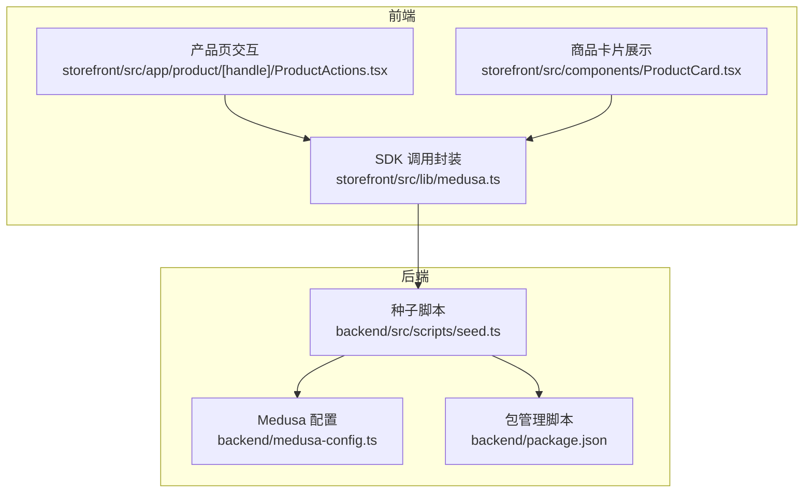
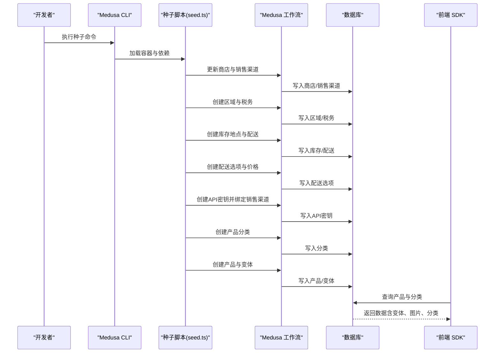
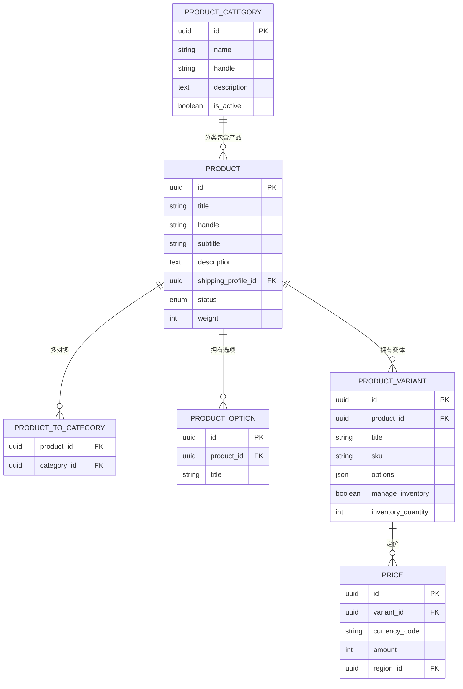
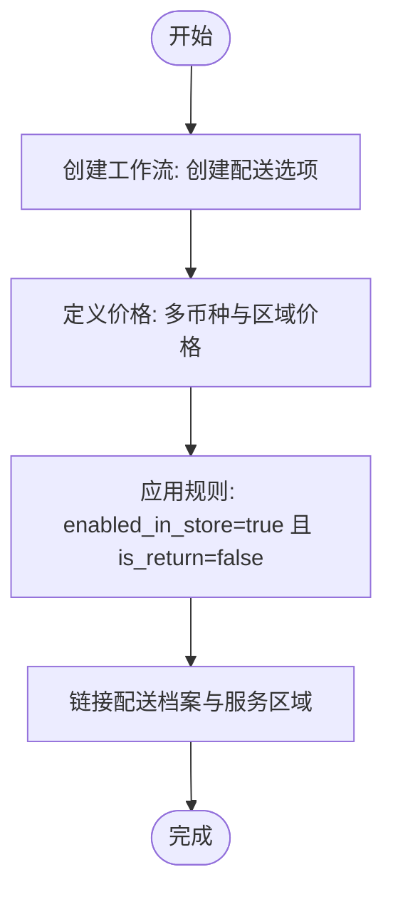
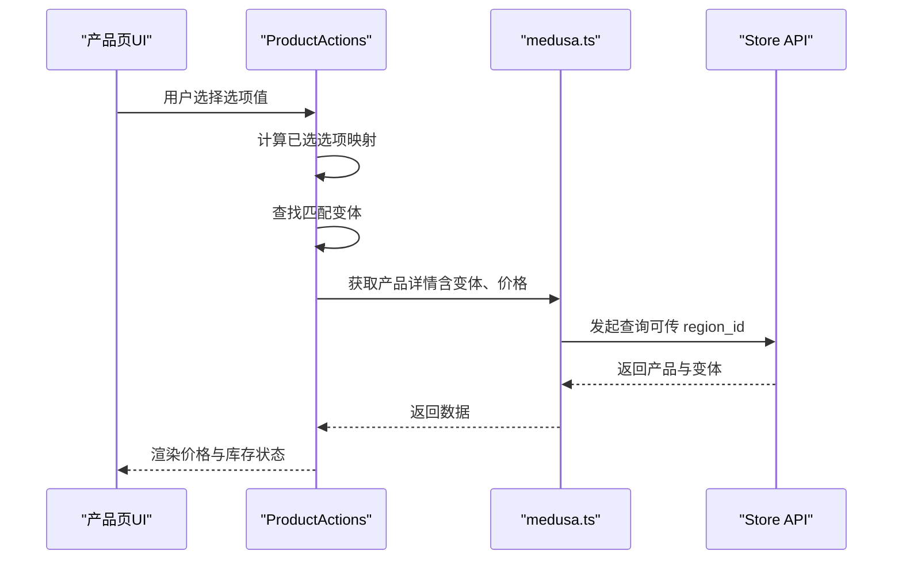
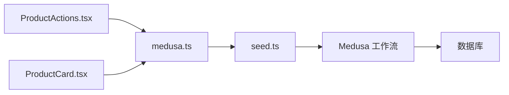

# 数据模型与ORM

<cite>
**本文引用的文件**
- [seed.ts](file://backend/src/scripts/seed.ts)
- [medusa-config.ts](file://backend/medusa-config.ts)
- [package.json](file://backend/package.json)
- [medusa.ts](file://storefront/src/lib/medusa.ts)
- [ProductActions.tsx](file://storefront/src/app/product/[handle]/ProductActions.tsx)
- [ProductCard.tsx](file://storefront/src/components/ProductCard.tsx)
</cite>

## 目录
1. [简介](#简介)
2. [项目结构](#项目结构)
3. [核心组件](#核心组件)
4. [架构总览](#架构总览)
5. [详细组件分析](#详细组件分析)
6. [依赖分析](#依赖分析)
7. [性能考虑](#性能考虑)
8. [故障排查指南](#故障排查指南)
9. [结论](#结论)
10. [附录](#附录)

## 简介
本文件围绕 Lumiera 项目的数据模型与 MedusaJS 的 ORM 机制展开，重点解析种子脚本 seed.ts 中的产品（Product）、区域（Region）、配送选项（Shipping Option）与价格（Price）等核心实体的设计与实现方式。文档将：
- 基于种子脚本揭示产品分类（Solo Play、Couples、Wellness、Accessories）的初始化流程；
- 展示如何通过 Medusa 的工作流（workflows）初始化多货币价格（GBP、EUR、USD）；
- 说明国家与配送规则的配置方法；
- 绘制实体关系图，解释变体（variants）、选项（options）与 SKU 的关联；
- 提供在种子脚本中创建带图像、描述与元数据的产品示例路径；
- 总结数据验证规则、唯一性约束与索引优化建议。

## 项目结构
后端使用 MedusaJS 框架，种子脚本位于 backend/src/scripts/seed.ts；前端通过 SDK 调用后端接口以展示产品与分类。Medusa 配置文件 medusa-config.ts 定义了运行时环境参数，包括数据库 URL 与 CORS 设置。

图表来源
- [seed.ts](file://backend/src/scripts/seed.ts#L1-L120)
- [medusa-config.ts](file://backend/medusa-config.ts#L1-L21)
- [package.json](file://backend/package.json#L1-L30)
- [medusa.ts](file://storefront/src/lib/medusa.ts#L38-L85)
- [ProductActions.tsx](file://storefront/src/app/product/[handle]/ProductActions.tsx#L82-L186)
- [ProductCard.tsx](file://storefront/src/components/ProductCard.tsx#L99-L119)

章节来源
- [seed.ts](file://backend/src/scripts/seed.ts#L1-L120)
- [medusa-config.ts](file://backend/medusa-config.ts#L1-L21)
- [package.json](file://backend/package.json#L1-L30)

## 核心组件
本节聚焦种子脚本中与数据模型直接相关的核心步骤：商店与销售渠道、区域与税务、库存地点、配送配置、API 密钥、产品分类与产品变体。

- 商店与销售渠道
  - 初始化默认销售渠道并将其设为商店默认销售渠道；
  - 更新商店支持的多币种（GBP、EUR、USD），并指定默认币种；
  - 参考路径：[更新商店与销售渠道](file://backend/src/scripts/seed.ts#L77-L122)

- 区域与税务
  - 创建两个区域：United Kingdom（GBP）与 Europe（EUR），并配置国家列表；
  - 为所有国家创建系统级税务区域；
  - 参考路径：[区域与税务初始化](file://backend/src/scripts/seed.ts#L124-L154)

- 库存地点与配送
  - 创建 UK 仓库作为默认库存地点；
  - 链接库存地点与配送提供方（manual_manual）；
  - 创建配送服务区域（service zone）覆盖 UK 与欧洲国家；
  - 创建默认配送档案（shipping profile）并链接到配送集；
  - 参考路径：[库存与配送初始化](file://backend/src/scripts/seed.ts#L156-L236)

- 配送选项与价格
  - 创建三种配送选项：标准、加急、免邮（订单满 £75）；
  - 为每种配送选项设置多币种与区域价格；
  - 配送规则限定 enabled_in_store=true 且 is_return=false；
  - 参考路径：[配送选项与价格](file://backend/src/scripts/seed.ts#L237-L309)

- API 密钥与销售渠道
  - 获取或创建发布式 API Key，并将其绑定到默认销售渠道；
  - 参考路径：[API 密钥与销售渠道绑定](file://backend/src/scripts/seed.ts#L320-L357)

- 产品分类
  - 初始化四类产品分类：Solo Play、Couples、Wellness、Accessories；
  - 参考路径：[产品分类初始化](file://backend/src/scripts/seed.ts#L359-L391)

- 产品与变体
  - 为每个分类创建多个产品，每个产品定义选项（如 Color、Size）与变体（variants）；
  - 每个变体包含 SKU、选项值与多币种价格；
  - 参考路径：[产品与变体初始化（示例）](file://backend/src/scripts/seed.ts#L400-L820)

章节来源
- [seed.ts](file://backend/src/scripts/seed.ts#L77-L122)
- [seed.ts](file://backend/src/scripts/seed.ts#L124-L154)
- [seed.ts](file://backend/src/scripts/seed.ts#L156-L236)
- [seed.ts](file://backend/src/scripts/seed.ts#L237-L309)
- [seed.ts](file://backend/src/scripts/seed.ts#L320-L357)
- [seed.ts](file://backend/src/scripts/seed.ts#L359-L391)
- [seed.ts](file://backend/src/scripts/seed.ts#L400-L820)

## 架构总览
下图展示了种子脚本在 Medusa 工作流驱动下的数据模型初始化流程，以及前端如何通过 SDK 查询产品与分类。

图表来源
- [seed.ts](file://backend/src/scripts/seed.ts#L77-L122)
- [seed.ts](file://backend/src/scripts/seed.ts#L124-L154)
- [seed.ts](file://backend/src/scripts/seed.ts#L156-L236)
- [seed.ts](file://backend/src/scripts/seed.ts#L237-L309)
- [seed.ts](file://backend/src/scripts/seed.ts#L320-L357)
- [seed.ts](file://backend/src/scripts/seed.ts#L359-L391)
- [seed.ts](file://backend/src/scripts/seed.ts#L400-L820)
- [medusa.ts](file://storefront/src/lib/medusa.ts#L38-L85)

## 详细组件分析

### 实体关系图（ER）
下图展示了产品、分类、变体、选项与价格之间的关系，映射到种子脚本中的实际数据结构。

图表来源
- [seed.ts](file://backend/src/scripts/seed.ts#L359-L391)
- [seed.ts](file://backend/src/scripts/seed.ts#L400-L820)

章节来源
- [seed.ts](file://backend/src/scripts/seed.ts#L359-L391)
- [seed.ts](file://backend/src/scripts/seed.ts#L400-L820)

### 配送选项与价格配置流程
种子脚本通过工作流创建配送选项，并为每个选项设置多币种与区域价格，同时应用业务规则。

图表来源
- [seed.ts](file://backend/src/scripts/seed.ts#L237-L309)

章节来源
- [seed.ts](file://backend/src/scripts/seed.ts#L237-L309)

### 产品与变体选择逻辑（前端）
前端根据用户选择的选项匹配对应变体，并据此计算价格与库存状态。

图表来源
- [ProductActions.tsx](file://storefront/src/app/product/[handle]/ProductActions.tsx#L82-L186)
- [medusa.ts](file://storefront/src/lib/medusa.ts#L38-L85)

章节来源
- [ProductActions.tsx](file://storefront/src/app/product/[handle]/ProductActions.tsx#L82-L186)
- [medusa.ts](file://storefront/src/lib/medusa.ts#L38-L85)

### 种子脚本中的产品创建要点
- 图像与描述：每个产品包含标题、副标题、描述与多张图片；
- 元数据：handle 用于 SEO 与路由；status 控制发布状态；
- 分类：通过 category_ids 关联至产品分类；
- 配送：通过 shipping_profile_id 指定配送档案；
- 销售渠道：通过 sales_channels 指向默认销售渠道；
- 变体与选项：每个产品定义一个或多个选项（如 Color、Size），并为每个组合生成变体；
- 价格：变体价格支持多币种与区域价格；
- 示例路径参考：
  - [产品与变体初始化（示例）](file://backend/src/scripts/seed.ts#L400-L820)

章节来源
- [seed.ts](file://backend/src/scripts/seed.ts#L400-L820)

## 依赖分析
- 后端依赖
  - Medusa 核心与工作流：用于创建商店、销售渠道、区域、税务、库存、配送、API 密钥、产品与变体；
  - 环境变量：数据库 URL、CORS、JWT/Cookie Secret；
  - 脚本入口：通过 package.json 的 seed 脚本执行种子脚本。
- 前端依赖
  - 使用 SDK 封装的 store 接口查询产品与分类，支持按 region_id 获取本地化价格；
  - 商品卡片与产品页组件消费这些数据并渲染价格与库存状态。

图表来源
- [seed.ts](file://backend/src/scripts/seed.ts#L77-L122)
- [medusa.ts](file://storefront/src/lib/medusa.ts#L38-L85)
- [ProductActions.tsx](file://storefront/src/app/product/[handle]/ProductActions.tsx#L82-L186)
- [ProductCard.tsx](file://storefront/src/components/ProductCard.tsx#L99-L119)

章节来源
- [seed.ts](file://backend/src/scripts/seed.ts#L77-L122)
- [medusa.ts](file://storefront/src/lib/medusa.ts#L38-L85)
- [ProductActions.tsx](file://storefront/src/app/product/[handle]/ProductActions.tsx#L82-L186)
- [ProductCard.tsx](file://storefront/src/components/ProductCard.tsx#L99-L119)

## 性能考虑
- 变体数量与查询复杂度
  - 每个产品若存在多个选项与变体，前端匹配变体时需遍历比较，建议在产品页仅加载必要字段（如 *variants.options、*variants.calculated_price），减少网络与渲染开销。
  - 参考路径：[前端字段选择](file://storefront/src/lib/medusa.ts#L38-L85)
- 价格计算与缓存
  - 通过 region_id 获取本地化价格，避免重复转换；
  - 对高频访问的商品可考虑在前端缓存价格与库存状态。
- 数据库写入批处理
  - 种子脚本中批量创建产品与变体，建议确保数据库具备合适的索引与事务控制，以提升导入效率。
- 索引优化建议
  - 在 product.handle、product_category.handle、product_variant.sku 上建立唯一索引，保证唯一性约束；
  - 在 product_category_to_product.category_id 上建立索引，加速分类查询；
  - 在 price.region_id 与 price.currency_code 上建立复合索引，优化价格查询；
  - 在 product_option.title 与 product_variant.options 上建立索引，提升变体匹配性能。

[本节为通用性能建议，不直接分析具体文件，故无“章节来源”标注]

## 故障排查指南
- 种子脚本执行失败
  - 检查数据库连接字符串是否正确配置（medusa-config.ts）；
  - 确认 Node 版本满足要求（package.json）；
  - 参考路径：[Medusa 配置](file://backend/medusa-config.ts#L1-L21)、[包脚本](file://backend/package.json#L1-L30)
- 产品未显示或变体不可选
  - 确认产品 status 为已发布；
  - 确认变体 options 字段与选项 title 一致；
  - 确认前端调用时传入了正确的 region_id；
  - 参考路径：[产品与变体初始化](file://backend/src/scripts/seed.ts#L400-L820)、[前端查询](file://storefront/src/lib/medusa.ts#L38-L85)
- 价格不正确
  - 检查配送选项的多币种与区域价格配置；
  - 确认配送规则（enabled_in_store、is_return）符合预期；
  - 参考路径：[配送选项与价格](file://backend/src/scripts/seed.ts#L237-L309)
- API 密钥无法使用
  - 确认发布式 API Key 已创建并绑定到默认销售渠道；
  - 参考路径：[API 密钥与销售渠道绑定](file://backend/src/scripts/seed.ts#L320-L357)

章节来源
- [medusa-config.ts](file://backend/medusa-config.ts#L1-L21)
- [package.json](file://backend/package.json#L1-L30)
- [seed.ts](file://backend/src/scripts/seed.ts#L237-L309)
- [seed.ts](file://backend/src/scripts/seed.ts#L320-L357)
- [medusa.ts](file://storefront/src/lib/medusa.ts#L38-L85)

## 结论
通过种子脚本，Lumiera 在 MedusaJS 的 ORM 与工作流机制下，完成了从商店与销售渠道、区域与税务、库存与配送，到产品分类与产品变体的全链路数据模型初始化。该设计清晰地体现了产品、分类、变体、选项与价格之间的关系，并通过多币种与区域价格策略支持国际化运营。前端通过 SDK 获取本地化价格与变体，结合选项选择逻辑，实现了良好的用户体验。建议在生产环境中进一步完善索引与缓存策略，以提升查询与渲染性能。

[本节为总结性内容，不直接分析具体文件，故无“章节来源”标注]

## 附录
- 唯一性约束建议
  - product.handle、product_category.handle、product_variant.sku 唯一；
  - product_option.title 在单个产品内唯一；
  - price(region_id, currency_code) 复合唯一（若同一变体在同一区域同一币种只允许一种价格）。
- 索引优化建议
  - product(handle)
  - product_category(handle)
  - product_variant(sku)
  - product_option(product_id, title)
  - product_variant(options)
  - price(region_id, currency_code)
  - product_category_to_product(category_id)

[本节为通用建议，不直接分析具体文件，故无“章节来源”标注]