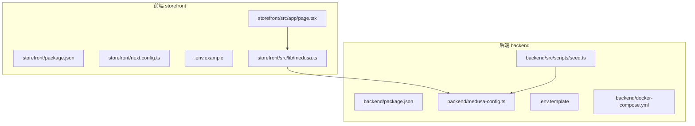
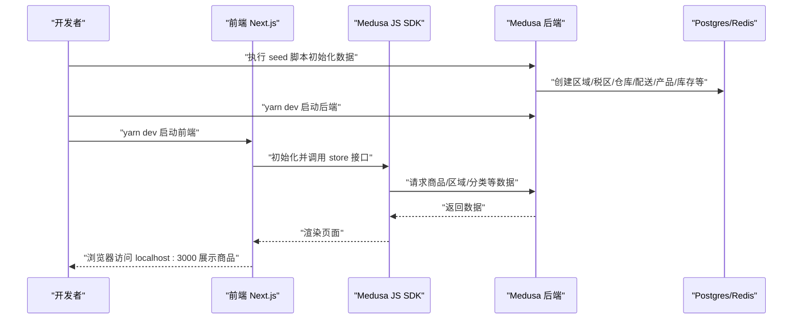
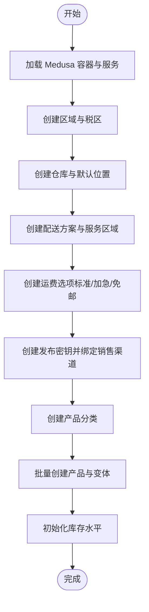
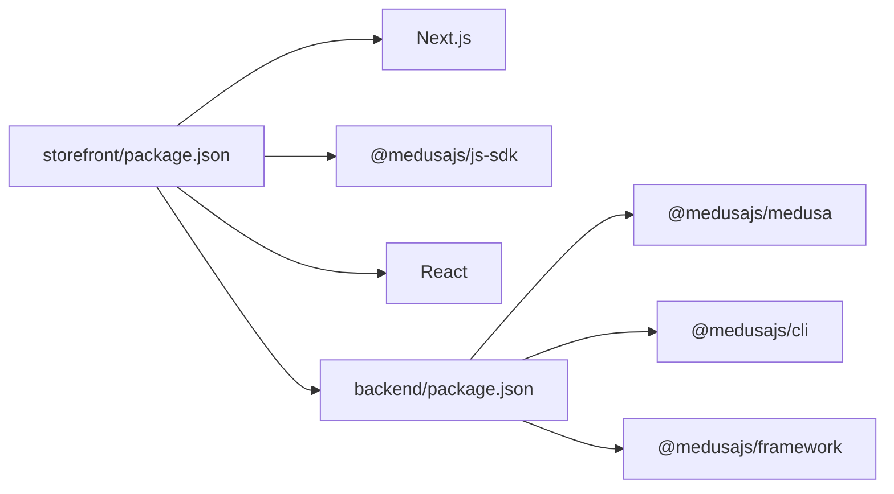

# 开发者入门指南

<cite>
**本文引用的文件**
- [backend/package.json](file://backend/package.json)
- [storefront/package.json](file://storefront/package.json)
- [backend/.env.template](file://backend/.env.template)
- [storefront/.env.example](file://storefront/.env.example)
- [backend/medusa-config.ts](file://backend/medusa-config.ts)
- [storefront/next.config.ts](file://storefront/next.config.ts)
- [backend/docker-compose.yml](file://backend/docker-compose.yml)
- [backend/src/scripts/seed.ts](file://backend/src/scripts/seed.ts)
- [backend/README.md](file://backend/README.md)
- [storefront/README.md](file://storefront/README.md)
- [storefront/src/lib/medusa.ts](file://storefront/src/lib/medusa.ts)
- [storefront/src/app/page.tsx](file://storefront/src/app/page.tsx)
</cite>

## 目录
1. [简介](#简介)
2. [项目结构](#项目结构)
3. [核心组件](#核心组件)
4. [架构总览](#架构总览)
5. [详细组件分析](#详细组件分析)
6. [依赖关系分析](#依赖关系分析)
7. [性能注意事项](#性能注意事项)
8. [故障排查指南](#故障排查指南)
9. [结论](#结论)
10. [附录：环境变量与脚本参考](#附录环境变量与脚本参考)

## 简介
本指南面向首次参与 Lumiera 开发的新同学，帮助你在本地快速搭建完整的开发环境，包括：
- 克隆仓库
- 安装依赖（yarn install）
- 配置环境变量（基于 .env.template 和 .env.local）
- 启动后端（yarn dev）与前端（yarn dev）
- 理解 package.json 中的关键脚本（如 dev、start、seed），特别是 seed 脚本如何初始化数据库与演示数据
- 首次运行常见问题（端口占用、依赖冲突）的解决方案
- 验证安装成功的检查点（访问 localhost:8000、localhost:8080、localhost:3000）

本指南对 TypeScript、Next.js 与 MedusaJS 基础薄弱的同学也尽量以“可操作”的方式讲解，避免过多术语堆砌。

## 项目结构
Lumiera 采用前后端分离的双仓库结构：
- backend：Medusa v2 后端服务，负责商品、库存、订单、区域、支付等电商能力
- storefront：Next.js 前端应用，负责展示商品、购物车、用户认证等前端交互

图表来源
- [backend/package.json](file://backend/package.json#L1-L50)
- [backend/medusa-config.ts](file://backend/medusa-config.ts#L1-L21)
- [backend/.env.template](file://backend/.env.template#L1-L9)
- [backend/docker-compose.yml](file://backend/docker-compose.yml#L1-L32)
- [backend/src/scripts/seed.ts](file://backend/src/scripts/seed.ts#L1-L852)
- [storefront/package.json](file://storefront/package.json#L1-L31)
- [storefront/next.config.ts](file://storefront/next.config.ts#L1-L42)
- [storefront/.env.example](file://storefront/.env.example#L1-L10)
- [storefront/src/lib/medusa.ts](file://storefront/src/lib/medusa.ts#L1-L267)
- [storefront/src/app/page.tsx](file://storefront/src/app/page.tsx#L1-L240)

章节来源
- [backend/README.md](file://backend/README.md#L1-L63)
- [storefront/README.md](file://storefront/README.md#L1-L37)

## 核心组件
- 后端（Medusa）
  - 使用 medusa-config.ts 加载环境变量并定义数据库、HTTP CORS、JWT/Cookie 密钥等配置
  - 提供多种脚本：build、start、dev、seed、test 等
  - 通过 docker-compose 提供 Postgres 与 Redis 的本地容器化依赖
- 前端（Next.js）
  - 使用 next.config.ts 在开发模式下放宽图片优化限制，便于访问本地后端资源
  - 通过 src/lib/medusa.ts 初始化 JS SDK 并封装商品、分类、购物车、登录注册等接口
  - 页面通过异步数据加载从后端拉取商品与区域信息

章节来源
- [backend/medusa-config.ts](file://backend/medusa-config.ts#L1-L21)
- [backend/package.json](file://backend/package.json#L1-L50)
- [backend/docker-compose.yml](file://backend/docker-compose.yml#L1-L32)
- [storefront/next.config.ts](file://storefront/next.config.ts#L1-L42)
- [storefront/src/lib/medusa.ts](file://storefront/src/lib/medusa.ts#L1-L267)

## 架构总览
下面的序列图展示了本地开发时，前端如何通过 Next.js 访问后端 Medusa，并由 seed 脚本初始化演示数据的整体流程。

图表来源
- [backend/src/scripts/seed.ts](file://backend/src/scripts/seed.ts#L1-L852)
- [backend/medusa-config.ts](file://backend/medusa-config.ts#L1-L21)
- [storefront/src/lib/medusa.ts](file://storefront/src/lib/medusa.ts#L1-L267)
- [storefront/src/app/page.tsx](file://storefront/src/app/page.tsx#L1-L240)

## 详细组件分析

### 后端：Medusa 配置与脚本
- 环境变量加载与配置
  - medusa-config.ts 会根据 NODE_ENV 加载 .env 文件，并将 STORE_CORS、ADMIN_CORS、AUTH_CORS、JWT_SECRET、COOKIE_SECRET、DATABASE_URL 等注入到运行时
  - 默认后端地址为 http://localhost:9000，可在 .env 中覆盖
- 关键脚本
  - dev：启动开发服务器（热更新）
  - start：生产启动
  - build：构建产物
  - seed：执行种子数据脚本，初始化区域、税区、仓库、配送、产品、库存、API Key 等演示数据
- 数据库与缓存
  - docker-compose 提供 Postgres 与 Redis，默认端口映射为 5432:5432、6379:6379
  - DATABASE_URL 可在 .env 中指定（例如 sqlite 或 postgres）

章节来源
- [backend/medusa-config.ts](file://backend/medusa-config.ts#L1-L21)
- [backend/package.json](file://backend/package.json#L1-L50)
- [backend/docker-compose.yml](file://backend/docker-compose.yml#L1-L32)
- [backend/.env.template](file://backend/.env.template#L1-L9)

### 前端：Next.js 配置与数据访问
- Next.js 开发服务器默认监听 3000 端口
- next.config.ts 在开发模式下允许访问本地后端资源（如 9000 端口），并放宽图片优化策略
- Medusa JS SDK
  - 通过 NEXT_PUBLIC_MEDUSA_BACKEND_URL 指向后端地址（默认 http://localhost:9000）
  - 通过 NEXT_PUBLIC_MEDUSA_PUBLISHABLE_KEY 获取发布密钥（用于前端调用 store API）
  - 封装了区域、商品、分类、购物车、登录注册等常用接口
- 首页数据加载
  - page.tsx 会先获取区域，再尝试按“热销”集合或兜底方式拉取商品列表，最终渲染到页面

章节来源
- [storefront/next.config.ts](file://storefront/next.config.ts#L1-L42)
- [storefront/.env.example](file://storefront/.env.example#L1-L10)
- [storefront/src/lib/medusa.ts](file://storefront/src/lib/medusa.ts#L1-L267)
- [storefront/src/app/page.tsx](file://storefront/src/app/page.tsx#L1-L240)

### 种子数据脚本：seed 的作用与流程
seed 脚本的作用是初始化演示数据，包括：
- 更新商店名称与默认销售渠道
- 创建区域（英国、欧洲）与税区
- 创建仓库与默认位置
- 配置配送设置（配送方案、服务区域、运费规则）
- 生成发布密钥并绑定销售渠道
- 创建产品分类与大量演示商品（含变体、价格、图片等）
- 初始化库存水平

图表来源
- [backend/src/scripts/seed.ts](file://backend/src/scripts/seed.ts#L1-L852)

章节来源
- [backend/src/scripts/seed.ts](file://backend/src/scripts/seed.ts#L1-L852)

## 依赖关系分析
- 后端依赖 Medusa 生态（framework、medusa、cli、admin-sdk 等），要求 Node 版本 ≥ 20
- 前端依赖 Next.js 16、React 19、@medusajs/js-sdk 等
- 前后端通过 HTTP 协议通信，前端通过 JS SDK 调用后端 store API

图表来源
- [storefront/package.json](file://storefront/package.json#L1-L31)
- [backend/package.json](file://backend/package.json#L1-L50)

章节来源
- [storefront/package.json](file://storefront/package.json#L1-L31)
- [backend/package.json](file://backend/package.json#L1-L50)

## 性能注意事项
- 开发阶段建议使用本地 Docker 服务（Postgres/Redis），避免频繁重启导致的冷启动开销
- 前端开发时开启图片优化放宽策略，减少 SSR/SSG 场景下的网络阻塞
- seed 脚本会一次性写入大量数据，首次执行时间较长；建议在空数据库上运行
- 如需加速开发，可先不执行 seed，直接启动后端与前端，再手动触发初始化流程

## 故障排查指南
- 端口占用
  - 后端默认端口：9000（可通过 .env 覆盖）
  - 前端默认端口：3000
  - Docker 默认端口：5432（Postgres）、6379（Redis）
  - 解决方法：修改 .env 中对应端口或停止占用进程
- 依赖冲突
  - Node 版本需满足后端要求（≥ 20）
  - 建议使用 Yarn（仓库内有 yarn.lock），避免 npm/pnpm 差异
- 数据库连接失败
  - 确认 DATABASE_URL 正确（如使用 sqlite 或 postgres）
  - 若使用 Docker，请确认容器已启动且端口映射正常
- CORS 错误
  - 确保 STORE_CORS、ADMIN_CORS、AUTH_CORS 包含前端与管理端地址
- 前端无法显示商品
  - 确认 NEXT_PUBLIC_MEDUSA_BACKEND_URL 指向正确后端地址
  - 确认已执行 seed 初始化数据
- 首次运行无数据
  - 执行 seed 脚本后再刷新页面

章节来源
- [backend/medusa-config.ts](file://backend/medusa-config.ts#L1-L21)
- [backend/docker-compose.yml](file://backend/docker-compose.yml#L1-L32)
- [storefront/src/lib/medusa.ts](file://storefront/src/lib/medusa.ts#L1-L267)

## 结论
按照本指南逐步操作，你可以在本地成功启动 Lumiera 的前后端服务，并通过 seed 脚本获得完整的演示数据。遇到问题时，优先检查端口占用、环境变量与 Docker 服务状态。后续开发中，建议结合 Next.js 与 Medusa 的官方文档加深理解。

## 附录：环境变量与脚本参考

- 环境变量（后端）
  - STORE_CORS、ADMIN_CORS、AUTH_CORS：允许跨域的前端地址
  - REDIS_URL：Redis 连接串
  - JWT_SECRET、COOKIE_SECRET：鉴权相关密钥
  - DATABASE_URL：数据库连接串（可为空，使用默认 sqlite）
  - DB_NAME：数据库名称（默认 medusa-v2）
  - MEDUSA_BACKEND_URL：后端管理后台 URL（默认 http://localhost:9000）

- 环境变量（前端）
  - NEXT_PUBLIC_MEDUSA_BACKEND_URL：后端地址（默认 http://localhost:9000）
  - NEXT_PUBLIC_MEDUSA_PUBLISHABLE_KEY：发布密钥（用于前端调用 store API）
  - NEXT_PUBLIC_SITE_URL：站点 URL（默认 http://localhost:3000）

- 关键脚本（后端）
  - dev：启动开发服务器（热更新）
  - start：生产启动
  - build：构建产物
  - seed：执行种子数据脚本，初始化演示数据

- 关键脚本（前端）
  - dev：启动开发服务器（默认 3000）
  - build：构建静态产物
  - start：生产启动
  - lint：代码风格检查

章节来源
- [backend/.env.template](file://backend/.env.template#L1-L9)
- [storefront/.env.example](file://storefront/.env.example#L1-L10)
- [backend/package.json](file://backend/package.json#L1-L50)
- [storefront/package.json](file://storefront/package.json#L1-L31)