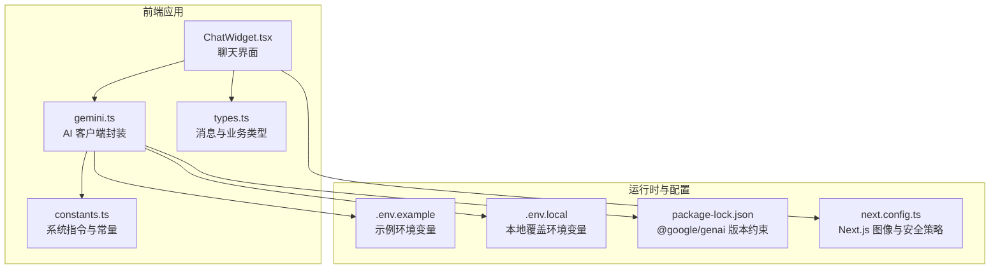
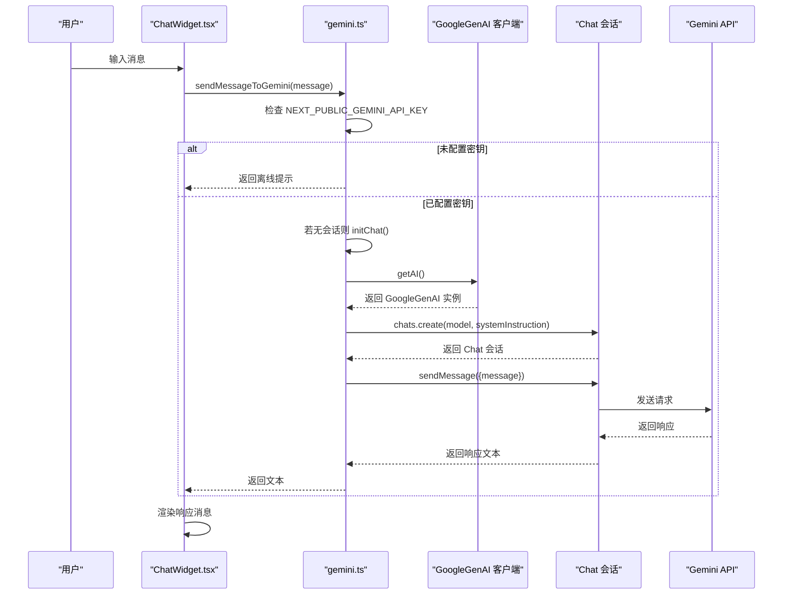
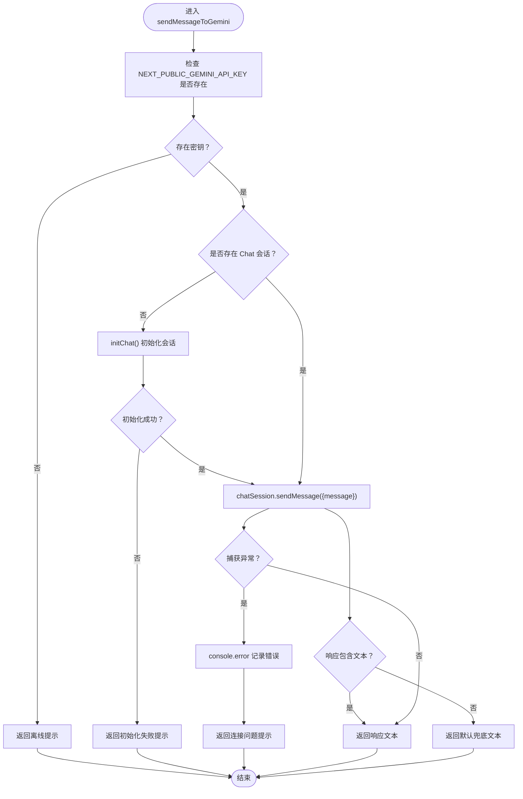
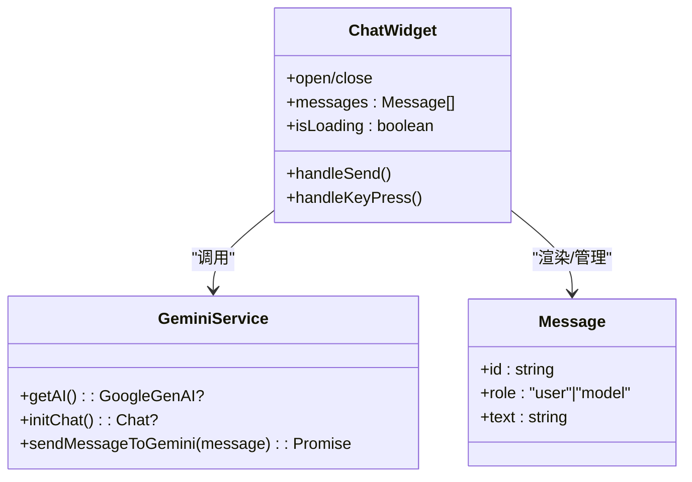
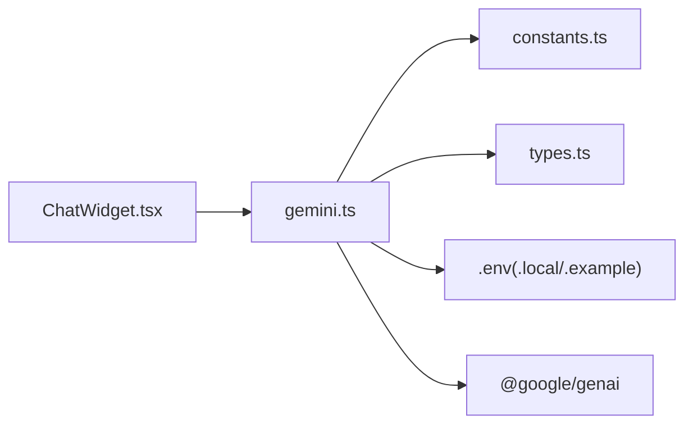

# AI集成

<cite>
**本文引用的文件**
- [storefront/src/lib/gemini.ts](file://storefront/src/lib/gemini.ts)
- [storefront/src/lib/constants.ts](file://storefront/src/lib/constants.ts)
- [storefront/src/components/ChatWidget.tsx](file://storefront/src/components/ChatWidget.tsx)
- [storefront/src/lib/types.ts](file://storefront/src/lib/types.ts)
- [storefront/.env.example](file://storefront/.env.example)
- [storefront/.env.local](file://storefront/.env.local)
- [storefront/package-lock.json](file://storefront/package-lock.json)
- [storefront/next.config.ts](file://storefront/next.config.ts)
</cite>

## 目录
1. [简介](#简介)
2. [项目结构](#项目结构)
3. [核心组件](#核心组件)
4. [架构总览](#架构总览)
5. [详细组件分析](#详细组件分析)
6. [依赖关系分析](#依赖关系分析)
7. [性能与可扩展性](#性能与可扩展性)
8. [故障排查指南](#故障排查指南)
9. [结论](#结论)
10. [附录](#附录)

## 简介
本文件为 Lumiera 前端商店（storefront）中 Google Gemini AI 集成的权威技术文档。重点围绕以下方面展开：
- 客户端 AI 服务封装：GoogleGenAI 实例化、聊天会话初始化（initChat）、消息交互（sendMessageToGemini）的实现细节与控制流。
- 环境变量安全配置：NEXT_PUBLIC_GEMINI_API_KEY 的使用与客户端/服务端执行上下文差异。
- 系统指令的作用：GEMINI_SYSTEM_INSTRUCTION 在引导 AI 行为中的角色，以及如何通过定制系统指令优化产品推荐、内容生成与客户服务。
- 错误处理策略、API 限流应对与性能监控建议。
- 扩展用例：个性化推荐、智能搜索增强、自动化内容创作等工作流设计思路。

## 项目结构
与 Gemini 集成直接相关的文件位于 storefront/src/lib 与 storefront/src/components 下，UI 层通过 ChatWidget.tsx 调用 AI 服务，AI 服务封装在 gemini.ts 中，系统指令定义在 constants.ts 中，类型定义在 types.ts 中；环境变量示例与本地覆盖文件分别在 .env.example 与 .env.local 中。

图表来源
- [storefront/src/components/ChatWidget.tsx](file://storefront/src/components/ChatWidget.tsx#L1-L153)
- [storefront/src/lib/gemini.ts](file://storefront/src/lib/gemini.ts#L1-L56)
- [storefront/src/lib/constants.ts](file://storefront/src/lib/constants.ts#L103-L116)
- [storefront/src/lib/types.ts](file://storefront/src/lib/types.ts#L30-L36)
- [storefront/.env.example](file://storefront/.env.example#L1-L10)
- [storefront/.env.local](file://storefront/.env.local#L1-L11)
- [storefront/package-lock.json](file://storefront/package-lock.json#L461-L481)
- [storefront/next.config.ts](file://storefront/next.config.ts#L1-L41)

章节来源
- [storefront/src/lib/gemini.ts](file://storefront/src/lib/gemini.ts#L1-L56)
- [storefront/src/lib/constants.ts](file://storefront/src/lib/constants.ts#L103-L116)
- [storefront/src/components/ChatWidget.tsx](file://storefront/src/components/ChatWidget.tsx#L1-L153)
- [storefront/src/lib/types.ts](file://storefront/src/lib/types.ts#L30-L36)
- [storefront/.env.example](file://storefront/.env.example#L1-L10)
- [storefront/.env.local](file://storefront/.env.local#L1-L11)
- [storefront/package-lock.json](file://storefront/package-lock.json#L461-L481)
- [storefront/next.config.ts](file://storefront/next.config.ts#L1-L41)

## 核心组件
- gemini.ts：封装 GoogleGenAI 客户端、会话创建与消息发送逻辑，负责初始化模型与系统指令、发送用户消息并返回文本响应。
- constants.ts：集中存放品牌与系统指令，其中 GEMINI_SYSTEM_INSTRUCTION 用于限定 AI 的角色、语气与边界。
- ChatWidget.tsx：前端聊天 UI 组件，负责收集用户输入、展示历史消息、调用 gemini.ts 发送消息并渲染响应。
- types.ts：定义消息结构（Message），包含 id、role、text 等字段，支撑聊天状态管理。
- 环境变量：NEXT_PUBLIC_GEMINI_API_KEY 用于客户端侧访问 Gemini API；.env.example 提供示例，.env.local 支持本地覆盖。

章节来源
- [storefront/src/lib/gemini.ts](file://storefront/src/lib/gemini.ts#L1-L56)
- [storefront/src/lib/constants.ts](file://storefront/src/lib/constants.ts#L103-L116)
- [storefront/src/components/ChatWidget.tsx](file://storefront/src/components/ChatWidget.tsx#L1-L153)
- [storefront/src/lib/types.ts](file://storefront/src/lib/types.ts#L30-L36)
- [storefront/.env.example](file://storefront/.env.example#L1-L10)
- [storefront/.env.local](file://storefront/.env.local#L1-L11)

## 架构总览
下图展示了从用户输入到 Gemini 响应的端到端流程，以及各模块之间的依赖关系。

图表来源
- [storefront/src/components/ChatWidget.tsx](file://storefront/src/components/ChatWidget.tsx#L1-L153)
- [storefront/src/lib/gemini.ts](file://storefront/src/lib/gemini.ts#L1-L56)
- [storefront/src/lib/constants.ts](file://storefront/src/lib/constants.ts#L103-L116)

## 详细组件分析

### 客户端 AI 封装（gemini.ts）
- GoogleGenAI 实例化
  - 通过 process.env.NEXT_PUBLIC_GEMINI_API_KEY 获取密钥，若为空则不初始化客户端。
  - 使用惰性初始化，首次需要时才创建 GoogleGenAI 实例，避免不必要的资源占用。
- 聊天会话管理（initChat）
  - 选择模型为 gemini-2.5-flash。
  - 通过 systemInstruction 注入 GEMINI_SYSTEM_INSTRUCTION，确保 AI 的角色、语气与边界符合品牌要求。
  - 创建 Chat 会话并缓存，后续消息复用同一会话以保持上下文连续性。
- 消息交互（sendMessageToGemini）
  - 若密钥缺失，直接返回离线提示。
  - 若会话不存在，先尝试初始化；失败则返回初始化失败提示。
  - 正常流程中调用 chatSession.sendMessage 并返回响应文本；异常时记录错误并返回通用提示。

图表来源
- [storefront/src/lib/gemini.ts](file://storefront/src/lib/gemini.ts#L1-L56)

章节来源
- [storefront/src/lib/gemini.ts](file://storefront/src/lib/gemini.ts#L1-L56)

### 系统指令与角色设定（constants.ts）
- GEMINI_SYSTEM_INSTRUCTION 定义了 AI 的角色为“Lumi”，一位温暖、共情且专业的健康与愉悦顾问，强调去污名化、自我保健、亲密关系与安全性，同时给出简洁、礼貌、非直白的语言规范与边界。
- 该指令在 initChat 时注入到 Chat 会话配置中，作为对话的系统级上下文，直接影响 AI 的回答风格与内容边界。

章节来源
- [storefront/src/lib/constants.ts](file://storefront/src/lib/constants.ts#L103-L116)
- [storefront/src/lib/gemini.ts](file://storefront/src/lib/gemini.ts#L18-L29)

### 前端聊天界面（ChatWidget.tsx）
- 负责 UI 交互：打开/关闭、输入框、消息列表滚动、加载态。
- 调用 gemini.ts 的 sendMessageToGemini 发送消息，接收文本后追加到消息列表。
- 使用 Message 类型管理消息结构，包含 id、role、text 字段，便于渲染与状态维护。

章节来源
- [storefront/src/components/ChatWidget.tsx](file://storefront/src/components/ChatWidget.tsx#L1-L153)
- [storefront/src/lib/types.ts](file://storefront/src/lib/types.ts#L30-L36)

### 类关系与依赖（类图）

图表来源
- [storefront/src/components/ChatWidget.tsx](file://storefront/src/components/ChatWidget.tsx#L1-L153)
- [storefront/src/lib/gemini.ts](file://storefront/src/lib/gemini.ts#L1-L56)
- [storefront/src/lib/types.ts](file://storefront/src/lib/types.ts#L30-L36)

## 依赖关系分析
- 外部依赖
  - @google/genai：提供 GoogleGenAI 与 Chat 会话能力，版本约束要求 Node >= 20。
- 内部依赖
  - gemini.ts 依赖 constants.ts 中的系统指令与 types.ts 中的消息类型。
  - ChatWidget.tsx 依赖 gemini.ts 的消息发送方法与 types.ts 的消息类型。
- 环境变量
  - NEXT_PUBLIC_GEMINI_API_KEY 由客户端读取，需放置于 .env.local 或构建时注入，确保不会泄露至浏览器端。
  - .env.example 提供示例键值，.env.local 支持本地覆盖。

图表来源
- [storefront/src/components/ChatWidget.tsx](file://storefront/src/components/ChatWidget.tsx#L1-L153)
- [storefront/src/lib/gemini.ts](file://storefront/src/lib/gemini.ts#L1-L56)
- [storefront/src/lib/constants.ts](file://storefront/src/lib/constants.ts#L103-L116)
- [storefront/src/lib/types.ts](file://storefront/src/lib/types.ts#L30-L36)
- [storefront/.env.example](file://storefront/.env.example#L1-L10)
- [storefront/.env.local](file://storefront/.env.local#L1-L11)
- [storefront/package-lock.json](file://storefront/package-lock.json#L461-L481)

章节来源
- [storefront/src/lib/gemini.ts](file://storefront/src/lib/gemini.ts#L1-L56)
- [storefront/src/lib/constants.ts](file://storefront/src/lib/constants.ts#L103-L116)
- [storefront/src/components/ChatWidget.tsx](file://storefront/src/components/ChatWidget.tsx#L1-L153)
- [storefront/src/lib/types.ts](file://storefront/src/lib/types.ts#L30-L36)
- [storefront/.env.example](file://storefront/.env.example#L1-L10)
- [storefront/.env.local](file://storefront/.env.local#L1-L11)
- [storefront/package-lock.json](file://storefront/package-lock.json#L461-L481)

## 性能与可扩展性
- 性能特性
  - 惰性初始化：仅在首次需要时创建 GoogleGenAI 实例，减少启动开销。
  - 单会话复用：通过缓存 Chat 会话，维持上下文连续性，避免重复初始化带来的延迟。
  - 文本兜底：当响应缺少文本时返回默认提示，保证 UI 流畅。
- 可扩展方向
  - 个性化推荐：在系统指令中加入“根据用户偏好与购买历史推荐产品”的规则，结合后端用户画像数据进行提示词工程。
  - 智能搜索增强：在用户输入前增加意图识别与关键词抽取，将检索结果与 AI 推荐结合，提升搜索质量。
  - 自动化内容创作：利用系统指令引导 AI 生成产品描述、博客文章或 FAQ 内容，统一品牌语调。
  - 会话持久化：当前实现为内存会话，可考虑引入后端会话存储与恢复机制，支持跨页面/设备连续对话。
  - 多模态扩展：若需要图片/视频理解，可在系统指令中声明多模态能力并调整模型选择。
- 监控与限流
  - 建议在 gemini.ts 中增加重试与退避策略，对网络异常与服务不可用进行指数退避重试。
  - 对外暴露计数器与指标（如响应时间、错误率、调用次数），结合前端埋点与服务端日志进行观测。
  - 在 next.config.ts 中启用必要的安全策略（如 CSP），防止 XSS 与 SSRF 风险。

章节来源
- [storefront/src/lib/gemini.ts](file://storefront/src/lib/gemini.ts#L1-L56)
- [storefront/next.config.ts](file://storefront/next.config.ts#L1-L41)

## 故障排查指南
- API 密钥缺失
  - 现象：返回离线提示。
  - 排查：确认 .env.local 中 NEXT_PUBLIC_GEMINI_API_KEY 已正确设置；检查构建时是否注入。
- 会话初始化失败
  - 现象：返回初始化失败提示。
  - 排查：检查密钥有效性、网络连通性与模型可用性；确认 initChat 调用路径可达。
- 网络异常或服务不可用
  - 现象：返回连接问题提示。
  - 排查：查看控制台错误日志；在网络层增加重试与超时配置；必要时降级为静态回复。
- 响应文本为空
  - 现象：返回默认兜底文本。
  - 排查：检查上游 API 返回结构；在系统指令中明确输出格式要求。
- 环境变量安全
  - 建议：不要在客户端暴露敏感密钥；使用 NEXT_PUBLIC 前缀仅适用于前端可见的配置项。若涉及后端 API 调用，请通过服务端代理或受控接口访问。

章节来源
- [storefront/src/lib/gemini.ts](file://storefront/src/lib/gemini.ts#L1-L56)
- [storefront/.env.example](file://storefront/.env.example#L1-L10)
- [storefront/.env.local](file://storefront/.env.local#L1-L11)

## 结论
本集成以轻量、可维护的方式在前端实现了 Gemini AI 的聊天能力：通过系统指令约束 AI 行为，通过惰性初始化与会话复用提升性能，通过完善的错误兜底保障用户体验。建议在现有基础上进一步完善监控、限流与会话持久化，并结合业务场景持续优化系统指令与工作流，以实现更高质量的个性化推荐与内容创作。

## 附录

### 环境变量与安全配置
- NEXT_PUBLIC_GEMINI_API_KEY
  - 用途：客户端侧访问 Gemini API 的密钥。
  - 配置位置：.env.example 提供示例，.env.local 支持本地覆盖。
  - 安全建议：避免在客户端暴露敏感密钥；如需后端调用，请通过受控接口代理。
- 其他相关配置
  - .env.local 中包含 Medusa 后端 URL、发布密钥等，确保与前端路由一致。
  - next.config.ts 中配置图像优化与安全策略，开发环境下禁用图片优化以规避私有 IP 阻断。

章节来源
- [storefront/.env.example](file://storefront/.env.example#L1-L10)
- [storefront/.env.local](file://storefront/.env.local#L1-L11)
- [storefront/next.config.ts](file://storefront/next.config.ts#L1-L41)

### 外部依赖与版本约束
- @google/genai
  - 版本：1.34.0
  - Node 引擎要求：>= 20.0.0
  - 依赖：google-auth-library、ws
  - 影响：确保运行环境满足引擎要求，避免兼容性问题。

章节来源
- [storefront/package-lock.json](file://storefront/package-lock.json#L461-L481)