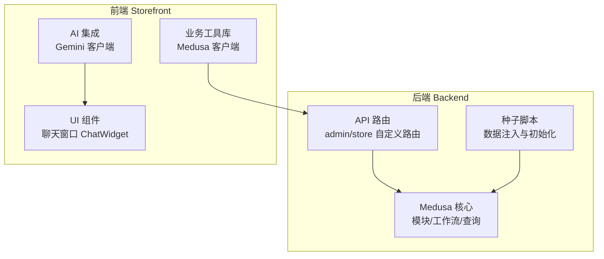
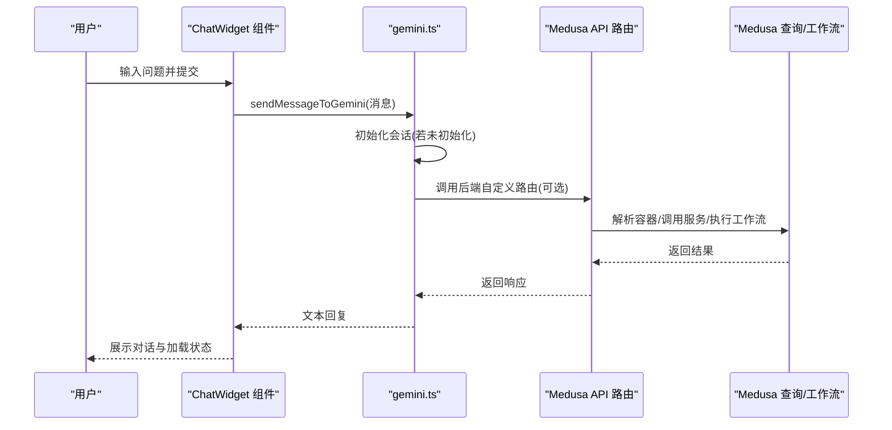
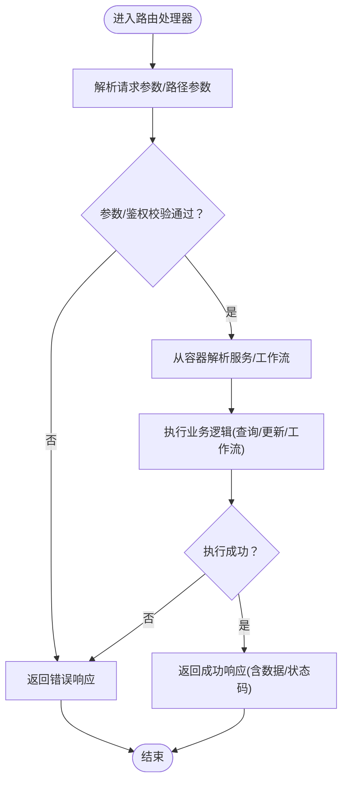
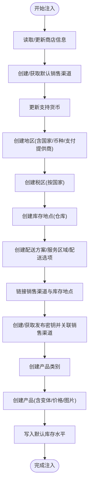
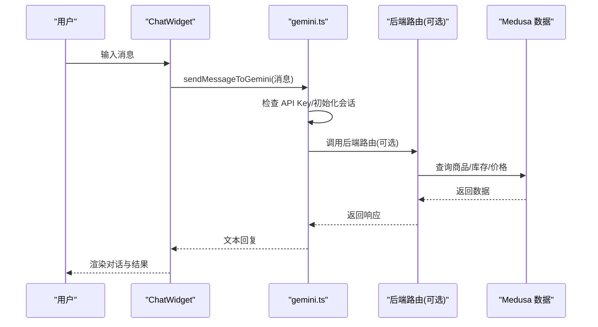
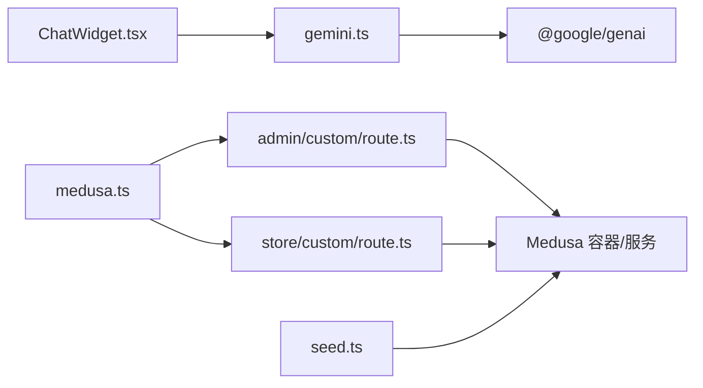

# 扩展与集成

<cite>
**本文引用的文件列表**
- [backend/src/api/admin/custom/route.ts](file://backend/src/api/admin/custom/route.ts)
- [backend/src/api/store/custom/route.ts](file://backend/src/api/store/custom/route.ts)
- [backend/src/api/README.md](file://backend/src/api/README.md)
- [backend/src/scripts/seed.ts](file://backend/src/scripts/seed.ts)
- [storefront/src/lib/gemini.ts](file://storefront/src/lib/gemini.ts)
- [storefront/src/lib/constants.ts](file://storefront/src/lib/constants.ts)
- [storefront/src/components/ChatWidget.tsx](file://storefront/src/components/ChatWidget.tsx)
- [storefront/src/lib/medusa.ts](file://storefront/src/lib/medusa.ts)
- [backend/README.md](file://backend/README.md)
- [storefront/README.md](file://storefront/README.md)
</cite>

## 目录
1. [引言](#引言)
2. [项目结构](#项目结构)
3. [核心组件](#核心组件)
4. [架构总览](#架构总览)
5. [详细组件分析](#详细组件分析)
6. [依赖关系分析](#依赖关系分析)
7. [性能考量](#性能考量)
8. [故障排查指南](#故障排查指南)
9. [结论](#结论)
10. [附录](#附录)

## 引言
本指南面向希望在 Lumiera 平台上进行扩展与集成的开发者，围绕以下目标展开：
- 在后端通过自定义 API 路由扩展管理端与店铺端能力
- 使用种子脚本自动化注入产品类别、区域与库存等数据
- 基于 Google Gemini 的 AI 集成模式，扩展智能推荐与对话体验
- 提供常见集成场景（支付网关、物流追踪）的实现路径与最佳实践

## 项目结构
Lumiera 采用前后端分离的典型架构：后端基于 Medusa 框架，提供可插拔模块与工作流；前端使用 Next.js，封装与后端交互的工具库与 AI 对话组件。

图表来源
- [backend/src/api/admin/custom/route.ts](file://backend/src/api/admin/custom/route.ts#L1-L9)
- [backend/src/api/store/custom/route.ts](file://backend/src/api/store/custom/route.ts#L1-L9)
- [backend/src/scripts/seed.ts](file://backend/src/scripts/seed.ts#L58-L122)
- [storefront/src/lib/gemini.ts](file://storefront/src/lib/gemini.ts#L1-L56)
- [storefront/src/components/ChatWidget.tsx](file://storefront/src/components/ChatWidget.tsx#L1-L153)
- [storefront/src/lib/medusa.ts](file://storefront/src/lib/medusa.ts#L1-L220)

章节来源
- [backend/README.md](file://backend/README.md#L35-L63)
- [storefront/README.md](file://storefront/README.md#L1-L37)

## 核心组件
- 后端自定义 API 路由：位于后端 src/api/admin 与 src/api/store 下，遵循 Medusa 文件路由约定，导出 HTTP 方法处理器函数。
- 种子脚本：通过 Medusa 工作流批量创建销售渠道、地区、税区、库存地点、配送方案、发布密钥、产品类别与商品，并写入默认库存。
- 前端 Gemini 集成：封装 Google GenAI 客户端，提供会话初始化与消息发送接口；配合聊天组件实现用户对话与响应展示。
- Medusa 客户端：封装前端对后端 API 的调用，如获取地区、产品、购物车等。

章节来源
- [backend/src/api/README.md](file://backend/src/api/README.md#L1-L136)
- [backend/src/scripts/seed.ts](file://backend/src/scripts/seed.ts#L58-L122)
- [storefront/src/lib/gemini.ts](file://storefront/src/lib/gemini.ts#L1-L56)
- [storefront/src/lib/medusa.ts](file://storefront/src/lib/medusa.ts#L1-L220)

## 架构总览
下图展示了从前端到后端再到 Medusa 核心的数据与控制流：

图表来源
- [storefront/src/components/ChatWidget.tsx](file://storefront/src/components/ChatWidget.tsx#L1-L153)
- [storefront/src/lib/gemini.ts](file://storefront/src/lib/gemini.ts#L1-L56)
- [backend/src/api/admin/custom/route.ts](file://backend/src/api/admin/custom/route.ts#L1-L9)
- [backend/src/api/store/custom/route.ts](file://backend/src/api/store/custom/route.ts#L1-L9)

## 详细组件分析

### 后端自定义 API 路由：管理端与店铺端
- 路由位置与命名
  - 管理端：backend/src/api/admin/custom/route.ts
  - 店铺端：backend/src/api/store/custom/route.ts
- 路由规则
  - 文件名必须为 route.ts；方法名需与 HTTP 方法一致（GET/POST/PUT/PATCH/DELETE/OPTIONS/HEAD）
  - 支持路径参数，目录名为 [param] 形式
  - 可通过中间件对特定路由应用日志等逻辑
- 请求与响应
  - 处理器接收 MedusaRequest/MedusaResponse 类型参数
  - 可通过 req.scope 获取容器中的服务实例，访问模块与工作流
- 错误处理与返回
  - 建议在处理器内捕获异常并返回统一格式的错误响应
  - 对于需要鉴权的端点，建议在中间件层进行权限校验

图表来源
- [backend/src/api/README.md](file://backend/src/api/README.md#L1-L136)
- [backend/src/api/admin/custom/route.ts](file://backend/src/api/admin/custom/route.ts#L1-L9)
- [backend/src/api/store/custom/route.ts](file://backend/src/api/store/custom/route.ts#L1-L9)

章节来源
- [backend/src/api/README.md](file://backend/src/api/README.md#L1-L136)
- [backend/src/api/admin/custom/route.ts](file://backend/src/api/admin/custom/route.ts#L1-L9)
- [backend/src/api/store/custom/route.ts](file://backend/src/api/store/custom/route.ts#L1-L9)

### 种子脚本：自动化注入产品类别与区域配置
- 入口与职责
  - 默认导出函数 seedDemoData，接收容器 ExecArgs
  - 通过容器解析日志、链接、查询、模块服务等资源
- 关键流程
  - 更新商店名称与默认销售渠道
  - 创建并配置支持货币、地区、税区、库存地点
  - 配置配送方案与服务区域，绑定销售渠道与库存地点
  - 创建发布密钥并关联销售渠道
  - 注入产品类别与多品类商品，设置变体与价格
  - 写入默认库存水平
- 扩展点
  - 新增产品类别：在 createProductCategoriesWorkflow 中追加条目
  - 新增区域：在 createRegionsWorkflow 中追加条目，并同步更新国家列表与配送规则
  - 新增销售渠道/库存地点：在对应工作流中新增输入项
  - 新增商品：在 createProductsWorkflow 中追加产品数组项，注意 category_ids/sales_channels/shipping_profile_id 等外键字段

图表来源
- [backend/src/scripts/seed.ts](file://backend/src/scripts/seed.ts#L58-L122)
- [backend/src/scripts/seed.ts](file://backend/src/scripts/seed.ts#L124-L318)
- [backend/src/scripts/seed.ts](file://backend/src/scripts/seed.ts#L320-L357)
- [backend/src/scripts/seed.ts](file://backend/src/scripts/seed.ts#L359-L821)
- [backend/src/scripts/seed.ts](file://backend/src/scripts/seed.ts#L823-L845)

章节来源
- [backend/src/scripts/seed.ts](file://backend/src/scripts/seed.ts#L58-L122)
- [backend/src/scripts/seed.ts](file://backend/src/scripts/seed.ts#L124-L318)
- [backend/src/scripts/seed.ts](file://backend/src/scripts/seed.ts#L320-L357)
- [backend/src/scripts/seed.ts](file://backend/src/scripts/seed.ts#L359-L821)
- [backend/src/scripts/seed.ts](file://backend/src/scripts/seed.ts#L823-L845)

### 前端 Gemini 集成：对话与智能推荐
- 集成模式
  - 使用 @google/genai 客户端，通过 NEXT_PUBLIC_GEMINI_API_KEY 初始化
  - 通过 initChat 创建会话，设置系统指令（品牌角色与风格）
  - sendMessageToGemini 发送消息并返回文本；包含空 API Key 与初始化失败的兜底提示
- UI 组件
  - ChatWidget 负责渲染对话窗口、滚动至底部、收集输入、触发发送与显示加载态
- 推荐扩展方向
  - 将用户画像、浏览历史、购物车/收藏作为上下文注入系统指令或消息历史
  - 结合后端路由返回的商品详情、库存与价格信息，生成更精准的推荐语
  - 增加多轮对话状态管理与记忆摘要，提升连贯性

图表来源
- [storefront/src/lib/gemini.ts](file://storefront/src/lib/gemini.ts#L1-L56)
- [storefront/src/components/ChatWidget.tsx](file://storefront/src/components/ChatWidget.tsx#L1-L153)
- [storefront/src/lib/constants.ts](file://storefront/src/lib/constants.ts#L103-L116)
- [storefront/src/lib/medusa.ts](file://storefront/src/lib/medusa.ts#L1-L220)

章节来源
- [storefront/src/lib/gemini.ts](file://storefront/src/lib/gemini.ts#L1-L56)
- [storefront/src/lib/constants.ts](file://storefront/src/lib/constants.ts#L103-L116)
- [storefront/src/components/ChatWidget.tsx](file://storefront/src/components/ChatWidget.tsx#L1-L153)
- [storefront/src/lib/medusa.ts](file://storefront/src/lib/medusa.ts#L1-L220)

### 常见集成场景与实现路径
- 支付网关
  - 在后端通过自定义 API 路由对接第三方支付网关 SDK，处理回调与订单状态同步
  - 在种子脚本中为地区配置支付提供商（参考现有 pp_system_default），并在前端根据地区动态切换
- 物流追踪
  - 在后端路由中调用物流商 API 获取轨迹，结合库存与订单状态返回给前端
  - 在前端 Medusa 客户端中增加物流查询接口，配合 ChatWidget 提供“我的订单”场景下的智能指引
- 商品推荐
  - 基于用户行为与商品属性，结合 Gemini 生成个性化推荐文案
  - 将推荐结果映射到商品详情页与购物车提示，形成闭环

章节来源
- [backend/src/api/README.md](file://backend/src/api/README.md#L1-L136)
- [backend/src/scripts/seed.ts](file://backend/src/scripts/seed.ts#L124-L145)
- [storefront/src/lib/medusa.ts](file://storefront/src/lib/medusa.ts#L1-L220)

### 插件开发最佳实践
- 路由与中间件
  - 明确区分管理端与店铺端路由，避免越权访问
  - 使用中间件进行鉴权、限流与审计日志
- 数据一致性
  - 通过工作流保证批量操作的原子性与幂等性
  - 种子脚本应具备幂等检查（如已存在则跳过）
- 错误与可观测性
  - 统一错误响应格式，记录关键链路日志
  - 在开发环境启用 OpenTelemetry 观测（参考 instrumentation.ts 注释）
- 安全与密钥
  - 前端仅暴露必要公共密钥（NEXT_PUBLIC_ 前缀），敏感密钥保留在后端
  - 对外部 API 调用进行超时与重试策略

章节来源
- [backend/src/api/README.md](file://backend/src/api/README.md#L1-L136)
- [backend/instrumentation.ts](file://backend/instrumentation.ts#L1-L24)

## 依赖关系分析
- 后端路由依赖 Medusa 容器与模块服务，通过工作流实现数据变更
- 前端 Gemini 依赖 @google/genai 与 NEXT_PUBLIC_GEMINI_API_KEY
- ChatWidget 依赖 gemini.ts 与 medusa.ts 的接口

图表来源
- [backend/src/api/admin/custom/route.ts](file://backend/src/api/admin/custom/route.ts#L1-L9)
- [backend/src/api/store/custom/route.ts](file://backend/src/api/store/custom/route.ts#L1-L9)
- [backend/src/scripts/seed.ts](file://backend/src/scripts/seed.ts#L58-L122)
- [storefront/src/lib/gemini.ts](file://storefront/src/lib/gemini.ts#L1-L56)
- [storefront/src/components/ChatWidget.tsx](file://storefront/src/components/ChatWidget.tsx#L1-L153)
- [storefront/src/lib/medusa.ts](file://storefront/src/lib/medusa.ts#L1-L220)

章节来源
- [backend/src/api/admin/custom/route.ts](file://backend/src/api/admin/custom/route.ts#L1-L9)
- [backend/src/api/store/custom/route.ts](file://backend/src/api/store/custom/route.ts#L1-L9)
- [backend/src/scripts/seed.ts](file://backend/src/scripts/seed.ts#L58-L122)
- [storefront/src/lib/gemini.ts](file://storefront/src/lib/gemini.ts#L1-L56)
- [storefront/src/components/ChatWidget.tsx](file://storefront/src/components/ChatWidget.tsx#L1-L153)
- [storefront/src/lib/medusa.ts](file://storefront/src/lib/medusa.ts#L1-L220)

## 性能考量
- 路由与工作流
  - 批量写入使用工作流，减少多次往返；确保事务边界清晰
  - 对高频查询使用缓存与分页，避免一次性拉取过多数据
- 前端交互
  - ChatWidget 使用虚拟滚动与懒加载，减少 DOM 压力
  - Gemini 请求应设置合理超时与重试，避免阻塞 UI
- 种子脚本
  - 顺序化依赖（如先创建地区再创建配送选项）降低失败概率
  - 幂等检查减少重复注入带来的开销

## 故障排查指南
- 后端路由
  - 若出现 404，请确认路由文件命名与路径层级是否符合 Medusa 文件路由规范
  - 参数缺失或类型不匹配会导致解析失败，建议在路由入口处进行参数校验
- 种子脚本
  - 若地区/配送未生效，检查国家列表与服务区域配置是否一致
  - 发布密钥为空时，前端相关功能可能无法访问公开数据
- 前端 Gemini
  - NEXT_PUBLIC_GEMINI_API_KEY 未配置将导致无法初始化会话
  - 网络异常或模型不可用时，sendMessageToGemini 会返回兜底提示，建议在 UI 层提示用户稍后再试

章节来源
- [backend/src/api/README.md](file://backend/src/api/README.md#L1-L136)
- [storefront/src/lib/gemini.ts](file://storefront/src/lib/gemini.ts#L1-L56)
- [backend/src/scripts/seed.ts](file://backend/src/scripts/seed.ts#L320-L357)

## 结论
通过后端自定义 API 路由、种子脚本与前端 Gemini 集成，Lumiera 提供了可扩展、可维护的平台能力。开发者可在保持 Medusa 生态兼容的前提下，快速添加新端点、注入新数据与增强 AI 驱动的用户体验。建议在扩展过程中遵循路由与中间件规范、工作流事务边界与安全密钥管理原则，确保系统稳定与可演进。

## 附录
- 快速定位参考
  - 后端自定义路由模板与参数说明：[backend/src/api/README.md](file://backend/src/api/README.md#L1-L136)
  - 管理端路由示例：[backend/src/api/admin/custom/route.ts](file://backend/src/api/admin/custom/route.ts#L1-L9)
  - 店铺端路由示例：[backend/src/api/store/custom/route.ts](file://backend/src/api/store/custom/route.ts#L1-L9)
  - 种子脚本入口与流程：[backend/src/scripts/seed.ts](file://backend/src/scripts/seed.ts#L58-L122)
  - 前端 Gemini 集成与系统指令：[storefront/src/lib/gemini.ts](file://storefront/src/lib/gemini.ts#L1-L56)，[storefront/src/lib/constants.ts](file://storefront/src/lib/constants.ts#L103-L116)
  - 前端聊天组件：[storefront/src/components/ChatWidget.tsx](file://storefront/src/components/ChatWidget.tsx#L1-L153)
  - 前端 Medusa 客户端：[storefront/src/lib/medusa.ts](file://storefront/src/lib/medusa.ts#L1-L220)