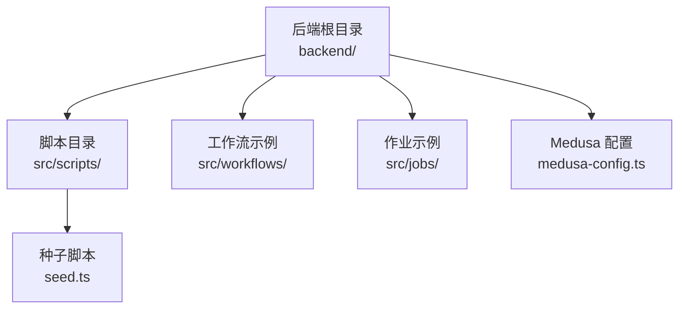
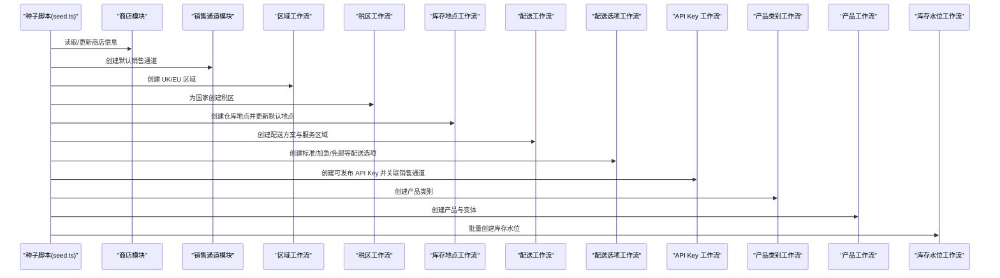
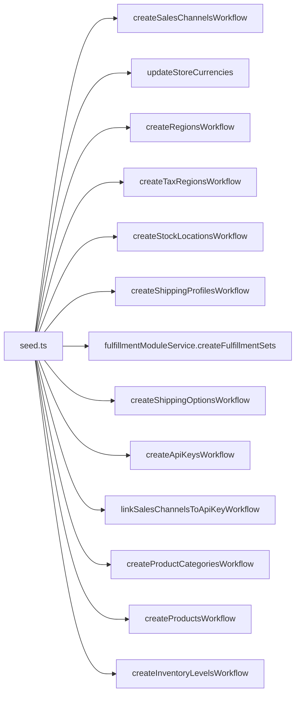

# 数据初始化

<cite>
**本文引用的文件列表**
- [seed.ts](file://backend/src/scripts/seed.ts)
- [medusa-config.ts](file://backend/medusa-config.ts)
- [workflows README.md](file://backend/src/workflows/README.md)
- [scripts README.md](file://backend/src/scripts/README.md)
- [jobs README.md](file://backend/src/jobs/README.md)
</cite>

## 目录
1. [简介](#简介)
2. [项目结构](#项目结构)
3. [核心组件](#核心组件)
4. [架构总览](#架构总览)
5. [详细组件分析](#详细组件分析)
6. [依赖关系分析](#依赖关系分析)
7. [性能考量](#性能考量)
8. [故障排查指南](#故障排查指南)
9. [结论](#结论)
10. [附录](#附录)

## 简介
本指南聚焦 Lumiera 系统的数据种子脚本，系统化解析 seed.ts 的实现机制与工作流编排。文档将深入说明如何利用 MedusaJS 工作流（workflows-sdk）批量创建产品类别、区域、配送选项、库存位置等核心数据；详解关键工作流的调用方式与输入参数结构；提供扩展示例与最佳实践，并解释异步执行模式、错误处理机制与事务性保证，最后给出性能优化建议。

## 项目结构
- 种子脚本位于后端源码目录，采用 MedusaJS 脚本机制执行，通过容器注入服务完成数据初始化。
- 配置文件 medusa-config.ts 提供运行时环境变量加载与基础配置。

图表来源
- [seed.ts](file://backend/src/scripts/seed.ts#L1-L40)
- [medusa-config.ts](file://backend/medusa-config.ts#L1-L21)
- [workflows README.md](file://backend/src/workflows/README.md#L9-L82)
- [jobs README.md](file://backend/src/jobs/README.md#L1-L39)

章节来源
- [seed.ts](file://backend/src/scripts/seed.ts#L1-L40)
- [medusa-config.ts](file://backend/medusa-config.ts#L1-L21)

## 核心组件
- 容器与模块解析：通过容器解析日志、链接、查询、销售通道、库存、配送等模块服务，确保工作流在受控环境中执行。
- 关键工作流：
  - 创建销售通道与默认渠道
  - 更新商店货币与默认渠道
  - 创建区域与税区
  - 创建库存地点并绑定配送
  - 创建配送方案与配送选项
  - 创建可发布 API Key 并关联销售通道
  - 创建产品类别与产品变体
  - 批量创建库存水位
- 自定义工作流：封装商店货币更新逻辑，便于复用与测试。

章节来源
- [seed.ts](file://backend/src/scripts/seed.ts#L58-L122)
- [seed.ts](file://backend/src/scripts/seed.ts#L124-L184)
- [seed.ts](file://backend/src/scripts/seed.ts#L184-L266)
- [seed.ts](file://backend/src/scripts/seed.ts#L320-L357)
- [seed.ts](file://backend/src/scripts/seed.ts#L359-L397)
- [seed.ts](file://backend/src/scripts/seed.ts#L399-L821)
- [seed.ts](file://backend/src/scripts/seed.ts#L823-L851)

## 架构总览
下图展示了种子脚本中各工作流之间的调用顺序与依赖关系，体现从商店与销售通道开始，逐步建立区域、税区、库存、配送、API Key，再到产品与库存水位的完整流程。

图表来源
- [seed.ts](file://backend/src/scripts/seed.ts#L58-L122)
- [seed.ts](file://backend/src/scripts/seed.ts#L124-L184)
- [seed.ts](file://backend/src/scripts/seed.ts#L184-L266)
- [seed.ts](file://backend/src/scripts/seed.ts#L320-L357)
- [seed.ts](file://backend/src/scripts/seed.ts#L359-L397)
- [seed.ts](file://backend/src/scripts/seed.ts#L399-L821)
- [seed.ts](file://backend/src/scripts/seed.ts#L823-L851)

## 详细组件分析

### 组件一：商店与销售通道初始化
- 功能要点
  - 读取现有商店并重命名
  - 若不存在默认销售通道则创建
  - 更新商店支持的货币与默认销售通道
- 输入输出
  - 输入：商店 ID、货币数组（含默认标志）
  - 输出：销售通道结果用于后续绑定
- 扩展建议
  - 可按需增加更多货币或默认币种
  - 可在创建前检查是否已存在同名销售通道以避免重复

章节来源
- [seed.ts](file://backend/src/scripts/seed.ts#L58-L122)

### 组件二：区域与税区初始化
- 功能要点
  - 创建“United Kingdom”和“Europe”两个区域，分别指定国家集合与支付提供商
  - 基于国家列表批量创建税区
- 输入输出
  - 输入：区域数组（名称、货币、国家、支付提供商）
  - 输入：国家数组映射为税区请求体
- 扩展建议
  - 新增区域时，注意国家代码与货币一致性
  - 可根据业务扩展为多层级区域或自定义地理区

章节来源
- [seed.ts](file://backend/src/scripts/seed.ts#L124-L154)

### 组件三：库存地点与配送初始化
- 功能要点
  - 创建仓库地点并更新商店默认地点
  - 链接库存地点到配送提供者与配送集
  - 确保配送方案存在，否则创建默认方案
  - 基于国家列表创建配送服务区域
- 输入输出
  - 输入：地点名称与地址、配送方案类型、服务区域名称与地理区
  - 输出：仓库地点、配送方案、配送集
- 扩展建议
  - 多仓策略：按地区创建多个仓库并分别绑定不同配送集
  - 地理区细化：支持省/州/州省级地理区

章节来源
- [seed.ts](file://backend/src/scripts/seed.ts#L156-L236)

### 组件四：配送选项初始化
- 功能要点
  - 创建多种配送选项（标准、加急、免邮），支持按币种与区域定价
  - 设置配送类型标签、描述与编码
  - 应用规则（启用状态、退货场景等）
- 输入输出
  - 输入：配送选项数组（名称、价格类型、提供商、服务区域、配送方案、类型、价格、规则）
  - 输出：配送选项结果
- 扩展建议
  - 新增促销规则：如满额免邮阈值、限时折扣
  - 国际扩展：新增非 EU/UK 区域的配送选项

章节来源
- [seed.ts](file://backend/src/scripts/seed.ts#L237-L310)

### 组件五：可发布 API Key 初始化
- 功能要点
  - 查询是否存在可发布 API Key，若无则创建
  - 将 API Key 与默认销售通道进行关联
- 输入输出
  - 输入：API Key 标题、类型、创建人
  - 输出：API Key 结果与令牌
- 扩展建议
  - 多环境区分：开发/测试/生产使用不同标题或前缀
  - 权限最小化：仅授予必要销售通道权限

章节来源
- [seed.ts](file://backend/src/scripts/seed.ts#L320-L357)

### 组件六：产品类别与产品初始化
- 功能要点
  - 创建产品类别（Solo Play、Couples、Wellness、Accessories）
  - 创建多品类产品，包含标题、副标题、描述、分类、重量、状态、图片、选项与变体、销售通道等
- 输入输出
  - 输入：类别数组、产品数组（含变体与价格）
  - 输出：类别与产品结果
- 扩展建议
  - 新增类别：如“Limited Edition”，按需调整 handle 与描述
  - 产品模板化：抽象出通用产品模板函数，减少重复

章节来源
- [seed.ts](file://backend/src/scripts/seed.ts#L359-L397)
- [seed.ts](file://backend/src/scripts/seed.ts#L399-L821)

### 组件七：库存水位初始化
- 功能要点
  - 查询所有库存项并批量创建库存水位，统一设置库存地点与数量
- 输入输出
  - 输入：库存项 ID 列表与地点 ID
  - 输出：批量创建结果
- 扩展建议
  - 分批入库：大数据量时分页批量提交
  - 水位策略：按品类设定安全库存阈值

章节来源
- [seed.ts](file://backend/src/scripts/seed.ts#L823-L851)

### 组件八：自定义工作流（商店货币更新）
- 功能要点
  - 封装商店货币更新逻辑，标准化输入格式（货币代码与默认标志）
- 使用方式
  - 在脚本中直接调用该工作流并传入输入对象
- 扩展建议
  - 支持增量更新：仅更新变化的币种
  - 异常处理：对无效币种或默认币种冲突进行校验

章节来源
- [seed.ts](file://backend/src/scripts/seed.ts#L30-L57)

## 依赖关系分析
- 组件耦合
  - seed.ts 通过容器解析多个模块服务，形成对核心模块的强依赖
  - 工作流之间存在显式依赖链：区域→税区；库存地点→配送；产品类别→产品
- 外部依赖
  - MedusaJS 工作流 SDK 与核心工作流包
  - 环境变量由 medusa-config.ts 加载
- 循环依赖
  - 当前脚本未见循环导入；工作流间通过容器与模块接口解耦

图表来源
- [seed.ts](file://backend/src/scripts/seed.ts#L58-L122)
- [seed.ts](file://backend/src/scripts/seed.ts#L124-L184)
- [seed.ts](file://backend/src/scripts/seed.ts#L184-L266)
- [seed.ts](file://backend/src/scripts/seed.ts#L320-L357)
- [seed.ts](file://backend/src/scripts/seed.ts#L359-L397)
- [seed.ts](file://backend/src/scripts/seed.ts#L399-L821)
- [seed.ts](file://backend/src/scripts/seed.ts#L823-L851)

## 性能考量
- 批量操作
  - 产品与库存水位采用批量创建，减少往返次数
  - 建议：对超大体量数据分页/分批提交，避免单次请求过大
- 索引优化
  - 为常用筛选字段（如 handle、region_id、stock_location_id）建立数据库索引
  - 对价格与规则字段进行复合索引以提升查询性能
- 缓存与幂等
  - 对已存在的实体先查询再决定创建或跳过，避免重复
  - 对高频读取（如区域、销售通道）引入缓存层
- 并发与事务
  - 工作流内部具备原子性；跨工作流事务可通过工作流编排与错误回滚策略保障一致性
  - 建议：对关键路径（如创建配送选项）增加幂等键与重试机制

## 故障排查指南
- 常见问题
  - 环境变量缺失：确认 DATABASE_URL、STORE_CORS、ADMIN_CORS、AUTH_CORS、JWT_SECRET、COOKIE_SECRET 等已正确配置
  - 销售通道或商店不存在：脚本会自动创建默认销售通道与商店，若失败请检查权限与模块可用性
  - 配送选项价格不生效：核对币种与区域 ID 是否匹配，确保已创建对应区域与货币
  - 产品变体价格异常：检查变体选项与价格映射是否一致
- 排查步骤
  - 查看日志输出，定位具体工作流执行阶段
  - 使用查询接口验证中间结果（如区域、库存地点、API Key）
  - 对批量操作逐条回放，缩小问题范围
- 错误处理与回滚
  - 工作流具备原子性；若某一步骤失败，建议在上层捕获并记录，随后清理已创建的中间实体
  - 对外部依赖（如第三方配送提供商）增加超时与重试策略

章节来源
- [medusa-config.ts](file://backend/medusa-config.ts#L1-L21)
- [seed.ts](file://backend/src/scripts/seed.ts#L58-L122)
- [seed.ts](file://backend/src/scripts/seed.ts#L124-L184)
- [seed.ts](file://backend/src/scripts/seed.ts#L184-L266)
- [seed.ts](file://backend/src/scripts/seed.ts#L320-L357)
- [seed.ts](file://backend/src/scripts/seed.ts#L359-L397)
- [seed.ts](file://backend/src/scripts/seed.ts#L399-L821)
- [seed.ts](file://backend/src/scripts/seed.ts#L823-L851)

## 结论
seed.ts 通过 MedusaJS 工作流实现了从商店、销售通道到区域、税区、库存、配送、API Key、产品类别与产品的全链路数据初始化。其设计遵循“自顶向下”的编排思路，借助容器与模块服务实现高内聚低耦合。结合本文提供的扩展示例、最佳实践与性能建议，可在开发、测试与生产环境中稳定高效地完成数据种子管理。

## 附录

### A. 关键工作流调用与输入结构速查
- 创建销售通道
  - 路径参考：[seed.ts](file://backend/src/scripts/seed.ts#L81-L95)
  - 输入要点：销售通道名称与描述
- 更新商店货币
  - 路径参考：[seed.ts](file://backend/src/scripts/seed.ts#L97-L113)
  - 输入要点：商店 ID、货币数组（含默认标志）
- 创建区域
  - 路径参考：[seed.ts](file://backend/src/scripts/seed.ts#L125-L142)
  - 输入要点：区域数组（名称、货币、国家、支付提供商）
- 创建税区
  - 路径参考：[seed.ts](file://backend/src/scripts/seed.ts#L148-L153)
  - 输入要点：国家代码与提供商 ID
- 创建库存地点
  - 路径参考：[seed.ts](file://backend/src/scripts/seed.ts#L157-L172)
  - 输入要点：地点名称与地址
- 创建配送方案与服务区域
  - 路径参考：[seed.ts](file://backend/src/scripts/seed.ts#L199-L236)
  - 输入要点：配送方案名称与类型；服务区域名称与地理区
- 创建配送选项
  - 路径参考：[seed.ts](file://backend/src/scripts/seed.ts#L237-L309)
  - 输入要点：名称、价格类型、提供商、服务区域、配送方案、类型、价格、规则
- 创建可发布 API Key 并关联销售通道
  - 路径参考：[seed.ts](file://backend/src/scripts/seed.ts#L320-L357)
  - 输入要点：标题、类型、创建人；随后关联销售通道
- 创建产品类别
  - 路径参考：[seed.ts](file://backend/src/scripts/seed.ts#L359-L397)
  - 输入要点：类别数组（名称、handle、描述、激活状态）
- 创建产品与变体
  - 路径参考：[seed.ts](file://backend/src/scripts/seed.ts#L399-L821)
  - 输入要点：标题、副标题、描述、分类、重量、状态、图片、选项、变体、销售通道
- 批量创建库存水位
  - 路径参考：[seed.ts](file://backend/src/scripts/seed.ts#L823-L851)
  - 输入要点：库存项 ID 列表与地点 ID

### B. 执行方式与最佳实践
- 执行脚本
  - 使用 Medusa CLI 的 exec 子命令执行脚本，传递所需参数
  - 路径参考：[scripts README.md](file://backend/src/scripts/README.md#L47-L63)
- 工作流执行
  - 通过容器与工作流 SDK 的 run 方法执行，传入输入对象
  - 路径参考：[workflows README.md](file://backend/src/workflows/README.md#L9-L82)
- 最佳实践
  - 开发环境：使用本地数据库与较小样本数据，便于快速迭代
  - 测试环境：使用独立数据库与自动化脚本，确保可重复性
  - 生产环境：限制并发、开启幂等键、记录详细日志、设置重试与告警