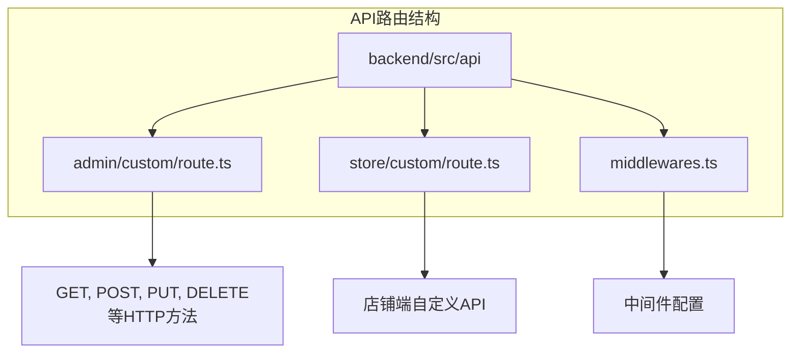
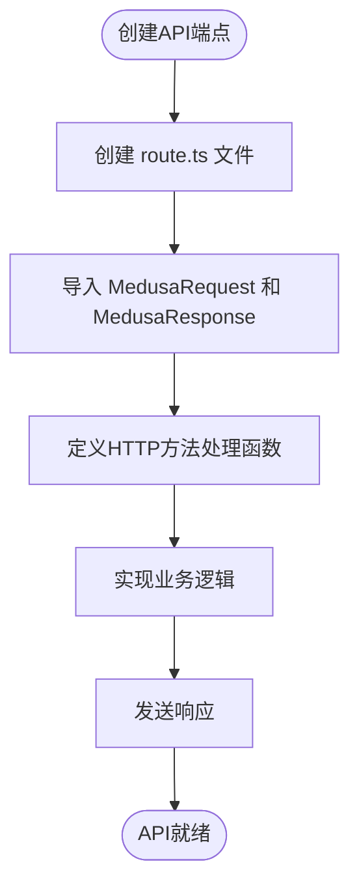
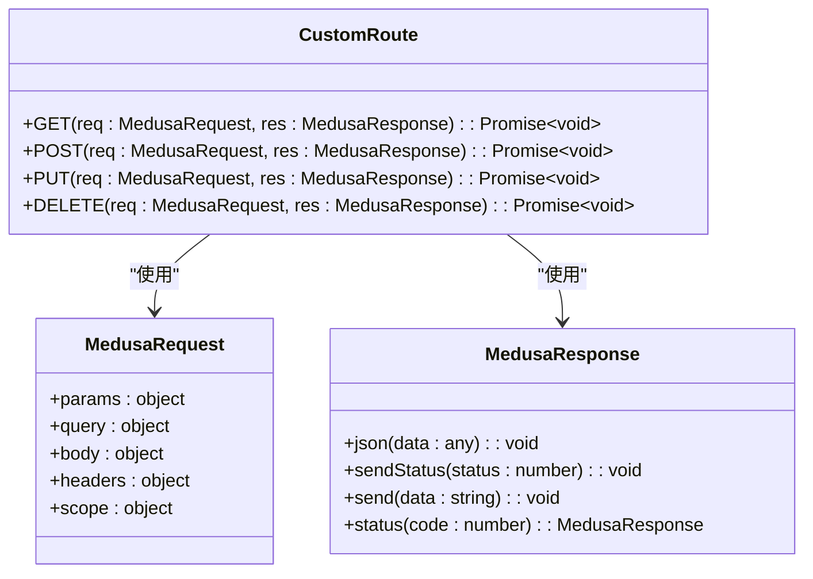
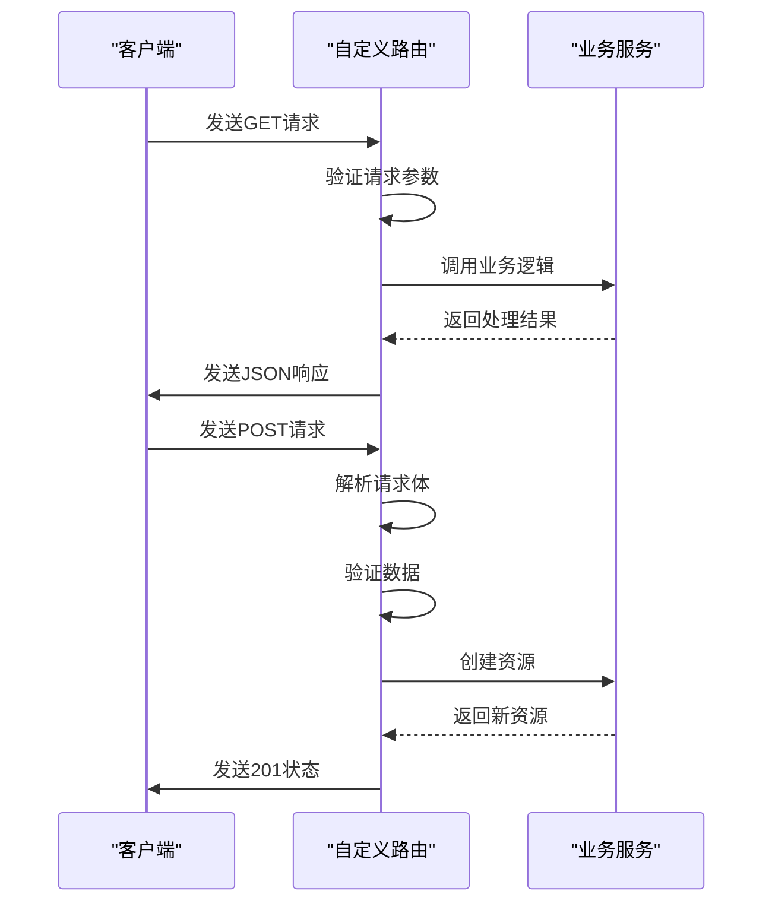
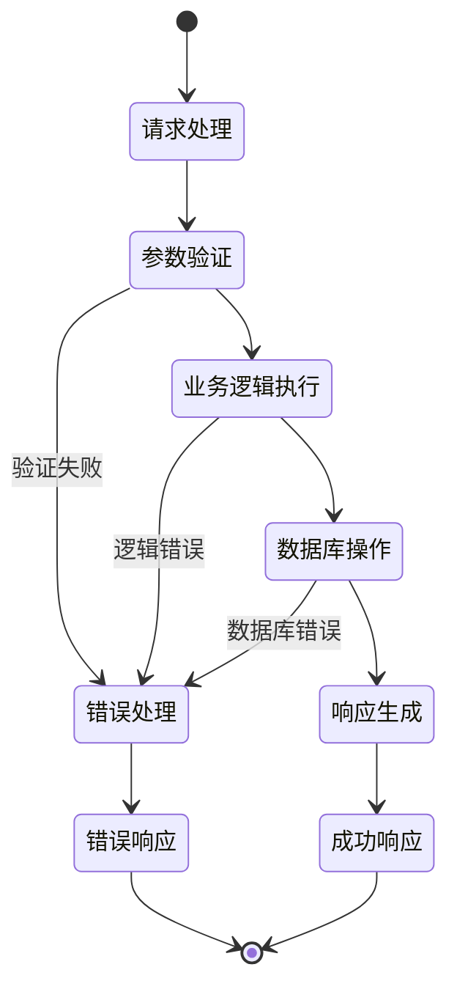
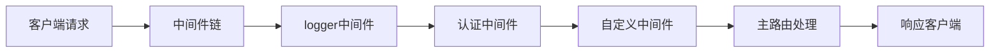
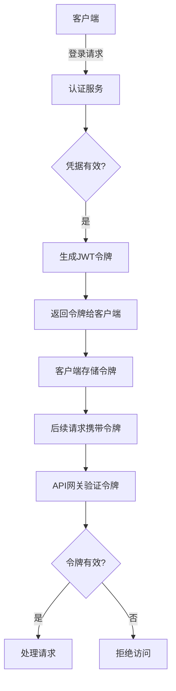
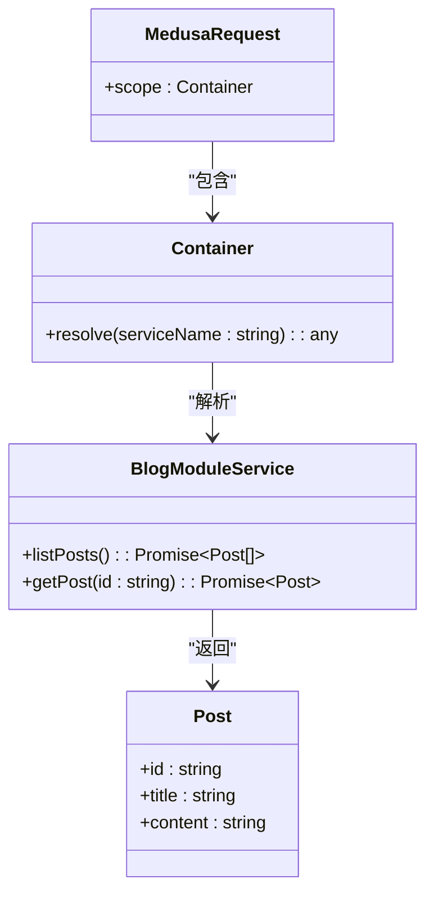

# 自定义API扩展

<cite>
**本文档中引用的文件**   
- [backend/src/api/admin/custom/route.ts](file://backend/src/api/admin/custom/route.ts)
- [backend/src/api/store/custom/route.ts](file://backend/src/api/store/custom/route.ts)
- [backend/src/api/README.md](file://backend/src/api/README.md)
- [backend/medusa-config.ts](file://backend/medusa-config.ts)
- [backend/.env.template](file://backend/.env.template)
- [backend/.env](file://backend/.env)
- [backend/src/modules/README.md](file://backend/src/modules/README.md)
</cite>

## 目录
1. [简介](#简介)
2. [项目结构与API路由机制](#项目结构与api路由机制)
3. [自定义API端点实现](#自定义api端点实现)
4. [请求处理函数签名与HTTP方法](#请求处理函数签名与http方法)
5. [请求验证与错误处理策略](#请求验证与错误处理策略)
6. [中间件集成与执行顺序](#中间件集成与执行顺序)
7. [身份验证与安全配置](#身份验证与安全配置)
8. [CORS配置与跨域问题排查](#cors配置与跨域问题排查)
9. [类型安全与模块集成](#类型安全与模块集成)
10. [常见问题排查指南](#常见问题排查指南)

## 简介
本文档详细说明Lumiera系统中管理端和店铺端的自定义API扩展机制。重点介绍如何通过`backend/src/api/admin/custom/route.ts`和`backend/src/api/store/custom/route.ts`文件定义新的RESTful API路由，涵盖请求处理、参数校验、身份验证、错误处理和响应格式化等关键方面。文档还解释了这些自定义路由与MedusaJS核心API的集成方式，并提供常见问题的解决方案。

## 项目结构与API路由机制
Lumiera系统的API路由采用基于文件的路由机制，位于`backend/src/api`目录下。该机制支持管理端（admin）和店铺端（store）的独立路由定义，允许开发者通过简单的文件结构创建RESTful端点。



**Diagram sources**
- [backend/src/api/admin/custom/route.ts](file://backend/src/api/admin/custom/route.ts#L1-L8)
- [backend/src/api/store/custom/route.ts](file://backend/src/api/store/custom/route.ts#L1-L8)
- [backend/src/api/README.md](file://backend/src/api/README.md#L1-L20)

**Section sources**
- [backend/src/api/README.md](file://backend/src/api/README.md#L1-L136)
- [backend/src/api/admin/custom/route.ts](file://backend/src/api/admin/custom/route.ts#L1-L8)

## 自定义API端点实现
在Lumiera系统中，自定义API端点通过在`src/api`目录下创建特定路径的`route.ts`文件来实现。系统支持两种主要的API端点类型：管理端API和店铺端API。

### 管理端自定义API
管理端API位于`backend/src/api/admin`目录下，通常用于后台管理系统功能。创建新的管理端API只需在相应路径下创建`route.ts`文件。



**Diagram sources**
- [backend/src/api/admin/custom/route.ts](file://backend/src/api/admin/custom/route.ts#L1-L8)

### 店铺端自定义API
店铺端API位于`backend/src/api/store`目录下，用于处理前端商店的特定需求。其创建方式与管理端API相同，但访问路径和权限控制有所不同。



**Diagram sources**
- [backend/src/api/store/custom/route.ts](file://backend/src/api/store/custom/route.ts#L1-L8)
- [backend/src/api/README.md](file://backend/src/api/README.md#L11-L18)

**Section sources**
- [backend/src/api/admin/custom/route.ts](file://backend/src/api/admin/custom/route.ts#L1-L8)
- [backend/src/api/store/custom/route.ts](file://backend/src/api/store/custom/route.ts#L1-L8)

## 请求处理函数签名与HTTP方法
Lumiera系统的自定义API路由支持标准的HTTP方法，通过导出相应名称的异步函数来处理不同类型的请求。

### 支持的HTTP方法
系统支持以下HTTP方法的处理：

- GET
- POST
- PUT
- PATCH
- DELETE
- OPTIONS
- HEAD



**Diagram sources**
- [backend/src/api/README.md](file://backend/src/api/README.md#L21-L51)
- [backend/src/api/admin/custom/route.ts](file://backend/src/api/admin/custom/route.ts#L3-L6)

### 请求处理函数示例
请求处理函数必须遵循特定的签名模式，接受`MedusaRequest`和`MedusaResponse`作为参数。

```typescript
import { MedusaRequest, MedusaResponse } from "@medusajs/framework/http";

export async function GET(
  req: MedusaRequest,
  res: MedusaResponse
) {
  res.sendStatus(200);
}
```

**Section sources**
- [backend/src/api/admin/custom/route.ts](file://backend/src/api/admin/custom/route.ts#L1-L8)
- [backend/src/api/store/custom/route.ts](file://backend/src/api/store/custom/route.ts#L1-L8)

## 请求验证与错误处理策略
有效的请求验证和错误处理是构建可靠API的关键组成部分。Lumiera系统提供了多种机制来确保数据完整性和系统稳定性。

### 参数验证
系统支持路径参数、查询参数和请求体参数的验证。路径参数通过特殊的目录命名约定来定义。

```mermaid
flowchart TD
A[请求到达] --> B{路径包含[param]?}
B --> |是| C["提取 req.params"]
B --> |否| D["继续处理"]
C --> E["验证参数格式"]
E --> F{"验证通过?"}
F --> |是| G["执行业务逻辑"]
F --> |否| H["返回400错误"]
G --> I["生成响应"]
H --> J["发送错误响应"]
I --> K([成功响应])
J --> K
```

**Diagram sources**
- [backend/src/api/README.md](file://backend/src/api/README.md#L53-L72)

### 错误处理最佳实践
统一的错误处理策略确保API返回一致的错误响应格式。



**Section sources**
- [backend/src/api/README.md](file://backend/src/api/README.md#L53-L72)
- [backend/src/modules/README.md](file://backend/src/modules/README.md#L92-L118)

## 中间件集成与执行顺序
中间件是扩展API功能的关键机制，允许在请求处理前后执行额外的逻辑。

### 中间件配置
通过创建`/api/middlewares.ts`文件来配置中间件，该文件导出一个包含路由匹配器和中间件函数数组的配置对象。



**Diagram sources**
- [backend/src/api/README.md](file://backend/src/api/README.md#L102-L132)

### 中间件执行流程
中间件按照配置的顺序依次执行，每个中间件可以选择调用`next()`函数继续执行链式调用，或直接发送响应终止流程。

```typescript
import { defineMiddlewares } from "@medusajs/framework/http"
import type {
  MedusaRequest,
  MedusaResponse,
  MedusaNextFunction,
} from "@medusajs/framework/http";

async function logger(
  req: MedusaRequest,
  res: MedusaResponse,
  next: MedusaNextFunction
) {
  console.log("请求已接收");
  next();
}

export default defineMiddlewares({
  routes: [
    {
      matcher: "/store/custom",
      middlewares: [logger],
    },
  ],
})
```

**Section sources**
- [backend/src/api/README.md](file://backend/src/api/README.md#L102-L136)

## 身份验证与安全配置
安全的身份验证机制是保护API端点的关键。Lumiera系统通过环境变量和配置文件来管理安全相关设置。

### JWT认证配置
系统使用JWT（JSON Web Token）进行身份验证，相关密钥通过环境变量配置。



**Diagram sources**
- [backend/medusa-config.ts](file://backend/medusa-config.ts#L1-L20)
- [backend/.env.template](file://backend/.env.template#L1-L8)

### 安全配置
关键安全配置通过`medusa-config.ts`文件和环境变量进行管理。

```typescript
module.exports = defineConfig({
  projectConfig: {
    databaseUrl: process.env.DATABASE_URL,
    http: {
      storeCors: process.env.STORE_CORS!,
      adminCors: process.env.ADMIN_CORS!,
      authCors: process.env.AUTH_CORS!,
      jwtSecret: process.env.JWT_SECRET || "supersecret",
      cookieSecret: process.env.COOKIE_SECRET || "supersecret",
    }
  },
  admin: {
    backendUrl: process.env.MEDUSA_BACKEND_URL || "http://localhost:9000",
  }
})
```

**Section sources**
- [backend/medusa-config.ts](file://backend/medusa-config.ts#L1-L20)
- [backend/.env](file://backend/.env#L1-L8)
- [backend/.env.template](file://backend/.env.template#L1-L8)

## CORS配置与跨域问题排查
跨域资源共享（CORS）配置对于现代Web应用至关重要，特别是在前后端分离的架构中。

### CORS配置机制
CORS设置通过环境变量进行配置，允许灵活控制不同环境下的跨域访问策略。

```mermaid
flowchart TB
A[浏览器发起请求] --> B{同源?}
B --> |是| C[直接发送请求]
B --> |否| D[发送预检请求(OPTIONS)]
D --> E{服务器允许跨域?}
E --> |是| F[服务器返回CORS头]
F --> G[浏览器发送实际请求]
G --> H[服务器处理请求]
H --> I[返回响应]
E --> |否| J[浏览器阻止请求]
```

**Diagram sources**
- [backend/medusa-config.ts](file://backend/medusa-config.ts#L8-L14)
- [backend/.env.template](file://backend/.env.template#L1-L3)

### 环境变量配置
CORS相关的环境变量定义在`.env.template`文件中，为不同环境提供跨域访问控制。

```env
STORE_CORS=http://localhost:8000,https://docs.medusajs.com
ADMIN_CORS=http://localhost:5173,http://localhost:9000,https://docs.medusajs.com
AUTH_CORS=http://localhost:5173,http://localhost:9000,https://docs.medusajs.com
```

**Section sources**
- [backend/.env.template](file://backend/.env.template#L1-L8)
- [backend/medusa-config.ts](file://backend/medusa-config.ts#L9-L11)

## 类型安全与模块集成
Lumiera系统强调类型安全，通过TypeScript和依赖注入机制确保代码的可靠性和可维护性。

### 依赖注入与服务访问
通过`req.scope.resolve()`方法访问系统中的各种服务，实现松耦合的模块化设计。



**Diagram sources**
- [backend/src/modules/README.md](file://backend/src/modules/README.md#L98-L117)

### 模块集成示例
自定义API可以集成系统中的各种模块，实现复杂业务逻辑。

```typescript
import { MedusaRequest, MedusaResponse } from "@medusajs/framework"
import BlogModuleService from "../../../modules/blog/service"
import { BLOG_MODULE } from "../../../modules/blog"

export async function GET(
  req: MedusaRequest,
  res: MedusaResponse
): Promise<void> {
  const blogModuleService: BlogModuleService = req.scope.resolve(
    BLOG_MODULE
  )

  const posts = await blogModuleService.listPosts()

  res.json({
    posts
  })
}
```

**Section sources**
- [backend/src/modules/README.md](file://backend/src/modules/README.md#L92-L118)

## 常见问题排查指南
本节提供常见问题的解决方案和调试技巧，帮助开发者快速定位和解决问题。

### CORS问题排查
当遇到跨域问题时，检查以下配置：

1. 确认`STORE_CORS`、`ADMIN_CORS`和`AUTH_CORS`环境变量是否正确配置
2. 检查前端请求的Origin头是否在允许的域名列表中
3. 验证服务器是否正确返回CORS相关响应头

### 中间件执行顺序问题
中间件的执行顺序可能影响API行为，注意以下几点：

1. 中间件按照配置数组的顺序执行
2. 确保认证中间件在业务逻辑之前执行
3. 使用日志中间件帮助调试执行流程

### 调试技巧
有效的调试策略包括：

1. 在中间件中添加日志输出
2. 使用Postman或curl测试API端点
3. 检查服务器日志中的错误信息
4. 验证环境变量是否正确加载

**Section sources**
- [backend/src/api/README.md](file://backend/src/api/README.md#L102-L136)
- [backend/medusa-config.ts](file://backend/medusa-config.ts#L1-L20)
- [backend/.env](file://backend/.env#L1-L8)