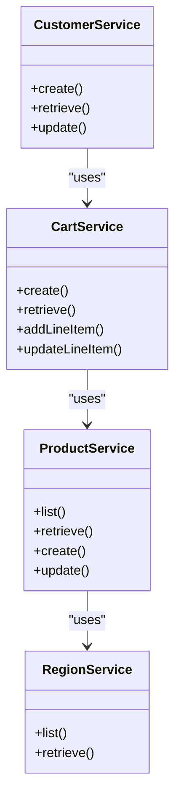
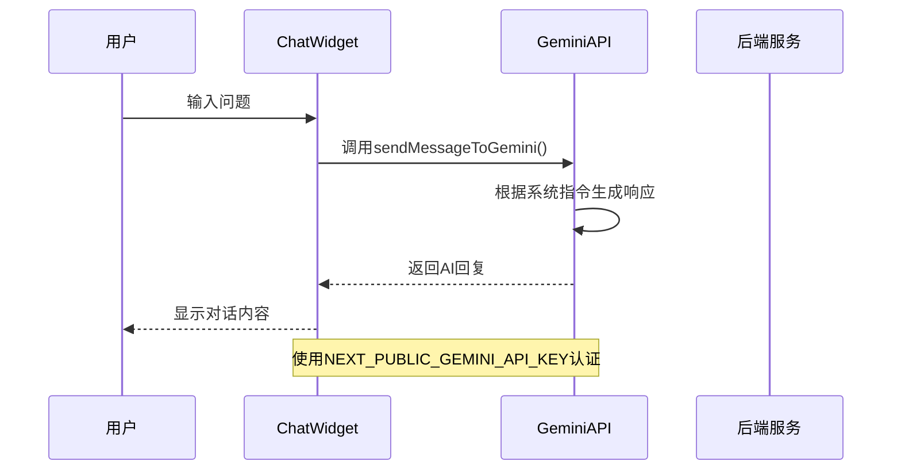
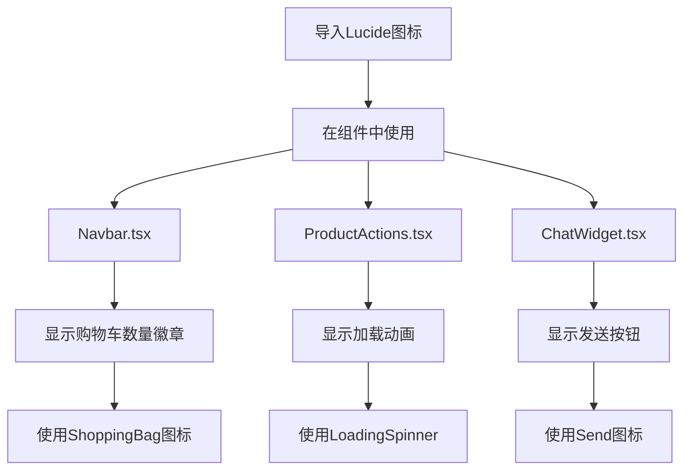
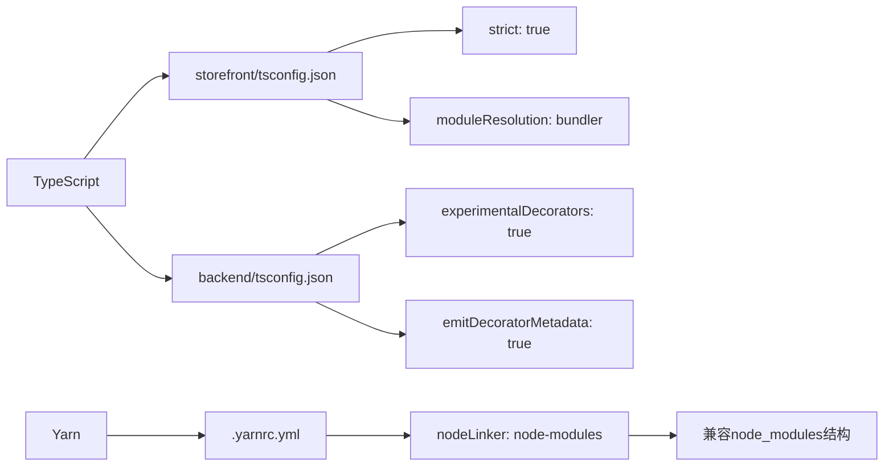

# 技术栈

<cite>
**本文档中引用的文件**  
- [storefront/package.json](file://storefront/package.json)
- [backend/package.json](file://backend/package.json)
- [storefront/next.config.ts](file://storefront/next.config.ts)
- [storefront/tsconfig.json](file://storefront/tsconfig.json)
- [backend/tsconfig.json](file://backend/tsconfig.json)
- [backend/.yarnrc.yml](file://backend/.yarnrc.yml)
- [storefront/src/lib/gemini.ts](file://storefront/src/lib/gemini.ts)
- [storefront/src/lib/medusa.ts](file://storefront/src/lib/medusa.ts)
- [storefront/src/app/layout.tsx](file://storefront/src/app/layout.tsx)
- [storefront/src/components/Navbar.tsx](file://storefront/src/components/Navbar.tsx)
- [storefront/src/lib/constants.ts](file://storefront/src/lib/constants.ts)
</cite>

## 目录
1. [简介](#简介)
2. [前端技术栈](#前端技术栈)
3. [后端技术栈](#后端技术栈)
4. [AI集成](#ai集成)
5. [UI组件库](#ui组件库)
6. [TypeScript与Yarn配置](#typescript与yarn配置)
7. [总结](#总结)

## 简介
Lumiera项目是一个高端亲密健康电商平台，采用现代化全栈技术架构。本项目分为前端（storefront）和后端（backend）两个独立模块，分别使用Next.js和MedusaJS构建。系统整合了AI智能推荐、国际化电商逻辑、响应式UI设计等特性，旨在提供安全、优雅且用户友好的购物体验。本文档详细说明其技术选型、架构优势及配置细节。

## 前端技术栈

Lumiera的前端基于Next.js 16.1.1与React 19.2.3构建，充分利用了最新的React特性与Next.js的App Router架构。通过服务端组件（Server Components）优化首屏加载性能，结合客户端组件（Client Components）实现交互逻辑，形成高效的混合渲染模式。

Next.js的App Router架构允许将页面逻辑按功能模块化组织，如`app/shop`、`app/product/[handle]`等路径清晰地映射到路由结构。同时，`layout.tsx`文件定义了全局布局，支持嵌套路由与共享UI组件，提升了开发效率与维护性。

```mermaid
graph TB
A[App Router] --> B[/app]
B --> C[layout.tsx]
B --> D[page.tsx]
B --> E[shop/page.tsx]
B --> F[product/[handle]/page.tsx]
B --> G[account/page.tsx]
C --> H[Providers]
C --> I[LayoutWrapper]
D --> J[HomeUSPBar]
F --> K[ProductGallery]
F --> L[ProductInfo]
F --> M[ProductActions]
```

**Diagram sources**  
- [storefront/src/app/layout.tsx](file://storefront/src/app/layout.tsx)
- [storefront/src/app/page.tsx](file://storefront/src/app/page.tsx)
- [storefront/src/app/product/[handle]/page.tsx](file://storefront/src/app/product/[handle]/page.tsx)

**Section sources**  
- [storefront/package.json](file://storefront/package.json#L16-L18)
- [storefront/next.config.ts](file://storefront/next.config.ts)

## 后端技术栈

后端采用MedusaJS框架（@medusajs/*）构建，专注于电商核心逻辑处理。MedusaJS提供了模块化的架构，支持产品管理、订单处理、库存控制、支付集成等标准电商功能，并通过插件机制实现灵活扩展。

后端项目结构清晰划分了API接口、任务调度、事件订阅者、工作流等模块。`medusa-config.ts`配置文件定义了数据库连接、插件加载及服务注册，确保系统可配置性和可维护性。通过`@medusajs/medusa`核心包与`@medusajs/framework`框架支持，实现了领域驱动设计（DDD）的分层架构。



**Diagram sources**  
- [backend/src/api/admin/custom/route.ts](file://backend/src/api/admin/custom/route.ts)
- [backend/src/api/store/custom/route.ts](file://backend/src/api/store/custom/route.ts)

**Section sources**  
- [backend/package.json](file://backend/package.json#L25-L28)
- [backend/medusa-config.ts](file://backend/medusa-config.ts)

## AI集成

Lumiera项目集成了`@google/genai` SDK，用于实现AI驱动的智能推荐与客户服务功能。通过Gemini模型，系统能够提供个性化的购物建议、解答用户疑问，并以“Lumi”虚拟健康顾问的身份增强用户体验。

AI功能主要在`src/lib/gemini.ts`中实现，初始化`GoogleGenAI`实例并创建聊天会话。系统指令（`GEMINI_SYSTEM_INSTRUCTION`）定义了品牌价值观与对话准则，确保AI响应符合“自我护理、亲密关系、精致、安全”的品牌定位。AI被用于聊天小部件（ChatWidget），为用户提供非评判性的专业指导。



**Diagram sources**  
- [storefront/src/lib/gemini.ts](file://storefront/src/lib/gemini.ts)
- [storefront/src/components/ChatWidget.tsx](file://storefront/src/components/ChatWidget.tsx)
- [storefront/src/lib/constants.ts](file://storefront/src/lib/constants.ts#L103-L115)

**Section sources**  
- [storefront/package.json](file://storefront/package.json#L12)
- [storefront/src/lib/gemini.ts](file://storefront/src/lib/gemini.ts)

## UI组件库

前端UI采用`lucide-react`图标库，提供一致且高质量的SVG图标支持。该库轻量、可定制性强，与React组件无缝集成，适用于各种交互场景，如导航栏、购物车、搜索等功能。

在`Navbar.tsx`中，`lucide-react`的`ShoppingBag`、`User`、`Search`等图标被用于构建响应式导航栏。图标通过ES模块导入，支持按需加载，减少打包体积。结合Tailwind CSS，实现现代化、极简风格的视觉呈现。



**Diagram sources**  
- [storefront/src/components/Navbar.tsx](file://storefront/src/components/Navbar.tsx#L6)
- [storefront/src/app/product/[handle]/ProductActions.tsx](file://storefront/src/app/product/[handle]/ProductActions.tsx#L32-L56)
- [storefront/src/components/ChatWidget.tsx](file://storefront/src/components/ChatWidget.tsx#L4)

**Section sources**  
- [storefront/package.json](file://storefront/package.json#L15)
- [storefront/src/components/Navbar.tsx](file://storefront/src/components/Navbar.tsx)

## TypeScript与Yarn配置

整个项目采用TypeScript作为主要开发语言，提供静态类型检查，增强代码可维护性与开发体验。前后端均配置了`tsconfig.json`，分别针对Next.js和Node.js环境进行优化。

前端`tsconfig.json`启用`strict`模式，使用`moduleResolution: "bundler"`以兼容现代打包工具。后端配置则启用装饰器支持（`experimentalDecorators`）和元数据发射（`emitDecoratorMetadata`），满足MedusaJS框架的依赖注入需求。

包管理使用Yarn，并通过`.yarnrc.yml`配置`nodeLinker: node-modules`，确保与传统npm生态兼容。该配置避免了PnP（Plug'n'Play）模式可能带来的工具链兼容性问题，同时保留Yarn的高效依赖解析优势。



**Diagram sources**  
- [storefront/tsconfig.json](file://storefront/tsconfig.json)
- [backend/tsconfig.json](file://backend/tsconfig.json)
- [backend/.yarnrc.yml](file://backend/.yarnrc.yml)

**Section sources**  
- [storefront/tsconfig.json](file://storefront/tsconfig.json)
- [backend/tsconfig.json](file://backend/tsconfig.json)
- [backend/.yarnrc.yml](file://backend/.yarnrc.yml)

## 总结
Lumiera项目的技术栈体现了现代电商应用的最佳实践：前端采用Next.js 16与React 19的最新特性，实现高性能服务端渲染；后端依托MedusaJS框架，快速构建可扩展的电商核心；通过`@google/genai`引入AI能力，提升个性化体验；使用`lucide-react`确保UI一致性。TypeScript提供类型安全，Yarn保证依赖管理效率。整体架构清晰、可维护性强，为高端亲密健康品牌提供了坚实的技术基础。