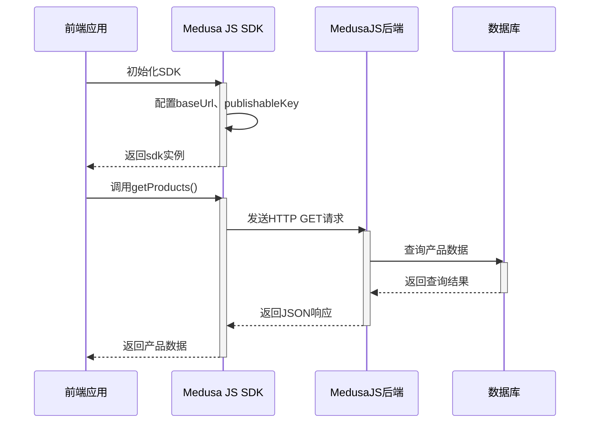
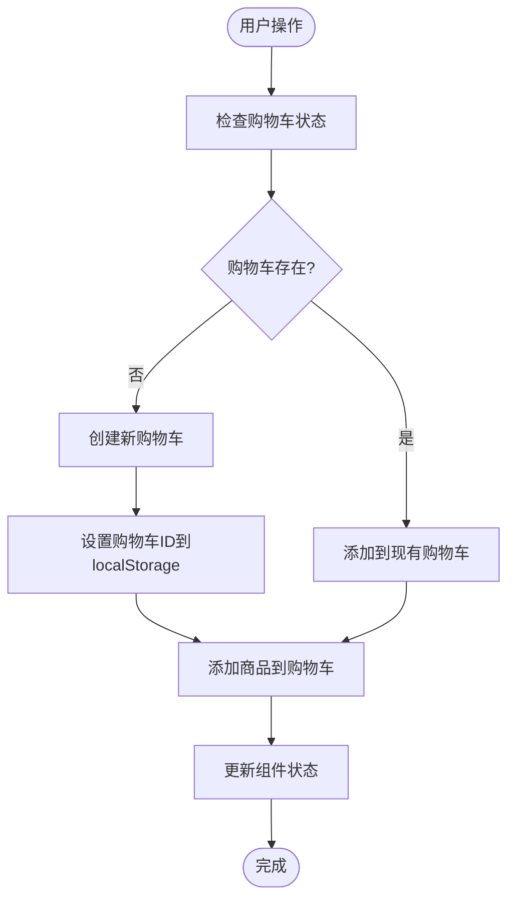
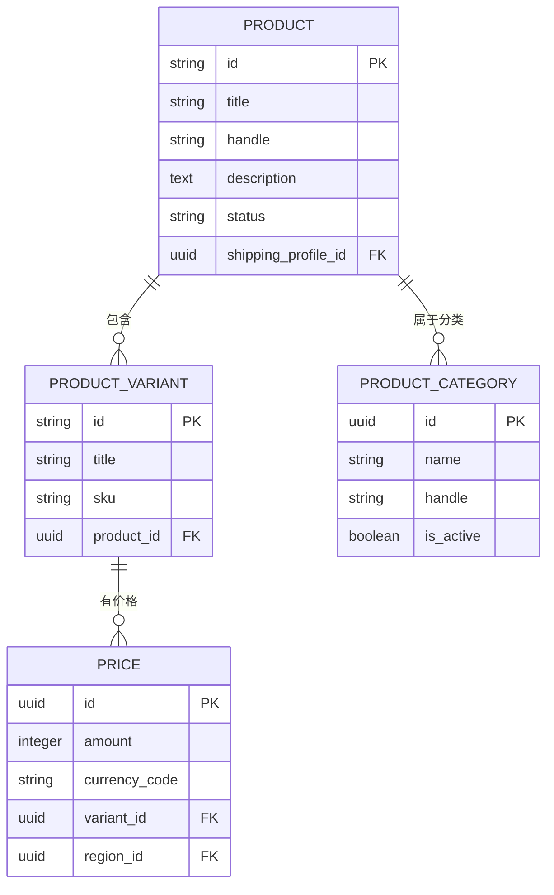
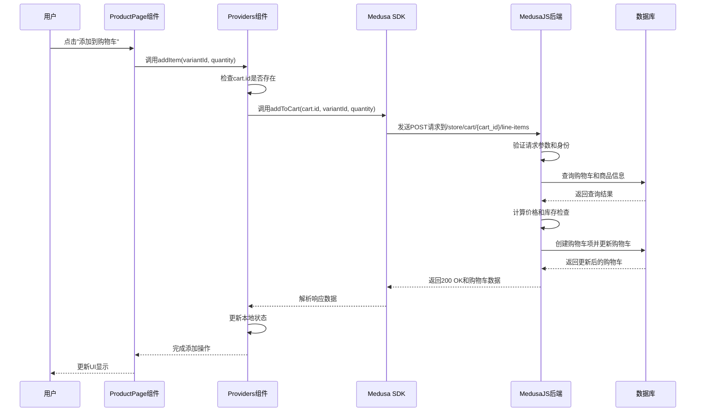

# 数据流与通信

<cite>
**本文档中引用的文件**  
- [medusa.ts](file://storefront/src/lib/medusa.ts)
- [route.ts](file://backend/src/api/store/custom/route.ts)
- [seed.ts](file://backend/src/scripts/seed.ts)
- [providers.tsx](file://storefront/src/lib/providers.tsx)
- [cart/page.tsx](file://storefront/src/app/cart/page.tsx)
- [types.ts](file://storefront/src/lib/types.ts)
- [medusa-config.ts](file://backend/medusa-config.ts)
</cite>

## 目录
1. [引言](#引言)
2. [系统架构概述](#系统架构概述)
3. [前后端通信机制](#前后端通信机制)
4. [数据流动路径分析](#数据流动路径分析)
5. [核心实体数据结构与关系](#核心实体数据结构与关系)
6. [典型场景序列图](#典型场景序列图)
7. [性能瓶颈与优化方案](#性能瓶颈与优化方案)
8. [结论](#结论)

## 引言
本文档详细描述Lumiera系统中的数据流动路径与前后端通信机制。从用户发起请求开始，说明Next.js页面如何通过Medusa SDK调用后端API，数据如何经由HTTP传输到达MedusaJS服务，最终持久化至数据库的完整链路。重点分析storefront/src/lib/medusa.ts中封装的API调用方法，以及backend/src/api/store/custom/route.ts中自定义接口的处理逻辑。结合seed.ts中的数据初始化过程，展示核心实体（产品、区域、购物车）的数据结构与关系。提供序列图说明典型场景（如添加商品到购物车）的数据交互流程，并指出潜在的性能瓶颈与优化方案。

## 系统架构概述
Lumiera系统采用前后端分离的架构设计，前端使用Next.js框架构建，后端基于MedusaJS电商框架。前端通过Medusa JS SDK与后端进行通信，实现数据的获取和操作。系统整体架构分为三个主要部分：前端展示层、后端服务层和数据存储层。

前端展示层负责用户界面的渲染和用户交互，使用Next.js的App Router架构，通过React组件构建用户界面。后端服务层基于MedusaJS框架，提供RESTful API接口，处理业务逻辑和数据操作。数据存储层使用关系型数据库，存储产品、订单、客户等核心数据。

系统通过发布/订阅模式实现组件间的松耦合，使用环境变量配置不同环境下的服务地址和密钥。前端通过Publishable API Key进行身份验证，确保API调用的安全性。

**Diagram sources**
- [medusa-config.ts](file://backend/medusa-config.ts#L1-L21)

## 前后端通信机制
Lumiera系统的前后端通信机制基于Medusa JS SDK实现，采用RESTful API设计风格。前端通过SDK封装的API调用方法与后端进行交互，所有通信均通过HTTPS协议进行，确保数据传输的安全性。

### Medusa SDK封装
前端在`storefront/src/lib/medusa.ts`文件中封装了Medusa SDK的初始化和API调用方法。SDK的初始化配置包括后端服务地址、发布密钥和销售渠道ID等关键参数。这些参数通过环境变量注入，确保配置的灵活性和安全性。

**Diagram sources**
- [medusa.ts](file://storefront/src/lib/medusa.ts#L1-L267)

### API调用流程
当用户在前端页面发起请求时，如浏览商品列表或添加商品到购物车，前端组件会调用`medusa.ts`中封装的相应方法。这些方法通过Medusa SDK的store API与后端进行通信。SDK会自动处理请求的序列化、身份验证和错误处理。

对于需要身份验证的API调用，SDK会自动在请求头中添加必要的认证信息。所有API调用都遵循Promise模式，支持异步操作，确保用户界面的响应性。错误处理机制会捕获网络异常和服务器错误，并在控制台输出详细的错误信息，便于调试。

**Section sources**
- [medusa.ts](file://storefront/src/lib/medusa.ts#L1-L267)

## 数据流动路径分析
Lumiera系统的数据流动路径从用户请求开始，经过前端处理、API调用、后端处理，最终到达数据库完成持久化。整个过程涉及多个组件的协同工作，形成完整的数据闭环。

### 请求发起阶段
当用户在前端页面进行操作时，如点击"添加到购物车"按钮，事件处理器会触发相应的业务逻辑。以购物车操作为例，`providers.tsx`中的`addItem`函数会被调用，该函数封装了添加商品到购物车的完整逻辑。

**Diagram sources**
- [providers.tsx](file://storefront/src/lib/providers.tsx#L1-L181)

### 数据传输阶段
数据传输阶段涉及前端与后端之间的HTTP通信。前端通过Medusa SDK的API方法发送请求，请求中包含必要的参数和身份验证信息。后端接收到请求后，进行参数验证和业务逻辑处理。

在购物车场景中，`addToCart`函数会调用`sdk.store.cart.createLineItem`方法，向后端发送创建购物车项的请求。请求中包含购物车ID、商品变体ID和数量等信息。SDK会自动处理请求的序列化和身份验证，确保数据的完整性和安全性。

**Section sources**
- [medusa.ts](file://storefront/src/lib/medusa.ts#L154-L166)
- [providers.tsx](file://storefront/src/lib/providers.tsx#L98-L111)

### 数据处理与持久化
后端接收到API请求后，MedusaJS框架会路由到相应的控制器进行处理。业务逻辑层会验证数据的合法性，执行必要的计算（如价格计算、库存检查），然后调用数据访问层将数据持久化到数据库。

对于购物车项的创建，系统会检查商品库存、计算价格，并更新购物车的总计金额。所有操作都在数据库事务中执行，确保数据的一致性。处理完成后，后端会返回更新后的购物车数据，前端收到响应后更新本地状态和用户界面。

**Section sources**
- [cart/page.tsx](file://storefront/src/app/cart/page.tsx#L363-L469)

## 核心实体数据结构与关系
Lumiera系统的核心实体包括产品、区域和购物车，这些实体通过seed.ts文件中的数据初始化过程建立，形成了完整的电商数据模型。

### 产品实体
产品实体是系统的核心，包含产品基本信息、变体、价格、分类等属性。在seed.ts文件中，产品数据通过`createProductsWorkflow`工作流进行初始化，每个产品包含多个变体，每个变体对应不同的颜色或尺寸选项。

产品实体的关键属性包括：
- **title**: 产品标题
- **handle**: URL友好标识符
- **description**: 产品描述
- **category_ids**: 所属分类ID数组
- **variants**: 产品变体数组
- **prices**: 价格信息，支持多货币

**Diagram sources**
- [seed.ts](file://backend/src/scripts/seed.ts#L398-L817)

### 区域实体
区域实体定义了系统的销售区域，包括货币、国家和支付方式等信息。在seed.ts文件中，通过`createRegionsWorkflow`工作流初始化了英国和欧洲两个主要销售区域。

区域实体的关键属性包括：
- **name**: 区域名称
- **currency_code**: 主要货币代码
- **countries**: 支持的国家数组
- **payment_providers**: 支付服务提供商

区域与产品价格直接关联，实现了多区域、多货币的价格管理。当用户访问系统时，会根据其地理位置自动匹配相应的区域设置。

**Section sources**
- [seed.ts](file://backend/src/scripts/seed.ts#L124-L145)

### 购物车实体
购物车实体是用户会话期间的核心数据结构，包含用户选择的商品、价格计算和配送信息。购物车数据存储在数据库中，同时通过localStorage在客户端进行缓存，确保用户刷新页面后购物车内容不丢失。

购物车实体的关键属性包括：
- **id**: 购物车ID
- **region_id**: 关联区域ID
- **sales_channel_id**: 销售渠道ID
- **items**: 购物车项数组
- **total**: 总金额
- **item_subtotal**: 商品小计
- **shipping_total**: 配送费用

购物车与购物车项之间存在一对多关系，每个购物车项关联一个商品变体。系统通过`CART_FIELDS`常量定义了购物车查询时需要包含的关联数据，确保一次请求就能获取完整的购物车信息。

**Section sources**
- [medusa.ts](file://storefront/src/lib/medusa.ts#L127-L127)
- [types.ts](file://storefront/src/lib/types.ts#L6-L7)

## 典型场景序列图
以下序列图展示了用户将商品添加到购物车的典型场景，详细描述了各组件之间的交互流程。

**Diagram sources**
- [medusa.ts](file://storefront/src/lib/medusa.ts#L154-L166)
- [providers.tsx](file://storefront/src/lib/providers.tsx#L98-L111)
- [cart/page.tsx](file://storefront/src/app/cart/page.tsx#L363-L469)

## 性能瓶颈与优化方案
在分析Lumiera系统的数据流动路径时，识别出几个潜在的性能瓶颈，并提出相应的优化方案。

### 潜在性能瓶颈
1. **重复的API调用**: 在`cart/page.tsx`中，当购物车项的图片信息缺失时，会为每个商品单独调用`getProductById`来获取图片URL，这可能导致多个串行的API调用，影响页面加载性能。
2. **客户端状态管理**: 购物车和区域信息的初始化依赖于多个异步操作，且存在依赖关系（区域初始化完成后才能初始化购物车），可能导致页面加载延迟。
3. **数据传输量**: 购物车查询时通过`CART_FIELDS`包含了大量关联数据，可能导致响应数据量过大，影响网络传输效率。

### 优化方案
1. **图片加载优化**: 实现产品图片的批量获取接口，或在后端API中优化购物车查询，确保购物车项包含必要的图片信息，减少客户端的额外请求。
2. **并行初始化**: 将区域和购物车的初始化操作改为并行执行，通过Promise.all等方式同时发起请求，减少总的等待时间。
3. **数据分层加载**: 实现购物车数据的分层加载机制，先加载核心信息（如商品名称、价格），再异步加载非关键数据（如详细描述、额外图片）。
4. **缓存策略**: 加强客户端缓存策略，对产品信息、分类等相对静态的数据进行更长时间的缓存，减少重复的网络请求。

**Section sources**
- [cart/page.tsx](file://storefront/src/app/cart/page.tsx#L83-L119)
- [providers.tsx](file://storefront/src/lib/providers.tsx#L39-L87)

## 结论
Lumiera系统通过Medusa JS SDK实现了前后端的高效通信，形成了完整的数据流动闭环。系统采用模块化设计，前后端职责分离，通过RESTful API进行数据交互。核心实体（产品、区域、购物车）通过清晰的数据结构和关系定义，支撑了电商系统的核心功能。

在性能方面，系统整体架构合理，但在某些场景下存在优化空间，特别是减少不必要的API调用和优化数据加载策略。通过实施上述优化方案，可以进一步提升系统的响应速度和用户体验。

未来可以考虑引入GraphQL替代部分REST API，实现更灵活的数据查询；或者实现服务端渲染（SSR）优化首屏加载性能。同时，加强监控和日志系统，实时跟踪API调用性能，及时发现和解决潜在的性能问题。