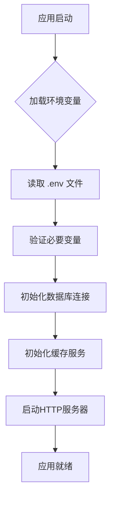
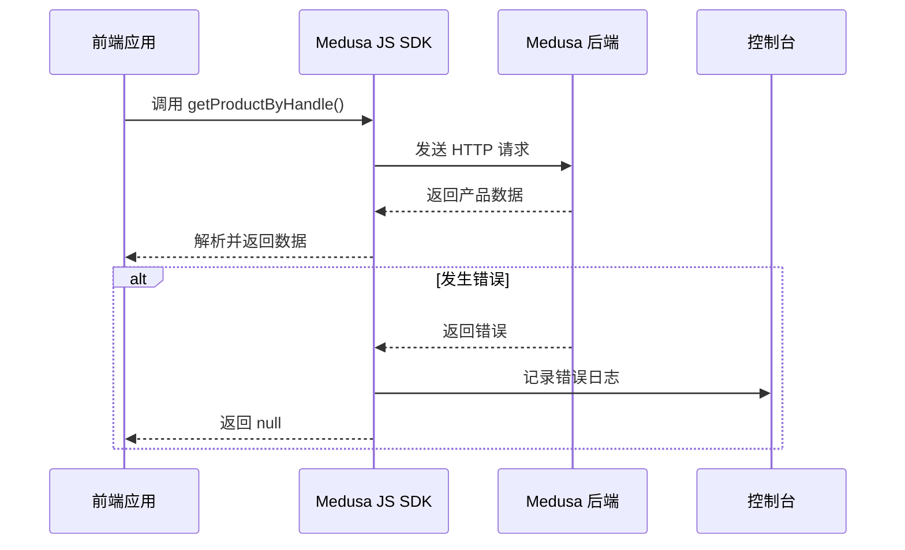

# 最佳实践

<cite>
**本文档中引用的文件**  
- [seed.ts](file://backend/src/scripts/seed.ts)
- [medusa-config.ts](file://backend/medusa-config.ts)
- [.env](file://backend/.env)
- [.env.local](file://storefront/.env.local)
- [medusa.ts](file://storefront/src/lib/medusa.ts)
- [package.json](file://backend/package.json)
- [package.json](file://storefront/package.json)
- [instrumentation.ts](file://backend/instrumentation.ts)
- [layout.tsx](file://storefront/src/app/layout.tsx)
- [LayoutWrapper.tsx](file://storefront/src/components/LayoutWrapper.tsx)
</cite>

## 目录
1. [简介](#简介)
2. [代码组织与模块化](#代码组织与模块化)
3. [种子数据管理](#种子数据管理)
4. [环境变量与安全管理](#环境变量与安全管理)
5. [MedusaJS插件配置](#medusajs插件配置)
6. [前端性能优化](#前端性能优化)
7. [API调用与错误处理](#api调用与错误处理)
8. [日志记录与监控](#日志记录与监控)
9. [电商场景下的合规性](#电商场景下的合规性)
10. [代码审查清单](#代码审查清单)

## 简介
本文档总结了Lumiera项目在开发与维护过程中的最佳实践，涵盖代码组织、性能优化、安全性、可维护性等多个方面。基于项目结构和实现细节，提供前后端模块化组织建议、环境变量安全管理、MedusaJS插件合理配置等指导原则。特别强调电商场景下的隐私保护、支付安全与GDPR合规性要求。

## 代码组织与模块化

Lumiera项目采用清晰的前后端分离架构，后端基于MedusaJS框架构建，前端使用Next.js实现。项目通过功能模块划分提升可维护性。

后端代码组织遵循MedusaJS标准结构，核心逻辑分布在`src/api`、`src/modules`、`src/workflows`等目录中，便于扩展自定义API和业务流程。前端采用Next.js App Router模式，页面按功能组织在`app`目录下，组件集中管理于`components`目录，工具函数和类型定义存放于`lib`目录。

**Section sources**
- [package.json](file://backend/package.json#L2-L50)
- [package.json](file://storefront/package.json#L1-L31)

## 种子数据管理

种子数据脚本`seed.ts`用于初始化系统基础数据，包括商店信息、区域、税区、库存位置、运输选项、产品分类及产品等。该脚本设计具有幂等性，可重复执行而不会产生重复数据。

脚本通过查询现有数据并判断是否存在来决定是否创建新记录，例如在创建销售渠道前会先查询是否已存在同名渠道。这种设计确保了在不同环境（开发、测试、生产）下的一致性和可重复部署能力。

种子数据包含完整的产品体系，分为“Solo Play”、“Couples”、“Wellness”和“Accessories”四大类别，每个产品包含多规格变体和多货币定价，体现了电商系统的复杂性需求。

**Section sources**
- [seed.ts](file://backend/src/scripts/seed.ts#L1-L852)

## 环境变量与安全管理

项目通过`.env`文件管理环境变量，实现配置与代码的分离。后端使用`medusa-config.ts`加载环境变量，前端通过`NEXT_PUBLIC_`前缀的环境变量暴露必要配置。

关键安全配置包括JWT密钥、Cookie密钥、数据库连接字符串和Redis连接等，均从环境变量读取，避免硬编码。前端通过`NEXT_PUBLIC_MEDUSA_PUBLISHABLE_KEY`暴露发布密钥，用于客户端API调用认证。

建议在生产环境中使用密钥管理服务（如AWS KMS、Hashicorp Vault）替代环境变量文件，进一步提升安全性。同时应确保`.env`文件被正确添加到`.gitignore`中，防止敏感信息泄露。

**Diagram sources**
- [medusa-config.ts](file://backend/medusa-config.ts#L1-L21)
- [.env](file://backend/.env#L1-L8)
- [.env.local](file://storefront/.env.local#L1-L11)

**Section sources**
- [medusa-config.ts](file://backend/medusa-config.ts#L1-L21)
- [.env](file://backend/.env#L1-L8)
- [.env.local](file://storefront/.env.local#L1-L11)

## MedusaJS插件配置

项目通过`medusa-config.ts`文件进行核心配置，包括数据库连接、CORS策略、JWT和Cookie密钥等。配置文件使用`defineConfig`函数定义，支持多环境配置。

CORS配置明确指定了允许的前端域名，防止跨站请求伪造攻击。JWT和Cookie密钥提供了默认值，但在生产环境中必须通过环境变量覆盖，确保安全性。

建议根据部署环境动态加载配置，避免在代码中暴露敏感信息。同时可考虑启用OpenTelemetry监控，通过`instrumentation.ts`文件中的注释代码实现系统可观测性。

**Section sources**
- [medusa-config.ts](file://backend/medusa-config.ts#L1-L21)
- [instrumentation.ts](file://backend/instrumentation.ts#L1-L24)

## 前端性能优化

前端采用Next.js框架，充分利用其服务端渲染（SSR）和静态生成（SSG）能力提升首屏加载性能。页面组件按需加载，减少初始包体积。

静态资源如图片采用CDN链接，避免本地存储带来的带宽压力。组件设计遵循单一职责原则，`LayoutWrapper`组件集中管理全局UI元素如导航栏、页脚和搜索弹窗，提高复用性。

建议进一步优化图片加载策略，实现懒加载和响应式图片。同时可考虑使用Next.js的App Router特性实现更精细的路由控制和数据获取优化。

**Section sources**
- [layout.tsx](file://storefront/src/app/layout.tsx#L1-L42)
- [LayoutWrapper.tsx](file://storefront/src/components/LayoutWrapper.tsx#L1-L31)

## API调用与错误处理

前端通过`medusa.ts`文件封装Medusa JS SDK，提供统一的API调用接口。所有API调用均包含错误处理机制，使用try-catch捕获异常并记录错误日志。

SDK初始化时配置了发布密钥和后端URL，支持调试模式。各类数据获取函数（如获取产品、获取购物车）均包含详细的字段选择，避免过度获取数据，提升API响应性能。

建议实现API调用节流机制，防止频繁请求。同时可引入错误边界组件，捕获并优雅处理运行时错误，提升用户体验。

**Diagram sources**
- [medusa.ts](file://storefront/src/lib/medusa.ts#L1-L267)

**Section sources**
- [medusa.ts](file://storefront/src/lib/medusa.ts#L1-L267)

## 日志记录与监控

后端使用Medusa内置的日志系统，在`seed.ts`脚本中通过`container.resolve(ContainerRegistrationKeys.LOGGER)`获取日志实例。日志记录了数据初始化的各个阶段，便于调试和监控。

建议在生产环境中集成集中式日志系统（如ELK Stack、Datadog），实现日志的统一收集、存储和分析。同时可启用`instrumentation.ts`中的OpenTelemetry配置，实现分布式追踪和性能监控。

前端通过`console.error`记录API调用错误，建议替换为更专业的前端监控工具（如Sentry、LogRocket），捕获JavaScript错误、性能问题和用户行为。

**Section sources**
- [seed.ts](file://backend/src/scripts/seed.ts#L59-L852)
- [medusa.ts](file://storefront/src/lib/medusa.ts#L26-L27)

## 电商场景下的合规性

作为亲密健康产品电商平台，Lumiera项目需特别关注隐私保护和合规性要求。系统设计中已包含年龄验证模态框（AgeVerificationModal），确保用户符合购买年龄要求。

日志记录应避免包含个人身份信息（PII），建议对日志中的用户数据进行匿名化处理。支付安全方面，应确保PCI DSS合规，使用安全的支付网关，并对敏感数据进行加密存储。

GDPR合规性要求包括用户数据访问权、删除权和数据可移植性。系统应提供用户数据管理接口，允许用户查看、修改和删除其个人数据。同时需明确隐私政策和条款，在用户注册时获取明确同意。

**Section sources**
- [LayoutWrapper.tsx](file://storefront/src/components/LayoutWrapper.tsx#L1-L31)

## 代码审查清单

- [ ] 确保所有敏感配置通过环境变量管理，无硬编码
- [ ] 验证种子数据脚本的幂等性，避免重复数据
- [ ] 检查API端点的认证和授权机制
- [ ] 确认日志记录不包含敏感个人信息
- [ ] 验证前端错误处理的完整性
- [ ] 检查CORS配置的合理性
- [ ] 确保数据库迁移脚本版本控制
- [ ] 验证支付流程的安全性
- [ ] 检查GDPR合规性要求的实现
- [ ] 确认静态资源优化策略

**Section sources**
- [medusa-config.ts](file://backend/medusa-config.ts#L1-L21)
- [seed.ts](file://backend/src/scripts/seed.ts#L1-L852)
- [medusa.ts](file://storefront/src/lib/medusa.ts#L1-L267)