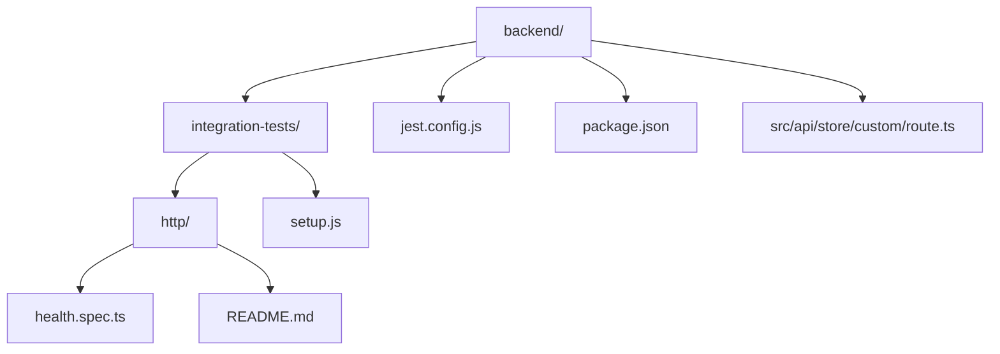
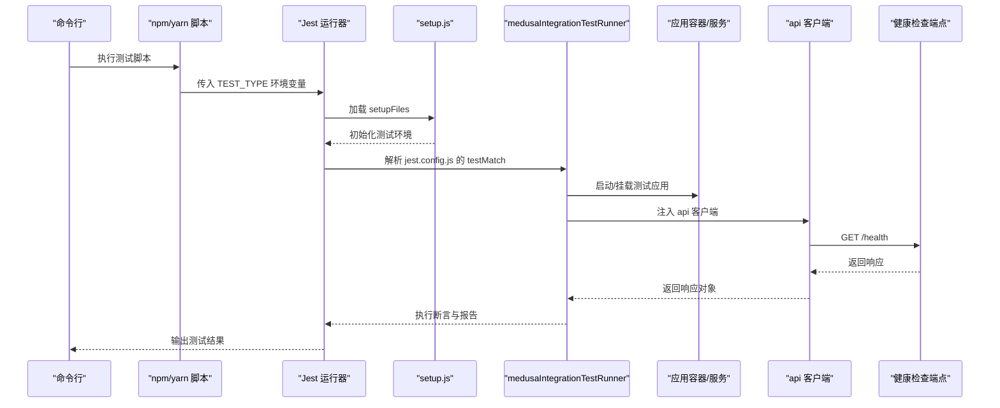
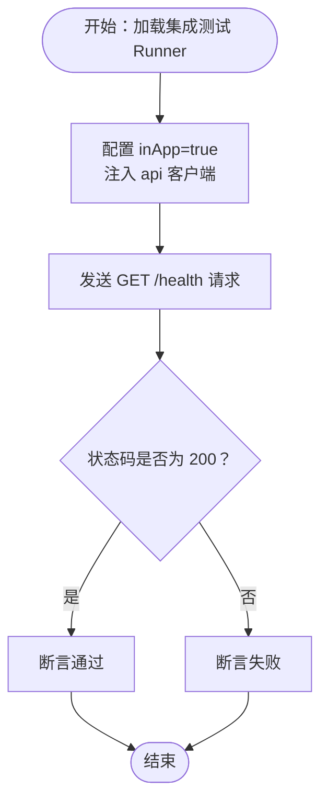
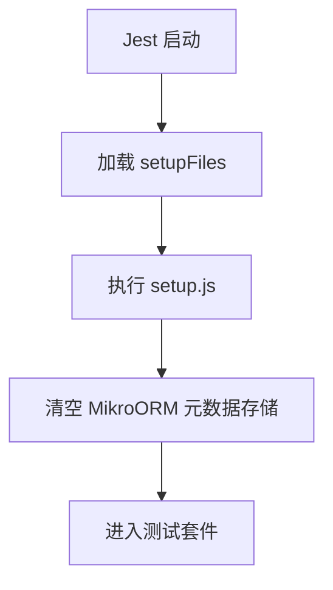
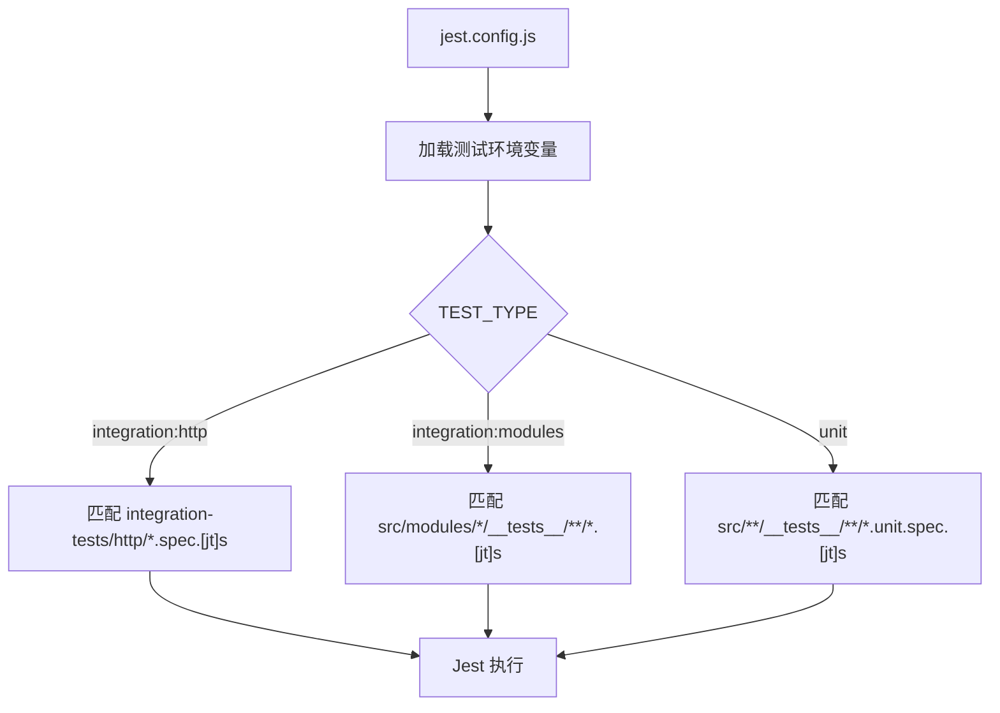
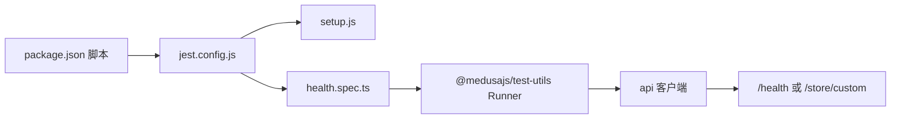

# 测试策略

<cite>
**本文引用的文件**
- [backend/integration-tests/http/health.spec.ts](file://backend/integration-tests/http/health.spec.ts)
- [backend/integration-tests/http/README.md](file://backend/integration-tests/http/README.md)
- [backend/integration-tests/setup.js](file://backend/integration-tests/setup.js)
- [backend/jest.config.js](file://backend/jest.config.js)
- [backend/package.json](file://backend/package.json)
- [backend/src/api/store/custom/route.ts](file://backend/src/api/store/custom/route.ts)
</cite>

## 目录
1. [引言](#引言)
2. [项目结构](#项目结构)
3. [核心组件](#核心组件)
4. [架构总览](#架构总览)
5. [详细组件分析](#详细组件分析)
6. [依赖关系分析](#依赖关系分析)
7. [性能考量](#性能考量)
8. [故障排查指南](#故障排查指南)
9. [结论](#结论)
10. [附录](#附录)

## 引言
本测试策略文档聚焦 Lumiera 后端的集成测试实践，围绕 integration-tests 目录下的 HTTP 健康检查测试（health.spec.ts）的编写规范与断言逻辑进行系统化说明；阐述 setup.js 在测试前的环境准备职责（如数据库连接、服务启动等）；解释 Jest 测试框架的配置（jest.config.js）与运行方式（通过 package.json 的脚本命令 yarn test 的变体）。同时，给出测试覆盖率目标、Mock 策略（如 API 调用模拟）与持续集成中的测试执行流程建议，并对后续扩展单元测试与前端组件测试提出规划建议。

## 项目结构
后端测试相关的关键位置如下：
- 集成测试入口与示例：integration-tests/http/health.spec.ts
- 集成测试工具使用说明：integration-tests/http/README.md
- 测试环境初始化脚本：integration-tests/setup.js
- Jest 配置与匹配规则：jest.config.js
- 测试脚本与运行命令：package.json

图表来源
- [backend/integration-tests/http/health.spec.ts](file://backend/integration-tests/http/health.spec.ts#L1-L15)
- [backend/integration-tests/http/README.md](file://backend/integration-tests/http/README.md#L1-L29)
- [backend/integration-tests/setup.js](file://backend/integration-tests/setup.js#L1-L3)
- [backend/jest.config.js](file://backend/jest.config.js#L1-L28)
- [backend/package.json](file://backend/package.json#L1-L50)
- [backend/src/api/store/custom/route.ts](file://backend/src/api/store/custom/route.ts#L1-L200)

章节来源
- [backend/integration-tests/http/health.spec.ts](file://backend/integration-tests/http/health.spec.ts#L1-L15)
- [backend/integration-tests/http/README.md](file://backend/integration-tests/http/README.md#L1-L29)
- [backend/integration-tests/setup.js](file://backend/integration-tests/setup.js#L1-L3)
- [backend/jest.config.js](file://backend/jest.config.js#L1-L28)
- [backend/package.json](file://backend/package.json#L1-L50)

## 核心组件
- 集成测试 Runner 与断言规范
  - 使用 Medusa 提供的集成测试 Runner 进行 HTTP 接口测试，统一加载测试环境、注入 api 客户端与容器资源，便于对路由与业务工作流进行端到端验证。
  - 断言逻辑以状态码为主，确保健康检查接口返回 200，体现服务可用性与基础链路正确性。
- 测试环境初始化
  - 通过 setup.js 清理 MikroORM 元数据存储，避免测试间相互污染，保证每次集成测试的干净状态。
- Jest 配置与匹配规则
  - 通过 TEST_TYPE 环境变量控制测试类型与匹配模式，分别支持 HTTP 集成测试、模块级集成测试与单元测试。
  - 配置了 TypeScript 转换器、Node 环境、忽略路径与 setupFiles，确保测试运行时的一致性与可重复性。
- 运行方式与脚本
  - package.json 中定义了三种测试脚本，分别对应不同测试类型，均通过 NODE_OPTIONS 与 Jest 参数保证 ES 模块兼容与串行执行。

章节来源
- [backend/integration-tests/http/health.spec.ts](file://backend/integration-tests/http/health.spec.ts#L1-L15)
- [backend/integration-tests/setup.js](file://backend/integration-tests/setup.js#L1-L3)
- [backend/jest.config.js](file://backend/jest.config.js#L1-L28)
- [backend/package.json](file://backend/package.json#L15-L23)

## 架构总览
下图展示了从命令行到测试执行的整体流程，以及集成测试 Runner 如何与应用容器交互，最终通过 api 客户端访问健康检查端点并断言响应。

图表来源
- [backend/package.json](file://backend/package.json#L15-L23)
- [backend/jest.config.js](file://backend/jest.config.js#L1-L28)
- [backend/integration-tests/setup.js](file://backend/integration-tests/setup.js#L1-L3)
- [backend/integration-tests/http/health.spec.ts](file://backend/integration-tests/http/health.spec.ts#L1-L15)

## 详细组件分析

### 组件一：HTTP 健康检查集成测试（health.spec.ts）
- 编写规范
  - 使用集成测试 Runner 包裹测试套件，设置 inApp 为 true，表示在应用上下文中运行测试。
  - 通过 api.get 访问 /health 路径，发起 HTTP 请求。
  - 断言响应状态码为 200，确保服务健康检查端点可用且返回成功。
- 断言逻辑
  - 仅断言状态码，简洁明确，适合健康检查这类基础可用性验证场景。
  - 可根据需要扩展断言内容（如响应体字段），但需与实际路由实现保持一致。
- 示例参考
  - README 中提供了更完整的示例，展示如何断言响应体字段，可作为扩展断言的参考模板。

图表来源
- [backend/integration-tests/http/health.spec.ts](file://backend/integration-tests/http/health.spec.ts#L1-L15)
- [backend/integration-tests/http/README.md](file://backend/integration-tests/http/README.md#L5-L27)

章节来源
- [backend/integration-tests/http/health.spec.ts](file://backend/integration-tests/http/health.spec.ts#L1-L15)
- [backend/integration-tests/http/README.md](file://backend/integration-tests/http/README.md#L1-L29)

### 组件二：测试前环境准备（setup.js）
- 职责说明
  - 在测试运行前清理 MikroORM 的 MetadataStorage，避免跨测试用例的元数据残留，确保 ORM 行为稳定。
  - 作为 setupFiles 被 Jest 在测试套件执行前加载，保证所有集成测试处于一致的初始状态。
- 影响范围
  - 对使用 MikroORM 的模块与实体有直接影响，有助于减少因缓存或元数据导致的测试不稳定。

图表来源
- [backend/jest.config.js](file://backend/jest.config.js#L17-L19)
- [backend/integration-tests/setup.js](file://backend/integration-tests/setup.js#L1-L3)

章节来源
- [backend/integration-tests/setup.js](file://backend/integration-tests/setup.js#L1-L3)
- [backend/jest.config.js](file://backend/jest.config.js#L17-L19)

### 组件三：Jest 测试框架配置（jest.config.js）
- 关键配置项
  - TypeScript 转换器：使用 @swc/jest 并启用装饰器语法，确保 TS/TSX 文件可被正确编译。
  - 测试环境：node，便于在 Node 上运行集成测试。
  - 模块扩展名：支持 js/ts/json。
  - 忽略路径：dist 与 .medusa 目录，避免无关文件参与测试。
  - setupFiles：指向 integration-tests/setup.js，确保测试前环境初始化。
  - 条件匹配：通过 TEST_TYPE 控制 testMatch，分别适配 HTTP 集成测试、模块级集成测试与单元测试。
- 运行参数
  - runInBand：串行执行，降低并发带来的资源竞争与不确定性。
  - forceExit：在测试结束后强制退出，避免进程悬挂。
  - silent：在 unit 测试中默认静默输出，便于 CI 日志整洁。

图表来源
- [backend/jest.config.js](file://backend/jest.config.js#L1-L28)

章节来源
- [backend/jest.config.js](file://backend/jest.config.js#L1-L28)

### 组件四：运行方式与脚本（package.json）
- 脚本定义
  - test:integration:http：设置 TEST_TYPE=integration:http，运行 HTTP 集成测试。
  - test:integration:modules：设置 TEST_TYPE=integration:modules，运行模块级集成测试。
  - test:unit：设置 TEST_TYPE=unit，运行单元测试。
- 运行特性
  - 统一通过 NODE_OPTIONS=--experimental-vm-modules 支持 ES 模块。
  - runInBand 与 forceExit 保障稳定性与可控性。
  - unit 测试默认 silent，便于在 CI 中输出精简日志。

章节来源
- [backend/package.json](file://backend/package.json#L15-L23)

### 组件五：路由与端点（示例：/store/custom）
- 作用说明
  - 该路由文件位于 src/api/store/custom/route.ts，用于演示如何在集成测试中访问自定义端点。
  - 可作为编写更复杂集成测试的参考，例如断言响应体字段、校验业务逻辑等。
- 建议
  - 在编写新测试时，优先参考该路由的实现，确保断言与实际行为一致。

章节来源
- [backend/src/api/store/custom/route.ts](file://backend/src/api/store/custom/route.ts#L1-L200)

## 依赖关系分析
- 组件耦合与协作
  - jest.config.js 通过 setupFiles 与 setup.js 耦合，确保测试前环境初始化。
  - package.json 的脚本通过 TEST_TYPE 与 jest.config.js 的 testMatch 解耦，按类型选择测试集。
  - health.spec.ts 依赖 medusaIntegrationTestRunner 与 api 客户端，形成“测试套件 -> 应用容器 -> HTTP 端点”的调用链。
- 外部依赖
  - @medusajs/test-utils 提供集成测试 Runner。
  - @medusajs/utils 提供环境变量加载能力。
  - @swc/jest 提供 TypeScript 转换支持。
  - jest 作为测试运行器与断言库。

图表来源
- [backend/package.json](file://backend/package.json#L15-L23)
- [backend/jest.config.js](file://backend/jest.config.js#L1-L28)
- [backend/integration-tests/setup.js](file://backend/integration-tests/setup.js#L1-L3)
- [backend/integration-tests/http/health.spec.ts](file://backend/integration-tests/http/health.spec.ts#L1-L15)

章节来源
- [backend/package.json](file://backend/package.json#L15-L23)
- [backend/jest.config.js](file://backend/jest.config.js#L1-L28)

## 性能考量
- 测试执行顺序
  - runInBand 串行执行可避免并发资源争用，但会增加整体耗时。可在本地开发阶段使用，CI 中可根据资源情况评估是否改为并行。
- 转换与编译
  - @swc/jest 的 TypeScript 转换器性能较优，但仍需关注大型测试集的冷启动时间。可通过缓存与增量构建优化。
- 环境初始化
  - setup.js 的清理操作开销较小，但在大量测试用例中仍应避免重复初始化。当前设计已通过单次加载解决此问题。

## 故障排查指南
- 常见问题与定位
  - 端点未返回 200：检查路由实现与中间件链路，确认 /health 是否存在且未被拦截。
  - 环境变量缺失：确认 TEST_TYPE 设置正确，jest.config.js 已根据其设置 testMatch。
  - ORM 相关错误：若出现实体或元数据异常，确认 setup.js 是否被正确加载，必要时手动清理测试数据库或缓存。
- 排查步骤
  - 本地复现：使用对应脚本（如 test:integration:http）单独运行，观察输出。
  - 逐步缩小：先运行最小测试集（health.spec.ts），再逐步添加其他测试用例。
  - 日志与静默：unit 测试默认静默，若需调试可临时移除 silent 参数或在 jest.config.js 中调整。

章节来源
- [backend/jest.config.js](file://backend/jest.config.js#L1-L28)
- [backend/integration-tests/http/health.spec.ts](file://backend/integration-tests/http/health.spec.ts#L1-L15)
- [backend/integration-tests/setup.js](file://backend/integration-tests/setup.js#L1-L3)

## 结论
本测试策略以 Medusa 集成测试 Runner 为核心，结合 jest.config.js 的条件匹配与 package.json 的脚本命令，实现了清晰、可维护的后端集成测试体系。health.spec.ts 展示了健康检查端点的断言范式，setup.js 则确保测试环境的稳定性。建议在现有基础上逐步扩展单元测试与前端组件测试，完善覆盖率目标与 Mock 策略，以支撑更全面的质量保障。

## 附录

### 测试覆盖率目标与 Mock 策略建议
- 覆盖率目标
  - 建议设定语句覆盖率、分支覆盖率与函数覆盖率不低于 80%，关键业务路径不低于 90%。
- Mock 策略
  - API 调用模拟：使用测试框架内置的 mock 功能（如 vi.mock 或 jest.mock），隔离外部依赖，提升测试稳定性与可重复性。
  - 数据层模拟：对数据库访问进行抽象，使用内存数据库或 Mock 实现，避免真实数据库副作用。
  - 第三方服务：对外部服务（如支付、邮件）进行 Mock，确保测试不依赖网络与外部状态。
- 持续集成中的执行流程
  - 建议在 CI 中按顺序执行：单元测试（silent）、模块集成测试、HTTP 集成测试，最后生成覆盖率报告并上传至覆盖率平台。

### 未来扩展：单元测试与前端组件测试规划
- 单元测试
  - 为后端核心模块（如 workflows、jobs、subscribers）补充单元测试，覆盖关键函数与边界条件。
  - 使用 Mock 策略隔离外部依赖，确保测试快速、稳定。
- 前端组件测试
  - 在前端工程中引入组件级测试（如基于 React Testing Library），针对关键交互与渲染逻辑编写测试。
  - 与后端集成测试联动，确保端到端流程的连贯性与一致性。