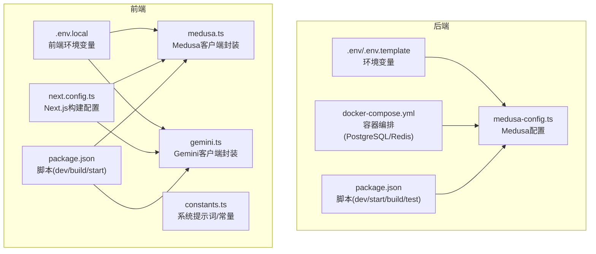
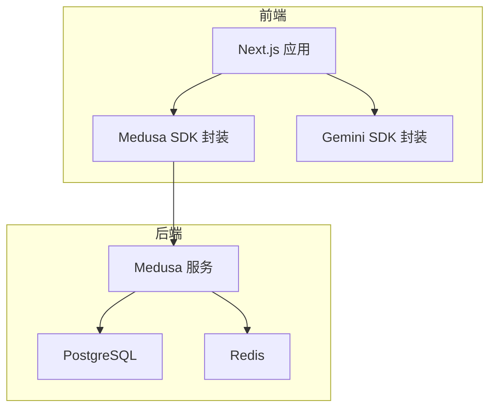
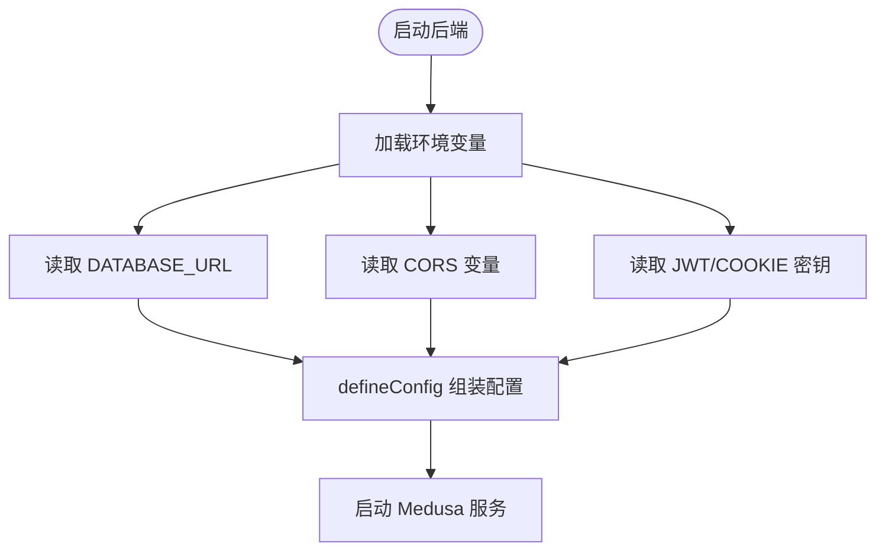
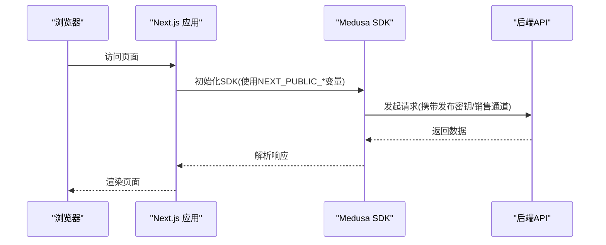
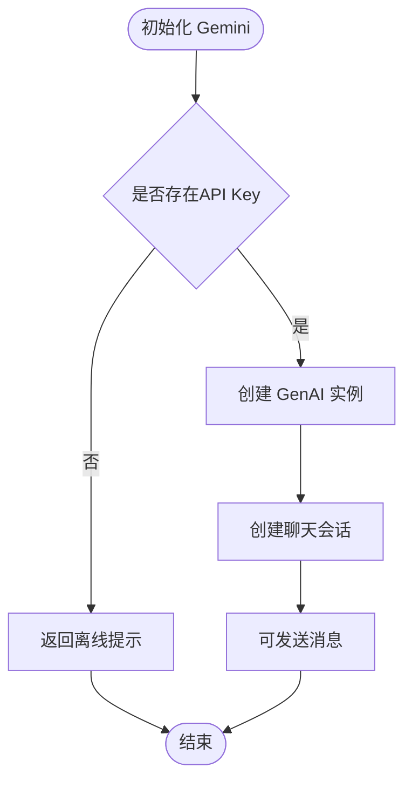
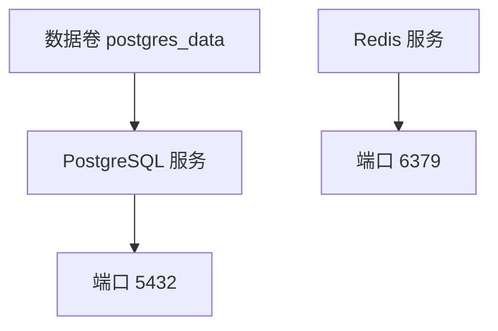
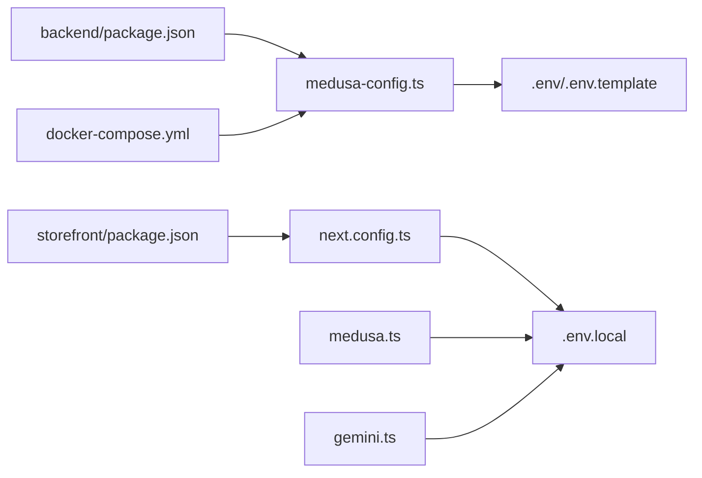

# 环境配置

<cite>
**本文引用的文件**
- [backend/.env.template](file://backend/.env.template)
- [backend/.env](file://backend/.env)
- [backend/docker-compose.yml](file://backend/docker-compose.yml)
- [backend/medusa-config.ts](file://backend/medusa-config.ts)
- [backend/package.json](file://backend/package.json)
- [storefront/.env.local](file://storefront/.env.local)
- [storefront/next.config.ts](file://storefront/next.config.ts)
- [storefront/package.json](file://storefront/package.json)
- [storefront/src/lib/gemini.ts](file://storefront/src/lib/gemini.ts)
- [storefront/src/lib/medusa.ts](file://storefront/src/lib/medusa.ts)
- [storefront/src/lib/constants.ts](file://storefront/src/lib/constants.ts)
- [backend/integration-tests/setup.js](file://backend/integration-tests/setup.js)
</cite>

## 目录
1. [简介](#简介)
2. [项目结构](#项目结构)
3. [核心组件](#核心组件)
4. [架构总览](#架构总览)
5. [详细组件分析](#详细组件分析)
6. [依赖关系分析](#依赖关系分析)
7. [性能考虑](#性能考虑)
8. [故障排查指南](#故障排查指南)
9. [结论](#结论)
10. [附录](#附录)

## 简介
本指南面向Lumiera项目的开发、测试与生产环境配置，聚焦以下方面：
- 后端与前端的关键环境变量及其含义（如数据库连接、API密钥、Gemini AI密钥）
- 后端Medusa插件配置（PostgreSQL、Redis、文件存储等）
- 前端Next.js构建配置（如基础路径、远程图片策略、环境变量注入）
- 配置步骤清单、常见错误排查与敏感信息安全管理

## 项目结构
Lumiera采用前后端分离架构：后端基于Medusa，前端基于Next.js。关键配置文件分布如下：
- 后端
  - 环境模板与示例：backend/.env.template、backend/.env
  - Medusa配置：backend/medusa-config.ts
  - 容器编排：backend/docker-compose.yml
  - 包脚本：backend/package.json
- 前端
  - 环境变量：storefront/.env.local
  - 构建配置：storefront/next.config.ts
  - SDK封装：storefront/src/lib/medusa.ts、storefront/src/lib/gemini.ts
  - 常量与系统提示词：storefront/src/lib/constants.ts
  - 包脚本：storefront/package.json

图表来源
- [backend/.env.template](file://backend/.env.template#L1-L9)
- [backend/.env](file://backend/.env#L1-L8)
- [backend/medusa-config.ts](file://backend/medusa-config.ts#L1-L21)
- [backend/docker-compose.yml](file://backend/docker-compose.yml#L1-L32)
- [backend/package.json](file://backend/package.json#L1-L50)
- [storefront/.env.local](file://storefront/.env.local#L1-L11)
- [storefront/next.config.ts](file://storefront/next.config.ts#L1-L42)
- [storefront/src/lib/medusa.ts](file://storefront/src/lib/medusa.ts#L1-L267)
- [storefront/src/lib/gemini.ts](file://storefront/src/lib/gemini.ts#L1-L56)
- [storefront/src/lib/constants.ts](file://storefront/src/lib/constants.ts#L1-L145)
- [storefront/package.json](file://storefront/package.json#L1-L31)

章节来源
- [backend/.env.template](file://backend/.env.template#L1-L9)
- [backend/.env](file://backend/.env#L1-L8)
- [backend/medusa-config.ts](file://backend/medusa-config.ts#L1-L21)
- [backend/docker-compose.yml](file://backend/docker-compose.yml#L1-L32)
- [backend/package.json](file://backend/package.json#L1-L50)
- [storefront/.env.local](file://storefront/.env.local#L1-L11)
- [storefront/next.config.ts](file://storefront/next.config.ts#L1-L42)
- [storefront/src/lib/medusa.ts](file://storefront/src/lib/medusa.ts#L1-L267)
- [storefront/src/lib/gemini.ts](file://storefront/src/lib/gemini.ts#L1-L56)
- [storefront/src/lib/constants.ts](file://storefront/src/lib/constants.ts#L1-L145)
- [storefront/package.json](file://storefront/package.json#L1-L31)

## 核心组件
- 后端环境变量
  - CORS配置：STORE_CORS、ADMIN_CORS、AUTH_CORS
  - 认证与会话：JWT_SECRET、COOKIE_SECRET
  - 数据库：DATABASE_URL
  - 缓存：REDIS_URL
- 前端环境变量
  - Medusa后端地址与发布密钥：NEXT_PUBLIC_MEDUSA_BACKEND_URL、NEXT_PUBLIC_MEDUSA_PUBLISHABLE_KEY、NEXT_PUBLIC_MEDUSA_SALES_CHANNEL_ID
  - Gemini AI密钥：NEXT_PUBLIC_GEMINI_API_KEY
  - 站点URL：NEXT_PUBLIC_SITE_URL
- Medusa配置
  - 通过defineConfig加载环境变量，配置数据库URL、CORS、JWT/Cookie密钥、Admin后台地址
- Next.js配置
  - 开发时禁用图片优化以避免私有IP阻断；允许远程图片模式；内容安全策略收紧；默认端口为3000

章节来源
- [backend/.env.template](file://backend/.env.template#L1-L9)
- [backend/.env](file://backend/.env#L1-L8)
- [backend/medusa-config.ts](file://backend/medusa-config.ts#L1-L21)
- [storefront/.env.local](file://storefront/.env.local#L1-L11)
- [storefront/next.config.ts](file://storefront/next.config.ts#L1-L42)

## 架构总览
后端Medusa负责业务逻辑与数据持久化，前端Next.js通过Medusa JS SDK调用后端接口；Gemini用于聊天助手功能；PostgreSQL与Redis由Docker Compose提供。

图表来源
- [storefront/src/lib/medusa.ts](file://storefront/src/lib/medusa.ts#L1-L267)
- [storefront/src/lib/gemini.ts](file://storefront/src/lib/gemini.ts#L1-L56)
- [backend/medusa-config.ts](file://backend/medusa-config.ts#L1-L21)
- [backend/docker-compose.yml](file://backend/docker-compose.yml#L1-L32)

## 详细组件分析

### 后端环境变量与Medusa配置
- 关键变量说明
  - STORE_CORS、ADMIN_CORS、AUTH_CORS：分别控制商店端、管理端、认证端的跨域白名单
  - DATABASE_URL：PostgreSQL连接字符串
  - REDIS_URL：Redis连接字符串
  - JWT_SECRET、COOKIE_SECRET：JWT与Cookie签名密钥
- Medusa配置要点
  - 通过loadEnv按环境加载变量
  - databaseUrl来自DATABASE_URL
  - http.storeCors/adminCors/authCors来自对应环境变量
  - jwtSecret/cookieSecret为空时回退到默认值
  - admin.backendUrl来自MEDUSA_BACKEND_URL或默认本地地址

图表来源
- [backend/medusa-config.ts](file://backend/medusa-config.ts#L1-L21)
- [backend/.env.template](file://backend/.env.template#L1-L9)
- [backend/.env](file://backend/.env#L1-L8)

章节来源
- [backend/medusa-config.ts](file://backend/medusa-config.ts#L1-L21)
- [backend/.env.template](file://backend/.env.template#L1-L9)
- [backend/.env](file://backend/.env#L1-L8)

### 前端环境变量与Next.js配置
- 关键变量说明
  - NEXT_PUBLIC_MEDUSA_BACKEND_URL：后端API地址
  - NEXT_PUBLIC_MEDUSA_PUBLISHABLE_KEY：发布密钥（用于SDK鉴权）
  - NEXT_PUBLIC_MEDUSA_SALES_CHANNEL_ID：销售通道ID
  - NEXT_PUBLIC_GEMINI_API_KEY：Gemini AI密钥（前端可见）
  - NEXT_PUBLIC_SITE_URL：站点URL
- Next.js配置要点
  - 开发模式下禁用图片优化，避免私有IP阻断
  - 允许特定远程图片源（含后端本地地址）
  - SVG与内容安全策略收紧
  - 默认端口3000

图表来源
- [storefront/src/lib/medusa.ts](file://storefront/src/lib/medusa.ts#L1-L267)
- [storefront/.env.local](file://storefront/.env.local#L1-L11)
- [storefront/next.config.ts](file://storefront/next.config.ts#L1-L42)

章节来源
- [storefront/.env.local](file://storefront/.env.local#L1-L11)
- [storefront/next.config.ts](file://storefront/next.config.ts#L1-L42)
- [storefront/src/lib/medusa.ts](file://storefront/src/lib/medusa.ts#L1-L267)

### Gemini AI集成
- 前端封装
  - 从NEXT_PUBLIC_GEMINI_API_KEY读取密钥
  - 初始化Google GenAI客户端与聊天会话
  - 提供发送消息与初始化聊天的方法
- 系统提示词
  - constants.ts中定义了品牌风格与行为准则

图表来源
- [storefront/src/lib/gemini.ts](file://storefront/src/lib/gemini.ts#L1-L56)
- [storefront/src/lib/constants.ts](file://storefront/src/lib/constants.ts#L103-L115)
- [storefront/.env.local](file://storefront/.env.local#L6-L8)

章节来源
- [storefront/src/lib/gemini.ts](file://storefront/src/lib/gemini.ts#L1-L56)
- [storefront/src/lib/constants.ts](file://storefront/src/lib/constants.ts#L103-L115)
- [storefront/.env.local](file://storefront/.env.local#L6-L8)

### Docker Compose数据库与缓存
- PostgreSQL
  - 镜像：postgres:16
  - 端口映射：5432
  - 数据卷：postgres_data
  - 健康检查：pg_isready
- Redis
  - 镜像：redis:7-alpine
  - 端口映射：6379
  - 健康检查：redis-cli ping

图表来源
- [backend/docker-compose.yml](file://backend/docker-compose.yml#L1-L32)

章节来源
- [backend/docker-compose.yml](file://backend/docker-compose.yml#L1-L32)

## 依赖关系分析
- 后端
  - package.json中的脚本定义了开发、构建、启动与测试流程
  - medusa-config.ts依赖环境变量进行运行时配置
  - docker-compose.yml提供数据库与缓存服务
- 前端
  - next.config.ts影响图片优化与远程图片策略
  - medusa.ts与gemini.ts依赖NEXT_PUBLIC_*变量
  - package.json中的脚本定义了开发、构建、启动流程

图表来源
- [backend/package.json](file://backend/package.json#L1-L50)
- [backend/medusa-config.ts](file://backend/medusa-config.ts#L1-L21)
- [backend/.env.template](file://backend/.env.template#L1-L9)
- [backend/docker-compose.yml](file://backend/docker-compose.yml#L1-L32)
- [storefront/package.json](file://storefront/package.json#L1-L31)
- [storefront/next.config.ts](file://storefront/next.config.ts#L1-L42)
- [storefront/src/lib/medusa.ts](file://storefront/src/lib/medusa.ts#L1-L267)
- [storefront/src/lib/gemini.ts](file://storefront/src/lib/gemini.ts#L1-L56)
- [storefront/.env.local](file://storefront/.env.local#L1-L11)

章节来源
- [backend/package.json](file://backend/package.json#L1-L50)
- [backend/medusa-config.ts](file://backend/medusa-config.ts#L1-L21)
- [backend/.env.template](file://backend/.env.template#L1-L9)
- [backend/docker-compose.yml](file://backend/docker-compose.yml#L1-L32)
- [storefront/package.json](file://storefront/package.json#L1-L31)
- [storefront/next.config.ts](file://storefront/next.config.ts#L1-L42)
- [storefront/src/lib/medusa.ts](file://storefront/src/lib/medusa.ts#L1-L267)
- [storefront/src/lib/gemini.ts](file://storefront/src/lib/gemini.ts#L1-L56)
- [storefront/.env.local](file://storefront/.env.local#L1-L11)

## 性能考虑
- 图片优化
  - 开发模式禁用图片优化，减少SSRF防护带来的私有IP阻断风险
  - 生产模式建议开启图片优化并配置合适的remotePatterns
- 内容安全策略
  - 严格限制脚本执行与沙箱，降低XSS风险
- 缓存与数据库
  - 使用Redis作为缓存层，提升查询与会话性能
  - PostgreSQL连接池与索引优化对高并发场景至关重要

## 故障排查指南
- 密钥缺失
  - 症状：Gemini聊天不可用、Medusa SDK无法鉴权
  - 排查：确认NEXT_PUBLIC_GEMINI_API_KEY与NEXT_PUBLIC_MEDUSA_PUBLISHABLE_KEY已正确设置
  - 参考
    - [storefront/src/lib/gemini.ts](file://storefront/src/lib/gemini.ts#L1-L56)
    - [storefront/src/lib/medusa.ts](file://storefront/src/lib/medusa.ts#L1-L267)
    - [storefront/.env.local](file://storefront/.env.local#L1-L11)
- 端口冲突
  - 症状：前端或后端启动失败
  - 排查：确认3000（前端）、9000（后端）、5432（PostgreSQL）、6379（Redis）未被占用
  - 参考
    - [storefront/next.config.ts](file://storefront/next.config.ts#L1-L42)
    - [backend/docker-compose.yml](file://backend/docker-compose.yml#L1-L32)
- 数据库连接失败
  - 症状：后端启动报错或迁移失败
  - 排查：确认DATABASE_URL格式正确，PostgreSQL服务健康，且与docker-compose中的数据库名一致
  - 参考
    - [backend/.env](file://backend/.env#L1-L8)
    - [backend/docker-compose.yml](file://backend/docker-compose.yml#L1-L32)
- CORS错误
  - 症状：前端跨域请求被拒绝
  - 排查：核对STORE_CORS、ADMIN_CORS、AUTH_CORS包含当前前端与后端地址
  - 参考
    - [backend/.env.template](file://backend/.env.template#L1-L9)
    - [backend/.env](file://backend/.env#L1-L8)
- 测试环境问题
  - 症状：集成测试失败
  - 排查：确保测试前清理ORM元数据存储
  - 参考
    - [backend/integration-tests/setup.js](file://backend/integration-tests/setup.js#L1-L3)

章节来源
- [storefront/src/lib/gemini.ts](file://storefront/src/lib/gemini.ts#L1-L56)
- [storefront/src/lib/medusa.ts](file://storefront/src/lib/medusa.ts#L1-L267)
- [storefront/.env.local](file://storefront/.env.local#L1-L11)
- [storefront/next.config.ts](file://storefront/next.config.ts#L1-L42)
- [backend/.env](file://backend/.env#L1-L8)
- [backend/.env.template](file://backend/.env.template#L1-L9)
- [backend/docker-compose.yml](file://backend/docker-compose.yml#L1-L32)
- [backend/integration-tests/setup.js](file://backend/integration-tests/setup.js#L1-L3)

## 结论
通过明确的环境变量分层与Medusa/Next.js配置，Lumiera实现了清晰的开发、测试与生产环境边界。建议在团队内统一环境变量命名规范，完善CI/CD中的密钥注入流程，并定期轮换JWT与Cookie密钥以提升安全性。

## 附录

### 配置步骤清单
- 后端
  1) 复制并编辑后端环境文件：backend/.env.template -> backend/.env
  2) 在backend/.env中填写DATABASE_URL、REDIS_URL、JWT_SECRET、COOKIE_SECRET
  3) 启动数据库与缓存容器：docker compose up -d
  4) 启动后端服务：yarn dev 或 yarn start
- 前端
  1) 编辑前端环境文件：storefront/.env.local
  2) 填写NEXT_PUBLIC_MEDUSA_BACKEND_URL、NEXT_PUBLIC_MEDUSA_PUBLISHABLE_KEY、NEXT_PUBLIC_MEDUSA_SALES_CHANNEL_ID、NEXT_PUBLIC_GEMINI_API_KEY、NEXT_PUBLIC_SITE_URL
  3) 启动前端服务：yarn dev
- 集成测试
  1) 准备测试环境：确保数据库与缓存可用
  2) 运行测试脚本：yarn test:integration:http 或 yarn test:integration:modules

章节来源
- [backend/.env.template](file://backend/.env.template#L1-L9)
- [backend/.env](file://backend/.env#L1-L8)
- [backend/docker-compose.yml](file://backend/docker-compose.yml#L1-L32)
- [backend/package.json](file://backend/package.json#L1-L50)
- [storefront/.env.local](file://storefront/.env.local#L1-L11)
- [storefront/package.json](file://storefront/package.json#L1-L31)

### 敏感信息安全管理实践
- 不将真实密钥提交至版本库，使用环境变量与CI/CD机密管理
- 定期轮换JWT_SECRET、COOKIE_SECRET与第三方API密钥
- 限制CORS白名单范围，仅开放必要域名
- 生产环境启用HTTPS与严格的Content-Security-Policy
- 对数据库与缓存访问进行网络隔离与最小权限授权