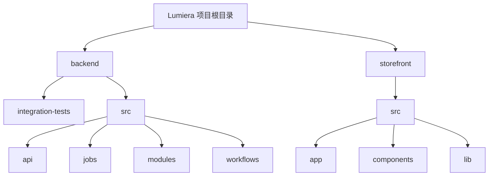
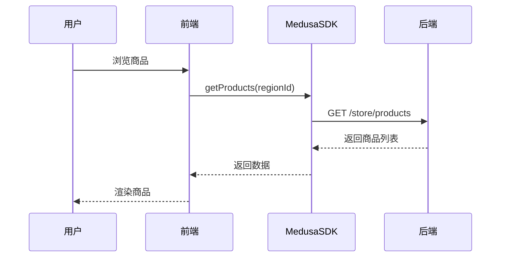
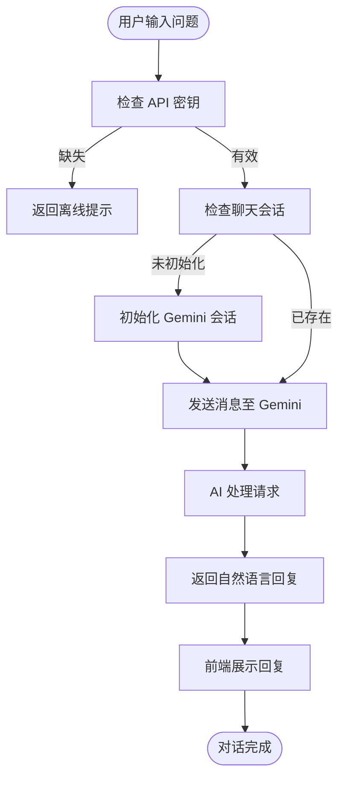
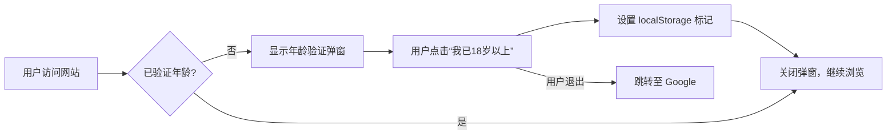

# 系统概述

<cite>
**本文档引用文件**  
- [lumiera-backend/package.json](file://backend/package.json)
- [lumiera-backend/medusa-config.ts](file://backend/medusa-config.ts)
- [lumiera-storefront/package.json](file://storefront/package.json)
- [lumiera-storefront/src/lib/medusa.ts](file://storefront/src/lib/medusa.ts)
- [lumiera-storefront/src/lib/gemini.ts](file://storefront/src/lib/gemini.ts)
- [lumiera-storefront/src/lib/constants.ts](file://storefront/src/lib/constants.ts)
- [lumiera-storefront/src/app/layout.tsx](file://storefront/src/app/layout.tsx)
- [lumiera-storefront/src/components/LayoutWrapper.tsx](file://storefront/src/components/LayoutWrapper.tsx)
- [lumiera-storefront/src/components/AgeVerificationModal.tsx](file://storefront/src/components/AgeVerificationModal.tsx)
- [lumiera-storefront/src/components/ChatWidget.tsx](file://storefront/src/components/ChatWidget.tsx)
- [lumiera-storefront/src/app/shop/page.tsx](file://storefront/src/app/shop/page.tsx)
</cite>

## 目录
1. [简介](#简介)
2. [项目结构](#项目结构)
3. [核心组件](#核心组件)
4. [架构概览](#架构概览)
5. [详细组件分析](#详细组件分析)
6. [依赖分析](#依赖分析)
7. [性能考虑](#性能考虑)
8. [故障排除指南](#故障排除指南)
9. [结论](#结论)

## 简介
Lumiera 是一个高端亲密健康产品电商平台，采用前后端分离的全栈架构设计。系统旨在为用户提供安全、私密且高品质的购物体验，支持多货币（GBP/EUR/USD）、隐私配送、年龄验证和AI智能推荐等关键特性。前端基于 Next.js 16 构建，后端采用 MedusaJS 2.12.4 框架，通过 Medusa SDK 实现前后端通信，并集成 Google Gemini AI 提供智能客户服务。本系统专为初学者提供高层次的系统上下文图，同时为高级开发者深入解析模块化架构与工作流驱动机制。

## 项目结构
Lumiera 项目由两个主要子目录构成：`backend` 和 `storefront`，分别代表后端服务和前端应用。这种清晰的分离支持独立开发、部署和扩展。



**图示来源**  
- [backend](file://backend)
- [storefront](file://storefront)

**本节来源**  
- [backend](file://backend)
- [storefront](file://storefront)

## 核心组件
Lumiera 的核心功能围绕商品浏览、购物车管理、用户认证、AI推荐和年龄验证展开。前端通过 Medusa SDK 与后端交互，获取商品信息、管理购物车并处理订单。后端基于 MedusaJS 提供标准化的电商能力，包括产品管理、区域与货币支持、订单处理等。AI 客服模块通过 Google Gemini 实现自然语言交互，提升用户体验。

**本节来源**  
- [storefront/src/lib/medusa.ts](file://storefront/src/lib/medusa.ts)
- [storefront/src/lib/gemini.ts](file://storefront/src/lib/gemini.ts)
- [storefront/src/components/AgeVerificationModal.tsx](file://storefront/src/components/AgeVerificationModal.tsx)

## 架构概览
Lumiera 采用前后端分离架构，前端使用 Next.js 16 提供 SSR 和静态生成能力，确保 SEO 友好和快速加载。后端使用 MedusaJS 2.12.4，一个模块化的头端电商框架，支持插件扩展和微服务集成。前后端通过 Medusa JavaScript SDK 进行通信，利用发布密钥进行安全访问。系统集成 Google Gemini AI，通过 API 调用实现智能对话功能。

```mermaid
graph LR
subgraph Frontend[前端 - Next.js 16]
A[用户界面] --> B[Medusa SDK]
B --> C[Gemini AI 集成]
C --> D[AI 客服小部件]
A --> E[年龄验证模态框]
end
subgraph Backend[后端 - MedusaJS 2.12.4]
F[API 接口]
G[产品管理]
H[区域与货币]
I[订单系统]
J[工作流引擎]
end
B < --> F
C --> |API 调用| K[Google Gemini]
```

**图示来源**  
- [storefront/src/lib/medusa.ts](file://storefront/src/lib/medusa.ts)
- [storefront/src/lib/gemini.ts](file://storefront/src/lib/gemini.ts)
- [backend/package.json](file://backend/package.json)

## 详细组件分析

### 前后端通信机制分析
Lumiera 前后端通过 Medusa JS SDK 实现高效通信。前端初始化 SDK 实例，配置后端基础 URL 和发布密钥，随后通过 SDK 提供的方法访问商品、区域、购物车等资源。所有请求自动携带认证信息，确保安全性。



**图示来源**  
- [storefront/src/lib/medusa.ts](file://storefront/src/lib/medusa.ts)
- [backend/src/api](file://backend/src/api)

**本节来源**  
- [storefront/src/lib/medusa.ts](file://storefront/src/lib/medusa.ts)

### AI 智能推荐系统分析
Lumiera 集成 Google Gemini AI 作为智能客服“Lumi”，提供产品推荐和咨询服务。系统通过 `@google/genai` SDK 初始化聊天会话，设置品牌专属的系统指令，确保回复符合品牌价值观。用户消息通过 `sendMessageToGemini` 函数发送，AI 返回个性化建议。



**图示来源**  
- [storefront/src/lib/gemini.ts](file://storefront/src/lib/gemini.ts)
- [storefront/src/lib/constants.ts](file://storefront/src/lib/constants.ts)

**本节来源**  
- [storefront/src/lib/gemini.ts](file://storefront/src/lib/gemini.ts)

### 年龄验证与隐私保护机制
为确保合规性，Lumiera 在用户首次访问时弹出年龄验证模态框。验证状态通过 `localStorage` 持久化存储，避免重复提示。系统设计强调隐私，所有用户数据加密存储，配送信息匿名化处理。



**图示来源**  
- [storefront/src/components/AgeVerificationModal.tsx](file://storefront/src/components/AgeVerificationModal.tsx)

**本节来源**  
- [storefront/src/components/AgeVerificationModal.tsx](file://storefront/src/components/AgeVerificationModal.tsx)

## 依赖分析
Lumiera 的依赖关系清晰分层，前端与后端各自维护独立的依赖树。后端基于 MedusaJS 框架，依赖其核心模块和 CLI 工具。前端依赖 Next.js 生态及 Medusa JS SDK，同时集成 Google Gemini AI 客户端库。

```mermaid
graph TD
A[@medusajs/medusa] --> B[MedusaJS 核心]
C[@medusajs/js-sdk] --> D[Medusa 前端 SDK]
E[@google/genai] --> F[Gemini AI 客户端]
G[next] --> H[Next.js 16]
D --> |通信| B
F --> |API 调用| I[Google Cloud]
```

**图示来源**  
- [backend/package.json](file://backend/package.json)
- [storefront/package.json](file://storefront/package.json)

**本节来源**  
- [backend/package.json](file://backend/package.json)
- [storefront/package.json](file://storefront/package.json)

## 性能考虑
Lumiera 通过 Next.js 的静态生成和服务器端渲染优化页面加载速度。商品列表页面设置 `revalidate=60` 实现增量静态再生，平衡性能与数据新鲜度。Medusa SDK 的缓存机制减少重复 API 调用，Gemini AI 的流式响应提升交互流畅性。

## 故障排除指南
常见问题包括 Medusa 后端未启动导致商品无法加载、Gemini API 密钥缺失导致 AI 客服离线、以及本地存储异常导致年龄验证循环弹出。解决方案包括检查后端服务状态、配置正确的环境变量、清除浏览器本地存储等。

**本节来源**  
- [storefront/src/lib/medusa.ts](file://storefront/src/lib/medusa.ts)
- [storefront/src/lib/gemini.ts](file://storefront/src/lib/gemini.ts)
- [storefront/src/components/AgeVerificationModal.tsx](file://storefront/src/components/AgeVerificationModal.tsx)

## 结论
Lumiera 系统通过现代化的全栈架构，成功构建了一个安全、智能且用户友好的高端亲密健康电商平台。其技术选型合理，前后端职责分明，AI 集成提升了服务体验，年龄验证机制确保了合规性。系统具备良好的可扩展性和维护性，为未来功能迭代奠定了坚实基础。