# API集成与数据通信层

<cite>
**本文档引用的文件**   
- [medusa.ts](file://storefront/src/lib/medusa.ts)
- [gemini.ts](file://storefront/src/lib/gemini.ts)
- [types.ts](file://storefront/src/lib/types.ts)
- [constants.ts](file://storefront/src/lib/constants.ts)
- [page.tsx](file://storefront/src/app/page.tsx)
- [ProductCard.tsx](file://storefront/src/components/ProductCard.tsx)
- [cart/page.tsx](file://storefront/src/app/cart/page.tsx)
- [providers.tsx](file://storefront/src/lib/providers.tsx)
- [ChatWidget.tsx](file://storefront/src/components/ChatWidget.tsx)
</cite>

## 目录
1. [项目结构](#项目结构)
2. [Medusa JS SDK集成](#medusa-js-sdk集成)
3. [Google AI服务集成](#google-ai服务集成)
4. [类型定义与常量管理](#类型定义与常量管理)
5. [服务端组件数据获取](#服务端组件数据获取)
6. [SDK封装与解耦策略](#sdk封装与解耦策略)

## 项目结构

Lumiera项目采用典型的前后端分离架构，前端位于`storefront`目录，后端位于`backend`目录。前端使用Next.js框架构建，主要关注点在于`storefront/src/lib`目录下的API集成层，该层负责与后端服务进行数据通信。

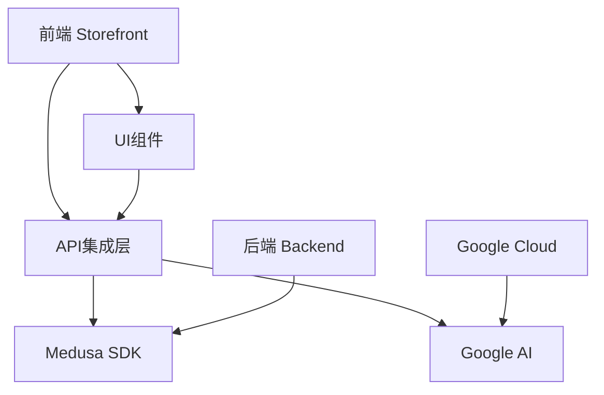

**图示来源**
- [medusa.ts](file://storefront/src/lib/medusa.ts)
- [gemini.ts](file://storefront/src/lib/gemini.ts)

**本节来源**
- [medusa.ts](file://storefront/src/lib/medusa.ts)
- [gemini.ts](file://storefront/src/lib/gemini.ts)

## Medusa JS SDK集成

### 初始化配置与环境变量注入

Medusa SDK的初始化在`medusa.ts`文件中完成，通过环境变量注入后端URL和发布密钥，确保了配置的灵活性和安全性。

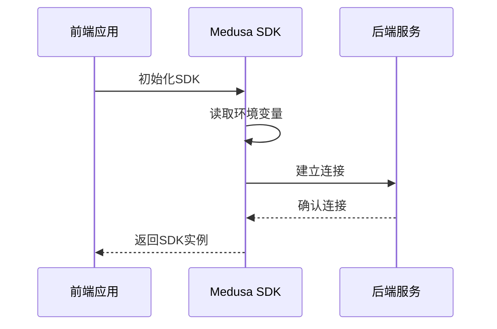

**图示来源**
- [medusa.ts](file://storefront/src/lib/medusa.ts#L4-L12)

**本节来源**
- [medusa.ts](file://storefront/src/lib/medusa.ts#L1-L267)

### 核心API封装函数

`medusa.ts`文件封装了多个核心API函数，包括产品获取、购物车操作和用户认证等，每个函数都包含了完善的错误处理机制。

#### 产品相关API

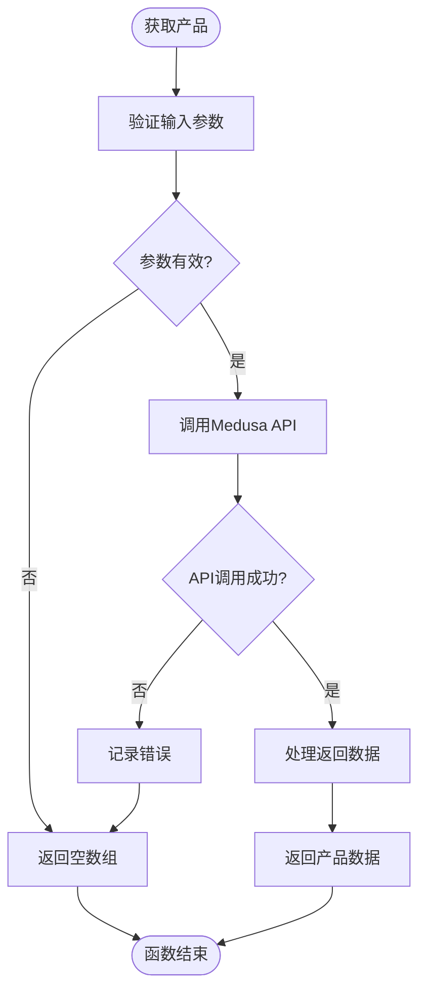

**图示来源**
- [medusa.ts](file://storefront/src/lib/medusa.ts#L31-L43)

#### 购物车操作API

购物车操作API包括创建购物车、获取购物车、添加商品到购物车、更新购物车商品和从购物车移除商品。这些函数通过`CART_FIELDS`常量确保获取到足够的商品信息。

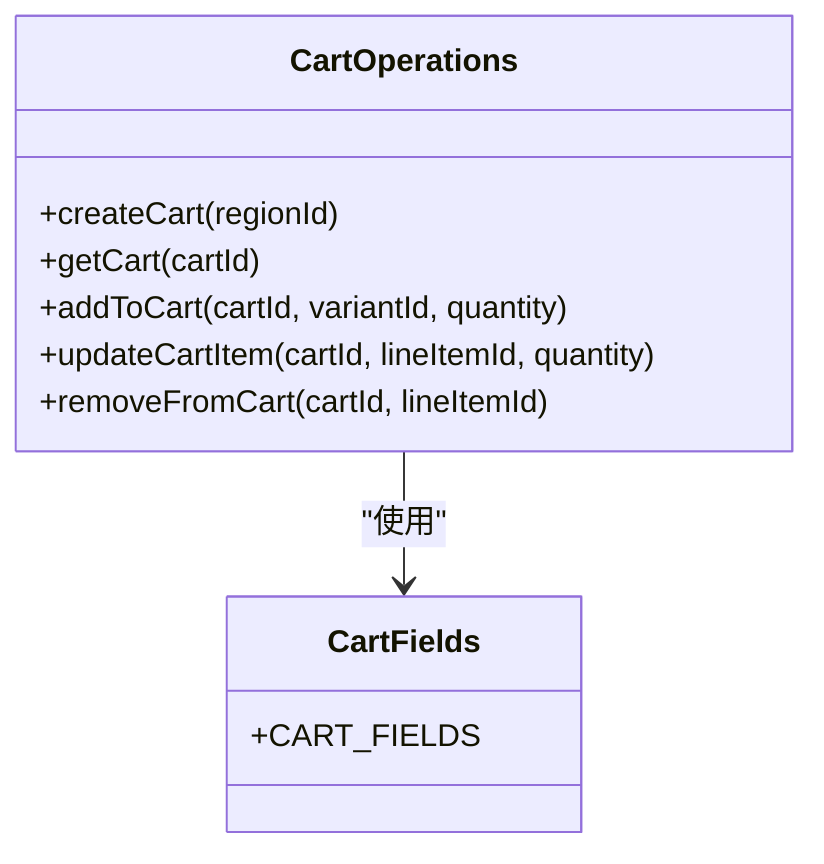

**图示来源**
- [medusa.ts](file://storefront/src/lib/medusa.ts#L125-L193)

## Google AI服务集成

### Gemini服务初始化

Gemini服务的集成在`gemini.ts`文件中实现，通过单例模式确保AI实例的唯一性，并在初始化时设置系统指令。

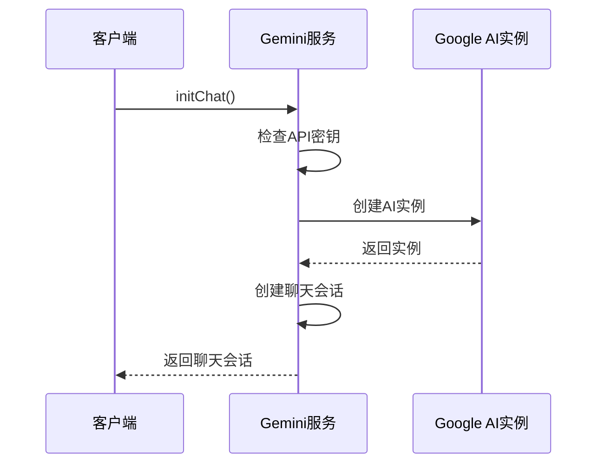

**图示来源**
- [gemini.ts](file://storefront/src/lib/gemini.ts#L18-L29)

### 智能推荐应用场景

Gemini服务在Lumiera中主要用于智能推荐场景，通过`ChatWidget`组件为用户提供个性化的购物建议和产品推荐。

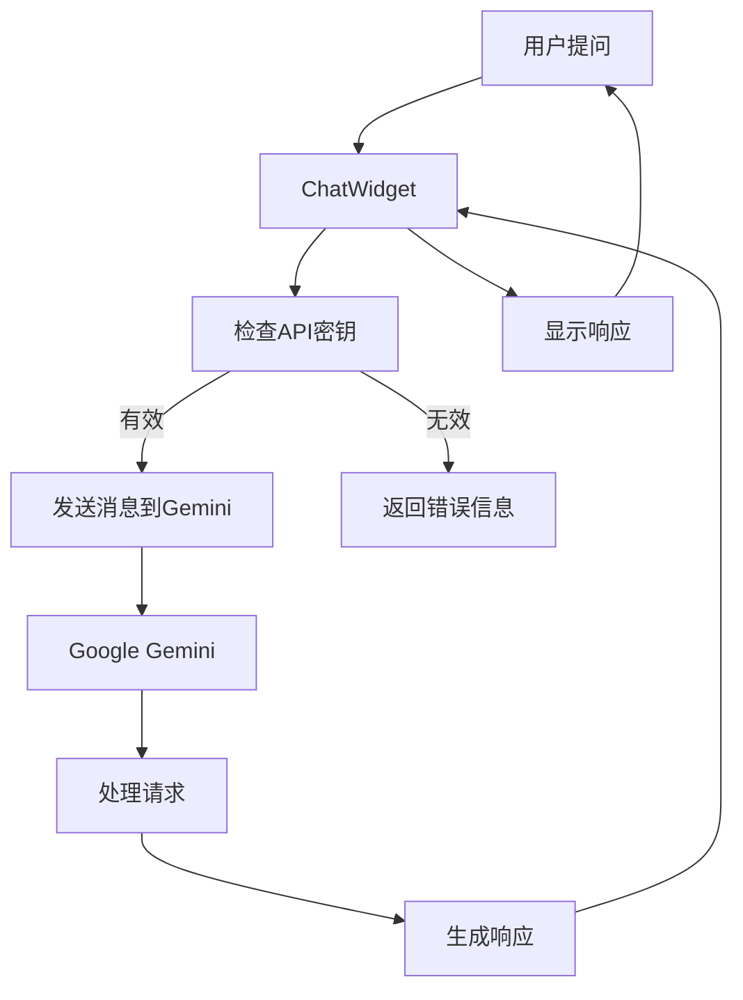

**图示来源**
- [gemini.ts](file://storefront/src/lib/gemini.ts#L31-L55)
- [ChatWidget.tsx](file://storefront/src/components/ChatWidget.tsx#L29-L50)

**本节来源**
- [gemini.ts](file://storefront/src/lib/gemini.ts#L1-L56)
- [ChatWidget.tsx](file://storefront/src/components/ChatWidget.tsx#L1-L153)

## 类型定义与常量管理

### 共享类型定义

`types.ts`文件通过重新导出Medusa类型并定义应用特定类型，实现了前后端之间的类型安全。

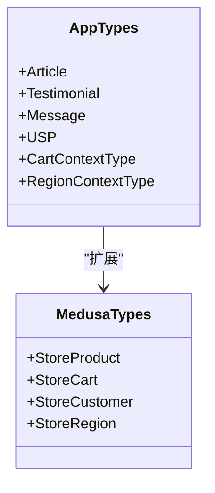

**图示来源**
- [types.ts](file://storefront/src/lib/types.ts#L1-L58)

### 静态数据组织

`constants.ts`文件集中管理了应用中的静态数据，包括公司信息、文章列表、用户评价和导航链接等。

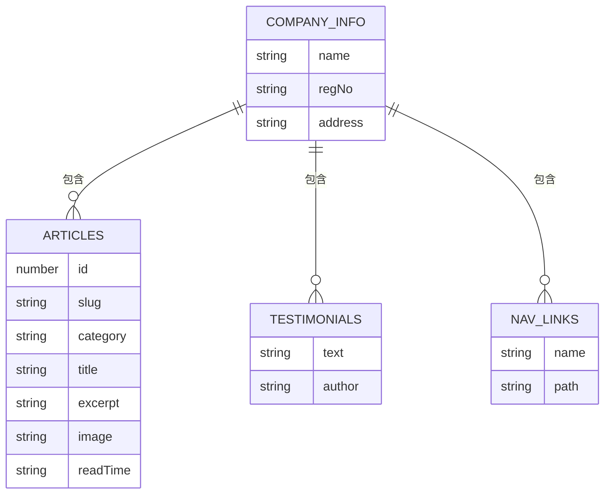

**图示来源**
- [constants.ts](file://storefront/src/lib/constants.ts#L1-L145)

**本节来源**
- [types.ts](file://storefront/src/lib/types.ts#L1-L58)
- [constants.ts](file://storefront/src/lib/constants.ts#L1-L145)

## 服务端组件数据获取

### 首页数据获取

首页通过服务端组件获取特色产品、地区信息和产品集合等数据，实现了静态生成和增量静态再生。

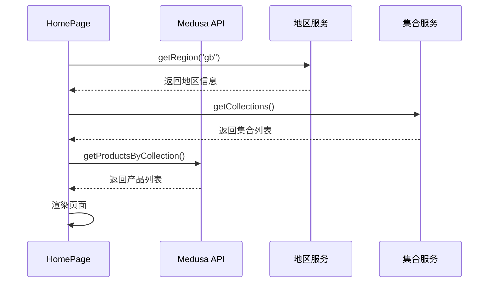

**图示来源**
- [page.tsx](file://storefront/src/app/page.tsx#L11-L29)

### 购物车页面数据获取

购物车页面使用客户端组件，通过上下文提供者模式管理购物车状态，实现了实时数据更新。

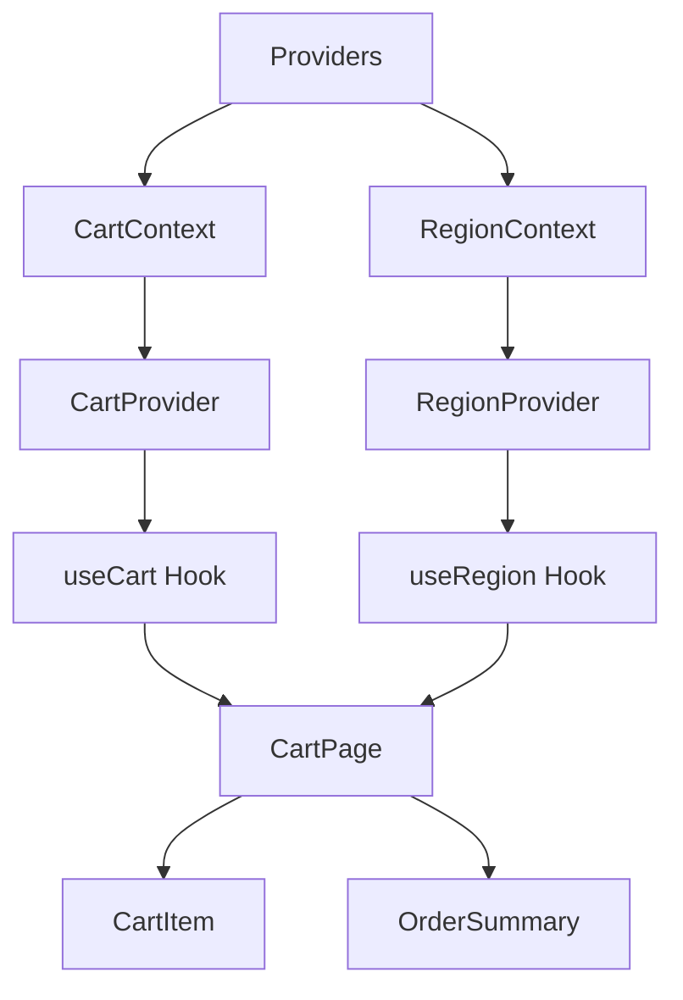

**图示来源**
- [providers.tsx](file://storefront/src/lib/providers.tsx#L21-L25)
- [cart/page.tsx](file://storefront/src/app/cart/page.tsx#L407-L513)

**本节来源**
- [page.tsx](file://storefront/src/app/page.tsx#L1-L240)
- [cart/page.tsx](file://storefront/src/app/cart/page.tsx#L1-L513)
- [providers.tsx](file://storefront/src/lib/providers.tsx#L1-L181)

## SDK封装与解耦策略

### 封装原则

Lumiera通过SDK封装实现了业务逻辑与API细节的解耦，主要体现在以下几个方面：

1. **统一错误处理**：所有API调用都包含try-catch块，确保错误被妥善处理。
2. **默认值设置**：为可选参数提供合理的默认值，降低调用复杂度。
3. **数据预处理**：在返回数据前进行必要的格式化和处理。
4. **类型安全**：通过TypeScript确保数据类型的正确性。

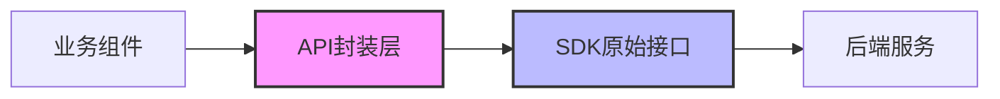

**图示来源**
- [medusa.ts](file://storefront/src/lib/medusa.ts)
- [gemini.ts](file://storefront/src/lib/gemini.ts)

### 解耦优势

SDK封装带来的主要优势包括：

- **维护性提升**：API变更只需修改封装层，不影响业务组件。
- **测试友好**：可以轻松地对封装函数进行单元测试。
- **复用性增强**：封装的函数可以在多个组件中复用。
- **错误隔离**：API错误被限制在封装层内，不会影响整个应用。

**本节来源**
- [medusa.ts](file://storefront/src/lib/medusa.ts#L1-L267)
- [gemini.ts](file://storefront/src/lib/gemini.ts#L1-L56)
- [types.ts](file://storefront/src/lib/types.ts#L1-L58)