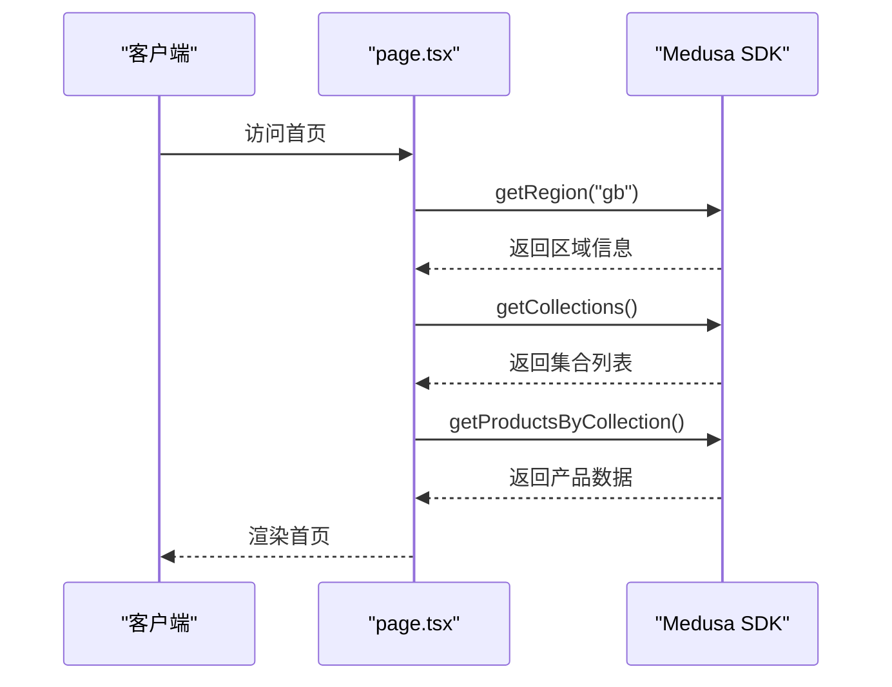
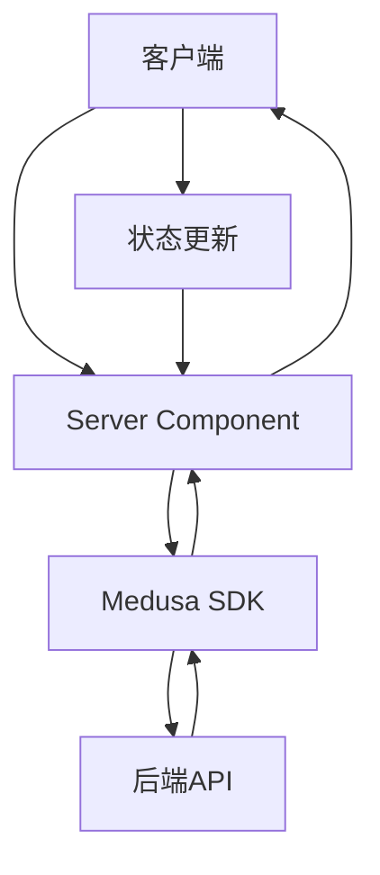

# 前端目录结构详解

<cite>
**本文档引用文件**  
- [layout.tsx](file://storefront/src/app/layout.tsx)
- [page.tsx](file://storefront/src/app/page.tsx)
- [medusa.ts](file://storefront/src/lib/medusa.ts)
- [gemini.ts](file://storefront/src/lib/gemini.ts)
- [types.ts](file://storefront/src/lib/types.ts)
- [constants.ts](file://storefront/src/lib/constants.ts)
- [providers.tsx](file://storefront/src/lib/providers.tsx)
- [next.config.ts](file://storefront/next.config.ts)
- [ProductCard.tsx](file://storefront/src/components/ProductCard.tsx)
- [Navbar.tsx](file://storefront/src/components/Navbar.tsx)
- [Footer.tsx](file://storefront/src/components/Footer.tsx)
- [index.ts](file://storefront/src/components/index.ts)
- [journal/[slug]/page.tsx](file://storefront/src/app/journal/[slug]/page.tsx)
- [shop/page.tsx](file://storefront/src/app/shop/page.tsx)
</cite>

## 目录

1. [项目结构概览](#项目结构概览)
2. [Next.js App Router路由机制](#nextjs-app-router路由机制)
3. [核心页面与布局](#核心页面与布局)
4. [UI组件设计与复用](#ui组件设计与复用)
5. [核心工具库分析](#核心工具库分析)
6. [Next.js配置解析](#nextjs配置解析)
7. [数据获取与前后端通信](#数据获取与前后端通信)

## 项目结构概览

Lumiera前端应用采用Next.js框架，其核心目录结构遵循现代React应用的最佳实践。`storefront`目录作为前端应用的根目录，包含`src`源码目录和配置文件。

`src`目录下主要分为三个核心部分：
- `app`：基于Next.js App Router的路由和页面系统
- `components`：可复用的UI组件库
- `lib`：核心工具函数、SDK封装和共享类型

这种分层结构实现了关注点分离，提高了代码的可维护性和可扩展性。

## Next.js App Router路由机制

Lumiera应用采用Next.js 13+的App Router架构，通过文件系统实现路由映射。在`src/app`目录中，每个子目录或文件都对应一个路由路径。

### 动态路由实现

动态路由通过方括号语法`[param]`实现。例如，在`src/app/journal/[slug]/page.tsx`中，`[slug]`表示一个动态参数，允许通过不同的slug值访问不同的文章页面。

```mermaid
graph TD
A[src/app/journal/[slug]/page.tsx] --> B[/journal/article-1]
A --> C[/journal/how-to-choose]
A --> D[/journal/destigmatizing-pleasure]
```

**Diagram sources**
- [journal/[slug]/page.tsx](file://storefront/src/app/journal/[slug]/page.tsx)

### 静态页面组织

静态页面直接通过文件名创建。例如：
- `about/page.tsx` 对应 `/about` 路由
- `cart/page.tsx` 对应 `/cart` 路由
- `shop/page.tsx` 对应 `/shop` 路由

每个`page.tsx`文件导出一个默认的React组件，该组件在对应的路由路径下渲染。

**Section sources**
- [shop/page.tsx](file://storefront/src/app/shop/page.tsx)

## 核心页面与布局

### 首页入口机制

`src/app/page.tsx`作为应用的首页入口，承担着多重职责。该文件通过Server Component模式获取数据，实现了服务端渲染。

首页主要功能包括：
- 获取特色产品数据
- 展示产品分类网格
- 显示精选商品
- 呈现品牌宣言和用户评价

数据获取通过`getFeaturedProducts`异步函数实现，该函数首先尝试获取"best-sellers"集合的产品，若不存在则回退到所有产品。



**Diagram sources**
- [page.tsx](file://storefront/src/app/page.tsx)

### 全局布局系统

`src/app/layout.tsx`文件定义了应用的全局布局结构。该布局组件包裹所有页面，确保一致的用户体验。

布局主要包含：
- 元数据定义（标题、描述、关键词）
- 全局样式导入
- 状态管理提供者（Providers）
- 字体配置

布局通过`Providers`组件注入购物车和区域上下文，实现了跨组件的状态共享。

**Section sources**
- [layout.tsx](file://storefront/src/app/layout.tsx)

## UI组件设计与复用

### 组件库设计模式

`src/components`目录包含应用的所有可复用UI组件，采用原子设计原则组织：

- **基础组件**：`ProductCard`、`Navbar`、`Footer`
- **复合组件**：`LayoutWrapper`、`SearchOverlay`
- **功能组件**：`AgeVerificationModal`、`ChatWidget`

组件设计遵循单一职责原则，每个组件专注于完成特定的UI功能。

### 复用策略

组件通过`index.ts`文件进行集中导出，实现了模块化的导入机制。

```typescript
export { default as Navbar } from "./Navbar";
export { default as Footer } from "./Footer";
export { default as ProductCard } from "./ProductCard";
```

这种模式允许其他文件通过`@/components`路径统一导入所需组件，提高了代码的可读性和维护性。

**Section sources**
- [index.ts](file://storefront/src/components/index.ts)

### 核心组件分析

`ProductCard`组件作为产品展示的核心，实现了丰富的交互功能：

- 图片悬停切换效果
- 价格格式化显示
- 促销标签展示
- 最佳销售标识

组件通过`formatPrice`工具函数处理价格显示，确保货币格式的一致性。

**Section sources**
- [ProductCard.tsx](file://storefront/src/components/ProductCard.tsx)
- [Navbar.tsx](file://storefront/src/components/Navbar.tsx)
- [Footer.tsx](file://storefront/src/components/Footer.tsx)

## 核心工具库分析

### Medusa SDK封装

`src/lib/medusa.ts`文件封装了Medusa SDK的API调用，提供了简洁的数据访问接口。

核心功能包括：
- 产品数据获取
- 购物车管理
- 用户认证
- 区域信息处理

SDK初始化通过环境变量配置，确保了配置的灵活性和安全性。

```mermaid
classDiagram
class medusa.ts {
+sdk : Medusa
+getRegion(countryCode)
+getProducts(regionId, limit)
+getProductByHandle(handle, regionId)
+createCart(regionId)
+getCart(cartId)
+addToCart(cartId, variantId, quantity)
+login(email, password)
+register(email, password, firstName, lastName)
}
medusa.ts --> "Medusa SDK"
```

**Diagram sources**
- [medusa.ts](file://storefront/src/lib/medusa.ts)

### Google AI集成

`src/lib/gemini.ts`文件集成了Google AI的Gemini服务，为应用提供智能推荐功能。

集成特点：
- 客户端专用（"use client"指令）
- 聊天会话管理
- 系统指令配置
- 错误处理机制

AI服务通过`initChat`和`sendMessageToGemini`函数提供接口，实现了与用户的自然语言交互。

**Section sources**
- [gemini.ts](file://storefront/src/lib/gemini.ts)

### 共享类型定义

`src/lib/types.ts`文件定义了应用的共享类型，通过类型导出实现了类型复用。

主要类型包括：
- Medusa API类型重导出
- 应用特定接口（文章、评价、消息）
- 上下文类型定义

类型系统确保了代码的类型安全，提高了开发效率和代码质量。

**Section sources**
- [types.ts](file://storefront/src/lib/types.ts)

## Next.js配置解析

`next.config.ts`文件包含了应用的关键配置，确保了性能优化和安全策略。

### 图像优化配置

配置文件通过`images`字段定义了图像优化策略：

- 开发环境下禁用图像优化
- 指定允许的远程图像模式
- 允许SVG图像
- 设置内容安全策略

```typescript
images: {
  unoptimized: isDev,
  remotePatterns: [
    { protocol: "https", hostname: "images.unsplash.com" },
    { protocol: "http", hostname: "localhost", port: "9000" }
  ]
}
```

### 安全配置

配置文件实施了严格的安全策略：

- 内容安全策略（CSP）
- 沙箱模式
- 脚本禁用

这些配置有效防止了跨站脚本（XSS）等安全威胁。

**Section sources**
- [next.config.ts](file://storefront/next.config.ts)

## 数据获取与前后端通信

### Server Components数据获取

Lumiera应用充分利用Next.js的Server Components特性，在服务端获取数据。

数据获取流程：
1. 页面组件定义`revalidate`选项
2. 异步函数获取数据
3. 数据传递给客户端组件
4. 服务端渲染最终HTML

这种模式减少了客户端的网络请求，提高了首屏加载速度。

### 前后端通信流程

应用通过Medusa SDK与后端进行通信，实现了RESTful API调用。

通信特点：
- 类型安全的API调用
- 错误处理机制
- 缓存策略
- 重验证配置

`providers.tsx`文件中的上下文管理器确保了数据的一致性和实时性。



**Diagram sources**
- [providers.tsx](file://storefront/src/lib/providers.tsx)