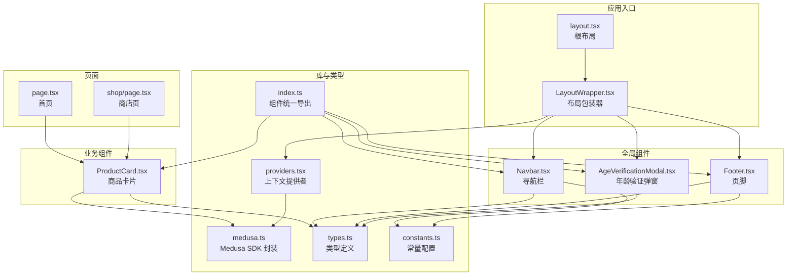
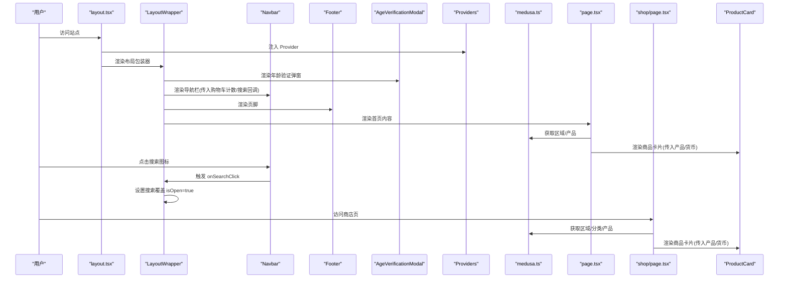
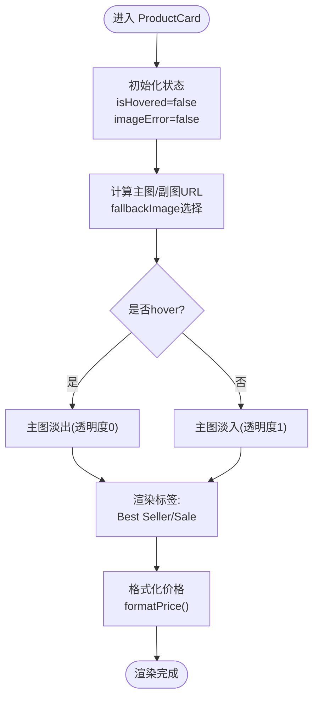
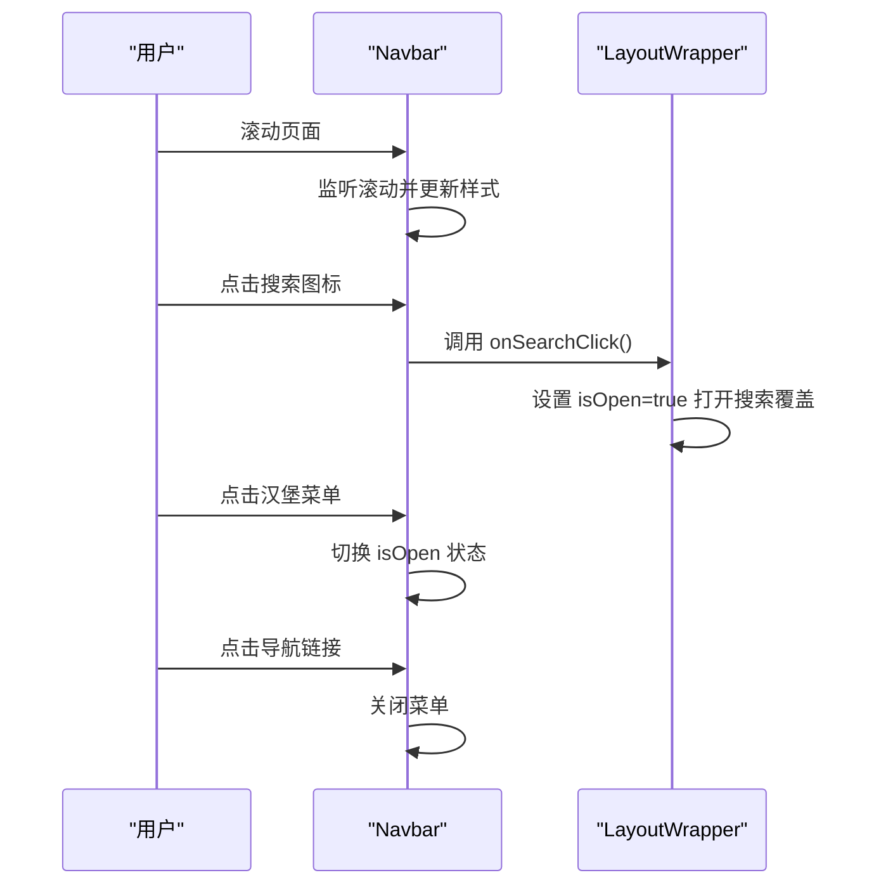
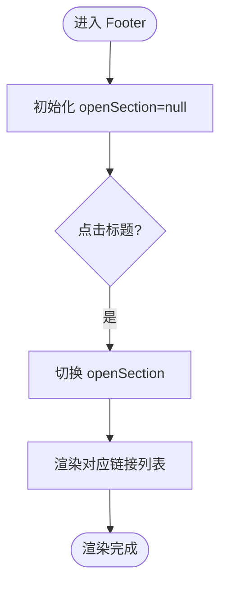
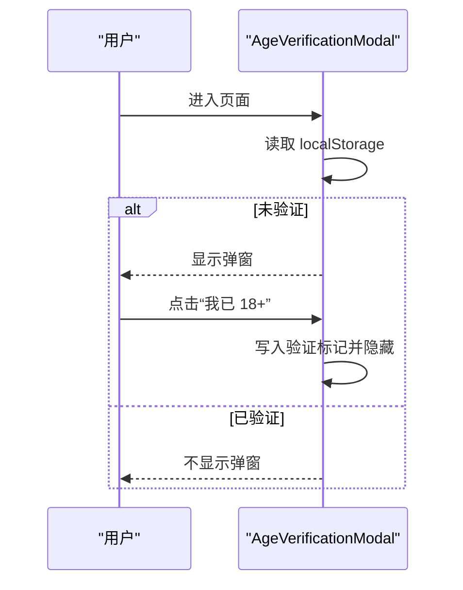
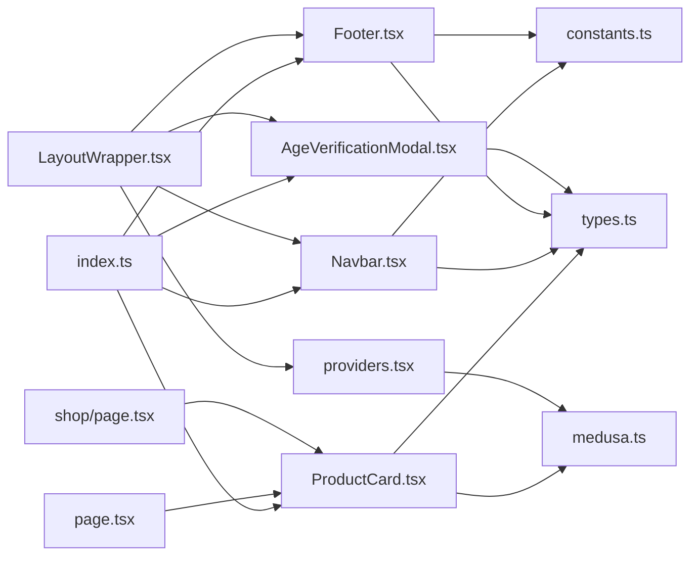

# 组件体系与UI设计模式

<cite>
**本文引用的文件**
- [storefront/src/components/index.ts](file://storefront/src/components/index.ts)
- [storefront/src/components/ProductCard.tsx](file://storefront/src/components/ProductCard.tsx)
- [storefront/src/components/Navbar.tsx](file://storefront/src/components/Navbar.tsx)
- [storefront/src/components/Footer.tsx](file://storefront/src/components/Footer.tsx)
- [storefront/src/components/AgeVerificationModal.tsx](file://storefront/src/components/AgeVerificationModal.tsx)
- [storefront/src/components/LayoutWrapper.tsx](file://storefront/src/components/LayoutWrapper.tsx)
- [storefront/src/lib/medusa.ts](file://storefront/src/lib/medusa.ts)
- [storefront/src/lib/constants.ts](file://storefront/src/lib/constants.ts)
- [storefront/src/lib/providers.tsx](file://storefront/src/lib/providers.tsx)
- [storefront/src/lib/types.ts](file://storefront/src/lib/types.ts)
- [storefront/src/app/layout.tsx](file://storefront/src/app/layout.tsx)
- [storefront/src/app/page.tsx](file://storefront/src/app/page.tsx)
- [storefront/src/app/shop/page.tsx](file://storefront/src/app/shop/page.tsx)
</cite>

## 目录
1. [引言](#引言)
2. [项目结构](#项目结构)
3. [核心组件](#核心组件)
4. [架构总览](#架构总览)
5. [详细组件分析](#详细组件分析)
6. [依赖关系分析](#依赖关系分析)
7. [性能考量](#性能考量)
8. [故障排查指南](#故障排查指南)
9. [结论](#结论)
10. [附录](#附录)

## 引言
本文件系统性解析 Lumiera 前端组件体系的设计模式与复用策略，聚焦以下目标：
- 深入剖析 ProductCard 作为客户端组件的实现细节：use client 的作用、hover 状态切换主次图片的交互逻辑、价格格式化、最佳销量标签渲染等。
- 解释 Navbar 和 Footer 在全局导航与品牌一致性中的作用，以及 AgeVerificationModal 在合规性交互中的实现机制。
- 说明 index.ts 的模块导出模式如何实现组件的集中管理与按需导入。
- 展示组件的 props 定义、状态管理、事件处理及与外部服务（Medusa）的集成方式，形成可复用的 UI 开发范式。

## 项目结构
前端位于 storefront/src，采用 Next.js App Router 结构，组件集中在 src/components，业务数据访问封装在 src/lib，页面路由在 src/app 下。整体采用“按功能分层 + 模块化导出”的组织方式，便于复用与维护。

图表来源
- [storefront/src/app/layout.tsx](file://storefront/src/app/layout.tsx#L1-L42)
- [storefront/src/components/LayoutWrapper.tsx](file://storefront/src/components/LayoutWrapper.tsx#L1-L31)
- [storefront/src/components/Navbar.tsx](file://storefront/src/components/Navbar.tsx#L1-L161)
- [storefront/src/components/Footer.tsx](file://storefront/src/components/Footer.tsx#L1-L155)
- [storefront/src/components/AgeVerificationModal.tsx](file://storefront/src/components/AgeVerificationModal.tsx#L1-L60)
- [storefront/src/components/ProductCard.tsx](file://storefront/src/components/ProductCard.tsx#L1-L120)
- [storefront/src/lib/medusa.ts](file://storefront/src/lib/medusa.ts#L1-L267)
- [storefront/src/lib/providers.tsx](file://storefront/src/lib/providers.tsx#L1-L181)
- [storefront/src/lib/types.ts](file://storefront/src/lib/types.ts#L1-L58)
- [storefront/src/lib/constants.ts](file://storefront/src/lib/constants.ts#L1-L145)
- [storefront/src/app/page.tsx](file://storefront/src/app/page.tsx#L1-L240)
- [storefront/src/app/shop/page.tsx](file://storefront/src/app/shop/page.tsx#L1-L112)
- [storefront/src/components/index.ts](file://storefront/src/components/index.ts#L1-L7)

章节来源
- [storefront/src/app/layout.tsx](file://storefront/src/app/layout.tsx#L1-L42)
- [storefront/src/components/index.ts](file://storefront/src/components/index.ts#L1-L7)

## 核心组件
- 组件统一导出：通过 index.ts 对外暴露 Navbar、Footer、ProductCard、AgeVerificationModal 等组件，便于集中管理与按需导入，降低上层引用复杂度。
- 客户端组件：所有全局组件均带有 use client 指令，确保在浏览器端运行，支持状态管理与副作用（如滚动监听、本地存储、事件绑定）。
- 数据访问：通过 medusa.ts 封装 Medusa SDK，提供区域、产品、购物车、搜索等能力；类型定义在 types.ts 中，保证与后端数据结构一致。
- 上下文提供者：providers.tsx 提供购物车与区域上下文，使子树组件可共享状态与方法，避免跨层级传递。

章节来源
- [storefront/src/components/index.ts](file://storefront/src/components/index.ts#L1-L7)
- [storefront/src/lib/medusa.ts](file://storefront/src/lib/medusa.ts#L1-L267)
- [storefront/src/lib/types.ts](file://storefront/src/lib/types.ts#L1-L58)
- [storefront/src/lib/providers.tsx](file://storefront/src/lib/providers.tsx#L1-L181)

## 架构总览
Lumiera 前端采用“布局包装器 + 全局组件 + 页面组件 + 库函数”的分层架构：
- 根布局负责注入 Provider 与全局样式。
- LayoutWrapper 负责挂载全局组件（导航、页脚、搜索覆盖、聊天、年龄验证），并协调状态（如搜索开关、购物车计数、区域信息）。
- 页面组件通过异步数据获取与组件组合完成内容渲染。
- 组件通过统一导出与类型约束提升可维护性与可测试性。

图表来源
- [storefront/src/app/layout.tsx](file://storefront/src/app/layout.tsx#L1-L42)
- [storefront/src/components/LayoutWrapper.tsx](file://storefront/src/components/LayoutWrapper.tsx#L1-L31)
- [storefront/src/components/Navbar.tsx](file://storefront/src/components/Navbar.tsx#L1-L161)
- [storefront/src/components/Footer.tsx](file://storefront/src/components/Footer.tsx#L1-L155)
- [storefront/src/components/AgeVerificationModal.tsx](file://storefront/src/components/AgeVerificationModal.tsx#L1-L60)
- [storefront/src/lib/providers.tsx](file://storefront/src/lib/providers.tsx#L1-L181)
- [storefront/src/lib/medusa.ts](file://storefront/src/lib/medusa.ts#L1-L267)
- [storefront/src/app/page.tsx](file://storefront/src/app/page.tsx#L1-L240)
- [storefront/src/app/shop/page.tsx](file://storefront/src/app/shop/page.tsx#L1-L112)
- [storefront/src/components/ProductCard.tsx](file://storefront/src/components/ProductCard.tsx#L1-L120)

## 详细组件分析

### ProductCard 组件
- 设计定位：用于商品列表与推荐场景，承载标题、类别、价格、标签与图片切换等信息。
- use client 作用：启用客户端状态与事件处理，支持 hover 切换图片、错误回退与价格格式化。
- Props 定义：接收 StoreProduct 与可选的区域货币代码，确保价格显示符合当前区域。
- 状态管理：
  - isHovered：控制主图与副图的透明度切换，实现 hover 效果。
  - imageError：当图片加载失败时切换到回退图或占位图，提升健壮性。
- 图片切换逻辑：
  - 主图与副图分别渲染，通过 opacity 动画在 hover 时互换显隐。
  - 支持多张图片与回退策略，避免空图影响体验。
- 价格格式化：调用 formatPrice，将后端以“分”为单位的价格转换为本地货币格式。
- 标签渲染：检测标签值是否包含“best seller/bestseller”，若命中则显示“Best Seller”徽章；当存在原价且高于现价时显示“Sale”折扣标签。
- 类别与链接：从产品类别取首个名称作为类别文案，并跳转至对应商品详情页。

图表来源
- [storefront/src/components/ProductCard.tsx](file://storefront/src/components/ProductCard.tsx#L1-L120)
- [storefront/src/lib/medusa.ts](file://storefront/src/lib/medusa.ts#L256-L265)
- [storefront/src/lib/types.ts](file://storefront/src/lib/types.ts#L1-L12)

章节来源
- [storefront/src/components/ProductCard.tsx](file://storefront/src/components/ProductCard.tsx#L1-L120)
- [storefront/src/lib/medusa.ts](file://storefront/src/lib/medusa.ts#L256-L265)
- [storefront/src/lib/types.ts](file://storefront/src/lib/types.ts#L1-L12)

### Navbar 组件
- 设计定位：全局导航与品牌标识，提供移动端菜单、搜索触发、账户与购物车入口。
- use client 作用：启用滚动监听与移动端菜单状态管理。
- Props 定义：接收 cartCount 与 onSearchClick 回调，解耦上层状态。
- 交互逻辑：
  - 滚动监听：根据滚动距离动态调整导航背景与内边距，增强可读性。
  - 移动端菜单：汉堡按钮切换 overlay 显示，overlay 内含导航链接与账户入口。
  - 链接高亮：基于路径判断当前激活项，提供视觉反馈。
- 品牌一致性：Logo 使用品牌字体与字间距，保持统一风格。

图表来源
- [storefront/src/components/Navbar.tsx](file://storefront/src/components/Navbar.tsx#L1-L161)
- [storefront/src/components/LayoutWrapper.tsx](file://storefront/src/components/LayoutWrapper.tsx#L1-L31)
- [storefront/src/lib/constants.ts](file://storefront/src/lib/constants.ts#L117-L122)

章节来源
- [storefront/src/components/Navbar.tsx](file://storefront/src/components/Navbar.tsx#L1-L161)
- [storefront/src/components/LayoutWrapper.tsx](file://storefront/src/components/LayoutWrapper.tsx#L1-L31)
- [storefront/src/lib/constants.ts](file://storefront/src/lib/constants.ts#L117-L122)

### Footer 组件
- 设计定位：品牌信息、站点地图与法律信息，移动端采用手风琴折叠。
- use client 作用：启用移动端展开/收起状态管理。
- 交互逻辑：
  - MobileAccordionItem 子组件：点击标题切换展开状态，控制内容区高度与箭头旋转。
  - 多列布局：品牌信息、Shop、Support、Legal 分栏展示，桌面端直列，移动端折叠。
- 品牌一致性：统一使用品牌字体与色板，底部版权与支付图标保持一致风格。

图表来源
- [storefront/src/components/Footer.tsx](file://storefront/src/components/Footer.tsx#L1-L155)

章节来源
- [storefront/src/components/Footer.tsx](file://storefront/src/components/Footer.tsx#L1-L155)

### AgeVerificationModal 组件
- 设计定位：合规性弹窗，要求用户确认年满 18 岁方可继续浏览。
- use client 作用：仅在客户端执行，使用 localStorage 存储验证状态。
- 交互逻辑：
  - 首次访问读取 localStorage，未验证则显示弹窗。
  - “我已 18+”写入验证标记并关闭弹窗；“退出”跳转至外部网站。
- 体验设计：半透明背景与居中卡片，提供明确的确认与退出选项。

图表来源
- [storefront/src/components/AgeVerificationModal.tsx](file://storefront/src/components/AgeVerificationModal.tsx#L1-L60)

章节来源
- [storefront/src/components/AgeVerificationModal.tsx](file://storefront/src/components/AgeVerificationModal.tsx#L1-L60)

### index.ts 模块导出模式
- 统一导出：通过 index.ts 将 Navbar、Footer、ProductCard、AgeVerificationModal 等组件集中导出，便于上层按需引入，减少路径硬编码。
- 复用策略：组件在不同页面直接复用，无需重复声明导入路径，降低耦合度与维护成本。

章节来源
- [storefront/src/components/index.ts](file://storefront/src/components/index.ts#L1-L7)

## 依赖关系分析
- 组件间依赖：
  - LayoutWrapper 依赖 Navbar、Footer、AgeVerificationModal、ChatWidget 与 SearchOverlay（由上层页面传入）。
  - ProductCard 依赖 medusa.ts 的价格格式化与 StoreProduct 类型。
  - Navbar/Footers 依赖 constants.ts 的导航与页脚链接配置。
- 上下文依赖：
  - providers.tsx 提供购物车与区域上下文，LayoutWrapper 通过 useCart/useRegion 获取计数与区域信息，再传递给 Navbar。
- 外部服务依赖：
  - medusa.ts 封装了区域、产品、购物车、搜索等 API，页面组件通过异步函数拉取数据，组件内部通过 formatPrice 渲染价格。

图表来源
- [storefront/src/components/index.ts](file://storefront/src/components/index.ts#L1-L7)
- [storefront/src/components/LayoutWrapper.tsx](file://storefront/src/components/LayoutWrapper.tsx#L1-L31)
- [storefront/src/components/Navbar.tsx](file://storefront/src/components/Navbar.tsx#L1-L161)
- [storefront/src/components/Footer.tsx](file://storefront/src/components/Footer.tsx#L1-L155)
- [storefront/src/components/AgeVerificationModal.tsx](file://storefront/src/components/AgeVerificationModal.tsx#L1-L60)
- [storefront/src/components/ProductCard.tsx](file://storefront/src/components/ProductCard.tsx#L1-L120)
- [storefront/src/lib/medusa.ts](file://storefront/src/lib/medusa.ts#L1-L267)
- [storefront/src/lib/constants.ts](file://storefront/src/lib/constants.ts#L1-L145)
- [storefront/src/lib/providers.tsx](file://storefront/src/lib/providers.tsx#L1-L181)
- [storefront/src/lib/types.ts](file://storefront/src/lib/types.ts#L1-L58)
- [storefront/src/app/page.tsx](file://storefront/src/app/page.tsx#L1-L240)
- [storefront/src/app/shop/page.tsx](file://storefront/src/app/shop/page.tsx#L1-L112)

章节来源
- [storefront/src/lib/medusa.ts](file://storefront/src/lib/medusa.ts#L1-L267)
- [storefront/src/lib/providers.tsx](file://storefront/src/lib/providers.tsx#L1-L181)
- [storefront/src/lib/types.ts](file://storefront/src/lib/types.ts#L1-L58)
- [storefront/src/lib/constants.ts](file://storefront/src/lib/constants.ts#L1-L145)
- [storefront/src/components/index.ts](file://storefront/src/components/index.ts#L1-L7)

## 性能考量
- 图片懒加载与尺寸优化：ProductCard 使用 Next/Image 并设置 sizes，结合 hover 切换减少不必要的主图渲染。
- 本地回退与错误处理：当图片加载失败时切换到本地回退图，避免空白与重试风暴。
- 价格格式化：formatPrice 在客户端进行，避免重复网络请求；注意后端以“分”为单位，前端除以 100 后格式化。
- 导航滚动监听：Navbar 的滚动监听在客户端执行，建议在卸载时清理事件，避免内存泄漏。
- 购物车与区域初始化：providers.tsx 在客户端初始化购物车与区域，避免阻塞首屏渲染；必要时可延迟部分操作。

## 故障排查指南
- 图片不显示或闪烁：
  - 检查图片 URL 是否有效；若失败会触发回退逻辑。
  - 确认占位图路径与回退图路径可用。
- 价格显示异常：
  - 确认 regionCurrency 传入正确；formatPrice 依赖货币代码进行本地化格式化。
  - 检查后端返回的金额单位是否为“分”，前端除以 100 后再格式化。
- 导航样式不生效：
  - 滚动监听需在客户端执行；确认 use client 已添加。
  - 检查滚动距离阈值与过渡类名是否匹配。
- 年龄验证弹窗反复出现：
  - 检查 localStorage 键值是否被清除；确认验证标记写入成功。
- 购物车计数不更新：
  - 确认 useCart/useRegion 上下文已正确提供；检查 addItem/updateItem/removeItem 的调用链路。
  - 检查本地存储的购物车 ID 是否有效。

章节来源
- [storefront/src/components/ProductCard.tsx](file://storefront/src/components/ProductCard.tsx#L1-L120)
- [storefront/src/lib/medusa.ts](file://storefront/src/lib/medusa.ts#L256-L265)
- [storefront/src/components/Navbar.tsx](file://storefront/src/components/Navbar.tsx#L1-L161)
- [storefront/src/components/AgeVerificationModal.tsx](file://storefront/src/components/AgeVerificationModal.tsx#L1-L60)
- [storefront/src/lib/providers.tsx](file://storefront/src/lib/providers.tsx#L1-L181)

## 结论
Lumiera 前端组件体系通过“use client + 统一导出 + 上下文提供者 + 类型约束”的设计，实现了高内聚、低耦合的 UI 复用范式。ProductCard 以最小状态与清晰的数据流展示了客户端组件的最佳实践；Navbar 与 Footer 在全局导航与品牌一致性方面提供了稳定基座；AgeVerificationModal 则以轻量交互满足合规需求。配合 medusa.ts 的统一数据访问与 providers.tsx 的上下文管理，开发者可以快速构建可扩展、可维护的前端界面。

## 附录
- 组件复用清单：
  - Navbar、Footer、ProductCard、AgeVerificationModal、SearchOverlay、ChatWidget 可通过 index.ts 集中导入，按需使用。
- 推荐开发规范：
  - 所有需要状态与事件的组件均添加 use client。
  - 使用统一的类型定义与数据访问封装，避免跨层传递复杂 props。
  - 为关键交互（如图片加载失败、价格格式化）提供默认值与回退策略。
  - 在布局包装器中集中管理全局组件与状态，减少页面组件负担。