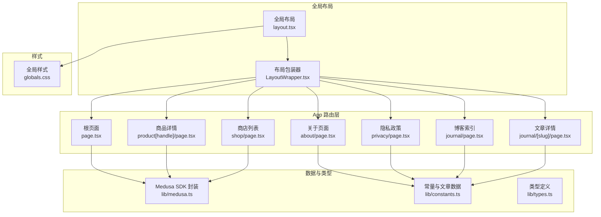
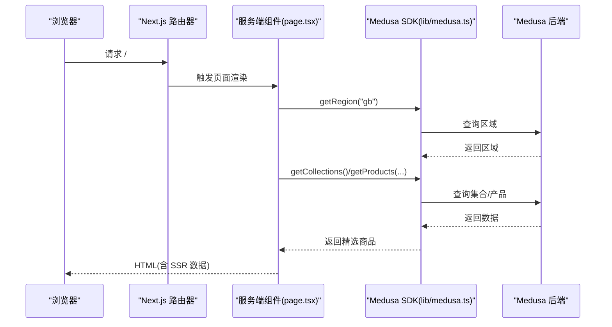
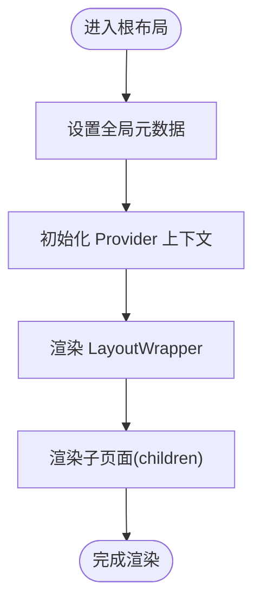
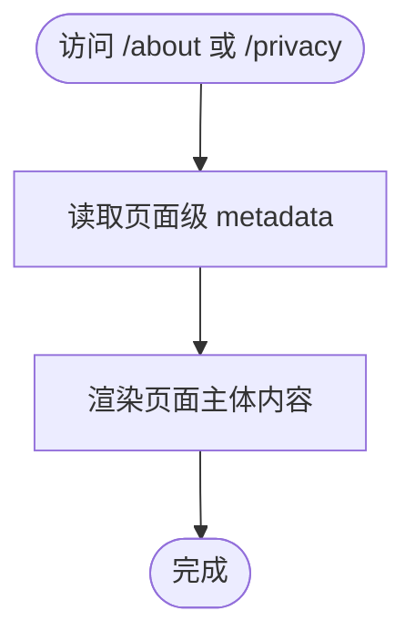
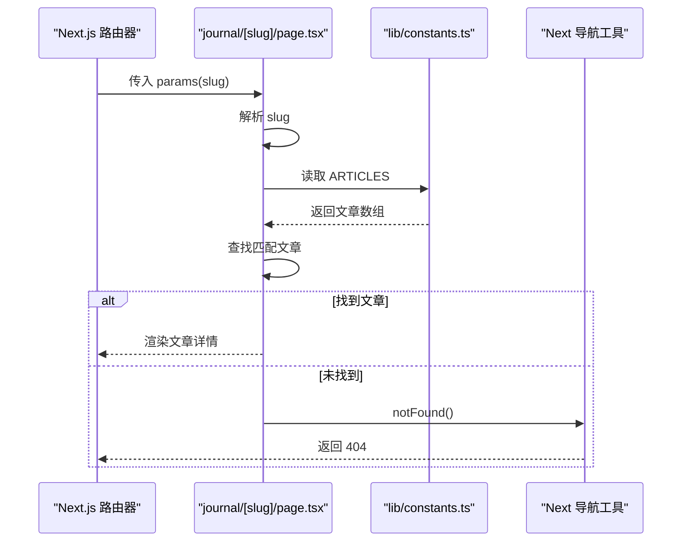
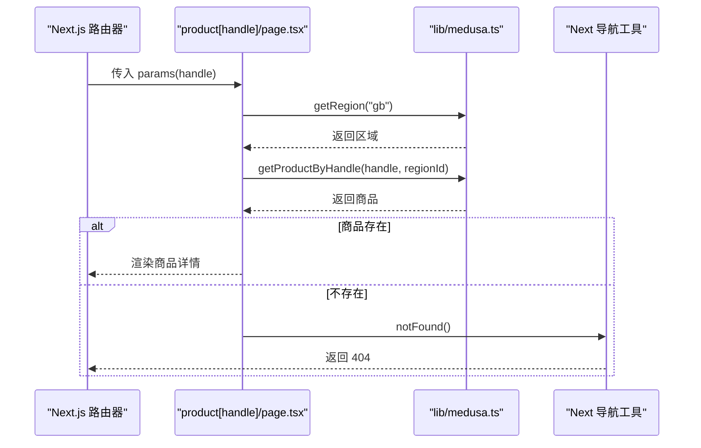
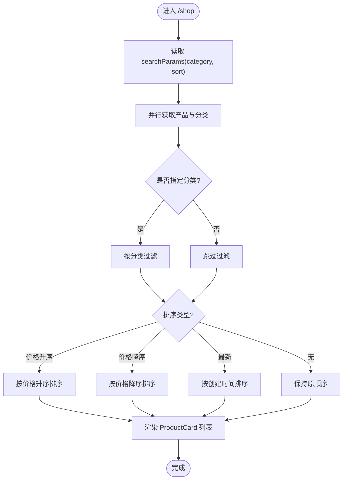
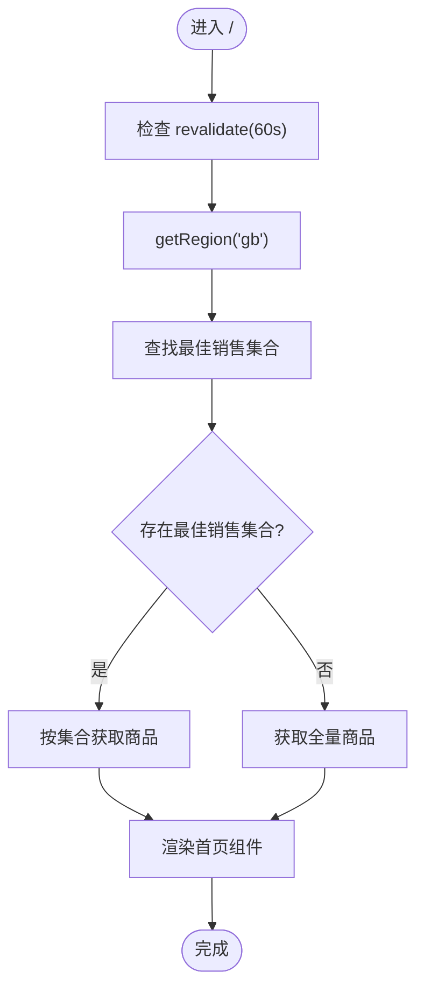
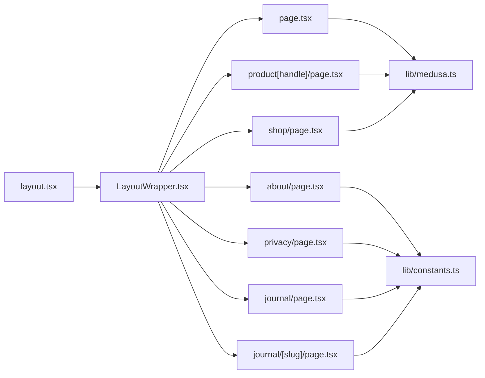

# 页面架构与路由机制

<cite>
**本文引用的文件**
- [storefront/src/app/layout.tsx](file://storefront/src/app/layout.tsx)
- [storefront/src/app/page.tsx](file://storefront/src/app/page.tsx)
- [storefront/src/app/about/page.tsx](file://storefront/src/app/about/page.tsx)
- [storefront/src/app/privacy/page.tsx](file://storefront/src/app/privacy/page.tsx)
- [storefront/src/app/journal/page.tsx](file://storefront/src/app/journal/page.tsx)
- [storefront/src/app/journal/[slug]/page.tsx](file://storefront/src/app/journal/[slug]/page.tsx)
- [storefront/src/app/product[handle]/page.tsx](file://storefront/src/app/product[handle]/page.tsx)
- [storefront/src/app/shop/page.tsx](file://storefront/src/app/shop/page.tsx)
- [storefront/src/lib/medusa.ts](file://storefront/src/lib/medusa.ts)
- [storefront/src/lib/constants.ts](file://storefront/src/lib/constants.ts)
- [storefront/src/components/LayoutWrapper.tsx](file://storefront/src/components/LayoutWrapper.tsx)
- [storefront/src/components/ProductCard.tsx](file://storefront/src/components/ProductCard.tsx)
- [storefront/src/lib/types.ts](file://storefront/src/lib/types.ts)
- [storefront/src/app/globals.css](file://storefront/src/app/globals.css)
</cite>

## 目录
1. [引言](#引言)
2. [项目结构](#项目结构)
3. [核心组件](#核心组件)
4. [架构总览](#架构总览)
5. [详细组件分析](#详细组件分析)
6. [依赖关系分析](#依赖关系分析)
7. [性能考量](#性能考量)
8. [故障排查指南](#故障排查指南)
9. [结论](#结论)
10. [附录](#附录)

## 引言
本文件系统性解析 Lumiera 前端应用的页面架构与 Next.js App Router 路由机制，聚焦以下目标：
- 深入说明 src/app 目录下的静态页面（如 about、privacy）与动态路由（如 product[handle]、journal/[slug]）的实现方式
- 阐述 page.tsx 作为服务端组件如何通过异步函数从 Medusa 后端获取数据，并结合 revalidate=60 实现静态生成与增量静态再生（ISR）的混合策略
- 解析 layout.tsx 在全局布局、共享 UI 和 SEO 元数据管理中的职责
- 展示动态路由参数的提取与使用、嵌套路由组织结构，帮助开发者理解页面生命周期与数据流

## 项目结构
Lumiera 前端采用 Next.js App Router 的 App 目录结构，页面按功能分层组织，核心入口为根目录 page.tsx，全局布局由 layout.tsx 提供，各业务页面位于子目录中，如 about、privacy、journal、product[handle]、shop 等。Medusa 数据访问封装在 lib/medusa.ts 中，常量与类型定义分别在 lib/constants.ts 与 lib/types.ts 中。

图表来源
- [storefront/src/app/layout.tsx](file://storefront/src/app/layout.tsx#L1-L42)
- [storefront/src/app/page.tsx](file://storefront/src/app/page.tsx#L1-L240)
- [storefront/src/app/about/page.tsx](file://storefront/src/app/about/page.tsx#L1-L130)
- [storefront/src/app/privacy/page.tsx](file://storefront/src/app/privacy/page.tsx#L1-L80)
- [storefront/src/app/journal/page.tsx](file://storefront/src/app/journal/page.tsx#L1-L90)
- [storefront/src/app/journal/[slug]/page.tsx](file://storefront/src/app/journal/[slug]/page.tsx#L1-L109)
- [storefront/src/app/product[handle]/page.tsx](file://storefront/src/app/product[handle]/page.tsx#L1-L214)
- [storefront/src/app/shop/page.tsx](file://storefront/src/app/shop/page.tsx#L1-L112)
- [storefront/src/lib/medusa.ts](file://storefront/src/lib/medusa.ts#L1-L267)
- [storefront/src/lib/constants.ts](file://storefront/src/lib/constants.ts#L1-L145)
- [storefront/src/components/LayoutWrapper.tsx](file://storefront/src/components/LayoutWrapper.tsx#L1-L31)
- [storefront/src/app/globals.css](file://storefront/src/app/globals.css#L1-L76)

章节来源
- [storefront/src/app/layout.tsx](file://storefront/src/app/layout.tsx#L1-L42)
- [storefront/src/app/page.tsx](file://storefront/src/app/page.tsx#L1-L240)

## 核心组件
- 全局布局与元数据：layout.tsx 定义根 html、body、字体与全局样式，并通过 metadata 对象统一设置站点标题、描述与 Open Graph 元信息；RootLayout 通过 Providers 包裹，再由 LayoutWrapper 渲染导航、搜索、页脚等共享 UI。
- 根页面与 ISR：page.tsx 使用 export const revalidate = 60 实现每 60 秒对首页进行增量静态再生（ISR），内部通过 getRegion、getCollections/getProductsByCollection 或 getProducts 获取精选商品数据，确保内容新鲜度与性能平衡。
- 动态路由与 SEO：product[handle]/page.tsx 通过 generateStaticParams 生成静态路径，同时通过 generateMetadata 动态生成商品页 SEO 元数据（标题、描述、OG 图片、价格等），提升搜索引擎可见性与分享体验。
- 博客动态路由：journal/[slug]/page.tsx 通过 generateStaticParams 与参数提取 params，结合常量 ARTICLES 进行文章匹配，不存在时调用 notFound() 返回 404。
- 商店列表与筛选：shop/page.tsx 使用 searchParams 接收查询参数，通过 getProducts 与 getCategories 并行拉取数据，支持按分类与排序过滤，提高交互响应速度。
- 组件化与类型：LayoutWrapper 负责共享 UI 与上下文消费；ProductCard 作为客户端组件负责图片懒加载与价格格式化；lib/types.ts 提供 Medusa 类型别名与应用内类型。

章节来源
- [storefront/src/app/layout.tsx](file://storefront/src/app/layout.tsx#L1-L42)
- [storefront/src/app/page.tsx](file://storefront/src/app/page.tsx#L1-L240)
- [storefront/src/app/product[handle]/page.tsx](file://storefront/src/app/product[handle]/page.tsx#L1-L214)
- [storefront/src/app/journal/[slug]/page.tsx](file://storefront/src/app/journal/[slug]/page.tsx#L1-L109)
- [storefront/src/app/shop/page.tsx](file://storefront/src/app/shop/page.tsx#L1-L112)
- [storefront/src/components/LayoutWrapper.tsx](file://storefront/src/components/LayoutWrapper.tsx#L1-L31)
- [storefront/src/components/ProductCard.tsx](file://storefront/src/components/ProductCard.tsx#L1-L120)
- [storefront/src/lib/types.ts](file://storefront/src/lib/types.ts#L1-L58)

## 架构总览
Next.js App Router 以“约定优于配置”的方式组织页面，服务端组件在构建期或请求期执行数据获取，客户端组件负责交互与局部状态。Medusa SDK 通过 lib/medusa.ts 封装，提供区域、产品、分类、购物车、客户认证等能力，ShopFilters、ProductCard 等组件复用这些能力，形成清晰的数据流与渲染链路。

图表来源
- [storefront/src/app/page.tsx](file://storefront/src/app/page.tsx#L1-L240)
- [storefront/src/lib/medusa.ts](file://storefront/src/lib/medusa.ts#L1-L267)

## 详细组件分析

### 全局布局与元数据管理（layout.tsx）
- 全局字体与样式：通过 Google Fonts 注入 Geist 字体变量，引入 globals.css 定义品牌色与动画。
- 元数据：metadata 对象集中定义站点标题、描述、关键词与 Open Graph，确保所有页面具备一致的 SEO 基线。
- 布局包装：RootLayout 通过 Providers 包裹，LayoutWrapper 注入 Navbar、SearchOverlay、Footer、ChatWidget 等共享 UI，并消费 useCart/useRegion 上下文。

图表来源
- [storefront/src/app/layout.tsx](file://storefront/src/app/layout.tsx#L1-L42)
- [storefront/src/components/LayoutWrapper.tsx](file://storefront/src/components/LayoutWrapper.tsx#L1-L31)
- [storefront/src/app/globals.css](file://storefront/src/app/globals.css#L1-L76)

章节来源
- [storefront/src/app/layout.tsx](file://storefront/src/app/layout.tsx#L1-L42)
- [storefront/src/components/LayoutWrapper.tsx](file://storefront/src/components/LayoutWrapper.tsx#L1-L31)
- [storefront/src/app/globals.css](file://storefront/src/app/globals.css#L1-L76)

### 静态页面：about 与 privacy
- about/page.tsx：通过本地 metadata 对象覆盖全局元数据，定义页面标题与描述，强调品牌使命与价值观。
- privacy/page.tsx：同样通过本地 metadata 设置标题，内容展示隐私政策文本，引用公司信息常量。

图表来源
- [storefront/src/app/about/page.tsx](file://storefront/src/app/about/page.tsx#L1-L130)
- [storefront/src/app/privacy/page.tsx](file://storefront/src/app/privacy/page.tsx#L1-L80)
- [storefront/src/lib/constants.ts](file://storefront/src/lib/constants.ts#L1-L145)

章节来源
- [storefront/src/app/about/page.tsx](file://storefront/src/app/about/page.tsx#L1-L130)
- [storefront/src/app/privacy/page.tsx](file://storefront/src/app/privacy/page.tsx#L1-L80)
- [storefront/src/lib/constants.ts](file://storefront/src/lib/constants.ts#L1-L145)

### 动态路由：journal/[slug] 文章详情
- 参数提取：通过 params Promise 解析 slug，结合 ARTICLES 常量查找对应文章。
- 静态参数生成：generateStaticParams 基于 ARTICLES 动态生成静态路径，提升 SEO 与首屏性能。
- 错误处理：未找到文章时调用 notFound() 返回 404。

图表来源
- [storefront/src/app/journal/[slug]/page.tsx](file://storefront/src/app/journal/[slug]/page.tsx#L1-L109)
- [storefront/src/lib/constants.ts](file://storefront/src/lib/constants.ts#L1-L145)

章节来源
- [storefront/src/app/journal/[slug]/page.tsx](file://storefront/src/app/journal/[slug]/page.tsx#L1-L109)
- [storefront/src/lib/constants.ts](file://storefront/src/lib/constants.ts#L1-L145)

### 动态路由：product[handle] 商品详情
- 静态参数生成：generateStaticParams 通过 getRegion 与 getProducts 获取产品列表，映射为静态路径，减少运行时查询。
- 动态元数据：generateMetadata 基于 handle 与区域信息动态生成标题、描述、OG 图片与价格元数据，增强社交分享体验。
- 数据获取与渲染：页面根据 handle 获取商品详情，计算折扣、标签徽章、分类面包屑等，组合 ProductGallery、ProductActions、ProductInfo 等子组件。

图表来源
- [storefront/src/app/product[handle]/page.tsx](file://storefront/src/app/product[handle]/page.tsx#L1-L214)
- [storefront/src/lib/medusa.ts](file://storefront/src/lib/medusa.ts#L1-L267)

章节来源
- [storefront/src/app/product[handle]/page.tsx](file://storefront/src/app/product[handle]/page.tsx#L1-L214)
- [storefront/src/lib/medusa.ts](file://storefront/src/lib/medusa.ts#L1-L267)

### 列表页：shop 页面与筛选
- 查询参数：通过 searchParams Promise 获取 category 与 sort 等筛选条件。
- 并行数据：getShopData 并行拉取产品与分类，提升首屏渲染效率。
- 过滤与排序：基于查询参数对产品进行分类过滤与价格/时间排序，最终渲染 ProductCard 列表。

图表来源
- [storefront/src/app/shop/page.tsx](file://storefront/src/app/shop/page.tsx#L1-L112)
- [storefront/src/lib/medusa.ts](file://storefront/src/lib/medusa.ts#L1-L267)
- [storefront/src/components/ProductCard.tsx](file://storefront/src/components/ProductCard.tsx#L1-L120)

章节来源
- [storefront/src/app/shop/page.tsx](file://storefront/src/app/shop/page.tsx#L1-L112)
- [storefront/src/lib/medusa.ts](file://storefront/src/lib/medusa.ts#L1-L267)
- [storefront/src/components/ProductCard.tsx](file://storefront/src/components/ProductCard.tsx#L1-L120)

### 首页：page.tsx 的 ISR 与数据流
- ISR 策略：export const revalidate = 60 表示每 60 秒重建一次静态页面，兼顾性能与内容更新。
- 数据获取：先获取区域，再尝试最佳销售集合，若存在则按集合取前 N 个商品；否则回退到全量产品列表。
- 渲染：包含横幅、USP 条、分类网格、精选商品、品牌故事与评价等模块。

图表来源
- [storefront/src/app/page.tsx](file://storefront/src/app/page.tsx#L1-L240)
- [storefront/src/lib/medusa.ts](file://storefront/src/lib/medusa.ts#L1-L267)

章节来源
- [storefront/src/app/page.tsx](file://storefront/src/app/page.tsx#L1-L240)
- [storefront/src/lib/medusa.ts](file://storefront/src/lib/medusa.ts#L1-L267)

## 依赖关系分析
- 组件耦合：layout.tsx 与 LayoutWrapper 形成全局布局与共享 UI 的强耦合；各页面通过 lib/medusa.ts 间接依赖 Medusa 后端。
- 数据依赖：page.tsx、product[handle]/page.tsx、shop/page.tsx 分别依赖不同数据接口，形成清晰的职责边界。
- 类型依赖：lib/types.ts 为应用内类型提供统一入口，避免跨模块重复定义。

图表来源
- [storefront/src/app/layout.tsx](file://storefront/src/app/layout.tsx#L1-L42)
- [storefront/src/components/LayoutWrapper.tsx](file://storefront/src/components/LayoutWrapper.tsx#L1-L31)
- [storefront/src/app/page.tsx](file://storefront/src/app/page.tsx#L1-L240)
- [storefront/src/app/about/page.tsx](file://storefront/src/app/about/page.tsx#L1-L130)
- [storefront/src/app/privacy/page.tsx](file://storefront/src/app/privacy/page.tsx#L1-L80)
- [storefront/src/app/journal/page.tsx](file://storefront/src/app/journal/page.tsx#L1-L90)
- [storefront/src/app/journal/[slug]/page.tsx](file://storefront/src/app/journal/[slug]/page.tsx#L1-L109)
- [storefront/src/app/product[handle]/page.tsx](file://storefront/src/app/product[handle]/page.tsx#L1-L214)
- [storefront/src/app/shop/page.tsx](file://storefront/src/app/shop/page.tsx#L1-L112)
- [storefront/src/lib/medusa.ts](file://storefront/src/lib/medusa.ts#L1-L267)
- [storefront/src/lib/constants.ts](file://storefront/src/lib/constants.ts#L1-L145)

章节来源
- [storefront/src/lib/medusa.ts](file://storefront/src/lib/medusa.ts#L1-L267)
- [storefront/src/lib/types.ts](file://storefront/src/lib/types.ts#L1-L58)

## 性能考量
- ISR 与静态生成：首页与商品详情页均设置 revalidate=60，利用 ISR 在后台增量更新缓存，降低冷启动与高并发压力。
- 并行数据请求：shop/page.tsx 使用 Promise.all 并行获取产品与分类，显著缩短首屏等待时间。
- 图片优化：ProductCard 与各页面使用 next/image，配合 sizes 与占位图，减少阻塞与闪烁。
- 客户端组件最小化：仅在需要交互的状态组件（如 LayoutWrapper、ProductCard）使用客户端模式，其余页面保持服务端渲染以获得更好性能。

## 故障排查指南
- 动态路由 404：journal/[slug]/page.tsx 未匹配到文章时会触发 notFound()，请确认 slug 是否存在于 ARTICLES 中。
- 商品不存在：product[handle]/page.tsx 若未找到商品，同样触发 notFound()，请检查 handle 是否正确且后端存在该商品。
- Medusa 连接失败：lib/medusa.ts 初始化时依赖环境变量 NEXT_PUBLIC_MEDUSA_BACKEND_URL、NEXT_PUBLIC_MEDUSA_PUBLISHABLE_KEY，若为空会导致请求失败。
- 区域与价格：getRegion 失败或返回空时，可能导致价格显示异常，需检查后端区域配置与网络连通性。
- 价格格式化：formatPrice 依赖后端以“分”存储的价格，若为 null/undefined 将显示“N/A”，请确认后端数据。

章节来源
- [storefront/src/app/journal/[slug]/page.tsx](file://storefront/src/app/journal/[slug]/page.tsx#L1-L109)
- [storefront/src/app/product[handle]/page.tsx](file://storefront/src/app/product[handle]/page.tsx#L1-L214)
- [storefront/src/lib/medusa.ts](file://storefront/src/lib/medusa.ts#L1-L267)

## 结论
Lumiera 的页面架构充分利用 Next.js App Router 的服务端组件与动态路由能力，结合 Medusa 的数据模型，实现了高性能、可维护、SEO 友好的前端页面体系。通过 revalidate=60 的 ISR 策略与 generateStaticParams 的静态路径生成，既保证了内容的新鲜度，又提升了首屏性能与可扩展性。全局布局与共享 UI 通过 layout.tsx 与 LayoutWrapper 统一管理，使站点风格一致、开发体验友好。

## 附录
- 动态路由参数提取与使用示例路径：
  - [journal/[slug]/page.tsx 参数解包与 notFound](file://storefront/src/app/journal/[slug]/page.tsx#L1-L109)
  - [product[handle]/page.tsx 参数解包与 notFound](file://storefront/src/app/product[handle]/page.tsx#L1-L214)
- 静态参数生成示例路径：
  - [journal/[slug]/page.tsx generateStaticParams](file://storefront/src/app/journal/[slug]/page.tsx#L1-L109)
  - [product[handle]/page.tsx generateStaticParams](file://storefront/src/app/product[handle]/page.tsx#L1-L214)
- ISR 与数据流示例路径：
  - [page.tsx revalidate 与 getFeaturedProducts](file://storefront/src/app/page.tsx#L1-L240)
  - [shop/page.tsx revalidate 与并行数据](file://storefront/src/app/shop/page.tsx#L1-L112)
- SEO 元数据示例路径：
  - [layout.tsx 全局元数据](file://storefront/src/app/layout.tsx#L1-L42)
  - [product[handle]/page.tsx generateMetadata](file://storefront/src/app/product[handle]/page.tsx#L1-L214)
  - [journal/[slug]/page.tsx 本地元数据](file://storefront/src/app/journal/[slug]/page.tsx#L1-L109)
  - [about/page.tsx 本地元数据](file://storefront/src/app/about/page.tsx#L1-L130)
  - [privacy/page.tsx 本地元数据](file://storefront/src/app/privacy/page.tsx#L1-L80)