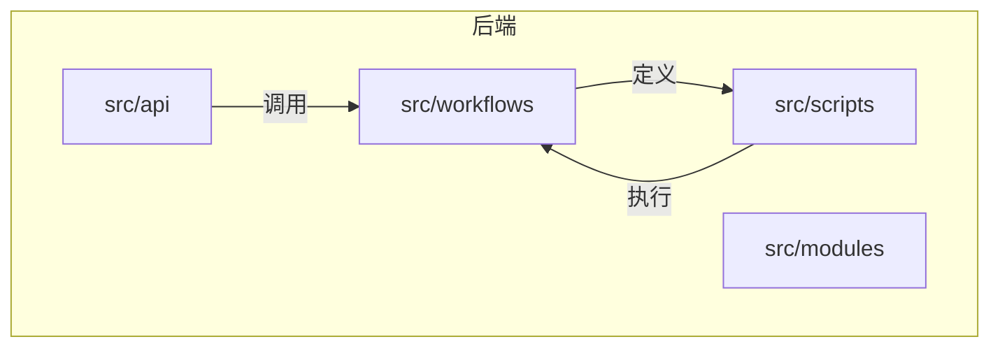
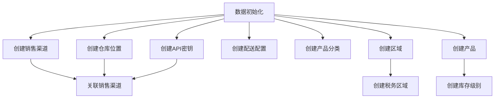
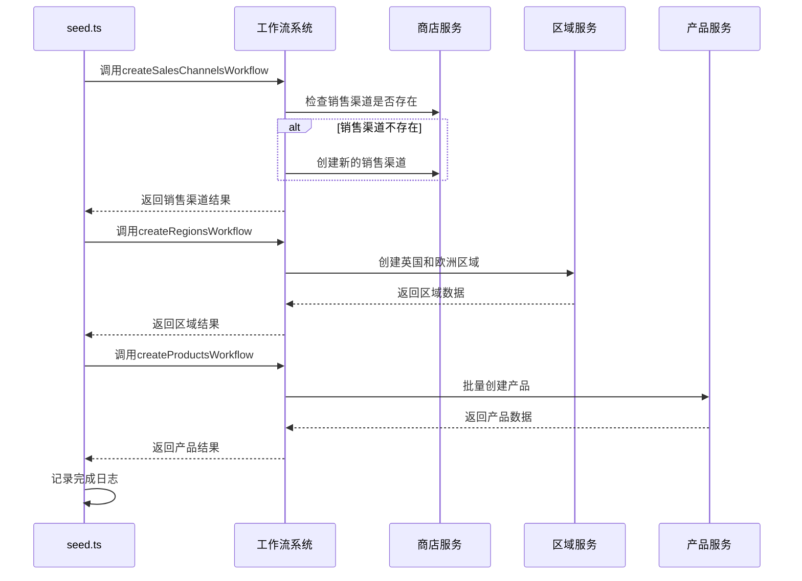
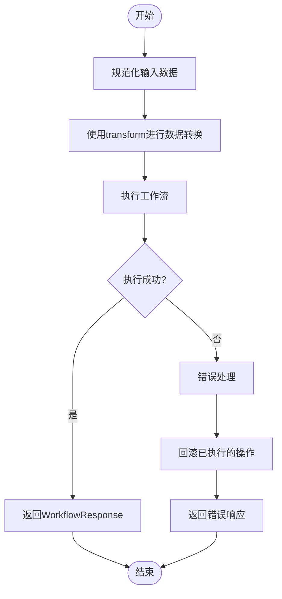

# 业务工作流设计

<cite>
**本文档引用的文件**  
- [seed.ts](file://backend/src/scripts/seed.ts)
- [README.md](file://backend/src/workflows/README.md)
- [medusa-config.ts](file://backend/medusa-config.ts)
- [package.json](file://backend/package.json)
- [instrumentation.ts](file://backend/instrumentation.ts)
</cite>

## 目录
1. [简介](#简介)
2. [项目结构](#项目结构)
3. [核心组件](#核心组件)
4. [架构概述](#架构概述)
5. [详细组件分析](#详细组件分析)
6. [依赖分析](#依赖分析)
7. [性能考虑](#性能考虑)
8. [故障排除指南](#故障排除指南)
9. [结论](#结论)

## 简介
本文档深入解析Lumiera基于@medusajs/workflows-sdk的工作流系统，阐述其在数据初始化、订单处理、库存更新等关键业务场景中的作用。结合seed.ts脚本，详细说明如何通过声明式工作流定义产品、区域、配送选项等初始数据的创建流程，包括事务管理、错误回滚机制和异步任务编排。解释工作流的定义、注册与调用方式，展示输入/输出数据结构及中间步骤的状态传递。提供可视化流程图描述典型工作流执行路径，分析其与传统串行代码相比在可维护性和可靠性上的优势。涵盖调试技巧、日志追踪方法以及性能优化建议，帮助开发者构建健壮的业务流程。

## 项目结构
Lumiera项目的后端结构清晰地组织了工作流相关组件。`src/workflows`目录用于存放自定义工作流，`src/scripts`目录包含seed.ts等数据初始化脚本，这些脚本大量使用了Medusa的核心工作流来完成数据播种任务。



**图示来源**
- [README.md](file://backend/src/workflows/README.md#L5-L8)

**本节来源**
- [README.md](file://backend/src/workflows/README.md#L5-L8)
- [project_structure](#project_structure)

## 核心组件
Lumiera的工作流系统基于@medusajs/workflows-sdk构建，通过声明式编程模型实现了复杂业务流程的编排。核心组件包括工作流定义、步骤创建、数据转换和响应处理。seed.ts脚本展示了如何组合多个核心工作流（如createRegionsWorkflow、createProductsWorkflow等）来完成完整的数据初始化任务。

**本节来源**
- [seed.ts](file://backend/src/scripts/seed.ts#L1-L852)
- [README.md](file://backend/src/workflows/README.md#L9-L82)

## 架构概述
Lumiera的工作流架构采用模块化设计，将复杂的初始化任务分解为多个可复用的工作流单元。通过组合Medusa提供的核心工作流和自定义工作流，实现了高内聚、低耦合的业务流程管理。



**图示来源**
- [seed.ts](file://backend/src/scripts/seed.ts#L58-L852)

## 详细组件分析

### 数据初始化工作流分析
seed.ts脚本实现了一个复杂的数据初始化流程，通过组合多个工作流来构建Lumiera商店的完整数据模型。该流程展示了事务性操作、错误处理和状态传递的最佳实践。

#### 自定义工作流定义
```mermaid
classDiagram
class updateStoreCurrencies {
+string store_id
+{currency_code : string, is_default? : boolean}[] supported_currencies
+WorkflowResponse execute()
}
class createRegionsWorkflow {
+RegionInput[] regions
+WorkflowResponse execute()
}
class createProductsWorkflow {
+ProductInput[] products
+WorkflowResponse execute()
}
updateStoreCurrencies --> transform : "使用"
createRegionsWorkflow --> WorkflowResponse : "返回"
createProductsWorkflow --> WorkflowResponse : "返回"
```

**图示来源**
- [seed.ts](file://backend/src/scripts/seed.ts#L30-L56)
- [seed.ts](file://backend/src/scripts/seed.ts#L125-L142)
- [seed.ts](file://backend/src/scripts/seed.ts#L400-L402)

#### 工作流执行流程


**图示来源**
- [seed.ts](file://backend/src/scripts/seed.ts#L81-L95)
- [seed.ts](file://backend/src/scripts/seed.ts#L125-L142)
- [seed.ts](file://backend/src/scripts/seed.ts#L400-L402)

#### 数据转换与处理流程


**图示来源**
- [seed.ts](file://backend/src/scripts/seed.ts#L36-L50)
- [seed.ts](file://backend/src/scripts/seed.ts#L52-L54)

**本节来源**
- [seed.ts](file://backend/src/scripts/seed.ts#L1-L852)

## 依赖分析
Lumiera工作流系统的依赖关系清晰，通过package.json文件定义了核心依赖项。系统依赖于Medusa框架的多个模块，包括框架核心、工作流SDK和核心业务流程。

```mermaid
graph LR
A[Lumiera] --> B[@medusajs/framework]
A --> C[@medusajs/medusa]
B --> D[workflows-sdk]
C --> E[core-flows]
D --> F[createWorkflow]
D --> G[createStep]
E --> H[createRegionsWorkflow]
E --> I[createProductsWorkflow]
F --> J[工作流编排]
G --> K[步骤定义]
H --> L[区域管理]
I --> M[产品管理]
```

**图示来源**
- [package.json](file://backend/package.json#L24-L28)
- [seed.ts](file://backend/src/scripts/seed.ts#L7-L27)

**本节来源**
- [package.json](file://backend/package.json#L24-L28)
- [seed.ts](file://backend/src/scripts/seed.ts#L7-L27)

## 性能考虑
在设计和执行工作流时，需要考虑性能优化。Lumiera的seed.ts脚本通过批量操作和合理的执行顺序来优化性能。建议在生产环境中启用工作流监控，通过instrumentation.ts文件中的配置来收集性能指标。

**本节来源**
- [instrumentation.ts](file://backend/instrumentation.ts#L19-L21)

## 故障排除指南
当工作流执行失败时，可以通过以下步骤进行故障排除：
1. 检查日志输出，seed.ts脚本使用logger.info记录了每个步骤的执行情况
2. 验证输入数据的正确性，确保所有必需字段都已提供
3. 检查依赖服务的可用性，如数据库连接
4. 查看工作流的错误回滚机制是否正常工作

**本节来源**
- [seed.ts](file://backend/src/scripts/seed.ts#L69-L848)
- [instrumentation.ts](file://backend/instrumentation.ts#L19-L21)

## 结论
Lumiera基于@medusajs/workflows-sdk的工作流系统提供了一种声明式、可组合的方式来管理复杂的业务流程。通过将业务逻辑分解为可复用的工作流单元，系统实现了更高的可维护性和可靠性。seed.ts脚本展示了如何有效地组合多个工作流来完成数据初始化任务，为开发者提供了构建健壮业务流程的优秀范例。