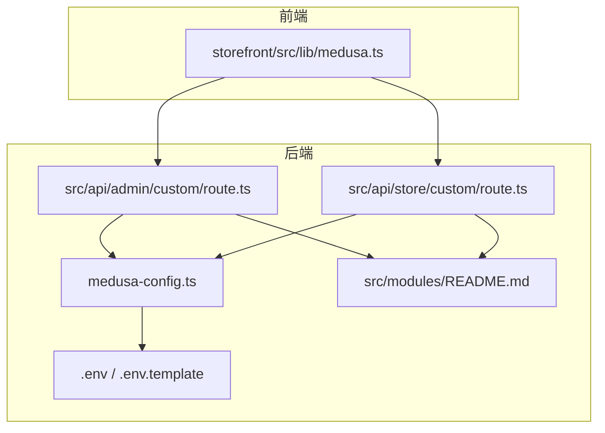
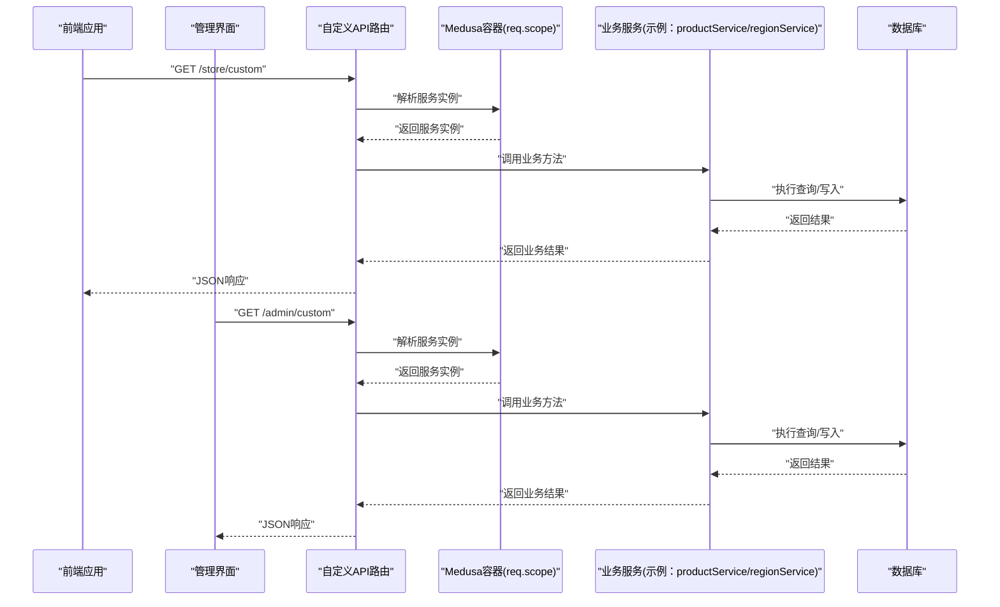
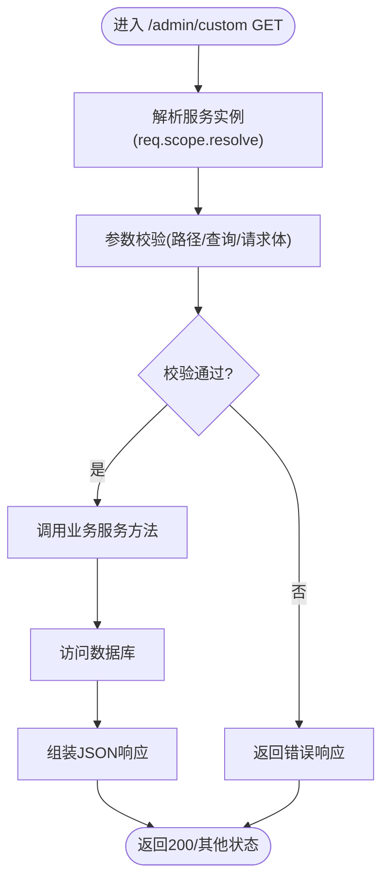
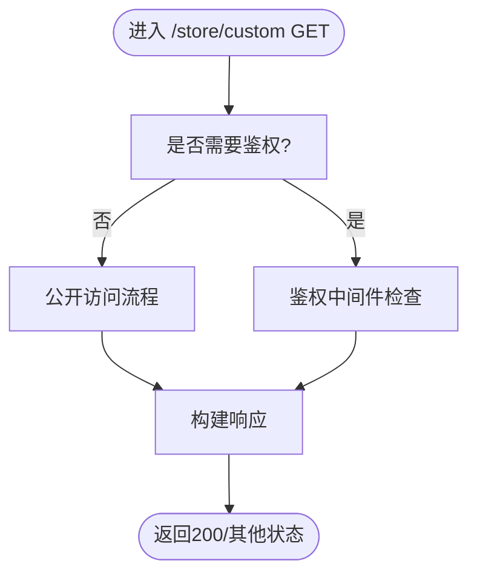
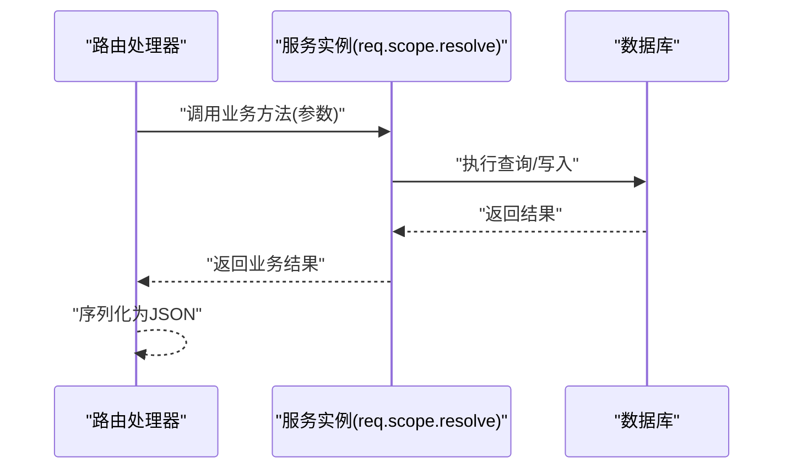
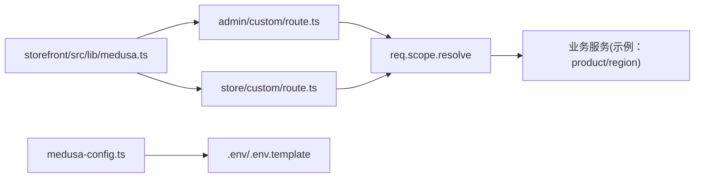

# 后端API架构

<cite>
**本文引用的文件**
- [backend/src/api/admin/custom/route.ts](file://backend/src/api/admin/custom/route.ts)
- [backend/src/api/store/custom/route.ts](file://backend/src/api/store/custom/route.ts)
- [backend/src/api/README.md](file://backend/src/api/README.md)
- [backend/medusa-config.ts](file://backend/medusa-config.ts)
- [backend/.env](file://backend/.env)
- [backend/.env.template](file://backend/.env.template)
- [backend/src/modules/README.md](file://backend/src/modules/README.md)
- [storefront/src/lib/medusa.ts](file://storefront/src/lib/medusa.ts)
</cite>

## 目录
1. [引言](#引言)
2. [项目结构](#项目结构)
3. [核心组件](#核心组件)
4. [架构总览](#架构总览)
5. [详细组件分析](#详细组件分析)
6. [依赖关系分析](#依赖关系分析)
7. [性能考量](#性能考量)
8. [故障排查指南](#故障排查指南)
9. [结论](#结论)
10. [附录](#附录)

## 引言
本文件面向Lumiera项目的后端自定义API，聚焦MedusaJS框架下的RESTful API扩展机制。重点说明admin/custom与store/custom两个路由模块的设计目的与访问权限：
- admin/custom：用于管理后台功能扩展，需管理员身份验证；
- store/custom：面向前端商店，支持公开或用户认证访问。

本文将基于route.ts的具体实现，系统阐述HTTP方法定义、请求/响应结构、错误处理模式及中间件使用；并提供新增API端点的实践步骤，包括请求体解析、参数校验与JSON响应返回。同时解释API与Medusa服务层（如productService、regionService）的集成方式，说明从HTTP请求到业务逻辑再到数据库的数据流路径。最后涵盖CORS配置、速率限制、安全防护等生产级考虑，并给出调试建议与常见问题解决方案。

## 项目结构
后端采用MedusaJS的文件系统路由约定，在src/api目录下按store与admin分组组织自定义API端点。每个端点以route.ts命名，导出对应HTTP方法的异步处理器函数。配置通过medusa-config.ts集中管理，CORS与密钥等运行时参数由环境变量提供。

图表来源
- [backend/src/api/admin/custom/route.ts](file://backend/src/api/admin/custom/route.ts#L1-L9)
- [backend/src/api/store/custom/route.ts](file://backend/src/api/store/custom/route.ts#L1-L9)
- [backend/medusa-config.ts](file://backend/medusa-config.ts#L1-L21)
- [backend/.env](file://backend/.env#L1-L8)
- [backend/.env.template](file://backend/.env.template#L1-L8)
- [backend/src/modules/README.md](file://backend/src/modules/README.md#L1-L118)
- [storefront/src/lib/medusa.ts](file://storefront/src/lib/medusa.ts#L1-L266)

章节来源
- [backend/src/api/admin/custom/route.ts](file://backend/src/api/admin/custom/route.ts#L1-L9)
- [backend/src/api/store/custom/route.ts](file://backend/src/api/store/custom/route.ts#L1-L9)
- [backend/src/api/README.md](file://backend/src/api/README.md#L1-L136)
- [backend/medusa-config.ts](file://backend/medusa-config.ts#L1-L21)
- [backend/.env](file://backend/.env#L1-L8)
- [backend/.env.template](file://backend/.env.template#L1-L8)
- [backend/src/modules/README.md](file://backend/src/modules/README.md#L1-L118)
- [storefront/src/lib/medusa.ts](file://storefront/src/lib/medusa.ts#L1-L266)

## 核心组件
- 管理后台路由模块（admin/custom）
  - 路径：backend/src/api/admin/custom/route.ts
  - 当前实现：导出GET处理器，返回200状态码
  - 设计目的：为管理后台提供扩展入口，通常需要管理员身份验证
- 前端商店路由模块（store/custom）
  - 路径：backend/src/api/store/custom/route.ts
  - 当前实现：导出GET处理器，返回200状态码
  - 设计目的：为前端商店提供公开或认证访问的扩展入口
- 配置中心（medusa-config.ts）
  - 提供CORS（storeCors、adminCors、authCors）、JWT与Cookie密钥等运行时参数
- 环境变量（.env/.env.template）
  - 定义CORS白名单、数据库连接、JWT与Cookie密钥等关键配置
- 模块化服务集成（src/modules/README.md）
  - 展示如何在API路由中通过req.scope.resolve获取服务实例，调用业务逻辑
- 前端SDK（storefront/src/lib/medusa.ts）
  - 提供对后端API的调用封装，便于前端消费

章节来源
- [backend/src/api/admin/custom/route.ts](file://backend/src/api/admin/custom/route.ts#L1-L9)
- [backend/src/api/store/custom/route.ts](file://backend/src/api/store/custom/route.ts#L1-L9)
- [backend/medusa-config.ts](file://backend/medusa-config.ts#L1-L21)
- [backend/.env](file://backend/.env#L1-L8)
- [backend/.env.template](file://backend/.env.template#L1-L8)
- [backend/src/modules/README.md](file://backend/src/modules/README.md#L1-L118)
- [storefront/src/lib/medusa.ts](file://storefront/src/lib/medusa.ts#L1-L266)

## 架构总览
下图展示了从浏览器/前端应用到后端API再到Medusa服务层的整体数据流与交互关系。

图表来源
- [backend/src/api/admin/custom/route.ts](file://backend/src/api/admin/custom/route.ts#L1-L9)
- [backend/src/api/store/custom/route.ts](file://backend/src/api/store/custom/route.ts#L1-L9)
- [backend/src/modules/README.md](file://backend/src/modules/README.md#L1-L118)

## 详细组件分析

### admin/custom 路由模块
- 设计目的
  - 作为管理后台扩展入口，通常需要管理员身份验证与授权控制
- 当前实现
  - 导出GET处理器，直接返回200状态码
- 可扩展方向
  - 在处理器内通过req.scope.resolve获取业务服务实例
  - 解析请求参数（路径参数、查询参数、请求体），进行参数校验
  - 返回标准化JSON响应，必要时设置HTTP状态码
  - 结合中间件实现鉴权与审计日志

图表来源
- [backend/src/api/admin/custom/route.ts](file://backend/src/api/admin/custom/route.ts#L1-L9)
- [backend/src/modules/README.md](file://backend/src/modules/README.md#L1-L118)

章节来源
- [backend/src/api/admin/custom/route.ts](file://backend/src/api/admin/custom/route.ts#L1-L9)
- [backend/src/modules/README.md](file://backend/src/modules/README.md#L1-L118)

### store/custom 路由模块
- 设计目的
  - 面向前端商店，支持公开访问或用户认证访问
- 当前实现
  - 导出GET处理器，直接返回200状态码
- 可扩展方向
  - 根据业务需求选择是否启用鉴权中间件
  - 支持多HTTP方法（POST/PUT/PATCH/DELETE），实现增删改查
  - 对请求体进行严格校验，返回统一的JSON格式

图表来源
- [backend/src/api/store/custom/route.ts](file://backend/src/api/store/custom/route.ts#L1-L9)
- [backend/src/api/README.md](file://backend/src/api/README.md#L102-L136)

章节来源
- [backend/src/api/store/custom/route.ts](file://backend/src/api/store/custom/route.ts#L1-L9)
- [backend/src/api/README.md](file://backend/src/api/README.md#L1-L136)

### Medusa服务层集成
- 服务获取
  - 使用req.scope.resolve获取已注册的服务实例，例如产品与区域相关服务
- 数据流
  - HTTP请求到达路由处理器
  - 处理器解析参数并调用服务方法
  - 服务方法执行数据库操作并返回结果
  - 路由处理器将结果序列化为JSON并返回

图表来源
- [backend/src/modules/README.md](file://backend/src/modules/README.md#L1-L118)

章节来源
- [backend/src/modules/README.md](file://backend/src/modules/README.md#L1-L118)

### CORS与安全配置
- CORS配置
  - 通过medusa-config.ts的http.storeCors、http.adminCors、http.authCors设置跨域白名单
  - 环境变量文件提供默认值，可在部署时覆盖
- 认证与会话
  - jwtSecret与cookieSecret用于签发与校验JWT与Cookie
- 生产建议
  - 仅允许受信域名加入CORS白名单
  - 为敏感接口启用鉴权中间件
  - 对外部可访问端点实施速率限制与请求大小限制

章节来源
- [backend/medusa-config.ts](file://backend/medusa-config.ts#L1-L21)
- [backend/.env](file://backend/.env#L1-L8)
- [backend/.env.template](file://backend/.env.template#L1-L8)

### 中间件与错误处理
- 中间件
  - 可通过/api/middlewares.ts为特定路由匹配器（字符串或正则）绑定中间件数组
  - 常见用途：鉴权、日志、限流、请求体解析与校验
- 错误处理
  - 建议在路由处理器内部捕获异常并返回标准化错误响应
  - 对参数校验失败返回400，鉴权失败返回401，资源不存在返回404，服务器错误返回500

章节来源
- [backend/src/api/README.md](file://backend/src/api/README.md#L102-L136)

## 依赖关系分析
- 组件耦合
  - 路由处理器依赖Medusa容器（req.scope）以获取服务实例
  - 配置中心集中管理CORS与密钥，降低硬编码风险
- 外部依赖
  - 前端通过storefront/src/lib/medusa.ts调用后端API
- 潜在风险
  - CORS白名单配置不当可能导致跨域失败
  - 缺少鉴权中间件可能暴露敏感接口

图表来源
- [backend/src/api/admin/custom/route.ts](file://backend/src/api/admin/custom/route.ts#L1-L9)
- [backend/src/api/store/custom/route.ts](file://backend/src/api/store/custom/route.ts#L1-L9)
- [backend/medusa-config.ts](file://backend/medusa-config.ts#L1-L21)
- [backend/.env](file://backend/.env#L1-L8)
- [backend/.env.template](file://backend/.env.template#L1-L8)
- [storefront/src/lib/medusa.ts](file://storefront/src/lib/medusa.ts#L1-L266)

章节来源
- [backend/src/api/admin/custom/route.ts](file://backend/src/api/admin/custom/route.ts#L1-L9)
- [backend/src/api/store/custom/route.ts](file://backend/src/api/store/custom/route.ts#L1-L9)
- [backend/medusa-config.ts](file://backend/medusa-config.ts#L1-L21)
- [backend/.env](file://backend/.env#L1-L8)
- [backend/.env.template](file://backend/.env.template#L1-L8)
- [storefront/src/lib/medusa.ts](file://storefront/src/lib/medusa.ts#L1-L266)

## 性能考量
- 请求体解析与校验
  - 对大体积请求体进行大小限制，避免内存压力
  - 使用异步校验库，减少阻塞
- 服务层优化
  - 批量查询与缓存热点数据
  - 合理使用索引，避免全表扫描
- 中间件顺序
  - 将轻量中间件置于前部，重负载中间件（如鉴权）放在靠后位置
- CORS与网络
  - 合理设置CORS预检缓存时间
  - 使用CDN与反向代理提升静态资源与API响应速度

## 故障排查指南
- 跨域问题
  - 检查storeCors/adminCors/authCors是否包含当前前端域名
  - 确认环境变量已正确加载
- 鉴权失败
  - 确认JWT与Cookie密钥一致且未泄露
  - 检查中间件是否正确挂载至目标路由
- 参数校验失败
  - 在路由处理器中增加参数校验逻辑并返回明确的错误信息
- 数据库连接
  - 校验DATABASE_URL与DB名称是否正确
- 日志与可观测性
  - 可参考instrumentation.ts启用OpenTelemetry观测（按需）

章节来源
- [backend/medusa-config.ts](file://backend/medusa-config.ts#L1-L21)
- [backend/.env](file://backend/.env#L1-L8)
- [backend/.env.template](file://backend/.env.template#L1-L8)
- [backend/src/api/README.md](file://backend/src/api/README.md#L102-L136)
- [backend/instrumentation.ts](file://backend/instrumentation.ts#L1-L24)

## 结论
admin/custom与store/custom两个路由模块为Lumiera后端提供了清晰的扩展边界：前者面向管理后台，后者面向前端商店。当前实现均为最小可用示例，后续应结合业务需求完善鉴权、参数校验、错误处理与中间件链路，并通过Medusa容器与服务层实现稳定的数据流。生产部署时务必重视CORS、鉴权与安全配置，确保系统在高并发场景下的稳定性与安全性。

## 附录

### 新增API端点实践步骤
- 创建路由文件
  - 在src/api/{store|admin}/{your-endpoint}/route.ts中导出所需HTTP方法处理器
- 参数与请求体解析
  - 读取req.params、req.query与req.body
  - 使用校验库进行参数校验，失败时返回400
- 服务层集成
  - 通过req.scope.resolve获取服务实例
  - 调用服务方法并处理返回结果
- 响应与错误处理
  - 成功时返回200/201等状态码与JSON
  - 失败时返回400/401/404/500等状态码与错误信息
- 中间件与安全
  - 为敏感端点挂载鉴权中间件
  - 为公共端点按需启用CORS与限流

章节来源
- [backend/src/api/README.md](file://backend/src/api/README.md#L1-L136)
- [backend/src/modules/README.md](file://backend/src/modules/README.md#L1-L118)