# 后端目录结构详解

<cite>
**本文档中引用的文件**
- [medusa-config.ts](file://backend/medusa-config.ts)
- [src/admin/i18n/index.ts](file://backend/src/admin/i18n/index.ts)
- [src/api/admin/custom/route.ts](file://backend/src/api/admin/custom/route.ts)
- [src/api/store/custom/route.ts](file://backend/src/api/store/custom/route.ts)
- [src/scripts/seed.ts](file://backend/src/scripts/seed.ts)
- [src/workflows/README.md](file://backend/src/workflows/README.md)
- [src/subscribers/README.md](file://backend/src/subscribers/README.md)
- [src/modules/README.md](file://backend/src/modules/README.md)
- [src/jobs/README.md](file://backend/src/jobs/README.md)
- [src/links/README.md](file://backend/src/links/README.md)
- [package.json](file://backend/package.json)
- [.env.template](file://backend/.env.template)
- [tsconfig.json](file://backend/tsconfig.json)
</cite>

## 目录

1. [项目结构概述](#项目结构概述)
2. [核心模块分析](#核心模块分析)
3. [Medusa配置详解](#medusa配置详解)
4. [API路由实现](#api路由实现)
5. [数据初始化脚本](#数据初始化脚本)
6. [工作流与业务编排](#工作流与业务编排)
7. [事件订阅处理](#事件订阅处理)
8. [功能插件化模块](#功能插件化模块)
9. [辅助模块机制](#辅助模块机制)
10. [架构关系图](#架构关系图)

## 项目结构概述

Lumiera后端基于MedusaJS框架构建，采用模块化架构设计。项目主要分为backend和storefront两个部分，其中backend目录包含完整的后端服务实现。src目录下组织了多个功能模块，包括admin、api、jobs、links、modules、scripts、subscribers和workflows，每个模块都有明确的职责分工。

**Section sources**
- [backend/package.json](file://backend/package.json)
- [backend/.env.template](file://backend/.env.template)

## 核心模块分析

Lumiera后端的src目录包含多个核心模块，每个模块负责特定的功能领域。这些模块共同构成了基于MedusaJS的模块化架构体系，实现了功能的清晰分离和可扩展性。

### 管理后台扩展模块

admin目录用于管理后台的扩展功能，其中i18n子目录支持国际化语言配置。该模块通过简单的配置即可启用多语言支持，为管理界面提供本地化能力。

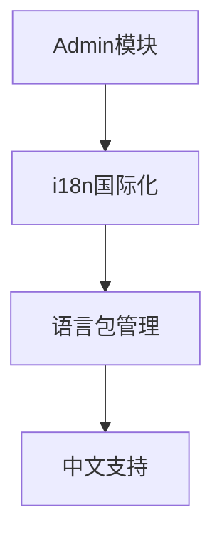

**Diagram sources**
- [src/admin/i18n/index.ts](file://backend/src/admin/i18n/index.ts)

**Section sources**
- [src/admin/i18n/index.ts](file://backend/src/admin/i18n/index.ts)

### 自定义API路由模块

api目录承载自定义REST API路由，分为admin/custom和store/custom两个子路径，分别服务于管理端和 storefront。这种分离设计确保了不同客户端的API端点独立管理，提高了安全性和可维护性。

**Section sources**
- [src/api/admin/custom/route.ts](file://backend/src/api/admin/custom/route.ts)
- [src/api/store/custom/route.ts](file://backend/src/api/store/custom/route.ts)

## Medusa配置详解

medusa-config.ts文件包含系统的核心配置项，这些配置决定了应用的运行时行为和安全策略。

### 数据库与安全配置

配置文件中定义了数据库连接、CORS策略、JWT安全密钥等关键参数。通过环境变量注入的方式，实现了配置的灵活性和安全性。

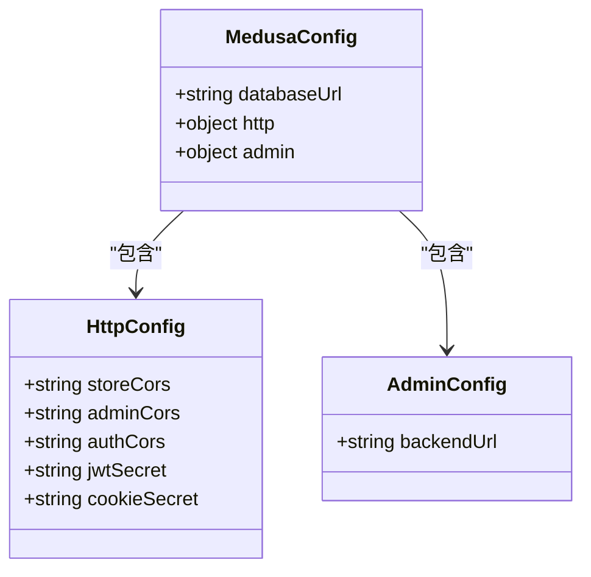

**Diagram sources**
- [medusa-config.ts](file://backend/medusa-config.ts)

**Section sources**
- [medusa-config.ts](file://backend/medusa-config.ts)
- [.env.template](file://backend/.env.template)

## API路由实现

通过route.ts文件展示了自定义API端点的实现方式，说明了如何通过Medusa框架扩展默认功能。

### 管理端自定义路由

admin/custom/route.ts实现了管理后台的自定义API端点，使用MedusaRequest和MedusaResponse类型定义请求响应处理。

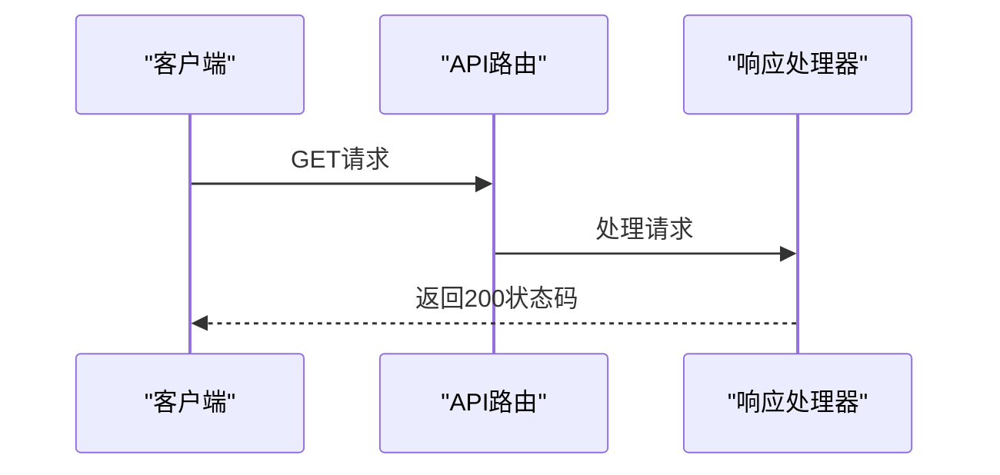

**Diagram sources**
- [src/api/admin/custom/route.ts](file://backend/src/api/admin/custom/route.ts)

### 门店端自定义路由

store/custom/route.ts为storefront提供了自定义API接口，同样遵循Medusa的请求响应模式。

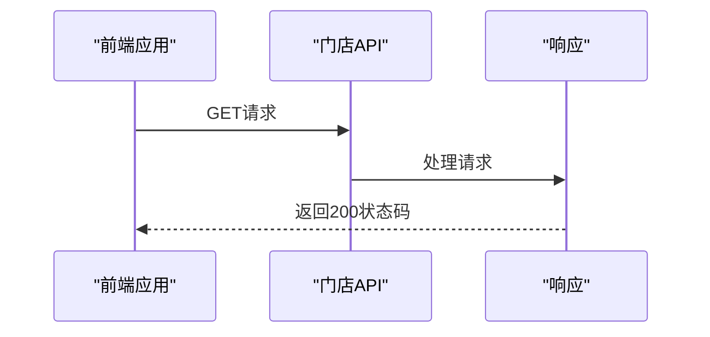

**Diagram sources**
- [src/api/store/custom/route.ts](file://backend/src/api/store/custom/route.ts)

**Section sources**
- [src/api/admin/custom/route.ts](file://backend/src/api/admin/custom/route.ts)
- [src/api/store/custom/route.ts](file://backend/src/api/store/custom/route.ts)

## 数据初始化脚本

scripts目录包含seed.ts数据初始化脚本，负责系统初始数据的创建和配置。

### 数据种子脚本功能

seed.ts脚本实现了完整的数据初始化流程，包括产品分类、区域设置、库存位置、运输选项等核心数据的创建。

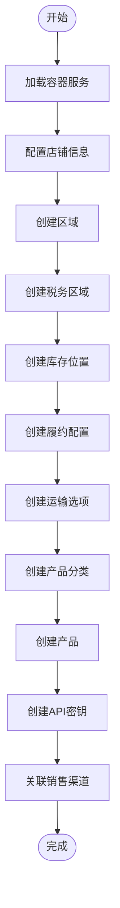

**Diagram sources**
- [src/scripts/seed.ts](file://backend/src/scripts/seed.ts)

**Section sources**
- [src/scripts/seed.ts](file://backend/src/scripts/seed.ts)
- [package.json](file://backend/package.json)

## 工作流与业务编排

workflows模块实现业务流程编排，通过工作流定义复杂的业务操作序列。

### 工作流机制

工作流通过createWorkflow函数创建，将多个步骤组合成一个完整的业务流程。每个工作流可以包含多个步骤，支持输入输出参数的传递。

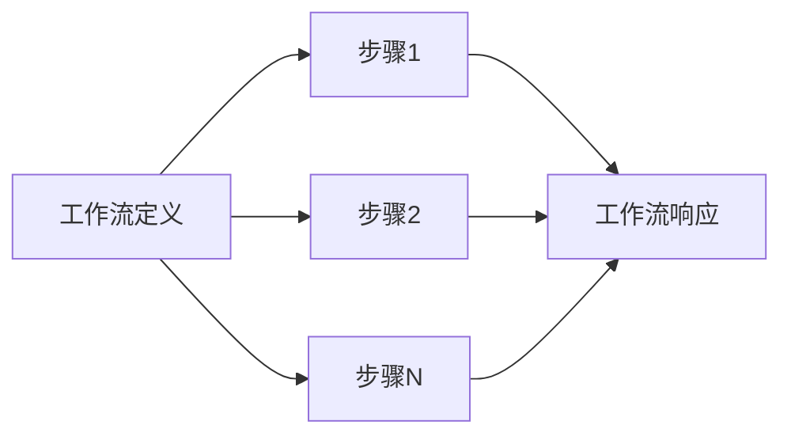

**Diagram sources**
- [src/workflows/README.md](file://backend/src/workflows/README.md)

**Section sources**
- [src/workflows/README.md](file://backend/src/workflows/README.md)

## 事件订阅处理

subscribers模块处理系统事件的订阅，实现事件驱动的架构模式。

### 事件订阅机制

订阅者监听特定的事件（如"product.created"），并在事件触发时执行相应的处理逻辑。这种机制实现了组件间的松耦合。

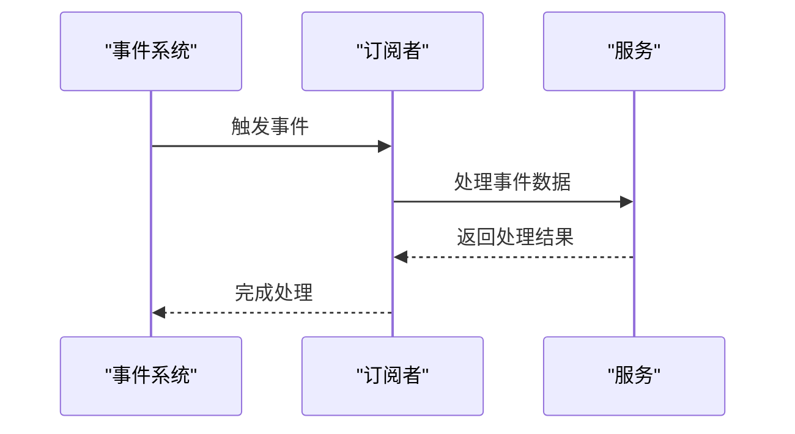

**Diagram sources**
- [src/subscribers/README.md](file://backend/src/subscribers/README.md)

**Section sources**
- [src/subscribers/README.md](file://backend/src/subscribers/README.md)

## 功能插件化模块

modules模块支持功能的插件化扩展，允许开发者创建可重用的功能模块。

### 模块化架构

自定义模块包含数据模型、服务类和模块定义三个核心部分，通过模块链接实现不同模块间的数据关联。

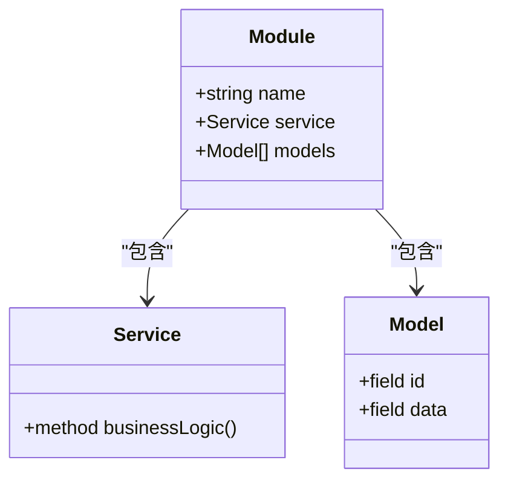

**Diagram sources**
- [src/modules/README.md](file://backend/src/modules/README.md)

**Section sources**
- [src/modules/README.md](file://backend/src/modules/README.md)

## 辅助模块机制

系统包含多个辅助模块，用于支持核心功能的实现。

### 定时任务模块

jobs模块支持定时任务的创建和管理，通过cron表达式定义执行计划。

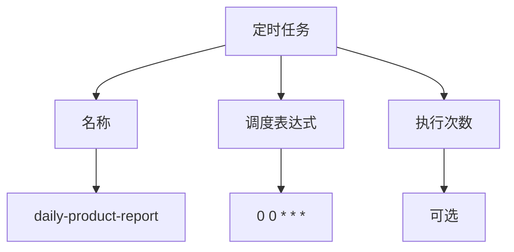

**Diagram sources**
- [src/jobs/README.md](file://backend/src/jobs/README.md)

### 模块链接模块

links模块实现不同模块间的数据关联，保持模块隔离的同时建立必要的数据连接。

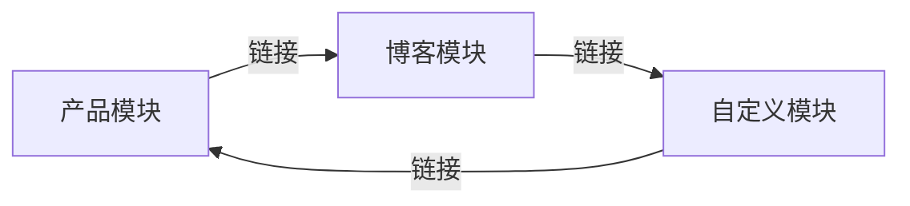

**Diagram sources**
- [src/links/README.md](file://backend/src/links/README.md)

**Section sources**
- [src/jobs/README.md](file://backend/src/jobs/README.md)
- [src/links/README.md](file://backend/src/links/README.md)

## 架构关系图

综合展示Lumiera后端各模块之间的关系和交互。

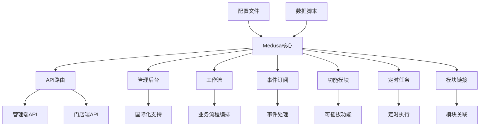

**Diagram sources**
- [medusa-config.ts](file://backend/medusa-config.ts)
- [src/scripts/seed.ts](file://backend/src/scripts/seed.ts)