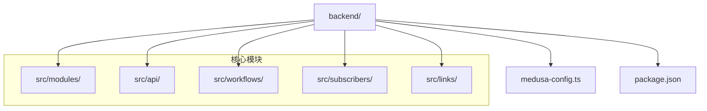
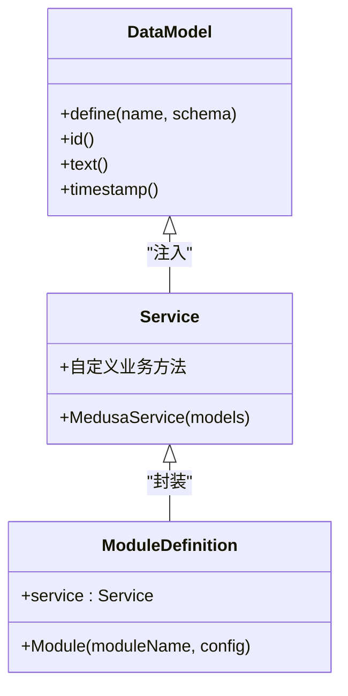
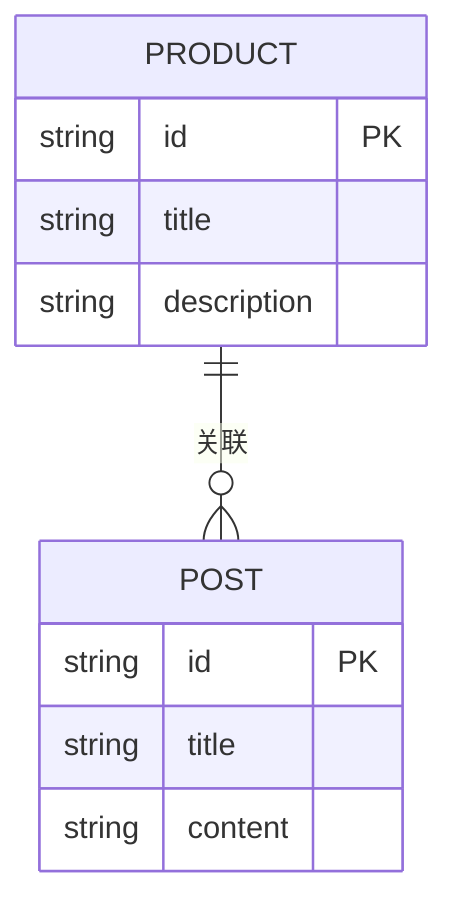

# 模块化扩展机制

<cite>
**本文档引用的文件**  
- [medusa-config.ts](file://backend/medusa-config.ts)
- [src/modules/README.md](file://backend/src/modules/README.md)
- [src/api/README.md](file://backend/src/api/README.md)
- [src/workflows/README.md](file://backend/src/workflows/README.md)
- [src/subscribers/README.md](file://backend/src/subscribers/README.md)
- [src/links/README.md](file://backend/src/links/README.md)
- [package.json](file://backend/package.json)
</cite>

## 目录
1. [引言](#引言)
2. [项目结构概览](#项目结构概览)
3. [模块化架构设计](#模块化架构设计)
4. [模块配置机制](#模块配置机制)
5. [自定义模块开发规范](#自定义模块开发规范)
6. [模块生命周期与加载机制](#模块生命周期与加载机制)
7. [模块与其他系统组件的交互](#模块与其他系统组件的交互)
8. [实际应用案例](#实际应用案例)
9. [测试与版本管理](#测试与版本管理)
10. [部署注意事项](#部署注意事项)
11. [结论](#结论)

## 引言

Lumiera后端基于MedusaJS框架构建，采用模块化架构设计，通过插件系统实现功能扩展。该架构允许开发者在不影响核心系统的情况下，通过自定义模块集成新功能，如支付网关、物流服务等。本文档全面阐述Lumiera后端的模块化扩展机制，重点说明如何通过MedusaJS的插件系统实现功能扩展，涵盖配置、开发、测试、部署等全生命周期管理。

**模块化架构的核心优势包括**：
- **功能解耦**：各模块独立开发、测试和部署
- **可扩展性**：通过配置轻松集成第三方插件或自定义模块
- **可维护性**：模块间隔离，降低系统复杂度
- **灵活性**：支持运行时动态加载和配置覆盖

## 项目结构概览

Lumiera后端项目的目录结构体现了清晰的模块化设计理念，主要功能按领域划分，便于维护和扩展。



**Diagram sources**  
- [backend](file://backend)
- [src/modules](file://backend/src/modules)
- [src/api](file://backend/src/api)
- [src/workflows](file://backend/src/workflows)
- [src/subscribers](file://backend/src/subscribers)
- [src/links](file://backend/src/links)

**Section sources**  
- [medusa-config.ts](file://backend/medusa-config.ts)
- [package.json](file://backend/package.json)

## 模块化架构设计

Lumiera后端的模块化架构基于MedusaJS的插件系统，通过模块（Module）作为功能扩展的基本单位。每个模块封装了特定业务功能，包括数据模型、服务逻辑和配置定义。

### 模块核心组成

一个完整的模块包含以下三个核心部分：

1. **数据模型（Data Model）**：定义数据库表结构
2. **服务（Service）**：封装业务逻辑
3. **模块定义（Module Definition）**：导出模块配置



**Diagram sources**  
- [src/modules/README.md](file://backend/src/modules/README.md#L15-L24)
- [src/modules/README.md](file://backend/src/modules/README.md#L32-L42)
- [src/modules/README.md](file://backend/src/modules/README.md#L50-L59)

**Section sources**  
- [src/modules/README.md](file://backend/src/modules/README.md)

## 模块配置机制

模块配置通过`medusa-config.ts`文件中的`modules`配置项实现，支持本地模块路径映射和第三方插件集成。

### 配置项结构

```typescript
module.exports = defineConfig({
  projectConfig: {
    // 项目配置
  },
  modules: [
    {
      resolve: "./src/modules/blog",
    },
  ],
})
```

### 本地模块路径映射

本地模块通过相对路径引用，使用`resolve`字段指定模块根目录：

```json
{
  "resolve": "./src/modules/blog"
}
```

### 第三方插件集成

第三方插件可通过npm包名直接引用：

```json
{
  "resolve": "@medusajs/medusa-payment-stripe"
}
```

### 配置覆盖机制

模块支持配置覆盖，允许在集成时覆盖默认配置：

```json
{
  "resolve": "./src/modules/blog",
  "options": {
    "database": {
      "connection": "custom_connection"
    }
  }
}
```

**Section sources**  
- [medusa-config.ts](file://backend/medusa-config.ts)
- [src/modules/README.md](file://backend/src/modules/README.md#L70-L75)

## 自定义模块开发规范

### 数据模型创建

数据模型代表数据库中的表，需在模块的`models`目录下创建TypeScript文件：

```typescript
import { model } from "@medusajs/framework/utils"

const Post = model.define("post", {
  id: model.id().primaryKey(),
  title: model.text(),
})

export default Post
```

### 服务创建

每个模块必须定义一个服务类，继承自`MedusaService`：

```typescript
import { MedusaService } from "@medusajs/framework/utils"
import Post from "./models/post"

class BlogModuleService extends MedusaService({
  Post,
}){}

export default BlogModuleService
```

### 模块定义导出

模块根目录需包含`index.ts`文件，导出模块定义：

```typescript
import BlogModuleService from "./service"
import { Module } from "@medusajs/framework/utils"

export const BLOG_MODULE = "blog"

export default Module(BLOG_MODULE, {
  service: BlogModuleService,
})
```

### 依赖注入

模块通过Medusa容器实现依赖注入，可在API路由、工作流或订阅者中使用：

```typescript
const blogModuleService: BlogModuleService = req.scope.resolve(BLOG_MODULE)
```

### 事件监听

模块可通过订阅者监听系统事件，实现事件驱动架构：

```typescript
export default async function productCreateHandler({
  event: { data },
  container,
}: SubscriberArgs<{ id: string }>) {
  const productModuleService = container.resolve("product")
  // 处理产品创建事件
}
```

**Section sources**  
- [src/modules/README.md](file://backend/src/modules/README.md#L13-L117)
- [src/subscribers/README.md](file://backend/src/subscribers/README.md#L45-L56)

## 模块生命周期与加载机制

### 模块加载顺序

1. **配置解析**：读取`medusa-config.ts`中的模块配置
2. **路径解析**：解析`resolve`字段指向的模块路径
3. **依赖注入**：将模块服务注册到Medusa容器
4. **数据库迁移**：执行模块相关的数据库迁移

### 生命周期钩子

模块支持以下生命周期钩子：

- **初始化**：模块服务实例化时执行
- **启动后**：应用启动完成后执行
- **关闭前**：应用关闭前执行清理工作

### 加载顺序控制

通过模块间的依赖关系控制加载顺序，确保依赖模块先于依赖者加载。

**Section sources**  
- [medusa-config.ts](file://backend/medusa-config.ts)
- [src/modules/README.md](file://backend/src/modules/README.md)

## 模块与其他系统组件的交互

### 与API接口的交互

模块可通过API路由暴露功能接口：

```typescript
export async function GET(
  req: MedusaRequest,
  res: MedusaResponse
): Promise<void> {
  const blogModuleService: BlogModuleService = req.scope.resolve(BLOG_MODULE)
  const posts = await blogModuleService.listPosts()
  res.json({ posts })
}
```

### 与工作流的交互

模块可作为工作流的一部分，参与复杂业务流程：

```typescript
const { result } = await myWorkflow(req.scope)
  .run({
    input: {
      name: req.query.name as string,
    },
  })
```

### 与订阅者的交互

模块可通过订阅者响应系统事件：

```typescript
export const config: SubscriberConfig = {
  event: "product.created",
}
```

### 模块链接（Module Links）

模块间可通过链接建立数据关联，同时保持模块隔离：

```typescript
import BlogModule from "../modules/blog"
import ProductModule from "@medusajs/medusa/product"
import { defineLink } from "@medusajs/framework/utils"

export default defineLink(
  ProductModule.linkable.product,
  BlogModule.linkable.post
)
```



**Diagram sources**  
- [src/links/README.md](file://backend/src/links/README.md#L14-L17)

**Section sources**  
- [src/api/README.md](file://backend/src/api/README.md#L98-L117)
- [src/workflows/README.md](file://backend/src/workflows/README.md#L66-L78)
- [src/subscribers/README.md](file://backend/src/subscribers/README.md#L22-L24)
- [src/links/README.md](file://backend/src/links/README.md)

## 实际应用案例

### 支付网关集成

1. **创建支付模块**：实现支付服务接口
2. **配置第三方插件**：集成Stripe或PayPal
3. **事件处理**：监听订单支付事件
4. **错误处理**：实现重试机制和异常捕获

### 物流服务集成

1. **创建物流模块**：定义物流数据模型
2. **API对接**：集成第三方物流API
3. **工作流集成**：在订单发货工作流中调用物流服务
4. **状态同步**：通过订阅者同步物流状态

**Section sources**  
- [src/modules/README.md](file://backend/src/modules/README.md)
- [src/workflows/README.md](file://backend/src/workflows/README.md)
- [src/subscribers/README.md](file://backend/src/subscribers/README.md)

## 测试与版本管理

### 模块测试策略

- **单元测试**：测试服务方法的正确性
- **集成测试**：测试模块与其他组件的交互
- **端到端测试**：测试完整业务流程

### 版本兼容性管理

- **语义化版本控制**：遵循SemVer规范
- **向后兼容**：确保API接口的向后兼容性
- **迁移脚本**：提供数据库迁移脚本

**Section sources**  
- [package.json](file://backend/package.json)
- [integration-tests](file://backend/integration-tests)

## 部署注意事项

### 部署前检查

- **配置验证**：确保`medusa-config.ts`配置正确
- **数据库迁移**：执行必要的数据库迁移
- **依赖安装**：确保所有依赖已正确安装

### 部署流程

1. 构建应用：`npm run build`
2. 迁移数据库：`npx medusa db:migrate`
3. 启动服务：`npm run start`

**Section sources**  
- [package.json](file://backend/package.json#L16-L18)
- [medusa-config.ts](file://backend/medusa-config.ts)

## 结论

Lumiera后端通过MedusaJS的模块化架构，实现了高度可扩展和可维护的系统设计。开发者可以遵循标准化的开发规范，通过配置文件轻松集成自定义模块或第三方插件。模块与API、工作流、订阅者等系统的无缝集成，使得复杂业务逻辑的实现更加灵活和可靠。通过合理的测试策略和版本管理，确保了扩展功能的稳定性和长期可维护性。