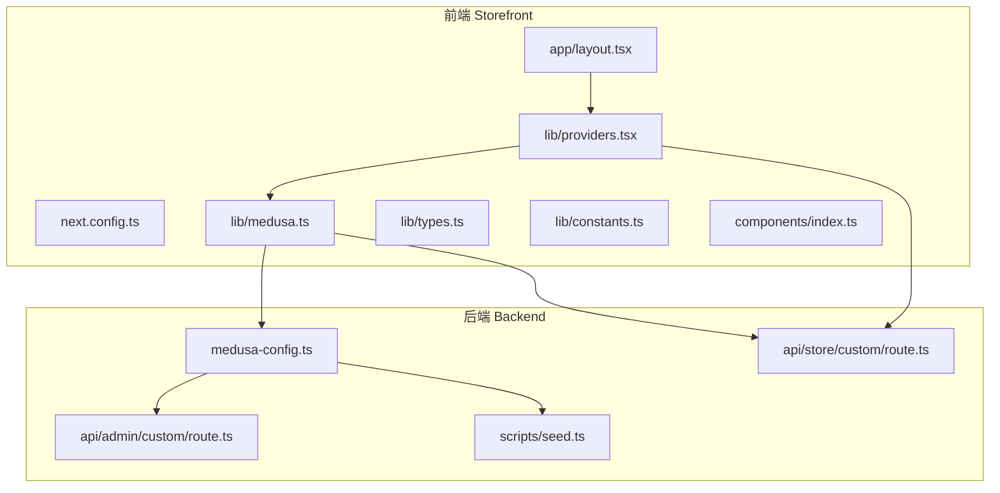
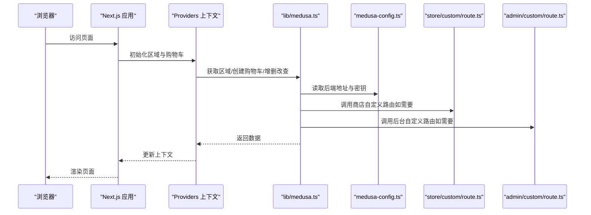
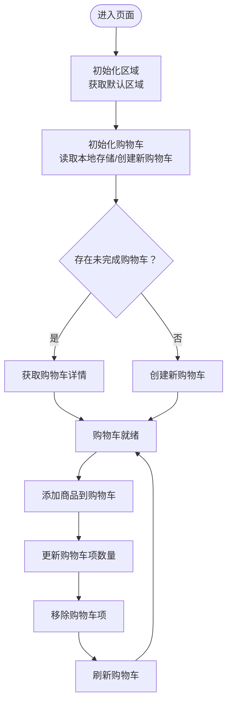
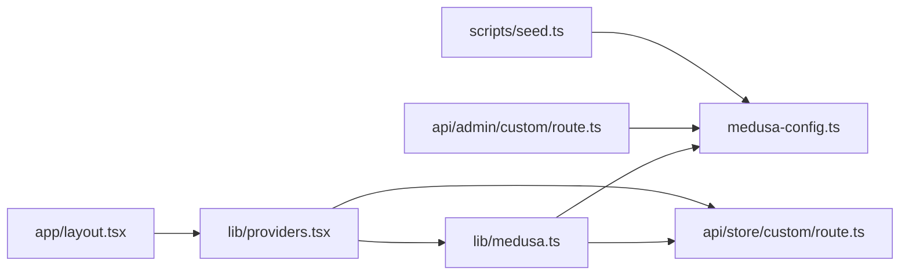
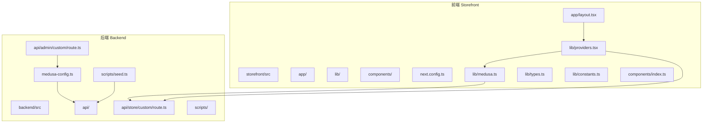

# 项目目录结构详解

<cite>
**本文引用的文件列表**
- [backend/medusa-config.ts](file://backend/medusa-config.ts)
- [storefront/next.config.ts](file://storefront/next.config.ts)
- [backend/src/api/admin/custom/route.ts](file://backend/src/api/admin/custom/route.ts)
- [backend/src/api/store/custom/route.ts](file://backend/src/api/store/custom/route.ts)
- [backend/src/scripts/seed.ts](file://backend/src/scripts/seed.ts)
- [storefront/src/lib/medusa.ts](file://storefront/src/lib/medusa.ts)
- [storefront/src/lib/providers.tsx](file://storefront/src/lib/providers.tsx)
- [storefront/src/app/layout.tsx](file://storefront/src/app/layout.tsx)
- [storefront/src/lib/types.ts](file://storefront/src/lib/types.ts)
- [storefront/src/lib/constants.ts](file://storefront/src/lib/constants.ts)
- [storefront/src/components/index.ts](file://storefront/src/components/index.ts)
</cite>

## 目录索引
1. [引言](#引言)
2. [项目结构总览](#项目结构总览)
3. [核心组件与职责划分](#核心组件与职责划分)
4. [架构总览](#架构总览)
5. [详细组件分析](#详细组件分析)
6. [依赖关系分析](#依赖关系分析)
7. [性能与可维护性建议](#性能与可维护性建议)
8. [故障排查指南](#故障排查指南)
9. [结论](#结论)
10. [附录：目录树与业务映射](#附录目录树与业务映射)

## 引言
本文件面向新加入 Lumiera 的开发者，系统梳理前后端目录结构与职责边界，重点解释：
- 后端 backend/src 下 admin、api、jobs、modules、scripts、subscribers、workflows 等子目录的职责与协作关系；
- 自定义 API 路由（admin/custom、store/custom）的定位与用途；
- 前端 storefront/src/app 中基于 Next.js App Router 的页面路由机制，以及 components 与 lib 的组织方式；
- medusa-config.ts 与 next.config.ts 作为配置中心的关键作用。

通过树状结构图与分层说明，帮助你快速定位代码位置并理解各模块在整体业务中的角色。

## 项目结构总览
仓库采用“前后端分离”的清晰布局：
- backend：Medusa 后端服务，负责商品、库存、订单、区域、支付、工作流等核心业务；
- storefront：Next.js 前端应用，使用 App Router 组织页面与组件，通过 lib 封装对后端 API 的调用。

图表来源
- [backend/medusa-config.ts](file://backend/medusa-config.ts#L1-L21)
- [backend/src/api/admin/custom/route.ts](file://backend/src/api/admin/custom/route.ts#L1-L9)
- [backend/src/api/store/custom/route.ts](file://backend/src/api/store/custom/route.ts#L1-L9)
- [backend/src/scripts/seed.ts](file://backend/src/scripts/seed.ts#L1-L120)
- [storefront/next.config.ts](file://storefront/next.config.ts#L1-L42)
- [storefront/src/app/layout.tsx](file://storefront/src/app/layout.tsx#L1-L42)
- [storefront/src/lib/medusa.ts](file://storefront/src/lib/medusa.ts#L1-L20)
- [storefront/src/lib/providers.tsx](file://storefront/src/lib/providers.tsx#L1-L40)

章节来源
- [backend/medusa-config.ts](file://backend/medusa-config.ts#L1-L21)
- [storefront/next.config.ts](file://storefront/next.config.ts#L1-L42)

## 核心组件与职责划分
- 后端配置中心（medusa-config.ts）
  - 加载环境变量并定义 Medusa 的数据库连接、跨域策略、JWT/Cookie 密钥、后台管理地址等全局配置。
  - 为 admin/store 自定义路由提供统一的运行时上下文与安全策略基础。
- 自定义 API 路由
  - admin/custom：面向后台管理的扩展接口，用于补充后台功能或内部工具。
  - store/custom：面向前端商店的扩展接口，用于补充前台业务逻辑或临时功能。
- 数据初始化脚本（scripts/seed.ts）
  - 使用 Medusa 工作流创建销售渠道、地区、税费、库存地点、配送方案、发布密钥、产品分类与示例商品等，支撑演示与开发环境。
- 前端配置中心（next.config.ts）
  - 控制图片优化、远程图片源白名单、内容安全策略、开发模式下的图像优化开关等，确保开发体验与生产安全。
- 前端数据访问层（lib/medusa.ts）
  - 对 Medusa Store SDK 进行封装，提供获取区域、产品、购物车、客户、搜索等方法，统一错误处理与字段选择。
- 前端上下文与状态（lib/providers.tsx）
  - 提供购物车与区域上下文，负责本地存储、初始化购物车、增删改查购物车项、刷新购物车等。
- 页面布局与根组件（app/layout.tsx）
  - 定义站点元信息、字体、全局样式与 Provider 包裹，作为所有页面的根布局。
- 类型与常量（lib/types.ts、lib/constants.ts）
  - 重导出 Medusa 类型，定义应用内类型（文章、评价、消息、USP），以及导航、公司信息、文章列表、测试评价、Gemini 指令等常量。
- 组件聚合导出（components/index.ts）
  - 统一导出常用 UI 组件，便于页面按需引入。

章节来源
- [backend/medusa-config.ts](file://backend/medusa-config.ts#L1-L21)
- [backend/src/api/admin/custom/route.ts](file://backend/src/api/admin/custom/route.ts#L1-L9)
- [backend/src/api/store/custom/route.ts](file://backend/src/api/store/custom/route.ts#L1-L9)
- [backend/src/scripts/seed.ts](file://backend/src/scripts/seed.ts#L1-L120)
- [storefront/next.config.ts](file://storefront/next.config.ts#L1-L42)
- [storefront/src/lib/medusa.ts](file://storefront/src/lib/medusa.ts#L1-L40)
- [storefront/src/lib/providers.tsx](file://storefront/src/lib/providers.tsx#L1-L60)
- [storefront/src/app/layout.tsx](file://storefront/src/app/layout.tsx#L1-L42)
- [storefront/src/lib/types.ts](file://storefront/src/lib/types.ts#L1-L20)
- [storefront/src/lib/constants.ts](file://storefront/src/lib/constants.ts#L1-L40)
- [storefront/src/components/index.ts](file://storefront/src/components/index.ts#L1-L7)

## 架构总览
从请求到响应的典型链路如下：

图表来源
- [storefront/src/app/layout.tsx](file://storefront/src/app/layout.tsx#L1-L42)
- [storefront/src/lib/providers.tsx](file://storefront/src/lib/providers.tsx#L1-L60)
- [storefront/src/lib/medusa.ts](file://storefront/src/lib/medusa.ts#L1-L40)
- [backend/medusa-config.ts](file://backend/medusa-config.ts#L1-L21)
- [backend/src/api/store/custom/route.ts](file://backend/src/api/store/custom/route.ts#L1-L9)
- [backend/src/api/admin/custom/route.ts](file://backend/src/api/admin/custom/route.ts#L1-L9)

## 详细组件分析

### 后端：配置中心与自定义路由
- 配置中心（medusa-config.ts）
  - 作用：集中管理数据库、CORS、JWT/Cookie 密钥、后台管理地址等；加载环境变量并导出 Medusa 配置对象。
  - 影响范围：影响所有后端模块的运行时行为，包括 admin/store 自定义路由的安全与鉴权策略。
- 自定义 API 路由
  - admin/custom/route.ts：当前实现返回 200，可扩展为后台管理专用接口（如报表、导入导出、内部工具）。
  - store/custom/route.ts：当前实现返回 200，可扩展为前端商店专用接口（如动态促销、个性化推荐入口）。
- 数据初始化脚本（scripts/seed.ts）
  - 作用：批量创建销售渠道、地区、税费、库存地点、配送方案、发布密钥、产品分类与示例商品，支撑演示与开发环境。
  - 关键流程：创建工作流 -> 解析容器服务 -> 创建实体 -> 建立关联（如库存与配送、销售渠道与 API Key）-> 输出日志。

章节来源
- [backend/medusa-config.ts](file://backend/medusa-config.ts#L1-L21)
- [backend/src/api/admin/custom/route.ts](file://backend/src/api/admin/custom/route.ts#L1-L9)
- [backend/src/api/store/custom/route.ts](file://backend/src/api/store/custom/route.ts#L1-L9)
- [backend/src/scripts/seed.ts](file://backend/src/scripts/seed.ts#L1-L120)

### 前端：App Router 页面与数据层
- 页面路由机制（storefront/src/app）
  - 使用 Next.js App Router，以文件系统为路由约定，例如：
    - /about、/account、/cart、/journal、/privacy、/returns、/shipping、/terms、/shop、/product[handle] 等。
  - 动态路由：/journal/[slug]、/product[handle]/... 支持参数化页面。
- 布局与根组件（app/layout.tsx）
  - 定义站点元信息、字体、全局样式与 Provider 包裹，作为所有页面的根布局。
- 数据访问层（lib/medusa.ts）
  - 封装 Medusa Store SDK，提供区域、产品、购物车、客户、搜索等方法，统一错误处理与字段选择。
- 上下文与状态（lib/providers.tsx）
  - 提供购物车与区域上下文，负责本地存储、初始化购物车、增删改查购物车项、刷新购物车等。
- 类型与常量（lib/types.ts、lib/constants.ts）
  - 重导出 Medusa 类型，定义应用内类型（文章、评价、消息、USP），以及导航、公司信息、文章列表、测试评价、Gemini 指令等常量。
- 组件聚合导出（components/index.ts）
  - 统一导出常用 UI 组件，便于页面按需引入。

章节来源
- [storefront/src/app/layout.tsx](file://storefront/src/app/layout.tsx#L1-L42)
- [storefront/src/lib/medusa.ts](file://storefront/src/lib/medusa.ts#L1-L40)
- [storefront/src/lib/providers.tsx](file://storefront/src/lib/providers.tsx#L1-L60)
- [storefront/src/lib/types.ts](file://storefront/src/lib/types.ts#L1-L20)
- [storefront/src/lib/constants.ts](file://storefront/src/lib/constants.ts#L1-L40)
- [storefront/src/components/index.ts](file://storefront/src/components/index.ts#L1-L7)

### 前端购物车流程（算法流程图）

图表来源
- [storefront/src/lib/providers.tsx](file://storefront/src/lib/providers.tsx#L1-L120)
- [storefront/src/lib/medusa.ts](file://storefront/src/lib/medusa.ts#L120-L190)

## 依赖关系分析
- 前端对后端的依赖
  - lib/medusa.ts 依赖 medusa-config.ts 提供的后端地址与密钥；
  - lib/providers.tsx 通过 lib/medusa.ts 调用 store/custom/route.ts；
  - app/layout.tsx 作为根布局，承载 Providers。
- 后端对配置与脚本的依赖
  - medusa-config.ts 为所有路由与模块提供统一配置；
  - scripts/seed.ts 通过 Medusa 工作流创建实体并建立关联，为前端提供初始数据。

图表来源
- [storefront/src/lib/medusa.ts](file://storefront/src/lib/medusa.ts#L1-L40)
- [storefront/src/lib/providers.tsx](file://storefront/src/lib/providers.tsx#L1-L60)
- [storefront/src/app/layout.tsx](file://storefront/src/app/layout.tsx#L1-L42)
- [backend/medusa-config.ts](file://backend/medusa-config.ts#L1-L21)
- [backend/src/api/store/custom/route.ts](file://backend/src/api/store/custom/route.ts#L1-L9)
- [backend/src/api/admin/custom/route.ts](file://backend/src/api/admin/custom/route.ts#L1-L9)
- [backend/src/scripts/seed.ts](file://backend/src/scripts/seed.ts#L1-L120)

## 性能与可维护性建议
- 图片与安全
  - next.config.ts 已针对开发模式禁用图片优化并配置远程图片白名单，生产环境保持严格的内容安全策略，有助于减少 SSRF 风险与提升加载性能。
- 前端缓存与懒加载
  - 在页面中对非首屏资源进行懒加载，结合 React Suspense 与动态导入，减少初始包体积。
- 后端路由扩展
  - admin/custom 与 store/custom 可按需扩展，但应遵循最小暴露原则，避免将复杂业务逻辑直接暴露给前端。
- 数据初始化
  - seed.ts 使用工作流批量创建实体，建议在 CI 中定期执行，确保开发与测试环境一致性。

[本节为通用建议，不直接分析具体文件]

## 故障排查指南
- 环境变量缺失
  - 症状：medusa-config.ts 无法读取 CORS/JWT/COOKIE 或后端地址为空。
  - 排查：检查 .env/.env.template 中相关键值是否正确设置。
- 购物车异常
  - 症状：购物车初始化失败或无法更新。
  - 排查：确认 lib/providers.tsx 中本地存储键名一致、store/custom/route.ts 可用、lib/medusa.ts 的后端地址与密钥正确。
- 图片加载失败
  - 症状：开发环境下图片被阻止或生产环境图片无法加载。
  - 排查：核对 next.config.ts 的 remotePatterns 与 unoptimized 设置，确保域名与端口匹配。

章节来源
- [backend/medusa-config.ts](file://backend/medusa-config.ts#L1-L21)
- [storefront/next.config.ts](file://storefront/next.config.ts#L1-L42)
- [storefront/src/lib/providers.tsx](file://storefront/src/lib/providers.tsx#L1-L120)
- [storefront/src/lib/medusa.ts](file://storefront/src/lib/medusa.ts#L1-L40)

## 结论
- backend/medusa-config.ts 与 storefront/next.config.ts 分别承担后端与前端的配置中心职责，是系统稳定运行的基础。
- admin/custom 与 store/custom 路由为扩展点，当前返回 200，后续可按业务需求扩展后台与前台功能。
- 前端通过 lib/medusa.ts 与 lib/providers.tsx 实现对后端的统一访问与状态管理，App Router 提供清晰的页面组织方式。
- scripts/seed.ts 为开发与演示提供了完整的初始数据，确保前后端联调顺畅。

[本节为总结，不直接分析具体文件]

## 附录：目录树与业务映射
以下为项目目录树与业务模块映射，帮助快速定位代码位置：

图表来源
- [backend/medusa-config.ts](file://backend/medusa-config.ts#L1-L21)
- [backend/src/api/admin/custom/route.ts](file://backend/src/api/admin/custom/route.ts#L1-L9)
- [backend/src/api/store/custom/route.ts](file://backend/src/api/store/custom/route.ts#L1-L9)
- [backend/src/scripts/seed.ts](file://backend/src/scripts/seed.ts#L1-L120)
- [storefront/next.config.ts](file://storefront/next.config.ts#L1-L42)
- [storefront/src/app/layout.tsx](file://storefront/src/app/layout.tsx#L1-L42)
- [storefront/src/lib/medusa.ts](file://storefront/src/lib/medusa.ts#L1-L40)
- [storefront/src/lib/providers.tsx](file://storefront/src/lib/providers.tsx#L1-L60)
- [storefront/src/lib/types.ts](file://storefront/src/lib/types.ts#L1-L20)
- [storefront/src/lib/constants.ts](file://storefront/src/lib/constants.ts#L1-L40)
- [storefront/src/components/index.ts](file://storefront/src/components/index.ts#L1-L7)